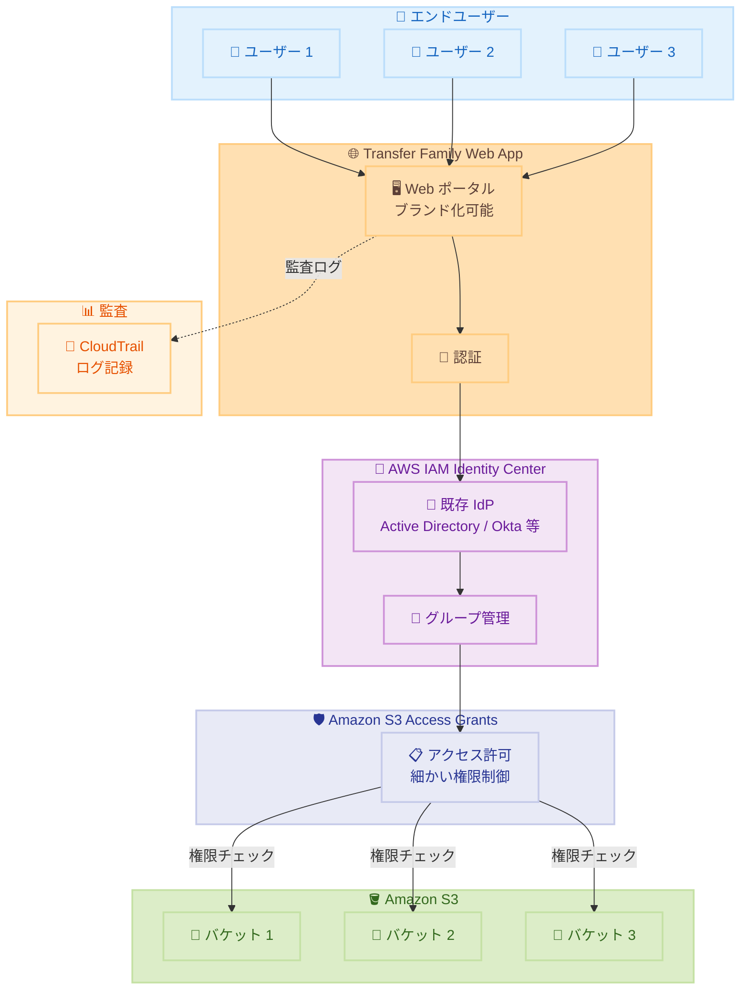

# AWS Transfer Family - Terraform モジュールで Web Apps をサポート

**リリース日**: 2026年1月21日
**サービス**: AWS Transfer Family
**機能**: Terraform モジュールによる Web Apps のデプロイメント

## 概要

AWS Transfer Family の Terraform モジュールが Web Apps のデプロイメントをサポートしました。これにより、エンドユーザーが Web インターフェース経由で Amazon S3 へファイル転送できる環境を、Infrastructure as Code (IaC) で一貫性のある方法でプロビジョニングできます。

この機能により、フェデレーション認証とユーザーアクセス制御を備えた Web Apps の集中的なプロビジョニングが効率化され、繰り返し可能なデプロイメントが実現します。AWS IAM Identity Center を使用した既存のアイデンティティプロバイダーとの統合、Amazon S3 Access Grants による細かいユーザー権限管理が可能です。

単一のデプロイメントで、ユーザー認証、権限管理、Web ポータルの設定を包括的に構成でき、エンドツーエンドの例も提供されています。

**アップデート前の課題**

- Transfer Family Web Apps のデプロイメントを手動で行う必要があり、エラーが発生しやすかった
- 複数の環境で一貫した設定を維持することが困難だった
- IAM Identity Center ユーザー、S3 Access Grants、Web App の設定を個別に管理する必要があった
- Infrastructure as Code による自動化が限定的だった

**アップデート後の改善**

- Terraform モジュールにより、Web Apps のデプロイメントを自動化し、一貫性のある設定が可能に
- IAM Identity Center、S3 Access Grants、Web App を統合的に構成できるようになった
- エンドツーエンドの例により、ベストプラクティスに基づいた実装が容易に
- CloudTrail によるセキュリティ監査を含む包括的な設定が可能に

## アーキテクチャ図



この図は、Transfer Family Web Apps のアーキテクチャを示しています。ユーザーは Web ポータル経由で認証され、S3 Access Grants により細かい権限制御が適用されます。

## サービスアップデートの詳細

### 主要機能

1. **Terraform モジュールによる IaC デプロイメント**
   - GitHub リポジトリで公開された公式 Terraform モジュール
   - 繰り返し可能で一貫性のあるデプロイメント
   - バージョン管理と変更追跡が可能
   - 複数環境での標準化されたプロビジョニング

2. **統合された認証とアクセス制御**
   - AWS IAM Identity Center との統合
   - 既存のアイデンティティプロバイダー (Active Directory、Okta など) を活用
   - Amazon S3 Access Grants による細かい権限管理
   - ユーザーとグループの自動プロビジョニング

3. **エンドツーエンドの例とベストプラクティス**
   - IAM Identity Center ユーザーとグループの作成・割り当て
   - S3 Access Grants の設定
   - Web App のセットアップ
   - CloudTrail によるセキュリティ監査の有効化

4. **完全マネージド型 Web ポータル**
   - ブランド化可能な Web インターフェース
   - ファイルのブラウズ、アップロード、ダウンロード機能
   - S3 データへの安全なアクセス
   - ワークフォースへの簡単な提供

## 技術仕様

### Terraform モジュールの構成

| 項目 | 詳細 |
|------|------|
| モジュール名 | terraform-aws-transfer-family |
| バージョン | v0.5.0 以降 |
| サブモジュール | transfer-web-app |
| リポジトリ | https://github.com/aws-ia/terraform-aws-transfer-family |
| レジストリ | Terraform Registry |

### サポートされる機能

| 機能 | 説明 |
|------|------|
| IAM Identity Center 統合 | フェデレーション認証のサポート |
| S3 Access Grants | 細かいユーザー権限制御 |
| ブランディング | カスタムロゴとカラースキーム |
| 監査ログ | CloudTrail による操作記録 |

## 設定方法

### 前提条件

1. Terraform がインストールされていること (v1.0 以降推奨)
2. AWS アカウントを持っていること
3. AWS IAM Identity Center が有効化されていること
4. 適切な IAM 権限を持っていること

### 手順

#### ステップ 1: Terraform モジュールの取得

```hcl
# main.tf
module "transfer_web_app" {
  source  = "aws-ia/transfer-family/aws//modules/transfer-web-app"
  version = "~> 0.5.0"

  web_app_name = "my-file-transfer-portal"

  # IAM Identity Center 設定
  identity_center_instance_arn = "arn:aws:sso:::instance/ssoins-xxxxxxxxx"

  # S3 バケット設定
  s3_bucket_arn = "arn:aws:s3:::my-transfer-bucket"

  # S3 Access Grants 設定
  access_grants_instance_arn = "arn:aws:s3:us-east-1:123456789012:access-grants/default"
}
```

このコードは、基本的な Transfer Family Web App を定義します。

#### ステップ 2: IAM Identity Center ユーザーとグループの設定

```hcl
# identity.tf
resource "aws_identitystore_group" "transfer_users" {
  identity_store_id = local.identity_store_id
  display_name      = "TransferUsers"
  description       = "Users with access to Transfer Family Web App"
}

resource "aws_identitystore_user" "example_user" {
  identity_store_id = local.identity_store_id
  display_name      = "John Doe"
  user_name         = "john.doe@example.com"

  name {
    given_name  = "John"
    family_name = "Doe"
  }

  emails {
    value   = "john.doe@example.com"
    primary = true
  }
}

resource "aws_identitystore_group_membership" "example" {
  identity_store_id = local.identity_store_id
  group_id          = aws_identitystore_group.transfer_users.group_id
  member_id         = aws_identitystore_user.example_user.user_id
}
```

このコードは、IAM Identity Center のユーザーとグループを作成します。

#### ステップ 3: S3 Access Grants の設定

```hcl
# access_grants.tf
resource "aws_s3_access_grants_instance" "example" {
  identity_center_arn = var.identity_center_instance_arn
}

resource "aws_s3_access_grants_location" "example" {
  access_grants_instance_id = aws_s3_access_grants_instance.example.id
  location_scope            = "s3://${aws_s3_bucket.transfer_bucket.bucket}/*"
  iam_role_arn             = aws_iam_role.access_grants_role.arn
}

resource "aws_s3_access_grants_grant" "user_access" {
  access_grants_instance_id = aws_s3_access_grants_instance.example.id
  access_grants_location_id = aws_s3_access_grants_location.example.id
  permission                = "READWRITE"

  grantee {
    grantee_type       = "IAM_IDENTITY_CENTER_GROUP"
    grantee_identifier = aws_identitystore_group.transfer_users.group_id
  }
}
```

このコードは、S3 Access Grants を設定し、グループに権限を付与します。

#### ステップ 4: デプロイメントの実行

```bash
# Terraform の初期化
terraform init

# プランの確認
terraform plan

# デプロイメントの実行
terraform apply
```

これらのコマンドは、Transfer Family Web App をデプロイします。

## メリット

### ビジネス面

- **デプロイメント時間の短縮**: 手動設定と比較して、デプロイメント時間を大幅に削減
- **一貫性の確保**: 環境間で同一の設定を保証し、設定ミスを防止
- **運用コストの削減**: Infrastructure as Code により、管理オーバーヘッドを低減

### 技術面

- **自動化**: Terraform による完全自動デプロイメント
- **バージョン管理**: Git でインフラ設定を管理し、変更履歴を追跡
- **再現性**: 同じコードから同じ環境を繰り返し構築可能

## デメリット・制約事項

### 制限事項

- Terraform の知識が必要
- IAM Identity Center が事前に有効化されている必要がある
- S3 Access Grants は特定のリージョンでのみ利用可能

### 考慮すべき点

- 既存の Transfer Family 設定がある場合、Terraform でインポートする必要がある
- IAM Identity Center の既存ユーザーとグループを Terraform で管理する場合、慎重な移行が必要
- S3 Access Grants の権限設定は、既存の IAM ポリシーと競合しないよう注意が必要

## ユースケース

### ユースケース 1: マルチアカウント環境での標準化されたファイル転送ポータル

**シナリオ**: 複数の AWS アカウントで、同じ設定の Transfer Family Web App をデプロイしたい。

**実装例**:
```hcl
# environments/dev/main.tf
module "transfer_web_app" {
  source = "../../modules/transfer-web-app"

  environment = "dev"
  web_app_name = "dev-file-portal"
  s3_bucket_name = "dev-transfer-bucket"
}

# environments/prod/main.tf
module "transfer_web_app" {
  source = "../../modules/transfer-web-app"

  environment = "prod"
  web_app_name = "prod-file-portal"
  s3_bucket_name = "prod-transfer-bucket"
}
```

**効果**: 環境ごとに一貫した設定を維持しながら、パラメータのみを変更して簡単にデプロイできます。

### ユースケース 2: 部門ごとの細かいアクセス制御

**シナリオ**: 営業部門とマーケティング部門で異なる S3 バケットへのアクセスを提供したい。

**実装例**:
```hcl
# S3 Access Grants で部門ごとの権限を設定
resource "aws_s3_access_grants_grant" "sales_access" {
  access_grants_instance_id = aws_s3_access_grants_instance.example.id
  access_grants_location_id = aws_s3_access_grants_location.sales.id
  permission                = "READWRITE"

  grantee {
    grantee_type       = "IAM_IDENTITY_CENTER_GROUP"
    grantee_identifier = aws_identitystore_group.sales.group_id
  }
}

resource "aws_s3_access_grants_grant" "marketing_access" {
  access_grants_instance_id = aws_s3_access_grants_instance.example.id
  access_grants_location_id = aws_s3_access_grants_location.marketing.id
  permission                = "READ"

  grantee {
    grantee_type       = "IAM_IDENTITY_CENTER_GROUP"
    grantee_identifier = aws_identitystore_group.marketing.group_id
  }
}
```

**効果**: 部門ごとに異なるアクセス権限を細かく制御し、データガバナンスを強化できます。

### ユースケース 3: CI/CD パイプラインでの自動デプロイメント

**シナリオ**: GitHub Actions を使用して、Transfer Family Web App を自動的にデプロイしたい。

**実装例**:
```yaml
name: Deploy Transfer Family Web App

on:
  push:
    branches: [main]

jobs:
  deploy:
    runs-on: ubuntu-latest
    steps:
      - uses: actions/checkout@v3

      - name: Setup Terraform
        uses: hashicorp/setup-terraform@v2
        with:
          terraform_version: 1.5.0

      - name: Terraform Init
        run: terraform init
        working-directory: ./terraform

      - name: Terraform Apply
        run: terraform apply -auto-approve
        working-directory: ./terraform
        env:
          AWS_ACCESS_KEY_ID: ${{ secrets.AWS_ACCESS_KEY_ID }}
          AWS_SECRET_ACCESS_KEY: ${{ secrets.AWS_SECRET_ACCESS_KEY }}
```

**効果**: コード変更がマージされると自動的にインフラが更新され、手動作業を削減できます。

## 料金

Transfer Family Web Apps の料金は、Web App の起動時間とデータ転送量に基づきます。

### 料金例

| 項目 | 料金 (概算) |
|------|------------|
| Web App 起動時間 | $0.30/時間 |
| データ転送 (アップロード) | S3 の標準料金 |
| データ転送 (ダウンロード) | S3 の標準料金 |

*注: 正確な料金は [AWS Transfer Family 料金ページ](https://aws.amazon.com/aws-transfer-family/pricing/) を参照してください。

## 利用可能リージョン

Transfer Family Web Apps は、以下のリージョンで利用可能です。

詳細は [AWS Region テーブル](https://docs.aws.amazon.com/transfer/latest/userguide/web-app.html#webapp-regions) を参照してください。

## 関連サービス・機能

- **AWS IAM Identity Center**: フェデレーション認証とユーザー管理
- **Amazon S3 Access Grants**: 細かいアクセス制御
- **Amazon CloudTrail**: 監査ログとセキュリティ監視

## 参考リンク

- [公式発表 (What's New)](https://aws.amazon.com/about-aws/whats-new/2026/01/aws-transfer-family-terraform-webapps)
- [Terraform モジュール (GitHub)](https://github.com/aws-ia/terraform-aws-transfer-family)
- [Terraform Registry](https://registry.terraform.io/modules/aws-ia/transfer-family/aws/latest/submodules/transfer-web-app)
- [エンドツーエンド例](https://github.com/aws-ia/terraform-aws-transfer-family/tree/v0.5.0/examples/sample-web-app)
- [Transfer Family Web Apps ユーザーガイド](https://docs.aws.amazon.com/transfer/latest/userguide/web-app.html)

## まとめ

AWS Transfer Family の Terraform モジュールによる Web Apps サポートは、Infrastructure as Code による一貫性のあるデプロイメントを実現します。IAM Identity Center との統合と S3 Access Grants による細かい権限制御により、エンタープライズグレードのセキュアなファイル転送ソリューションを簡単に構築できます。特に複数環境での標準化や、CI/CD パイプラインでの自動化を検討している組織には、このモジュールの活用を強くお勧めします。エンドツーエンドの例を参照することで、ベストプラクティスに基づいた実装を迅速に開始できます。
