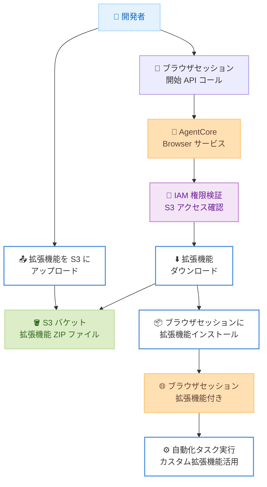

# Amazon Bedrock AgentCore Browser - カスタムブラウザ拡張機能サポート

**リリース日**: 2026年1月22日
**サービス**: Amazon Bedrock AgentCore Browser
**機能**: カスタム Chrome ブラウザ拡張機能サポート

## 概要

Amazon Bedrock AgentCore Browser が、カスタム Chrome ブラウザ拡張機能のサポートを開始しました。この機能により、標準的なブラウザ自動化だけでは対応できない複雑なワークフローの自動化が可能になります。エンタープライズ開発者、自動化エンジニア、およびセキュアな環境内で特殊なブラウザ機能を必要とするあらゆる業界の組織に向けた機能強化です。

AgentCore の既存のセキュアブラウザ機能を基盤として、Chrome 互換の拡張機能を Amazon S3 にアップロードし、ブラウザセッション起動時に自動的にインストールすることができます。これにより、カスタム認証フロー、自動テスト、広告ブロックを通じたパフォーマンス最適化など、強力なユースケースが実現可能になりました。

**アップデート前の課題**

- 標準的なブラウザ自動化では対応できない複雑なワークフローを実行する場合、手動プロセスが必要だった
- カスタム認証フローや特殊な Web ナビゲーション機能を実装するためには、独自のソリューションを構築する必要があった
- サードパーティツールをブラウザ拡張機能として統合できず、セキュアな環境内での柔軟性が制限されていた

**アップデート後の改善**

- カスタム Chrome 拡張機能を S3 経由でブラウザセッションに自動インストールできるようになった
- セキュアな AgentCore Browser 環境内で、サードパーティツールを拡張機能として統合可能になった
- 手動プロセスを排除しながら、セキュリティを維持した状態で複雑な自動化ワークフローを実行できるようになった

## アーキテクチャ図



ブラウザ拡張機能のライフサイクル: S3 へのアップロード、IAM 権限検証、セッション起動時の自動インストールまでの流れを示しています。

## サービスアップデートの詳細

### 主要機能

1. **カスタムブラウザ拡張機能のインストール**
   - Chrome 互換の拡張機能を ZIP ファイルとして S3 バケットに保存
   - ブラウザセッション作成時に、最大 10 個の拡張機能を自動的にインストール
   - 各拡張機能のファイルサイズは最大 10 MB まで

2. **セキュアな拡張機能管理**
   - IAM ポリシーを使用して S3 バケットへのアクセスを制御
   - サービスは認証情報を使用して S3 オブジェクトへのアクセス権を検証
   - セッション起動時にのみ拡張機能をダウンロードおよびインストール

3. **柔軟な統合オプション**
   - AWS CLI、SDK (Boto3 など)、API 経由でブラウザセッションを作成可能
   - S3 バージョニングをサポート (オプションで特定バージョンを指定可能)
   - 複数の拡張機能を同時にインストール可能

## 技術仕様

### 制限事項と要件

| 項目 | 詳細 |
|------|------|
| 最大拡張機能数 | セッションあたり 10 個 |
| ファイルサイズ制限 | 拡張機能 1 つあたり 10 MB |
| S3 バケット要件 | ブラウザセッションと同じ AWS アカウント内に存在する必要がある |
| 拡張機能形式 | Chromium 拡張機能標準に準拠した ZIP ファイル |
| 必須ファイル | 各拡張機能に有効な `manifest.json` が必要 |

### IAM 権限設定

拡張機能を使用するには、以下の IAM ポリシーを設定する必要があります。

```json
{
    "Version": "2012-10-17",
    "Statement": [
        {
            "Sid": "ExtensionS3Access",
            "Effect": "Allow",
            "Action": [
                "s3:GetObject",
                "s3:GetObjectVersion"
            ],
            "Resource": [
                "arn:aws:s3:::<S3Bucket>/<path_to_extensions>/*"
            ]
        }
    ]
}
```

## 設定方法

### 前提条件

1. Amazon Bedrock AgentCore Browser の一般的な前提条件を満たしていること
2. 拡張機能 ZIP ファイルを保存する Amazon S3 バケットがあること
3. 拡張機能を含む S3 バケットへのアクセス権限を持つ IAM ポリシーが設定されていること

### 手順

#### ステップ1: Chrome 拡張機能の準備

```bash
# 拡張機能ディレクトリに移動
cd my-extension

# 拡張機能を ZIP ファイルに圧縮 (親フォルダではなく、ディレクトリの内容を圧縮)
zip -r ../my-extension.zip .
```

拡張機能は Chromium 拡張機能のガイドラインに従い、有効な `manifest.json` ファイルを含む必要があります。

#### ステップ2: S3 へのアップロード

```bash
# ZIP ファイルを S3 バケットにアップロード
aws s3 cp my-extension.zip s3://my-extensions-bucket/extensions/my-extension.zip
```

アップロードした拡張機能は、IAM ポリシーで指定したパスに保存されている必要があります。

#### ステップ3: 拡張機能付きブラウザセッションの作成

AWS CLI を使用してブラウザセッションを作成する例:

```bash
aws bedrock-agentcore start-browser-session \
  --region us-west-2 \
  --browser-identifier "aws.browser.v1" \
  --name "my-session-with-extensions" \
  --session-timeout-seconds 1800 \
  --extensions '[
    {
      "location": {
        "s3": {
          "bucket": "my-extensions-bucket",
          "prefix": "extensions/my-extension.zip"
        }
      }
    }
  ]'
```

Boto3 (Python SDK) を使用する例:

```python
import boto3

region = "us-west-2"
client = boto3.client('bedrock-agentcore', region_name=region)

response = client.start_browser_session(
    browserIdentifier="aws.browser.v1",
    name="my-session-with-extensions",
    sessionTimeoutSeconds=1800,
    viewPort={
        'height': 1080,
        'width': 1920
    },
    extensions=[
        {
            "location": {
                "s3": {
                    "bucket": "my-extensions-bucket",
                    "prefix": "extensions/my-extension.zip"
                }
            }
        }
    ]
)

print(f"Session ID: {response['sessionId']}")
print(f"Status: {response['status']}")
```

セッションが作成されると、指定した拡張機能が自動的にインストールされ、すぐに使用可能になります。

## メリット

### ビジネス面

- **自動化範囲の拡大**: 標準的なブラウザ自動化では対応できない複雑なワークフローを自動化し、生産性を向上
- **開発時間の短縮**: 既存の Chrome 拡張機能を再利用できるため、カスタムソリューションの開発時間を削減
- **セキュリティの維持**: AgentCore のセキュアな環境内で拡張機能を実行できるため、セキュリティ基準を満たしながら柔軟性を確保

### 技術面

- **柔軟な統合**: サードパーティツールをブラウザ拡張機能として統合し、既存のツールエコシステムを活用
- **パフォーマンス最適化**: 広告ブロッカーなどの拡張機能を使用して、ブラウザのパフォーマンスを最適化
- **カスタム認証フロー**: 特殊な認証メカニズムを拡張機能として実装し、複雑な Web アプリケーションへのアクセスを自動化

## デメリット・制約事項

### 制限事項

- S3 バケットはブラウザセッションと同じ AWS アカウント内に存在する必要がある
- セッションあたり最大 10 個の拡張機能のみインストール可能
- 各拡張機能のファイルサイズは 10 MB に制限される
- Chrome (Chromium) 互換の拡張機能のみサポート (Firefox や他のブラウザの拡張機能は非対応)

### 考慮すべき点

- 拡張機能の品質とセキュリティは、ユーザーの責任で管理する必要がある
- 拡張機能の動作が Web ページのパフォーマンスに影響を与える可能性がある
- S3 からのダウンロードとインストールにより、セッション起動時間がわずかに増加する可能性がある

## ユースケース

### ユースケース1: カスタム認証フローの自動化

**シナリオ**: 複雑な多要素認証 (MFA) を持つ企業向け Web アプリケーションへの自動ログインを実現したい。

**実装例**:
カスタム拡張機能を作成し、特定の認証トークンを自動的に入力するロジックを実装。拡張機能を S3 にアップロードし、ブラウザセッション作成時にインストール。

```python
response = client.start_browser_session(
    browserIdentifier="aws.browser.v1",
    name="auth-automation-session",
    sessionTimeoutSeconds=3600,
    extensions=[
        {
            "location": {
                "s3": {
                    "bucket": "my-auth-extensions",
                    "prefix": "extensions/custom-auth.zip"
                }
            }
        }
    ]
)
```

**効果**: 手動での認証プロセスを排除し、エンドツーエンドの自動化テストを実現。テスト実行時間を大幅に短縮。

### ユースケース2: Web スクレイピングのパフォーマンス最適化

**シナリオ**: 大量の Web ページからデータを収集する際に、広告やトラッキングスクリプトが読み込み時間を遅延させている。

**実装例**:
広告ブロッカーおよび不要なスクリプトをブロックする拡張機能をインストールし、ページ読み込み時間を短縮。

```bash
aws bedrock-agentcore start-browser-session \
  --region us-west-2 \
  --browser-identifier "aws.browser.v1" \
  --name "scraping-optimized-session" \
  --session-timeout-seconds 1800 \
  --extensions '[
    {
      "location": {
        "s3": {
          "bucket": "scraping-tools",
          "prefix": "extensions/adblocker.zip"
        }
      }
    }
  ]'
```

**効果**: ページ読み込み時間を最大 50% 削減し、データ収集の効率を向上。ネットワーク帯域幅の使用量も削減。

### ユースケース3: 自動テストの機能拡張

**シナリオ**: Web アプリケーションの自動テストにおいて、スクリーンショットの注釈付けやデバッグ情報の追加が必要。

**実装例**:
開発者ツールを拡張する拡張機能や、スクリーンショットに自動的に注釈を付ける拡張機能をインストール。

```python
extensions=[
    {
        "location": {
            "s3": {
                "bucket": "testing-extensions",
                "prefix": "extensions/screenshot-annotator.zip"
            }
        }
    },
    {
        "location": {
            "s3": {
                "bucket": "testing-extensions",
                "prefix": "extensions/devtools-enhancer.zip"
            }
        }
    }
]
```

**効果**: テスト結果の可視性を向上させ、バグ特定の時間を短縮。チーム間でのテスト結果の共有が容易になる。

## 料金

Amazon Bedrock AgentCore Browser の料金は、ブラウザセッションの使用時間に基づいて課金されます。カスタムブラウザ拡張機能の使用に対する追加料金はかかりません。

ただし、拡張機能を保存する S3 バケットのストレージ料金と、セッション起動時の S3 からのデータ転送料金が別途発生します。

### 料金例

| 使用量 | 月額料金 (概算) |
|--------|------------------|
| S3 ストレージ (10 個の拡張機能、各 5 MB) | 約 $0.01 |
| S3 データ転送 (1,000 セッション起動、各 50 MB ダウンロード) | 約 $4.50 |

※料金は概算であり、実際の料金は使用状況やリージョンによって異なります。

## 利用可能リージョン

この機能は、Amazon Bedrock AgentCore Browser が利用可能なすべてのリージョンで利用できます。

- US East (N. Virginia)
- US East (Ohio)
- US West (Oregon)
- Asia Pacific (Mumbai)
- Asia Pacific (Singapore)
- Asia Pacific (Sydney)
- Asia Pacific (Tokyo)
- Europe (Frankfurt)
- Europe (Ireland)

## 関連サービス・機能

- **Amazon S3**: カスタムブラウザ拡張機能の保存とバージョン管理
- **AWS IAM**: 拡張機能へのアクセス制御とセキュリティ管理
- **Amazon Bedrock Agents**: AI エージェントと AgentCore Browser の統合により、自律的な Web インタラクションを実現

## 参考リンク

- [公式発表 (What's New)](https://aws.amazon.com/about-aws/whats-new/2026/01/amazon-bedrock-agentcore-browser-custom-extensions/)
- [ドキュメント - ブラウザ拡張機能の使用](https://docs.aws.amazon.com/bedrock-agentcore/latest/devguide/browser-extensions.html)
- [ドキュメント - AgentCore Browser](https://docs.aws.amazon.com/bedrock-agentcore/latest/devguide/browser-tool.html)

## まとめ

Amazon Bedrock AgentCore Browser のカスタムブラウザ拡張機能サポートにより、複雑なワークフローの自動化が可能になりました。セキュアな環境内でカスタム拡張機能を活用することで、認証自動化、パフォーマンス最適化、テスト機能拡張など、幅広いユースケースに対応できます。既存の Chrome 拡張機能エコシステムを活用できるため、開発時間を短縮しながら、柔軟な自動化ソリューションを構築できます。ブラウザ自動化を次のレベルに引き上げたい開発者やエンジニアは、この機能の導入を検討する価値があります。
