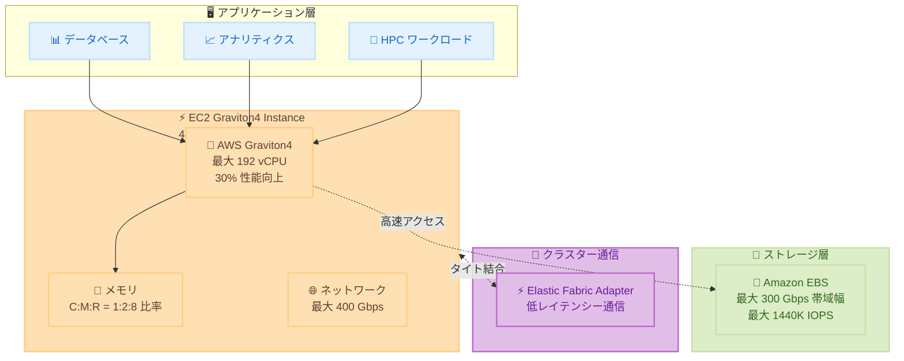

# Amazon EC2 - Graviton4 EBS 最適化インスタンスの 48xlarge サイズを追加

**リリース日**: 2026年1月22日
**サービス**: Amazon EC2
**機能**: C8gb、M8gb、R8gb インスタンスの 48xlarge および metal-48xl サイズ

## 概要

AWS は、Amazon EBS 最適化された C8gb、M8gb、R8gb インスタンスに 48xlarge サイズを追加しました。さらに、C8gb と R8gb には metal-48xl サイズも提供されます。これらのインスタンスは AWS Graviton4 プロセッサを搭載し、Graviton3 プロセッサと比較して最大 30% 優れた計算性能を提供します。

最大 300 Gbps の EBS 帯域幅により、これらのインスタンスは非アクセラレーテッドコンピュート EC2 インスタンスの中で最高の EBS パフォーマンスを提供します。また、最大 1440K IOPS を実現し、Amazon EC2 で最高の EBS IOPS パフォーマンスを持ちます。

これらの新しいインスタンスサイズは、高いブロックストレージパフォーマンスとスループットを必要とする幅広いワークロードのスケーリングに最適です。

**アップデート前の課題**

- 大規模なストレージ集約型ワークロードで十分な EBS 帯域幅が得られなかった
- IOPS 要件の高いデータベースやアナリティクスワークロードの性能がボトルネックになっていた
- 最大インスタンスサイズが 24xlarge までで、さらに大規模なワークロードに対応できなかった
- タイトに結合されたクラスターでの低レイテンシー通信が限定的だった

**アップデート後の改善**

- 48xlarge サイズにより、最大 192 vCPU と最大 300 Gbps の EBS 帯域幅を利用可能に
- 最大 1440K IOPS により、EC2 で最高の EBS IOPS パフォーマンスを実現
- metal-48xl サイズ (C8gb、R8gb) により、ベアメタルパフォーマンスを提供
- Elastic Fabric Adapter (EFA) により、低レイテンシーのクラスター通信が可能に

## アーキテクチャ図



この図は、Graviton4 EBS 最適化インスタンスの構成と、高帯域幅ストレージ、ネットワーク、クラスター通信の関係を示しています。

## サービスアップデートの詳細

### 主要機能

1. **AWS Graviton4 プロセッサによる高性能**
   - Graviton3 と比較して最大 30% 優れた計算性能
   - 最大 192 vCPU を提供
   - 最新の DDR5 メモリ搭載
   - 高効率でコスト効果の高いパフォーマンス

2. **最高クラスの EBS パフォーマンス**
   - 最大 300 Gbps の EBS 帯域幅
   - 最大 1440K IOPS (Amazon EC2 で最高)
   - ストレージ集約型ワークロードに最適
   - 高速なデータアクセスとスループット

3. **大規模インスタンスサイズとメタルオプション**
   - 48xlarge サイズで最大スケーラビリティ
   - metal-48xl サイズ (C8gb、R8gb) でベアメタルアクセス
   - メモリと vCPU の 3 つの比率 (1:2、1:4、1:8)
   - ワークロードに応じた柔軟な選択

4. **高速ネットワーキング**
   - 最大 400 Gbps のネットワーク帯域幅
   - Elastic Fabric Adapter (EFA) サポート
   - タイト結合クラスターでの低レイテンシー通信
   - HPC や分散アプリケーションに最適

## 技術仕様

### インスタンススペック比較

| インスタンスタイプ | vCPU | メモリ (GiB) | EBS 帯域幅 (Gbps) | ネットワーク帯域幅 (Gbps) | 最大 IOPS |
|-----------------|------|-------------|------------------|------------------------|----------|
| C8gb.48xlarge | 192 | 384 | 300 | 400 | 1440K |
| M8gb.48xlarge | 192 | 768 | 300 | 400 | 1440K |
| R8gb.48xlarge | 192 | 1536 | 300 | 400 | 1440K |
| C8gb.metal-48xl | 192 | 384 | 300 | 400 | 1440K |
| R8gb.metal-48xl | 192 | 1536 | 300 | 400 | 1440K |

### Graviton4 vs Graviton3 性能比較

| 項目 | Graviton4 | Graviton3 |
|------|-----------|-----------|
| 計算性能 | 基準 + 30% | 基準 |
| 最大 vCPU | 192 | 128 |
| 最大 EBS 帯域幅 | 300 Gbps | 80 Gbps |
| 最大 IOPS | 1440K | 400K |
| メモリタイプ | DDR5 | DDR5 |

### EFA サポート

Elastic Fabric Adapter (EFA) は以下のサイズでサポートされます。
- 16xlarge、24xlarge、48xlarge
- metal-24xl、metal-48xl

## 設定方法

### 前提条件

1. AWS アカウントを持っていること
2. US East (N. Virginia) または US West (Oregon) リージョンを使用すること
3. 適切な IAM 権限を持っていること

### 手順

#### ステップ 1: インスタンスの起動

```bash
# C8gb.48xlarge インスタンスを起動
aws ec2 run-instances \
  --image-id ami-xxxxxxxxx \
  --instance-type c8gb.48xlarge \
  --key-name my-key-pair \
  --subnet-id subnet-xxxxxxxxx \
  --security-group-ids sg-xxxxxxxxx
```

このコマンドは、C8gb.48xlarge インスタンスを起動します。

#### ステップ 2: EBS ボリュームの最適化

```bash
# 高 IOPS EBS ボリュームを作成
aws ec2 create-volume \
  --volume-type gp3 \
  --size 1000 \
  --iops 16000 \
  --throughput 1000 \
  --availability-zone us-east-1a

# ボリュームをインスタンスにアタッチ
aws ec2 attach-volume \
  --volume-id vol-xxxxxxxxx \
  --instance-id i-xxxxxxxxx \
  --device /dev/sdf
```

これらのコマンドは、高性能な EBS ボリュームを作成し、インスタンスにアタッチします。

#### ステップ 3: EFA の設定 (HPC ワークロード向け)

```bash
# EFA 対応のセキュリティグループを作成
aws ec2 create-security-group \
  --group-name efa-sg \
  --description "Security group for EFA"

# EFA トラフィックを許可
aws ec2 authorize-security-group-ingress \
  --group-id sg-xxxxxxxxx \
  --ip-permissions IpProtocol=-1,FromPort=-1,ToPort=-1,UserIdGroupPairs=[{GroupId=sg-xxxxxxxxx}]

# EFA 有効化でインスタンスを起動
aws ec2 run-instances \
  --image-id ami-xxxxxxxxx \
  --instance-type c8gb.48xlarge \
  --network-interfaces InterfaceType=efa,SubnetId=subnet-xxxxxxxxx,Groups=sg-xxxxxxxxx \
  --key-name my-key-pair
```

これらのコマンドは、EFA を有効にしたインスタンスを起動します。

## メリット

### ビジネス面

- **コスト効率**: Graviton4 の高性能により、同じワークロードをより少ないインスタンス数で実行可能
- **スケーラビリティ**: 48xlarge サイズにより、単一インスタンスでより大規模なワークロードに対応
- **競争優位性**: 最高の EBS パフォーマンスにより、データ処理速度を大幅に向上

### 技術面

- **最高の EBS IOPS**: 1440K IOPS により、データベースやアナリティクスのパフォーマンスを最大化
- **高帯域幅**: 300 Gbps の EBS 帯域幅により、大量のデータ転送が高速化
- **ベアメタルアクセス**: metal-48xl サイズにより、ハードウェアへの直接アクセスが可能

## デメリット・制約事項

### 制限事項

- 現時点では US East (N. Virginia) と US West (Oregon) のみで利用可能
- metal-48xl サイズは C8gb と R8gb のみで提供 (M8gb は非対応)
- 大規模インスタンスサイズのため、コストが高額になる可能性がある

### 考慮すべき点

- ワークロードが 48xlarge サイズを必要とするかを事前に評価すべき
- EBS 帯域幅を最大限活用するには、適切な EBS ボリュームタイプと設定が必要
- EFA を使用する場合、アプリケーションが EFA に対応している必要がある

## ユースケース

### ユースケース 1: 大規模なリレーショナルデータベース

**シナリオ**: 数 TB のデータを持つ PostgreSQL データベースで、高い IOPS とスループットが必要。

**実装例**:
```bash
# R8gb.48xlarge インスタンスでデータベースを起動
aws ec2 run-instances \
  --instance-type r8gb.48xlarge \
  --image-id ami-postgres \
  --key-name db-key

# 高性能 EBS ボリュームを作成
aws ec2 create-volume \
  --volume-type io2 \
  --size 5000 \
  --iops 64000 \
  --multi-attach-enabled false
```

**効果**: 1440K IOPS と 300 Gbps の EBS 帯域幅により、大規模なトランザクション処理とクエリが高速化されます。

### ユースケース 2: ビッグデータアナリティクス

**シナリオ**: Apache Spark クラスターで大規模なデータセットを処理し、高速な分析を実行したい。

**実装例**:
```bash
# M8gb.48xlarge インスタンスで Spark クラスターを構築
for i in {1..4}; do
  aws ec2 run-instances \
    --instance-type m8gb.48xlarge \
    --image-id ami-spark \
    --count 1 \
    --tag-specifications "ResourceType=instance,Tags=[{Key=Name,Value=spark-node-$i}]"
done
```

**効果**: 192 vCPU と 768 GiB メモリにより、大規模なデータセットのインメモリ処理が可能になり、分析時間を大幅に短縮できます。

### ユースケース 3: HPC クラスターワークロード

**シナリオ**: 分子動力学シミュレーションなど、タイト結合した HPC ワークロードを実行したい。

**実装例**:
```bash
# EFA 有効化で C8gb.metal-48xl インスタンスを起動
aws ec2 run-instances \
  --instance-type c8gb.metal-48xl \
  --image-id ami-hpc \
  --network-interfaces InterfaceType=efa,SubnetId=subnet-xxx,Groups=sg-xxx \
  --placement GroupName=my-placement-group \
  --count 8
```

**効果**: EFA による低レイテンシー通信と、ベアメタルの高性能により、HPC ワークロードのスケーラビリティと性能が向上します。

## 料金

料金は、インスタンスタイプとリージョンによって異なります。On-Demand、Spot、Savings Plans の料金モデルが利用可能です。

### 料金例 (US East N. Virginia)

| インスタンスタイプ | 時間あたり料金 (On-Demand、概算) |
|-----------------|--------------------------------|
| C8gb.48xlarge | $8.00 |
| M8gb.48xlarge | $16.00 |
| R8gb.48xlarge | $24.00 |

*注: 正確な料金は [EC2 料金ページ](https://aws.amazon.com/ec2/pricing/) を参照してください。

## 利用可能リージョン

- US East (N. Virginia) - すべてのサイズ
- US West (Oregon) - すべてのサイズ

*注: metal-48xl サイズは現時点で US East (N. Virginia) のみで利用可能です。

## 関連サービス・機能

- **Amazon EBS**: 高性能ストレージボリューム
- **Elastic Fabric Adapter (EFA)**: HPC 向け低レイテンシーネットワーキング
- **AWS Nitro System**: 高性能仮想化基盤

## 参考リンク

- [公式発表 (What's New)](https://aws.amazon.com/about-aws/whats-new/2026/01/graviton4-ebs-optimized-larger-sizes)
- [Amazon C8gb インスタンス](https://aws.amazon.com/ec2/instance-types/c8g/)
- [Amazon M8gb インスタンス](https://aws.amazon.com/ec2/instance-types/m8g/)
- [Amazon R8gb インスタンス](https://aws.amazon.com/ec2/instance-types/r8g)
- [AWS Graviton ページ](https://aws.amazon.com/ec2/graviton/level-up-with-graviton/)

## まとめ

C8gb、M8gb、R8gb の 48xlarge および metal-48xl サイズは、AWS Graviton4 の性能を最大限に活用し、EC2 で最高の EBS パフォーマンスを提供します。最大 1440K IOPS と 300 Gbps の EBS 帯域幅により、ストレージ集約型ワークロード、大規模データベース、ビッグデータアナリティクス、HPC クラスターに最適です。特に高い IOPS とスループットを必要とするワークロードでは、これらの新しいインスタンスサイズを検討することを強くお勧めします。
