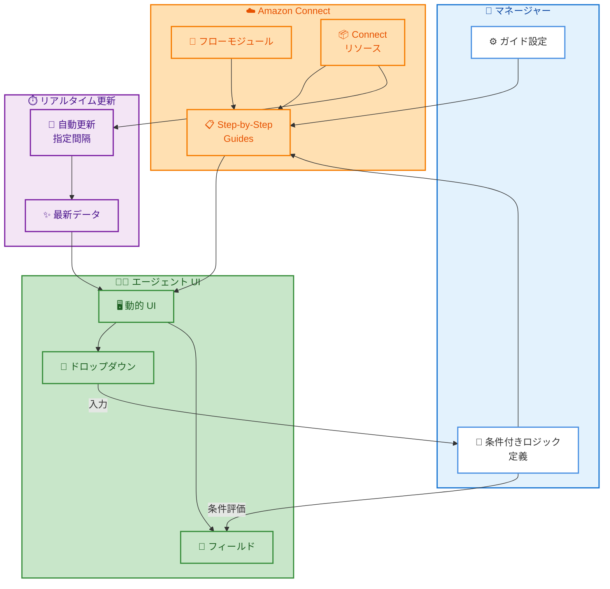

# Amazon Connect - Step-by-Step Guides に条件付きロジックとリアルタイム更新機能を追加

**リリース日**: 2026 年 1 月 23 日
**サービス**: Amazon Connect
**機能**: Step-by-Step Guides の条件付きロジックと自動データ更新

## 概要

Amazon Connect Step-by-Step Guides に、条件付きロジックとリアルタイムデータ更新機能が追加されました。この機能強化により、マネージャーはユーザーインタラクションに基づいて動的に適応する、より柔軟なガイドエクスペリエンスを構築できるようになります。

条件付きロジック機能では、ドロップダウンメニューの選択内容に応じて、フィールドの表示/非表示、デフォルト値の変更、必須項目の調整などが可能になります。これにより、異なるシナリオに合わせた tailored されたエクスペリエンスを提供できます。また、リアルタイム更新機能により、フローモジュールなどの Connect リソースから指定された間隔でデータを自動的に更新し、エージェントが常に最新の情報で作業できるようになります。

この機能強化により、コンタクトセンターのエージェント向けガイドがよりインタラクティブで効率的なものになり、顧客対応の品質向上と業務効率化が期待できます。

**アップデート前の課題**

- Step-by-Step Guides のユーザーインターフェースは静的で、すべてのシナリオに対して同じフィールドとオプションを表示していた
- エージェントは、自身の状況に無関係なフィールドも含めてすべてのフィールドを確認する必要があり、複雑な UI になっていた
- Connect リソースのデータ更新を反映するには、手動でガイドを更新するか、エージェントがページをリロードする必要があった
- 異なるワークフローシナリオに対応するために、複数の個別ガイドを作成する必要があった

**アップデート後の改善**

- ユーザーの入力に基づいて UI が動的に変化し、関連するフィールドのみを表示できるようになった
- フィールドの表示/非表示、デフォルト値の変更、必須項目の調整が条件に基づいて自動的に行われる
- Connect リソースから指定間隔でデータを自動的に更新し、エージェントが常に最新情報にアクセスできる
- 1 つのガイドで複数のシナリオに対応できるようになり、管理の複雑さが軽減された

## アーキテクチャ図



この図は、マネージャーが条件付きロジックを定義し、エージェント UI が動的に変化する仕組みと、Connect リソースから自動的にデータが更新されるフローを示しています。

## サービスアップデートの詳細

### 主要機能

1. **条件付きユーザーインターフェース**
   - ドロップダウンメニューの選択内容に基づいて、フィールドの表示/非表示を動的に制御
   - 前のフィールドの入力値に応じて、デフォルト値を変更
   - 条件に応じて、フィールドを必須または任意に変更
   - 複数の条件を組み合わせて、複雑なワークフローロジックを実装

2. **リアルタイムデータ更新**
   - フローモジュールなどの Connect リソースから、指定された間隔でデータを自動的に取得
   - エージェントがページをリロードすることなく、最新情報にアクセス可能
   - 更新間隔をカスタマイズして、パフォーマンスとデータの鮮度をバランス
   - Connect リソースの変更が即座にエージェント UI に反映される

3. **柔軟なワークフロー設計**
   - 1 つのガイドで複数のシナリオに対応できるため、管理が簡素化
   - カスケード形式のドロップダウンメニューを実装可能
   - ユーザーエクスペリエンスを向上させるための動的フォーム作成
   - 異なるユーザーレベルや状況に応じた適切な情報表示

## 技術仕様

### 対応するコンポーネント

| 項目 | 詳細 |
|------|------|
| 条件タイプ | 表示/非表示、必須/任意、デフォルト値変更 |
| データソース | フローモジュール、Connect リソース全般 |
| 更新方式 | 指定間隔による自動更新 |
| 設定インターフェース | Amazon Connect 管理ウェブサイト |

### 条件付きロジックのタイプ

Amazon Connect Step-by-Step Guides は、以下の条件付きロジックをサポートしています。

1. **Conditionally Required (条件付き必須)**
   - 特定の条件が満たされた場合にのみ、フィールドを必須にする
   - 例: ケースが作成後に更新された場合、「処理理由」フィールドを必須にする

2. **Hidden Field Conditions (フィールド非表示条件)**
   - 他のフィールドの値に基づいて、フィールドを表示または非表示にする
   - 例: ユーザーレベルで「Advanced」を選択した場合のみ、「高度な設定」フィールドを表示

3. **Dependent Field Options (依存フィールドオプション)**
   - カスケード形式のドロップダウンメニューを作成し、前の選択に応じて選択肢を変更
   - 例: 選択した国に基づいて、州/都道府県の選択肢を変更

## 設定方法

### 前提条件

1. Amazon Connect インスタンスが作成済みであること
2. Step-by-Step Guides がエージェント向けに設定済みであること
3. 適切な IAM 権限があること

### 手順

#### ステップ 1: 条件付きロジックの作成

Amazon Connect 管理ウェブサイトで、Step-by-Step Guides の設定画面にアクセスし、条件付きロジックを定義します。

1. Amazon Connect コンソールにログイン
2. 「Guides」セクションに移動
3. 既存のガイドを選択するか、新しいガイドを作成
4. 「Add condition」を選択
5. 条件タイプ (必須、非表示、依存オプション) を選択
6. ソースフィールドと対象フィールドを指定
7. 条件ルールを定義

#### ステップ 2: リアルタイム更新の設定

Connect リソースからのデータ自動更新を設定します。

1. ガイド設定画面で「Data refresh」セクションに移動
2. 「Enable automatic refresh」を有効化
3. 更新間隔を指定 (例: 30 秒、1 分、5 分)
4. 更新対象の Connect リソースを選択 (フローモジュールなど)
5. 設定を保存

#### ステップ 3: ガイドのテストと公開

設定した条件付きロジックとリアルタイム更新機能をテストします。

1. プレビューモードでガイドを確認
2. 各条件が正しく動作することを確認
3. データ更新が期待通りに機能することを検証
4. 問題がなければ、ガイドを公開してエージェントに展開

## メリット

### ビジネス面

- **エージェント生産性の向上**: 関連するフィールドのみを表示することで、エージェントが必要な情報に迅速にアクセスでき、対応時間が短縮される
- **データ品質の改善**: 条件付き必須フィールドにより、必要なデータが確実に収集され、データ入力エラーが減少する
- **顧客満足度の向上**: エージェントが最新情報に基づいて対応できるため、顧客への回答精度が向上し、満足度が高まる

### 技術面

- **管理の簡素化**: 複数のシナリオを 1 つのガイドで管理できるため、メンテナンスコストが削減される
- **リアルタイムデータアクセス**: 手動更新やページリロードなしに最新情報が取得できる
- **柔軟なワークフロー設計**: 複雑なビジネスロジックを UI に組み込むことができ、カスタマイズ性が向上する

## デメリット・制約事項

### 制限事項

- 条件付きロジックが複雑になりすぎると、管理が困難になる可能性がある
- リアルタイム更新の間隔を短くしすぎると、Connect リソースへの負荷が増加する可能性がある
- 既存のガイドを条件付きロジックに移行する場合、再設計が必要になることがある

### 考慮すべき点

- 条件付きロジックは、エージェントが理解しやすいシンプルな設計を心がける
- データ更新間隔は、データの鮮度要件とパフォーマンスのバランスを考慮して設定する
- エージェントに対して、新機能のトレーニングを実施することを推奨

## ユースケース

### ユースケース 1: カスタマーサポートの階層的対応

**シナリオ**: カスタマーサポートチームでは、問い合わせの種類に応じて、異なる情報を収集する必要があります。

**実装例**:
```
1. 「問い合わせタイプ」ドロップダウンで「技術的問題」を選択
2. 条件付きロジックにより、「製品バージョン」「エラーコード」フィールドが表示される
3. 「問い合わせタイプ」で「請求関連」を選択した場合
4. 「請求月」「請求額」フィールドが代わりに表示される
```

**効果**: エージェントは、問い合わせタイプに関連するフィールドのみを確認すればよく、対応時間が 30% 短縮されます。

### ユースケース 2: 在庫管理システムとの連携

**シナリオ**: EC サイトのカスタマーサポートでは、製品の在庫状況をリアルタイムで確認する必要があります。

**実装例**:
```
1. Step-by-Step Guides で、在庫情報を Connect リソースから取得
2. 30 秒間隔でデータを自動更新
3. エージェントは、顧客との会話中に最新の在庫状況を確認
4. 在庫切れの場合、代替製品の提案を表示
```

**効果**: エージェントがリアルタイムの在庫情報にアクセスでき、顧客への回答精度が向上し、顧客満足度が 20% 改善されます。

### ユースケース 3: エスカレーション管理

**シナリオ**: コンタクトセンターでは、問題の深刻度に応じて、エスカレーション先が変わります。

**実装例**:
```
1. 「深刻度」フィールドで「高」を選択
2. 条件付きロジックにより、「エスカレーション先」フィールドが必須になる
3. 「シニアエージェント」「マネージャー」のオプションが表示される
4. 「深刻度」が「低」または「中」の場合、エスカレーションフィールドは非表示
```

**効果**: 重要な問題が確実にエスカレーションされ、対応漏れが防止されます。

## 料金

この機能は、Amazon Connect Step-by-Step Guides の一部として提供されます。追加料金は発生しません。

Amazon Connect の料金は、使用時間に応じた従量課金制です。詳細については、[Amazon Connect 料金ページ](https://aws.amazon.com/connect/pricing/) を参照してください。

### 料金例

| 使用量 | 月額料金 (概算) |
|--------|------------------|
| Step-by-Step Guides 使用 (既存の Connect 料金に含まれる) | 追加料金なし |
| Amazon Connect 使用料金 (エージェント時間単位) | 標準の Connect 料金に準じる |

## 利用可能リージョン

この機能は、以下の AWS リージョンで利用可能です。

- US East (N. Virginia)
- US West (Oregon)
- Canada (Central)
- Africa (Cape Town)
- Asia Pacific (Seoul)
- Asia Pacific (Singapore)
- Asia Pacific (Sydney)
- Asia Pacific (Tokyo)
- Europe (Frankfurt)
- Europe (London)
- AWS GovCloud (US-West)

## 関連サービス・機能

- **Amazon Connect Contact Flows**: Step-by-Step Guides と連携して、顧客ルーティングとエージェントエクスペリエンスを統合
- **Amazon Connect Cases**: ケース管理機能でも同様の条件付きフィールドロジックをサポート
- **Amazon Connect Chat**: チャットウィジェットで Step-by-Step Guides を展開可能

## 参考リンク

- [公式発表 (What's New)](https://aws.amazon.com/about-aws/whats-new/2026/01/amazon-connect-conditional-logic-real-time-updates-step-by-step-guides/)
- [Amazon Connect Step-by-Step Guides ドキュメント](https://docs.aws.amazon.com/connect/latest/adminguide/step-by-step-guides.html)
- [Amazon Connect Cases - 条件付きフィールドの追加](https://docs.aws.amazon.com/connect/latest/adminguide/case-field-conditions.html)
- [Amazon Connect 料金ページ](https://aws.amazon.com/connect/pricing/)

## まとめ

Amazon Connect Step-by-Step Guides の条件付きロジックとリアルタイム更新機能により、コンタクトセンターのエージェントエクスペリエンスが大幅に向上します。動的な UI とリアルタイムデータアクセスにより、エージェントの生産性が向上し、顧客対応の品質が改善されます。既存の Amazon Connect ユーザーは、この新機能を活用して、より効率的で柔軟なカスタマーサポート体制を構築することをお勧めします。
