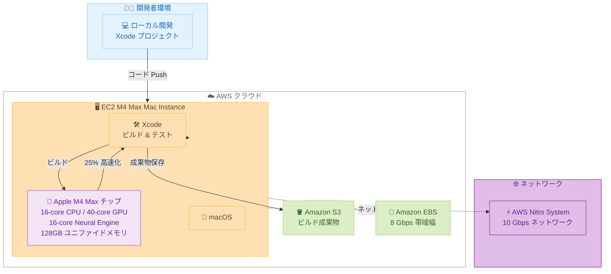

# Amazon EC2 M4 Max Mac Instances - 一般提供開始

**リリース日**: 2026年1月23日
**サービス**: Amazon EC2
**機能**: M4 Max Mac instances

## 概要

Amazon Web Services は、最新の Mac Studio ハードウェアを搭載した Amazon EC2 M4 Max Mac instances の一般提供を開始しました。これは、Apple 開発者が最も要求の厳しいビルドおよびテストワークロードを AWS に移行できるようにする次世代 EC2 Mac インスタンスです。

M4 Max Mac instances は、iOS、macOS、iPadOS、tvOS、watchOS、visionOS、Safari などの Apple プラットフォーム向けアプリケーションの構築とテストに最適です。Apple M4 Max チップを搭載し、M1 Ultra Mac instances と比較して最大 25% 優れたアプリケーションビルドパフォーマンスを提供します。

AWS Nitro System により、最大 10 Gbps のネットワーク帯域幅と 8 Gbps の Amazon EBS ストレージ帯域幅を提供し、Apple M4 Max Mac Studio コンピュータをベースにした 16 コア CPU、40 コア GPU、16 コア Neural Engine、128GB のユニファイドメモリを搭載しています。

**アップデート前の課題**

- M1 Ultra Mac instances では、大規模な Apple アプリケーションのビルドに時間がかかっていた
- GPU コア数とメモリ容量に制限があり、複雑なグラフィックス処理や ML ワークロードに対応しきれなかった
- 最新の Apple Silicon の性能を活用できなかった
- ビルドパフォーマンスの向上が求められていた

**アップデート後の改善**

- M1 Ultra Mac instances と比較して最大 25% 優れたアプリケーションビルドパフォーマンスを実現
- 40 コア GPU により、グラフィックス処理能力が大幅に向上
- 128GB のユニファイドメモリにより、大規模プロジェクトのビルドが可能に
- 16 コア Neural Engine により、機械学習ワークロードの高速化

## アーキテクチャ図



この図は、EC2 M4 Max Mac instances を使用した Apple アプリケーション開発のワークフローを示しています。

## サービスアップデートの詳細

### 主要機能

1. **Apple M4 Max チップ搭載**
   - 16 コア CPU で高速なコンパイルを実現
   - 40 コア GPU でグラフィックス処理を大幅に高速化
   - 16 コア Neural Engine で機械学習ワークロードに対応
   - 128GB のユニファイドメモリで大規模プロジェクトをサポート

2. **優れたビルドパフォーマンス**
   - M1 Ultra Mac instances と比較して最大 25% 高速化
   - Xcode プロジェクトのコンパイル時間を大幅に短縮
   - テストスイートの実行時間を削減
   - CI/CD パイプラインの効率化

3. **AWS Nitro System による高性能ネットワーキング**
   - 最大 10 Gbps のネットワーク帯域幅
   - 最大 8 Gbps の Amazon EBS ストレージ帯域幅
   - 高速なコード転送とビルド成果物の保存

## 技術仕様

### インスタンススペック

| 項目 | 詳細 |
|------|------|
| プロセッサ | Apple M4 Max |
| CPU コア数 | 16 コア |
| GPU コア数 | 40 コア |
| Neural Engine | 16 コア |
| メモリ | 128GB ユニファイドメモリ |
| ネットワーク帯域幅 | 最大 10 Gbps |
| EBS 帯域幅 | 最大 8 Gbps |

### M4 Max vs M1 Ultra 比較

| 項目 | M4 Max Mac | M1 Ultra Mac |
|------|------------|--------------|
| ビルドパフォーマンス | 基準 + 25% | 基準 |
| GPU コア数 | 40 コア | 64 コア |
| メモリ | 128GB | 128GB |
| CPU コア数 | 16 コア | 20 コア |

## 設定方法

### 前提条件

1. AWS アカウントを持っていること
2. EC2 Dedicated Hosts の使用経験があること
3. macOS と Xcode の知識があること

### 手順

#### ステップ 1: Dedicated Host の割り当て

```bash
# Dedicated Host を割り当て
aws ec2 allocate-hosts \
  --instance-type mac2-m4max.metal \
  --availability-zone us-east-1a \
  --quantity 1
```

このコマンドは、M4 Max Mac instance を実行するための Dedicated Host を割り当てます。

#### ステップ 2: Mac インスタンスの起動

```bash
# M4 Max Mac インスタンスを起動
aws ec2 run-instances \
  --instance-type mac2-m4max.metal \
  --ami-id ami-xxxxxxxxx \
  --key-name my-key-pair \
  --placement Tenancy=host,HostId=h-xxxxxxxxx
```

このコマンドは、割り当てた Dedicated Host 上で M4 Max Mac インスタンスを起動します。

#### ステップ 3: Xcode のインストールとプロジェクト設定

```bash
# SSH で Mac インスタンスに接続
ssh -i my-key-pair.pem ec2-user@<instance-public-ip>

# Xcode のインストール
sudo softwareupdate --install-rosetta --agree-to-license
xcode-select --install

# プロジェクトのクローン
git clone https://github.com/your-org/your-ios-app.git
cd your-ios-app

# ビルドの実行
xcodebuild -project YourApp.xcodeproj -scheme YourApp -configuration Release
```

これらのコマンドは、Mac インスタンス上で Xcode を設定し、iOS アプリをビルドします。

## メリット

### ビジネス面

- **開発サイクルの高速化**: ビルド時間が 25% 短縮され、開発者の生産性が向上
- **スケーラビリティ**: 必要に応じて複数の Mac インスタンスを並列実行し、ビルド時間をさらに短縮
- **コスト最適化**: オンプレミスの Mac ハードウェアを購入・維持する必要がなくなる

### 技術面

- **最新の Apple Silicon**: M4 Max チップの性能を AWS クラウドで活用
- **高速ストレージアクセス**: 8 Gbps の EBS 帯域幅により、大規模プロジェクトのビルドが高速化
- **ネットワークパフォーマンス**: 10 Gbps のネットワークにより、コードとビルド成果物の転送が高速化

## デメリット・制約事項

### 制限事項

- 現時点では US East (N. Virginia) と US West (Oregon) のみで利用可能
- Dedicated Hosts として提供され、24 時間の最小割り当て期間がある
- macOS ライセンスの制約により、インスタンスタイプの変更に制限がある

### 考慮すべき点

- 24 時間の最小割り当て期間があるため、短時間の使用には向かない
- Dedicated Host の管理が必要
- macOS の更新とメンテナンスは利用者が実施する必要がある

## ユースケース

### ユースケース 1: iOS アプリの CI/CD パイプライン

**シナリオ**: iOS アプリの開発チームが、GitHub Actions を使用して自動ビルドとテストを実行したい。

**実装例**:
```yaml
name: iOS CI

on: [push, pull_request]

jobs:
  build:
    runs-on: [self-hosted, macOS, m4-max]
    steps:
      - uses: actions/checkout@v3
      - name: Build
        run: |
          xcodebuild -project MyApp.xcodeproj \
            -scheme MyApp \
            -configuration Release \
            -archivePath MyApp.xcarchive \
            archive
      - name: Test
        run: |
          xcodebuild test \
            -project MyApp.xcodeproj \
            -scheme MyApp \
            -destination 'platform=iOS Simulator,name=iPhone 15'
```

**効果**: M4 Max の性能により、ビルドとテストが高速化され、開発者へのフィードバックが早まります。

### ユースケース 2: visionOS アプリの開発

**シナリオ**: Apple Vision Pro 向けの visionOS アプリを開発し、複雑な 3D グラフィックスをテストしたい。

**実装例**:
```bash
# visionOS シミュレータでビルドとテスト
xcodebuild -project VisionApp.xcodeproj \
  -scheme VisionApp \
  -destination 'platform=visionOS Simulator,name=Apple Vision Pro' \
  test
```

**効果**: 40 コア GPU により、3D グラフィックスのレンダリングが高速化され、開発効率が向上します。

### ユースケース 3: 大規模なマルチプラットフォームビルド

**シナリオ**: iOS、macOS、tvOS、watchOS 向けのアプリを同時にビルドしたい。

**実装例**:
```bash
# 並列ビルドスクリプト
#!/bin/bash
xcodebuild -project MyApp.xcodeproj -scheme iOS -destination generic/platform=iOS &
xcodebuild -project MyApp.xcodeproj -scheme macOS -destination generic/platform=macOS &
xcodebuild -project MyApp.xcodeproj -scheme tvOS -destination generic/platform=tvOS &
xcodebuild -project MyApp.xcodeproj -scheme watchOS -destination generic/platform=watchOS &
wait
```

**効果**: 128GB のユニファイドメモリにより、複数のビルドを並列実行でき、全体のビルド時間を大幅に短縮できます。

## 料金

M4 Max Mac instances は Dedicated Hosts として提供され、On-Demand と Savings Plans の料金モデルが利用可能です。秒単位の課金で、24 時間の最小割り当て期間があります。

### 料金例

| リージョン | インスタンスタイプ | 時間あたり料金（概算） |
|------------|-------------------|----------------------|
| US East (N. Virginia) | mac2-m4max.metal | $3.50 |
| US West (Oregon) | mac2-m4max.metal | $3.50 |

*注: 正確な料金は [EC2 料金ページ](https://aws.amazon.com/ec2/pricing/dedicated-instances/) を参照してください。

## 利用可能リージョン

- US East (N. Virginia)
- US West (Oregon)

## 関連サービス・機能

- **Amazon S3**: ビルド成果物とアプリパッケージの保存
- **AWS CodePipeline**: CI/CD パイプラインの自動化
- **Amazon CloudWatch**: インスタンスのモニタリングとログ管理

## 参考リンク

- [公式発表 (What's New)](https://aws.amazon.com/about-aws/whats-new/2026/01/amazon-ec2-m4-max-mac-instances-ga/)
- [Amazon EC2 Mac ページ](https://aws.amazon.com/ec2/instance-types/mac/)
- [EC2 料金ページ](https://aws.amazon.com/ec2/pricing/dedicated-instances/)

## まとめ

Amazon EC2 M4 Max Mac instances は、Apple 開発者に最新の M4 Max チップの性能を AWS クラウドで提供します。M1 Ultra と比較して 25% 優れたビルドパフォーマンスを実現し、iOS、macOS、visionOS などの Apple プラットフォーム向けアプリケーション開発を大幅に加速します。特に CI/CD パイプラインでの自動ビルドや、大規模プロジェクトの並列ビルドに最適です。US East と US West リージョンで利用可能なため、まずは小規模なワークロードから試してみることをお勧めします。
