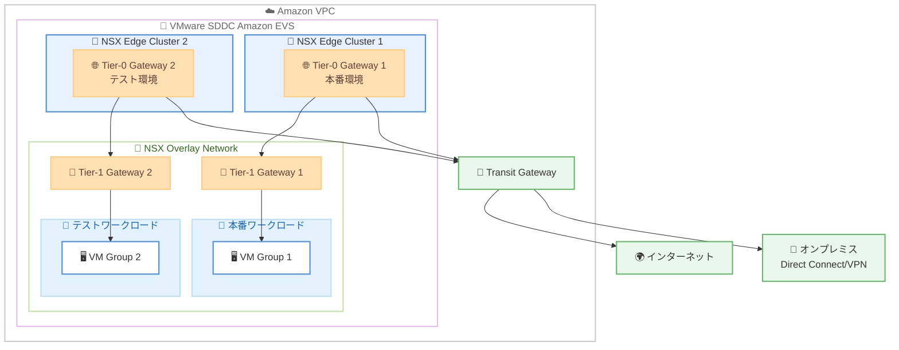

# Amazon EVS - 複数の VMware NSX Edge Gateway サポート

**リリース日**: 2026年01月23日
**サービス**: Amazon Elastic VMware Service (Amazon EVS)
**機能**: 複数の VMware NSX Tier-0 Gateway のデプロイサポート

## 概要

AWS は、Amazon Elastic VMware Service (Amazon EVS) において、VMware Software-Defined Data Centers (SDDC) 内に複数の VMware NSX Tier-0 Gateway をデプロイできる機能を発表しました。この新機能により、ネットワークセグメンテーションが強化され、より柔軟なルーティング構成が可能になります。

複数の NSX Tier-0 Gateway により、ネットワークトラフィックを複数の NSX Edge Cluster に分散することで、パフォーマンスとスケーラビリティが向上します。この機能強化により、異なるワークロード環境を分離し、各 Gateway ごとに個別のセキュリティポリシーを維持できるようになります。また、複数の Gateway を使用して、ネットワーク構成の検証や Gateway のアップグレードを行うための独立したテスト環境を作成し、本番ワークロードへの影響を最小限に抑えることができます。

このアーキテクチャの柔軟性により、顧客は特定のビジネス要件に合わせてネットワークトポロジを調整し、AWS 上で VMware ワークロードを実行する際の運用効率を維持できます。

**アップデート前の課題**

- 単一の NSX Tier-0 Gateway しかサポートされておらず、すべてのトラフィックが一つの Gateway を経由していた
- 異なるワークロード環境間でネットワークセグメンテーションを実現するのが困難だった
- Gateway のアップグレードやメンテナンス時に本番ワークロードへの影響が避けられなかった

**アップデート後の改善**

- 複数の NSX Tier-0 Gateway をデプロイし、ネットワークトラフィックを分散できるようになった
- ワークロード環境ごとに異なるセキュリティポリシーを維持できるようになった
- テスト環境を分離することで、本番環境への影響を最小限に抑えながら Gateway のアップグレードや構成検証が可能になった

## アーキテクチャ図

この図は、Amazon EVS 環境内に複数の NSX Edge Cluster と Tier-0 Gateway をデプロイし、本番環境とテスト環境を分離する構成を示しています。各 Gateway は独立したトラフィック管理とセキュリティポリシーを持ちます。

## サービスアップデートの詳細

### 主要機能

1. **複数の NSX Tier-0 Gateway のサポート**
   - VMware SDDC 内に複数の NSX Tier-0 Gateway をデプロイ可能
   - 各 Gateway は独立した NSX Edge Cluster 上で動作
   - Active/Standby 構成で高可用性を実現

2. **ネットワークセグメンテーションの強化**
   - 異なるワークロード環境を論理的に分離
   - 各 Gateway ごとに個別のセキュリティポリシーを設定可能
   - ワークロードごとに異なるルーティング構成を実装

3. **トラフィック分散とパフォーマンス向上**
   - ネットワークトラフィックを複数の NSX Edge Cluster に分散
   - 各 Gateway が独立してトラフィックを処理
   - スケーラビリティとパフォーマンスの向上

4. **独立したテスト環境の作成**
   - 本番環境とは別のテスト用 Gateway を作成
   - ネットワーク構成の検証を本番環境に影響を与えずに実施
   - Gateway のアップグレードを段階的に実行可能

## 技術仕様

### NSX Tier-0 Gateway の構成

| 項目 | 詳細 |
|------|------|
| サポート数 | 複数の Tier-0 Gateway をデプロイ可能 |
| 高可用性構成 | Active/Standby NSX Edge Cluster (2ノード) |
| トラフィック処理 | 論理ネットワークと物理ネットワーク間の North-South トラフィック |
| ルーティング | 各 Gateway で独立したルーティングポリシーを設定可能 |

### NSX Edge Cluster の役割

- NSX Tier-0 Gateway のホスト環境を提供
- ネットワークトラフィックの処理と転送を実行
- VPC との接続を管理 (Transit Gateway、Direct Connect、VPN)

## 設定方法

### 前提条件

1. Amazon EVS 環境が作成されていること
2. 必要な VPC および VLAN サブネットが構成されていること
3. NSX Manager クラスターが稼働していること

### 手順

#### ステップ1: NSX Edge Cluster の追加デプロイ

Amazon EVS コンソールまたは API を使用して、追加の NSX Edge Cluster をデプロイします。

#### ステップ2: 新しい Tier-0 Gateway の作成

NSX Manager を使用して、新しい NSX Edge Cluster 上に Tier-0 Gateway を作成します。

#### ステップ3: ルーティングポリシーの設定

各 Tier-0 Gateway に対して、適切なルーティングポリシーとセキュリティ設定を構成します。

#### ステップ4: Tier-1 Gateway との接続

Tier-1 Gateway を作成し、適切な Tier-0 Gateway に接続します。

#### ステップ5: ワークロードの配置

各ワークロードを適切な Tier-1 Gateway に接続し、ネットワークセグメンテーションを実現します。

詳細な手順については、[re:Post article](https://repost.aws/articles/ARUttZpYUrSIKLLyaR3txGkA) を参照してください。

## メリット

### ビジネス面

- **運用効率の向上**: テスト環境を分離することで、本番環境への影響を最小限に抑えながらネットワーク変更を検証できる
- **ビジネス要件への適合**: 特定のビジネス要件に合わせてネットワークトポロジを柔軟に調整できる
- **ダウンタイムの削減**: Gateway のアップグレードを段階的に実施し、ダウンタイムを最小化できる

### 技術面

- **パフォーマンスの向上**: ネットワークトラフィックを複数の Edge Cluster に分散し、パフォーマンスを向上
- **スケーラビリティの向上**: 複数の Gateway により、ネットワークのスケーラビリティが向上
- **セキュリティの強化**: ワークロード環境ごとに個別のセキュリティポリシーを維持できる

## デメリット・制約事項

### 制限事項

- 各 Tier-0 Gateway は Active/Standby 構成で 2 つの NSX Edge ノードが必要
- 追加の NSX Edge Cluster にはコストが発生する
- ネットワーク構成の複雑性が増加する

### 考慮すべき点

- 複数の Gateway を適切に管理するための運用プロセスが必要
- ルーティングポリシーとセキュリティポリシーを各 Gateway で一貫して管理する必要がある
- ネットワークトラフィックパターンを理解し、適切に Gateway を配置する必要がある

## ユースケース

### ユースケース1: 本番環境とテスト環境の分離

**シナリオ**: 本番ワークロードとテストワークロードを完全に分離し、テスト環境での変更が本番環境に影響を与えないようにする

**実装例**:
- Tier-0 Gateway 1: 本番ワークロード専用
- Tier-0 Gateway 2: テストワークロード専用
- 各 Gateway に独立したセキュリティポリシーとルーティング構成を適用

**効果**: テスト環境での実験的な変更やアップグレードを安全に実施でき、本番環境の安定性を維持

### ユースケース2: セキュリティレベル別のネットワーク分離

**シナリオ**: 異なるセキュリティ要件を持つワークロードを論理的に分離し、各環境に適したセキュリティポリシーを適用

**実装例**:
- Tier-0 Gateway 1: 高セキュリティワークロード (PCI-DSS 準拠など)
- Tier-0 Gateway 2: 標準セキュリティワークロード
- 各 Gateway に異なるファイアウォールルールとアクセス制御を適用

**効果**: コンプライアンス要件に準拠しながら、各ワークロードに適切なセキュリティ制御を実装

### ユースケース3: 段階的な Gateway アップグレード

**シナリオ**: NSX Gateway のアップグレードを段階的に実施し、本番環境へのリスクを最小化

**実装例**:
- まずテスト用 Tier-0 Gateway でアップグレードを実施
- 動作を検証した後、本番用 Tier-0 Gateway をアップグレード
- 問題が発生した場合は、以前のバージョンの Gateway にトラフィックを切り戻し

**効果**: アップグレードに伴うリスクを最小化し、安全にインフラストラクチャを更新

## 料金

Amazon EVS の料金は、使用する EC2 ベアメタルインスタンス (ESX ホスト) の数と種類に基づいて課金されます。複数の NSX Edge Cluster を使用する場合、追加のホストが必要になる場合があります。

詳細な料金情報については、[Amazon EVS pricing page](https://aws.amazon.com/evs/pricing/) を参照してください。

## 利用可能リージョン

Amazon EVS が利用可能な全リージョンで、複数の NSX Tier-0 Gateway 機能を使用できます。

## 関連サービス・機能

- **VMware NSX**: ソフトウェア定義ネットワーク (SDN) プラットフォーム
- **VMware Cloud Foundation**: 統合されたソフトウェアスタック
- **AWS Transit Gateway**: 複数の VPC とオンプレミスネットワークを接続するネットワークハブ
- **AWS Direct Connect**: AWS への専用ネットワーク接続

## 参考リンク

- [公式発表 (What's New)](https://aws.amazon.com/about-aws/whats-new/2026/01/amazon-evs-multiple-vmware-nsx-edge-gateways/)
- [re:Post article - 複数 NSX Edge Cluster のデプロイ手順](https://repost.aws/articles/ARUttZpYUrSIKLLyaR3txGkA)
- [Amazon EVS product detail page](https://aws.amazon.com/evs/)
- [Amazon EVS user guide](https://docs.aws.amazon.com/evs/latest/userguide/what-is-evs.html)

## まとめ

Amazon EVS における複数の NSX Tier-0 Gateway のサポートにより、ネットワークセグメンテーション、パフォーマンス、運用効率が大幅に向上しました。VMware ワークロードを AWS 上で実行する組織は、この新機能を活用して、ビジネス要件に合わせたネットワークアーキテクチャを構築し、本番環境への影響を最小限に抑えながらネットワーク変更を安全に実施できるようになります。特に、段階的なアップグレードやテスト環境の分離が求められる環境では、この機能の導入を検討する価値があります。
