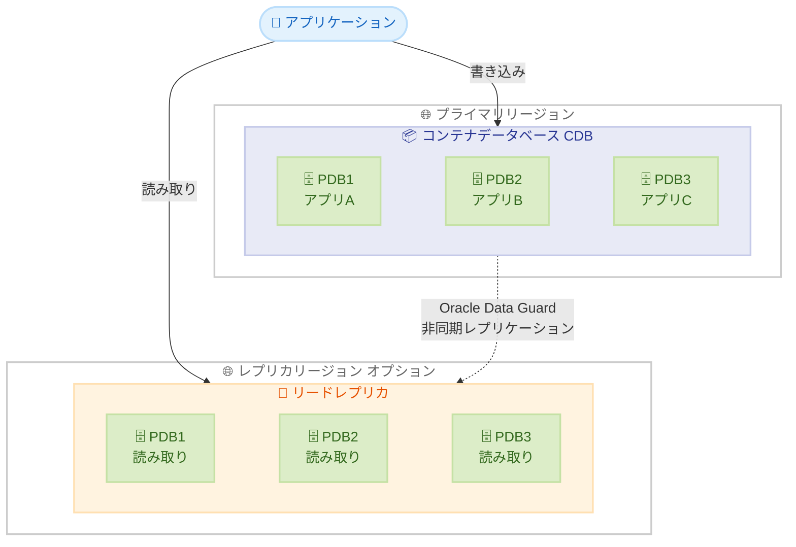

# Amazon RDS for Oracle - マルチテナント構成でのレプリカサポート

**リリース日**: 2026 年 1 月 23 日
**サービス**: Amazon RDS for Oracle
**機能**: Oracle マルチテナント構成でのリードレプリカサポート

## 概要

Amazon RDS for Oracle は、Oracle マルチテナント構成で設定されたインスタンスに対するデータベースレプリカのサポートを開始しました。Oracle マルチテナント構成は、単一のコンテナデータベース (CDB) 内に複数の独立したプラガブルデータベース (PDB) をホストできる機能で、統合によるコスト削減と管理の簡素化を実現します。

このアップデートにより、顧客はマルチテナント構成のレプリカに読み取りワークロードを分散してスケーリングしたり、クロスリージョンレプリカをセットアップしたりできるようになりました。災害復旧の場合、レプリカを昇格させて新しいスタンドアロンデータベースとして機能させたり、スイッチオーバーを実行してプライマリデータベースとレプリカの役割を逆転させたりすることで、迅速な復旧が可能です。

レプリカの設定は、AWS マネジメントコンソール、AWS CLI、または AWS SDK を使用して、マウントモードまたは読み取り専用モードで作成できます。レプリカがセットアップされると、Amazon RDS for Oracle は Oracle Data Guard を使用して、プライマリとレプリカのデータベースインスタンス間で非同期の物理レプリケーションを管理します。

**アップデート前の課題**

- Oracle マルチテナント構成 (CDB/PDB) を使用している場合、リードレプリカを作成できなかった
- 読み取りワークロードのスケーリングやクロスリージョンレプリケーションを実現するには、非 CDB 構成を使用する必要があった
- マルチテナント構成のメリット (コスト削減、管理簡素化) とレプリカのメリット (読み取りスケーリング、DR) を同時に享受できなかった

**アップデート後の改善**

- Oracle マルチテナント構成 (CDB/PDB) でリードレプリカを作成できるようになった
- 読み取りワークロードをレプリカに分散し、マルチテナント環境でもスケーリングが可能になった
- クロスリージョンレプリカを使用した災害復旧戦略を、マルチテナント構成で実装できるようになった
- Oracle Data Guard による自動レプリケーション管理で、高い信頼性を確保

## アーキテクチャ図



プライマリリージョンのコンテナデータベース (CDB) に複数のプラガブルデータベース (PDB) を配置し、Oracle Data Guard を使用してレプリカリージョンに非同期レプリケーションを実行します。アプリケーションは書き込みをプライマリに、読み取りをレプリカに分散できます。

## サービスアップデートの詳細

### 主要機能

1. **マルチテナント構成でのリードレプリカ作成**
   - Oracle マルチテナント構成 (CDB/PDB) でリードレプリカを作成可能
   - マウントモードまたは読み取り専用モードを選択可能
   - AWS マネジメントコンソール、AWS CLI、AWS SDK から作成

2. **Oracle Data Guard による自動レプリケーション**
   - プライマリとレプリカ間で非同期物理レプリケーションを自動管理
   - Oracle Data Guard の高い信頼性と実績を活用
   - レプリケーションラグの監視と管理が容易

3. **クロスリージョンレプリカ**
   - 異なる AWS リージョンにレプリカを作成可能
   - 地理的に分散した災害復旧戦略を実装
   - ユーザーに近いリージョンで読み取りパフォーマンスを向上

4. **レプリカの昇格とスイッチオーバー**
   - 災害復旧時にレプリカを昇格させて新しいプライマリに
   - スイッチオーバーでプライマリとレプリカの役割を逆転
   - 迅速な復旧とダウンタイムの最小化

### Oracle マルチテナント構成とは

- **コンテナデータベース (CDB)**: 複数の PDB を含む親データベース
- **プラガブルデータベース (PDB)**: CDB 内の独立した論理データベース
- **メリット**: リソースの共有によるコスト削減、一元管理、パッチ適用の効率化

## 技術仕様

### レプリカモード

| モード | 説明 | ライセンス要件 |
|--------|------|----------------|
| マウントモード | レプリカは読み取りアクセス不可、レプリケーションのみ | Oracle Database Enterprise Edition (EE) |
| 読み取り専用モード | レプリカに読み取りアクセス可能 | Oracle Database Enterprise Edition (EE) + Oracle Active Data Guard |

### サポートされる構成

| 項目 | 詳細 |
|------|------|
| Oracle バージョン | Oracle Database 19c 以降 |
| エディション | Enterprise Edition (EE)、Standard Edition 2 (SE2) |
| CDB あたりの PDB 数 | EE: 最大 30 個、SE2: 最大 3 個 |
| レプリケーション方式 | Oracle Data Guard による非同期物理レプリケーション |

### API 変更履歴

このアップデートに関連する API 変更はありませんが、既存の RDS API を使用してマルチテナント構成のレプリカを作成できます。

## 設定方法

### 前提条件

1. Oracle マルチテナント構成の RDS インスタンスが既に存在すること
2. Oracle Database Enterprise Edition (EE) のライセンスを保有していること
3. 読み取り専用モードを使用する場合は Oracle Active Data Guard のライセンスも必要
4. レプリカを作成する AWS リージョンとサブネットグループが設定済みであること

### 手順

#### ステップ 1: RDS コンソールでレプリカ作成を開始

1. AWS マネジメントコンソールで Amazon RDS を開く
2. マルチテナント構成のソース DB インスタンスを選択
3. 「アクション」から「リードレプリカの作成」を選択

#### ステップ 2: レプリカの設定

1. **DB インスタンス識別子**: レプリカの名前を入力
2. **レプリカモード**: マウントモードまたは読み取り専用モードを選択
3. **送信先リージョン**: 同じリージョンまたは別のリージョンを選択
4. **DB インスタンスクラス**: ソースと同じまたは異なるクラスを選択
5. **ストレージ**: ソースと同じストレージタイプとサイズが自動的に設定される

#### ステップ 3: ネットワークとセキュリティの設定

1. **VPC とサブネット**: レプリカを配置する VPC とサブネットを選択
2. **セキュリティグループ**: 適切なセキュリティグループを設定
3. **パブリックアクセス**: 必要に応じて設定

#### ステップ 4: レプリカの作成

1. 設定内容を確認
2. 「リードレプリカの作成」をクリック
3. レプリカの作成には数分から数十分かかる場合がある

#### AWS CLI を使用した作成例

```bash
aws rds create-db-instance-read-replica \
  --db-instance-identifier mydb-replica \
  --source-db-instance-identifier mydb-primary \
  --replica-mode mounted \
  --db-instance-class db.r5.large \
  --availability-zone us-west-2a
```

このコマンドは、マウントモードのリードレプリカを作成します。読み取り専用モードにする場合は `--replica-mode read-only` を指定します。

## メリット

### ビジネス面

- **コスト最適化**: マルチテナント構成による統合とレプリカによるスケーリングを両立
- **事業継続性の向上**: クロスリージョンレプリカによる災害復旧戦略の実装
- **ダウンタイムの削減**: スイッチオーバーによる迅速な復旧で、ビジネスへの影響を最小化

### 技術面

- **読み取りパフォーマンスの向上**: レプリカに読み取りワークロードを分散してスケーリング
- **管理の簡素化**: Oracle Data Guard による自動レプリケーション管理
- **柔軟なアーキテクチャ**: マウントモードと読み取り専用モードを選択可能
- **地理的分散**: クロスリージョンレプリカで低レイテンシの読み取りアクセスを実現

## デメリット・制約事項

### 制限事項

- Oracle Database Enterprise Edition (EE) のライセンスが必要 (マウントモード)
- Oracle Active Data Guard のライセンスが追加で必要 (読み取り専用モード)
- レプリケーションは非同期のため、レプリカとプライマリ間でデータラグが発生する可能性がある
- アプリケーション PDB とプロキシ PDB はサポートされない

### 考慮すべき点

- Oracle ライセンスの要件を事前に確認し、ライセンス専門家に相談すること
- レプリケーションラグを監視し、アプリケーション要件に合致するか確認すること
- クロスリージョンレプリカの場合、データ転送コストが発生する
- マルチテナント構成の制限 (CDB あたりの PDB 数) を考慮すること

## ユースケース

### ユースケース 1: 読み取り集約型アプリケーションのスケーリング

**シナリオ**: 複数の SaaS アプリケーションを Oracle マルチテナント構成でホストしており、レポート生成などの読み取り集約型ワークロードでプライマリデータベースに負荷がかかっている

**実装例**:
1. プライマリ CDB に複数の PDB (各 SaaS テナント用) を配置
2. 読み取り専用モードのリードレプリカを作成
3. レポート生成やアナリティクスクエリをレプリカにルーティング

**効果**: プライマリデータベースの負荷を軽減し、書き込みパフォーマンスを維持しながら、読み取りワークロードをスケーリング

### ユースケース 2: クロスリージョン災害復旧

**シナリオ**: ミッションクリティカルなアプリケーションを複数の PDB でホストしており、地理的に分散した災害復旧戦略を実装したい

**実装例**:
1. プライマリリージョン (例: us-east-1) に CDB を配置
2. セカンダリリージョン (例: us-west-2) にマウントモードのレプリカを作成
3. 災害時にレプリカを昇格させて新しいプライマリに

**効果**: 地理的に分散した災害復旧戦略により、リージョン障害時でも迅速に復旧可能

### ユースケース 3: グローバル読み取りアクセスの最適化

**シナリオ**: グローバルに展開する E コマースプラットフォームで、複数のテナント (販売者) のデータを Oracle マルチテナント構成で管理しており、各リージョンで低レイテンシの読み取りアクセスを提供したい

**実装例**:
1. プライマリリージョン (例: us-east-1) に CDB を配置
2. APAC リージョン (例: ap-southeast-1)、EU リージョン (例: eu-west-1) にそれぞれ読み取り専用レプリカを作成
3. ユーザーに近いリージョンのレプリカから商品情報などを読み取り

**効果**: 各リージョンで低レイテンシの読み取りアクセスを提供し、ユーザーエクスペリエンスを向上

## 料金

### 主な料金要素

- **DB インスタンス料金**: レプリカのインスタンスクラスに基づく時間単位の料金
- **ストレージ料金**: レプリカのストレージタイプとサイズに基づく料金
- **データ転送料金**: クロスリージョンレプリケーションの場合、リージョン間のデータ転送料金
- **バックアップストレージ料金**: レプリカの自動バックアップのストレージ料金 (オプション)
- **Oracle ライセンス料金**: Oracle Database EE および Oracle Active Data Guard のライセンス料金 (Bring Your Own License の場合は顧客負担)

### 料金例

以下は概算例です。詳細は [Amazon RDS for Oracle 料金ページ](https://aws.amazon.com/rds/oracle/pricing/) をご確認ください。

| 構成 | 月額料金 (概算) |
|------|------------------|
| db.r5.large (マウントモード) | 約 $250 (インスタンス) + ストレージ料金 |
| db.r5.large (読み取り専用モード) | 約 $250 (インスタンス) + ストレージ料金 + Active Data Guard ライセンス |
| クロスリージョンレプリケーション | 上記 + データ転送料金 (例: $0.02/GB) |

## 利用可能リージョン

Amazon RDS for Oracle のマルチテナント構成とリードレプリカは、RDS for Oracle がサポートされているすべての AWS リージョンで利用可能です。詳細は [Amazon RDS for Oracle 料金ページ](https://aws.amazon.com/rds/oracle/pricing/) でリージョン別の可用性を確認してください。

## 関連サービス・機能

- **Amazon RDS Proxy**: RDS インスタンスへの接続プーリングとフェイルオーバー管理
- **AWS Database Migration Service (DMS)**: Oracle データベースの移行と継続的なレプリケーション
- **AWS Secrets Manager**: データベース認証情報の安全な管理
- **Amazon CloudWatch**: RDS インスタンスとレプリケーションラグの監視
- **AWS Backup**: RDS インスタンスの一元的なバックアップ管理

## 参考リンク

- [公式発表 (What's New)](https://aws.amazon.com/about-aws/whats-new/2026/01/amazon-rds-for-oracle-replica-multi-tenant-configuration-support/)
- [RDS for Oracle ユーザーガイド: Oracle Data Guard](https://docs.aws.amazon.com/AmazonRDS/latest/UserGuide/oracle-read-replicas.overview.html#oracle-read-replicas.overview.data-guard)
- [RDS for Oracle データベースアーキテクチャ](https://docs.aws.amazon.com/AmazonRDS/latest/UserGuide/oracle-multi-architecture.html)
- [Amazon RDS for Oracle 料金ページ](https://aws.amazon.com/rds/oracle/pricing/)
- [AWS Prescriptive Guidance: Oracle マルチテナントアーキテクチャ](https://docs.aws.amazon.com/prescriptive-guidance/latest/replatform-oracle-database-options/oracle-architecture.html)

## まとめ

Amazon RDS for Oracle のマルチテナント構成でのリードレプリカサポートにより、コスト最適化と読み取りスケーリング、災害復旧戦略を同時に実現できるようになりました。Oracle Data Guard による自動レプリケーション管理で、運用負荷を最小化しながら高可用性を確保できます。Oracle のライセンス要件を確認した上で、マルチテナント環境でのリードレプリカ活用を検討することをお勧めします。
