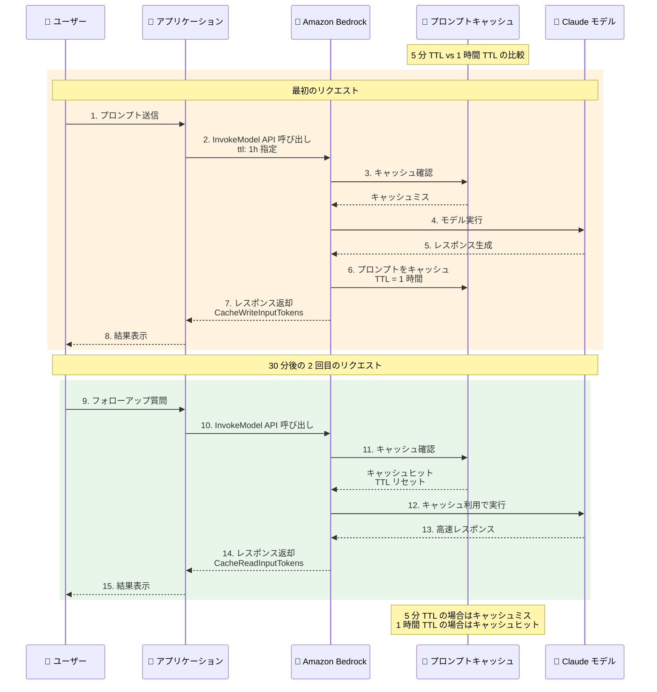

# Amazon Bedrock - 1 時間の Prompt Caching サポート

**リリース日**: 2026 年 1 月 26 日
**サービス**: Amazon Bedrock
**機能**: 1 時間 Time-to-Live (TTL) オプションの Prompt Caching

## 概要

Amazon Bedrock は、選択された Anthropic Claude モデルで Prompt Caching の 1 時間 Time-to-Live (TTL) オプションをサポート開始しました。このアップデートにより、キャッシュされたプロンプトプレフィックスの持続時間をデフォルトの 5 分から 1 時間に延長でき、長時間実行されるエージェント型ワークフローやマルチターン会話のコスト効率とパフォーマンスが向上します。

これまでは、キャッシュされたコンテンツは固定の 5 分間のウィンドウで有効で、再利用時に更新されていました。新しい 1 時間 TTL オプションにより、操作頻度が低いユーザーや、ツール使用、検索、オーケストレーションなどのステップ間により長い時間を必要とする複雑なエージェントのコンテキストを維持できます。1 時間 TTL は、長時間のセッションやバッチ処理で、キャッシュされたコンテンツを長期間にわたって保持したい場合にも有用です。

**アップデート前の課題**

- プロンプトキャッシュの TTL が 5 分間に固定されており、長時間実行されるワークフローでは頻繁にキャッシュミスが発生していました
- 操作頻度が低いユーザー (5 分以上の間隔で対話) に対して、キャッシュの恩恵を受けられませんでした
- 複雑なエージェント型ワークフローで、ステップ間に 5 分以上かかる場合、コンテキストが失われていました
- バッチ処理で長期間キャッシュを維持できず、コストとレイテンシーが増加していました

**アップデート後の改善**

- プロンプトキャッシュの TTL を 1 時間に延長でき、長時間実行されるワークフローでのキャッシュヒット率が向上しました
- 操作頻度が低いユーザーでもキャッシュの恩恵を受けられるようになり、コストとレイテンシーが削減されました
- 複雑なエージェント型ワークフローで、ステップ間に時間がかかる場合もコンテキストを維持できるようになりました
- バッチ処理で長期間キャッシュを活用でき、全体的なコスト効率が向上しました

## アーキテクチャ図



1 時間 TTL により、5 分以上の間隔が空いても、1 時間以内であればキャッシュを再利用できるようになります。

## サービスアップデートの詳細

### 主要機能

1. **1 時間 TTL オプション**
   - プロンプトキャッシュの持続時間を 5 分から 1 時間に延長可能
   - Claude Sonnet 4.5、Claude Haiku 4.5、Claude Opus 4.5 で利用可能
   - キャッシュヒット時に TTL がリセットされ、さらに 1 時間延長

2. **コスト効率の向上**
   - 長時間実行されるワークフローでキャッシュヒット率が向上
   - キャッシュから読み取るトークンは割引料金で課金
   - 入力トークンコストの削減

3. **レイテンシーの削減**
   - キャッシュヒット時、モデルの内部状態の再計算が不要
   - レスポンスレイテンシーの大幅な短縮
   - 長時間セッションでの一貫したパフォーマンス

### ユースケース

**1 時間 TTL が最適なシナリオ**:
- プロンプトが 5 分より長い間隔で使用される可能性があるが、1 時間以内に再利用される場合
- レイテンシーが重要で、フォローアッププロンプトが 5 分を超える可能性がある場合
- レート制限の利用効率を向上させたい場合
- 長時間のエージェント型ワークフロー (ツール使用、検索、オーケストレーション)
- バッチ処理やデータ分析タスク

## 技術仕様

### 対応モデル

| モデル | 5 分 TTL | 1 時間 TTL |
|--------|----------|------------|
| Claude Sonnet 4.5 | ✓ | ✓ |
| Claude Haiku 4.5 | ✓ | ✓ |
| Claude Opus 4.5 | ✓ | ✓ |

### API 指定方法

**Converse API の場合**:
```json
{
  "modelId": "anthropic.claude-sonnet-4-5-v2:0",
  "messages": [
    {
      "role": "user",
      "content": [
        {
          "text": "Your long context here...",
          "cachePoint": {
            "ttl": "1h"
          }
        }
      ]
    }
  ]
}
```

**InvokeModel API (Claude モデル) の場合**:
```json
{
  "anthropic_version": "bedrock-2023-05-31",
  "messages": [
    {
      "role": "user",
      "content": [
        {
          "type": "text",
          "text": "Your long context here...",
          "cache_control": {
            "ttl": "1h",
            "type": "ephemeral"
          }
        }
      ]
    }
  ]
}
```

### レスポンスフィールド

Converse API のレスポンスには、以下のキャッシュ関連フィールドが含まれます:

- **CacheReadInputTokens**: キャッシュから読み取られたトークン数
- **CacheWriteInputTokens**: 前回のリクエストによってキャッシュに書き込まれたトークン数
- **CacheDetails**: キャッシュに書き込まれたトークン数に使用された TTL

## 設定方法

### 前提条件

1. Amazon Bedrock にアクセス可能な AWS アカウント
2. Claude Sonnet 4.5、Claude Haiku 4.5、または Claude Opus 4.5 へのモデルアクセス権限
3. Bedrock API を呼び出すための IAM 権限 (`bedrock:InvokeModel` または `bedrock:Converse`)

### 手順

#### ステップ 1: モデルアクセスの有効化

AWS Console の Amazon Bedrock で、使用する Claude モデルへのアクセスをリクエストします。

#### ステップ 2: API 呼び出しで TTL を指定

Converse API または InvokeModel API を使用する際、キャッシュポイントに `"ttl": "1h"` を指定します。

#### ステップ 3: キャッシュメトリクスの確認

レスポンスから `CacheReadInputTokens` と `CacheWriteInputTokens` を確認し、キャッシュが正しく機能しているかを検証します。

```python
import boto3
import json

bedrock = boto3.client('bedrock-runtime')

response = bedrock.converse(
    modelId='anthropic.claude-sonnet-4-5-v2:0',
    messages=[
        {
            'role': 'user',
            'content': [
                {
                    'text': 'Your long context here...',
                    'cachePoint': {
                        'ttl': '1h'
                    }
                }
            ]
        }
    ]
)

# キャッシュメトリクスを確認
usage = response['usage']
print(f"Cache Read Tokens: {usage.get('cacheReadInputTokens', 0)}")
print(f"Cache Write Tokens: {usage.get('cacheWriteInputTokens', 0)}")
```

このコードは、Bedrock の Converse API を使用して 1 時間 TTL のプロンプトキャッシュを有効化し、キャッシュメトリクスを取得します。

## メリット

### ビジネス面

- **コスト削減**: キャッシュヒット率の向上により、入力トークンコストが大幅に削減されます
- **ユーザーエクスペリエンスの向上**: レイテンシーの削減により、応答時間が短縮されます
- **スケーラビリティの向上**: レート制限の利用効率が向上し、より多くのリクエストを処理可能になります

### 技術面

- **長時間セッションのサポート**: 1 時間以内の操作であればキャッシュを維持できます
- **エージェント型ワークフローの最適化**: 複雑なツール使用や検索処理でもコンテキストを保持できます
- **バッチ処理の効率化**: 長期間実行されるバッチ処理でキャッシュを活用できます

## デメリット・制約事項

### 制限事項

- 1 時間 TTL は Claude Sonnet 4.5、Claude Haiku 4.5、Claude Opus 4.5 のみでサポート
- 1 時間キャッシュは 5 分キャッシュとは異なる料金で課金されます
- プロンプトプレフィックスが変更されるとキャッシュミスが発生します

### 考慮すべき点

- **料金の違い**: 1 時間 TTL のキャッシュ書き込み料金は 5 分 TTL と異なる場合があります。[Amazon Bedrock Pricing](https://aws.amazon.com/bedrock/pricing/) を確認してください
- **キャッシュチェックポイントの配置**: 静的なコンテンツを適切に配置して、キャッシュヒット率を最大化する必要があります
- **自動プレフィックスチェック**: 最大約 20 コンテンツブロックまでしか遡ってチェックしないため、静的コンテンツがこの範囲を超える場合は複数のキャッシュチェックポイントを使用する必要があります

## ユースケース

### ユースケース 1: カスタマーサポートチャットボット

**シナリオ**: カスタマーサポートチャットボットで、ユーザーが問い合わせの途中で離席し、30 分後に会話を再開する場合があります。

**実装例**:
```python
# 最初のリクエスト: FAQ と製品情報をキャッシュ
response = bedrock.converse(
    modelId='anthropic.claude-sonnet-4-5-v2:0',
    messages=[
        {
            'role': 'user',
            'content': [
                {'text': FAQ_CONTENT, 'cachePoint': {'ttl': '1h'}},
                {'text': PRODUCT_INFO, 'cachePoint': {'ttl': '1h'}},
                {'text': 'ユーザーの質問'}
            ]
        }
    ]
)

# 30 分後のフォローアップ: キャッシュヒット
response = bedrock.converse(
    modelId='anthropic.claude-sonnet-4-5-v2:0',
    messages=[
        {
            'role': 'user',
            'content': [
                {'text': FAQ_CONTENT, 'cachePoint': {'ttl': '1h'}},
                {'text': PRODUCT_INFO, 'cachePoint': {'ttl': '1h'}},
                {'text': 'フォローアップの質問'}
            ]
        }
    ]
)
```

**効果**: 30 分後のフォローアップでも FAQ と製品情報がキャッシュされているため、コストが削減され、応答時間が短縮されます。

### ユースケース 2: データ分析エージェント

**シナリオ**: データ分析エージェントが、大量のデータセットを読み込み、複数のステップで分析を実行します。各ステップの間に 10-15 分かかる場合があります。

**実装例**:
```python
# ステップ 1: データセットをキャッシュ
response = bedrock.converse(
    modelId='anthropic.claude-sonnet-4-5-v2:0',
    messages=[
        {
            'role': 'user',
            'content': [
                {'text': LARGE_DATASET, 'cachePoint': {'ttl': '1h'}},
                {'text': '売上データの傾向を分析してください'}
            ]
        }
    ]
)

# 15 分後のステップ 2: キャッシュを再利用
response = bedrock.converse(
    modelId='anthropic.claude-sonnet-4-5-v2:0',
    messages=[
        {
            'role': 'user',
            'content': [
                {'text': LARGE_DATASET, 'cachePoint': {'ttl': '1h'}},
                {'text': '地域別の売上を比較してください'}
            ]
        }
    ]
)
```

**効果**: 15 分後のステップでも大量のデータセットがキャッシュされているため、各ステップのコストとレイテンシーが大幅に削減されます。

### ユースケース 3: ドキュメント Q&A システム

**シナリオ**: 長大なドキュメントに対する Q&A システムで、ユーザーが複数の質問を時間をおいて行う場合があります。

**実装例**:
```python
# 質問 1: 長大なドキュメントをキャッシュ
response = bedrock.converse(
    modelId='anthropic.claude-sonnet-4-5-v2:0',
    messages=[
        {
            'role': 'user',
            'content': [
                {'text': LONG_DOCUMENT, 'cachePoint': {'ttl': '1h'}},
                {'text': '第 3 章の要約を教えてください'}
            ]
        }
    ]
)

# 45 分後の質問 2: キャッシュを再利用
response = bedrock.converse(
    modelId='anthropic.claude-sonnet-4-5-v2:0',
    messages=[
        {
            'role': 'user',
            'content': [
                {'text': LONG_DOCUMENT, 'cachePoint': {'ttl': '1h'}},
                {'text': '第 5 章と第 3 章の関連性は?'}
            ]
        }
    ]
)
```

**効果**: 45 分後の質問でも長大なドキュメントがキャッシュされているため、毎回ドキュメント全体を再処理する必要がなくなり、コストとレイテンシーが削減されます。

## 料金

### キャッシュ料金の構造

- **キャッシュ書き込み (Cache Write)**: キャッシュに書き込まれるトークンに対して課金されます。1 時間 TTL の料金は 5 分 TTL と異なる場合があります
- **キャッシュ読み取り (Cache Read)**: キャッシュから読み取られるトークンに対して割引料金で課金されます
- **通常の入力トークン**: キャッシュされていないトークンに対して通常料金で課金されます

詳細な料金については、[Amazon Bedrock Pricing](https://aws.amazon.com/bedrock/pricing/) ページをご確認ください。

## 利用可能リージョン

1 時間 TTL Prompt Caching は、Anthropic の Claude Sonnet 4.5、Claude Haiku 4.5、Claude Opus 4.5 が利用可能なすべての商用 AWS リージョンおよび AWS GovCloud (US) リージョンで一般提供されています。

## 関連サービス・機能

- **Amazon Bedrock Agents**: エージェント型ワークフローで 1 時間 TTL キャッシュを活用
- **Amazon Bedrock Knowledge Bases**: RAG パターンでのキャッシュ活用
- **Amazon Bedrock Prompt Management**: プロンプトテンプレートでのキャッシュ管理

## 参考リンク

- [公式発表 (What's New)](https://aws.amazon.com/about-aws/whats-new/2026/01/amazon-bedrock-one-hour-duration-prompt-caching/)
- [Amazon Bedrock ドキュメント - Prompt Caching](https://docs.aws.amazon.com/bedrock/latest/userguide/prompt-caching.html)
- [Amazon Bedrock Pricing](https://aws.amazon.com/bedrock/pricing/)
- [Amazon Bedrock Prompt Caching 製品ページ](https://aws.amazon.com/bedrock/prompt-caching/)

## まとめ

Amazon Bedrock の 1 時間 Prompt Caching サポートにより、長時間実行されるエージェント型ワークフローやマルチターン会話のコスト効率とパフォーマンスが大幅に向上します。特に、操作頻度が低いユーザーや複雑なエージェント型ワークフローを実装している場合、この機能を活用することで、キャッシュヒット率の向上によるコスト削減とレイテンシーの短縮を実現できます。既存の Bedrock アプリケーションで、API 呼び出し時に `"ttl": "1h"` を指定するだけで簡単に有効化できるため、ぜひお試しください。
