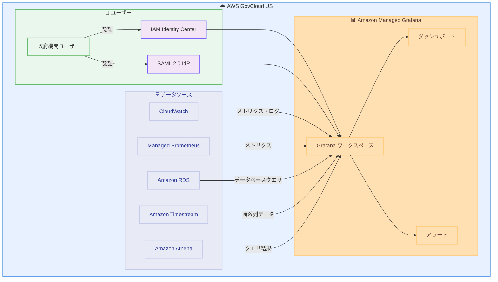

# Amazon Managed Grafana - AWS GovCloud (US) リージョンで利用可能

**リリース日**: 2026 年 01 月 26 日
**サービス**: Amazon Managed Grafana
**機能**: AWS GovCloud (US) リージョンでの GA (一般提供)

## 概要

Amazon Managed Grafana が AWS GovCloud (US-West) および AWS GovCloud (US-East) の両リージョンで利用可能になりました。これにより、政府機関や規制産業の顧客が、厳格なコンプライアンス要件を満たしながら、運用データを安全に可視化および分析できるようになります。

Amazon Managed Grafana は、オープンソース Grafana をベースとしたフルマネージドサービスで、運用データを大規模に可視化および分析することを容易にします。AWS GovCloud (US) リージョンでは、Enterprise プラグインを除くすべての機能がサポートされています。

**アップデート前の課題**

- AWS GovCloud (US) リージョンで Amazon Managed Grafana が利用できなかった
- 政府機関や規制産業の顧客は、コンプライアンス要件を満たしながら Grafana を自己管理する必要があった
- セキュアな環境でのデータ可視化ツールの選択肢が限られていた

**アップデート後の改善**

- AWS GovCloud (US) リージョンで Amazon Managed Grafana を利用できるようになった
- 厳格なコンプライアンス要件を満たしながら、マネージドサービスの利点を享受できるようになった
- インフラストラクチャの管理やスケーリングを AWS に任せることができるようになった

## アーキテクチャ図



この図は、AWS GovCloud (US) リージョン内で Amazon Managed Grafana がさまざまなデータソースに接続し、政府機関ユーザーが認証を通じてアクセスする様子を示しています。

## サービスアップデートの詳細

### 主要機能

1. **フルマネージド Grafana サービス**
   - Grafana のデプロイ、運用、スケーリングを簡素化
   - 自動的にインフラストラクチャを管理
   - バージョン更新とセキュリティパッチを自動的に適用

2. **複数データソースのサポート**
   - CloudWatch、Managed Prometheus、RDS、Timestream、Athena などの AWS サービスと統合
   - 複数のデータソースからデータをクエリ、相関、可視化
   - 組み込みパネルとダッシュボードですぐに開始可能

3. **セキュアな認証とアクセス制御**
   - IAM Identity Center との統合
   - SAML 2.0 サポート
   - きめ細かいアクセス制御とロールベースのアクセス管理

## 技術仕様

### GovCloud リージョンでの制限事項

| 機能 | サポート状況 |
|------|------|
| 基本的な Grafana 機能 | サポート ✓ |
| データソース統合 | サポート ✓ |
| ダッシュボード作成 | サポート ✓ |
| アラート機能 | サポート ✓ |
| Enterprise プラグイン | サポート外 ✗ |
| Customer Managed Keys (CMK) | サポート外 ✗ |
| デュアルスタック機能 | サポート外 ✗ |
| CloudFormation | サポート外 ✗ |

### サポートされるデータソース

| データソース | 説明 |
|------|------|
| Amazon CloudWatch | AWS リソースのメトリクスとログ |
| Amazon Managed Service for Prometheus | Prometheus 互換のメトリクス |
| Amazon RDS | リレーショナルデータベースのクエリ |
| Amazon Timestream | 時系列データベース |
| Amazon Athena | S3 データのクエリ |
| AWS X-Ray | 分散トレーシング |

### ワークスペース設定例

```json
{
  "name": "govcloud-monitoring-workspace",
  "accountAccessType": "ORGANIZATION",
  "authenticationProviders": [
    "AWS_SSO",
    "SAML"
  ],
  "permissionType": "SERVICE_MANAGED",
  "dataSources": [
    "CLOUDWATCH",
    "PROMETHEUS",
    "TIMESTREAM"
  ],
  "notificationDestinations": [
    "SNS"
  ]
}
```

## 設定方法

### 前提条件

1. AWS GovCloud (US) アカウントが有効化されていること
2. IAM Identity Center が設定されている、または SAML 2.0 IdP が利用可能であること
3. 可視化したいデータソース (CloudWatch、Prometheus など) が設定されていること
4. 適切な IAM 権限が付与されていること

### 手順

#### ステップ 1: Grafana ワークスペースを作成

```bash
# AWS GovCloud (US-West) リージョンで Grafana ワークスペースを作成
aws grafana create-workspace \
  --account-access-type ORGANIZATION \
  --authentication-providers AWS_SSO \
  --permission-type SERVICE_MANAGED \
  --workspace-name govcloud-monitoring \
  --workspace-description "GovCloud monitoring workspace" \
  --region us-gov-west-1
```

このコマンドは、AWS GovCloud (US-West) リージョンに新しい Grafana ワークスペースを作成します。

#### ステップ 2: データソースを設定

```bash
# ワークスペース ID を取得
WORKSPACE_ID=$(aws grafana list-workspaces \
  --query 'workspaces[0].id' \
  --output text \
  --region us-gov-west-1)

# CloudWatch データソースを追加
aws grafana update-workspace \
  --workspace-id $WORKSPACE_ID \
  --workspace-data-sources CLOUDWATCH PROMETHEUS TIMESTREAM \
  --region us-gov-west-1
```

このコマンドは、ワークスペースに CloudWatch、Prometheus、Timestream データソースを追加します。

#### ステップ 3: ユーザーアクセスを設定

```bash
# IAM Identity Center ユーザーに管理者権限を付与
aws grafana update-permissions \
  --workspace-id $WORKSPACE_ID \
  --update-instruction-batch '[
    {
      "action": "ADD",
      "role": "ADMIN",
      "users": [
        {
          "id": "user-id-from-identity-center",
          "type": "SSO_USER"
        }
      ]
    }
  ]' \
  --region us-gov-west-1
```

このコマンドは、IAM Identity Center ユーザーに Grafana ワークスペースへの管理者権限を付与します。

#### ステップ 4: Grafana コンソールにアクセス

```bash
# ワークスペースの URL を取得
aws grafana describe-workspace \
  --workspace-id $WORKSPACE_ID \
  --query 'workspace.endpoint' \
  --output text \
  --region us-gov-west-1
```

このコマンドで取得した URL にブラウザでアクセスし、IAM Identity Center または SAML で認証してダッシュボードを作成します。

## メリット

### ビジネス面

- **コンプライアンス要件の充足**: FedRAMP、ITAR、CJIS などの政府規制要件を満たす
- **運用コストの削減**: インフラストラクチャの管理が不要になり、運用コストを削減
- **迅速なデプロイメント**: 数分でダッシュボードを作成し、データを可視化可能

### 技術面

- **高可用性とスケーラビリティ**: AWS がインフラストラクチャを自動的に管理し、スケール
- **統合された可観測性**: 複数の AWS データソースを 1 つのダッシュボードで可視化
- **自動更新とパッチ適用**: セキュリティパッチとバージョン更新を自動的に適用

## デメリット・制約事項

### 制限事項

- Enterprise プラグインはサポートされていない
- Customer Managed Keys (CMK) による暗号化はサポートされていない
- デュアルスタック (IPv4/IPv6) 機能はサポートされていない
- CloudFormation による自動化はサポートされていない

### 考慮すべき点

- GovCloud リージョン特有の制限により、一部の機能が利用できない可能性がある
- コストは通常の AWS リージョンと異なる場合がある
- データの転送や保存には、政府規制に準拠した適切なセキュリティ対策が必要

## ユースケース

### ユースケース 1: 政府機関のインフラストラクチャ監視

**シナリオ**: 政府機関が AWS GovCloud (US) リージョンで運用しているインフラストラクチャを監視し、リアルタイムでパフォーマンスを可視化したい場合。

**実装例**:
```bash
# CloudWatch データソースを使用したダッシュボードを作成
# Grafana コンソールで以下の設定を行う
# - データソース: CloudWatch
# - メトリクス: EC2 CPU 使用率、RDS 接続数、Lambda 実行時間
# - アラート: CPU 使用率が 80% を超えた場合に SNS 通知
```

**効果**: インフラストラクチャの健全性をリアルタイムで監視し、問題が発生する前にプロアクティブに対応できます。

### ユースケース 2: アプリケーションパフォーマンス監視

**シナリオ**: 規制産業の企業が、AWS GovCloud (US) リージョンで運用しているアプリケーションのパフォーマンスを監視したい場合。

**実装例**:
```bash
# Prometheus と CloudWatch を組み合わせた統合ダッシュボード
# - Prometheus: カスタムアプリケーションメトリクス
# - CloudWatch: AWS サービスメトリクス
# - X-Ray: 分散トレーシング

# Grafana で複数のデータソースからデータを取得
# Dashboard > Add Panel > Query で複数のデータソースを選択
```

**効果**: アプリケーションと AWS インフラストラクチャのパフォーマンスを一元的に可視化し、問題の根本原因を迅速に特定できます。

### ユースケース 3: セキュリティイベントの監視

**シナリオ**: セキュリティチームが、AWS GovCloud (US) リージョンでのセキュリティイベントを監視し、異常を検出したい場合。

**実装例**:
```bash
# CloudWatch Logs Insights と Athena を使用したセキュリティダッシュボード
# - CloudWatch Logs: VPC フローログ、CloudTrail ログ
# - Athena: S3 に保存された大規模なログデータをクエリ

# Grafana でアラートを設定
# - 不正なログイン試行が閾値を超えた場合
# - 異常なネットワークトラフィックが検出された場合
```

**効果**: セキュリティイベントをリアルタイムで監視し、インシデント対応時間を短縮できます。

## 料金

Amazon Managed Grafana の料金は、ワークスペースごとに課金されます。

### 料金例

| 使用量 | 月額料金 (概算) |
|--------|------------------|
| Grafana ワークスペース 1 つ (アクティブユーザー 10 人) | $90.00 ($9/ユーザー/月) |
| Grafana ワークスペース 1 つ (アクティブユーザー 50 人) | $450.00 ($9/ユーザー/月) |

注: GovCloud リージョンの料金は、通常の AWS リージョンと異なる場合があります。詳細な料金については、[Amazon Managed Grafana の料金ページ](https://aws.amazon.com/grafana/pricing/)を参照してください。

## 利用可能リージョン

この機能は、以下の AWS GovCloud (US) リージョンで利用可能です。

- AWS GovCloud (US-West): us-gov-west-1
- AWS GovCloud (US-East): us-gov-east-1

## 関連サービス・機能

- **Amazon CloudWatch**: AWS リソースのメトリクスとログを収集
- **Amazon Managed Service for Prometheus**: Prometheus 互換のマネージドメトリクスサービス
- **AWS IAM Identity Center**: シングルサインオンとユーザー管理

## 参考リンク

- [公式発表 (What's New)](https://aws.amazon.com/about-aws/whats-new/2026/01/amazon-managed-grafana-aws-govcloud-us-regions/)
- [AWS Console](https://console.aws.amazon.com/grafana/home/)
- [Amazon Managed Grafana ユーザーガイド](https://docs.aws.amazon.com/grafana/latest/userguide/what-is-Amazon-Managed-Service-Grafana.html)
- [Amazon Managed Grafana 製品ページ](https://aws.amazon.com/grafana/)
- [Amazon Managed Grafana 料金](https://aws.amazon.com/grafana/pricing/)
- [GovCloud での違い](https://docs.aws.amazon.com/govcloud-us/latest/UserGuide/grafana.html)

## まとめ

Amazon Managed Grafana が AWS GovCloud (US) リージョンで利用可能になったことで、政府機関や規制産業の顧客が、厳格なコンプライアンス要件を満たしながら、運用データを安全に可視化および分析できるようになりました。インフラストラクチャの管理を AWS に任せることで、運用コストを削減し、コアビジネスに集中することができます。AWS GovCloud (US) リージョンで可観測性を強化したい組織は、Amazon Managed Grafana の導入を検討することをお勧めします。
