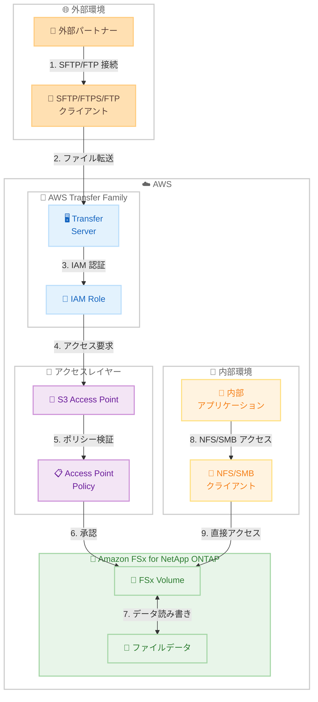

# AWS Transfer Family - Amazon FSx for NetApp ONTAP サポート

**リリース日**: 2026 年 1 月 26 日
**サービス**: AWS Transfer Family
**機能**: Amazon FSx for NetApp ONTAP ファイルシステムへのアクセスサポート

## 概要

AWS Transfer Family は、Amazon FSx for NetApp ONTAP に保存されたファイルシステムデータへの SFTP、FTPS、FTP によるアクセスをサポート開始しました。これにより、ネイティブファイルプロトコル (NFS/SMB) によるアクセスを維持しながら、S3 Access Points を通じて Transfer Family がサポートするプロトコルで FSx for ONTAP ファイルシステムにアクセスできるようになります。

AWS Transfer Family は、SFTP、FTP、FTPS、AS2、Web ブラウザベースのインターフェースを介した完全マネージド型のファイル転送サービスです。今回のリリースにより、既存のファイルシステムワークフローを維持しながら、外部パートナーや内部ユーザーに対して業界標準プロトコルによる安全なアクセスを追加できます。アクセスは標準的な IAM ポリシーと S3 Access Point 設定を通じて制御され、データセキュリティとコンプライアンス要件を満たすのに役立ちます。

**アップデート前の課題**

- FSx for ONTAP ファイルシステムには NFS/SMB でのみアクセス可能で、SFTP/FTP プロトコルでのアクセスができませんでした
- 外部パートナーとのファイル共有に、別途 SFTP サーバーを構築・管理する必要がありました
- 既存の FSx for ONTAP ワークフローに、セキュアなファイル転送機能を追加する際に、複雑な統合が必要でした

**アップデート後の改善**

- FSx for ONTAP ファイルシステムに SFTP、FTPS、FTP でアクセスできるようになりました
- S3 Access Points を介して、ネイティブプロトコル (NFS/SMB) と Transfer Family プロトコル (SFTP/FTPS/FTP) の両方でアクセス可能になりました
- IAM ポリシーと S3 Access Point 設定による一元的なアクセス制御が可能になりました
- 外部パートナーとのセキュアなファイル共有が簡単に実現できるようになりました

## アーキテクチャ図



Transfer Family と FSx for ONTAP の統合により、外部パートナーは SFTP/FTP でアクセスし、内部アプリケーションは NFS/SMB で同じデータにアクセスできます。

## サービスアップデートの詳細

### 主要機能

1. **マルチプロトコルアクセス**
   - SFTP、FTPS、FTP を介した FSx for ONTAP へのアクセス
   - ネイティブプロトコル (NFS/SMB) との並行利用
   - S3 Access Points を介した統合アクセス

2. **IAM ベースのアクセス制御**
   - 標準的な IAM ポリシーによるアクセス管理
   - S3 Access Point ポリシーによるきめ細かな制御
   - ファイルシステムユーザー ID による認証

3. **既存ワークフローとの互換性**
   - 既存の FSx for ONTAP ワークフローを維持
   - Transfer Family ユーザーによるホームディレクトリマッピング
   - セキュアな外部共有の追加が容易

## 技術仕様

### 前提条件

| 項目 | 要件 |
|------|------|
| FSx for ONTAP バージョン | ONTAP 9.17.1 以降 |
| リージョン | FSx ファイルシステムと S3 Access Point が同じリージョン |
| アカウント | FSx ファイルシステムと Access Point が同じ AWS アカウント |
| IAM 権限 | `fsx:CreateAndAttachS3AccessPoint`, `s3:CreateAccessPoint`, `s3:GetAccessPoint`, `s3:PutAccessPointPolicy` |

### サポートプロトコル

- **SFTP** (SSH File Transfer Protocol)
- **FTPS** (FTP over SSL/TLS)
- **FTP** (File Transfer Protocol)

### 非サポート機能

Transfer Family を FSx ファイルシステムと使用する場合、以下の機能は無効化する必要があります:

- WinSCP の Temporary rename 機能

## 設定方法

### 前提条件

1. Amazon FSx for NetApp ONTAP ファイルシステム (ONTAP 9.17.1 以降)
2. AWS Transfer Family サーバー
3. 必要な IAM 権限

### 手順

#### ステップ 1: FSx for ONTAP に S3 Access Point を作成

```bash
# AWS CLI で S3 Access Point を作成
aws fsx create-and-attach-s3-access-point \
  --file-system-id fs-0123456789abcdef0 \
  --volume-id fsvol-0123456789abcdef0 \
  --access-point-name my-fsx-access-point \
  --file-system-user-identity \
    UnixUid=1001,UnixGid=1001
```

このコマンドは、FSx for ONTAP ボリュームに S3 Access Point を作成し、指定した UNIX ユーザー ID でファイルアクセスを認証します。

#### ステップ 2: Transfer Family 用 IAM ロールを作成

```json
{
  "Version": "2012-10-17",
  "Statement": [
    {
      "Sid": "AllowS3AccessPointAccess",
      "Effect": "Allow",
      "Action": [
        "s3:GetObject",
        "s3:PutObject",
        "s3:DeleteObject",
        "s3:ListBucket"
      ],
      "Resource": [
        "arn:aws:s3:us-east-1:123456789012:accesspoint/my-fsx-access-point",
        "arn:aws:s3:us-east-1:123456789012:accesspoint/my-fsx-access-point/*"
      ]
    }
  ]
}
```

この IAM ポリシーは、Transfer Family が S3 Access Point を介して FSx for ONTAP にアクセスする権限を付与します。

#### ステップ 3: Transfer Family ユーザーを設定

```bash
# Transfer Family ユーザーを作成
aws transfer create-user \
  --server-id s-01234567890abcdef \
  --user-name external-partner \
  --role arn:aws:iam::123456789012:role/TransferFSxRole \
  --home-directory-type LOGICAL \
  --home-directory-mappings \
    '[{"Entry":"/","Target":"/my-fsx-access-point-alias/shared"}]'
```

このコマンドは、S3 Access Point のエイリアスを使用してホームディレクトリマッピングを設定した Transfer Family ユーザーを作成します。

#### ステップ 4: SFTP クライアントで接続

```bash
# SFTP で接続
sftp external-partner@s-01234567890abcdef.server.transfer.us-east-1.amazonaws.com

# ファイルをアップロード
sftp> put local-file.txt

# ファイルをダウンロード
sftp> get remote-file.txt
```

SFTP クライアントから Transfer Family サーバーに接続し、FSx for ONTAP のファイルにアクセスします。

## メリット

### ビジネス面

- **外部パートナーとのセキュアな連携**: SFTP/FTP による安全なファイル共有が簡単に実現
- **運用コストの削減**: 別途 SFTP サーバーを構築・管理する必要がなくなる
- **コンプライアンスの向上**: IAM と S3 Access Point によるアクセス制御でセキュリティ要件を満たす

### 技術面

- **マルチプロトコルサポート**: NFS/SMB と SFTP/FTP を同時利用可能
- **柔軟なアクセス制御**: IAM ポリシーと S3 Access Point ポリシーによるきめ細かな制御
- **既存システムとの統合**: 既存の FSx for ONTAP ワークフローをそのまま維持
- **完全マネージド**: Transfer Family がサーバー管理を自動化

## デメリット・制約事項

### 制限事項

- FSx for ONTAP は ONTAP 9.17.1 以降が必要
- FSx ファイルシステムと S3 Access Point は同じリージョン・同じアカウントである必要がある
- WinSCP の Temporary rename 機能などは無効化が必要
- 選択された AWS リージョンでのみ利用可能

### 考慮すべき点

- S3 Access Point の作成と設定が必要
- IAM ロールとポリシーの適切な設定が必要
- ファイルシステムユーザー ID の管理が必要
- ファイルサイズと利用可能なストレージ容量の監視が必要

## ユースケース

### ユースケース 1: 外部パートナーとのセキュアなファイル交換

**シナリオ**: 製造業の企業が、外部サプライヤーと設計図面や仕様書を安全に共有する必要があります。内部チームは NFS でファイルシステムにアクセスし、外部パートナーは SFTP でアクセスします。

**実装例**:
1. FSx for ONTAP にプロジェクトファイルを保存
2. 外部パートナー用に S3 Access Point を作成
3. Transfer Family ユーザーを設定し、ホームディレクトリを共有フォルダーにマッピング
4. 外部パートナーに SFTP 認証情報を提供

**効果**: 内部チームは既存の NFS ワークフローを維持しながら、外部パートナーとセキュアに SFTP でファイルを共有できます。

### ユースケース 2: レガシーアプリケーションの統合

**シナリオ**: レガシーアプリケーションが FTP プロトコルでファイルを転送する必要がありますが、最新のクラウドストレージに移行したい場合です。

**実装例**:
1. FSx for ONTAP でファイルシステムを作成
2. S3 Access Point を設定
3. Transfer Family で FTP サーバーを構築
4. レガシーアプリケーションの FTP 接続先を Transfer Family エンドポイントに変更

**効果**: レガシーアプリケーションのコードを変更せずに、クラウドストレージに移行できます。

### ユースケース 3: 多拠点でのファイル共有

**シナリオ**: グローバル企業が、各拠点からファイルにアクセスする必要があります。本社は NFS、リモートオフィスは SFTP でアクセスします。

**実装例**:
1. FSx for ONTAP で中央ファイルシステムを構築
2. 本社は VPN 経由で NFS マウント
3. リモートオフィス用に Transfer Family を設定
4. 各拠点に適切なアクセス権限を付与

**効果**: 1 つのファイルシステムで、拠点ごとに最適なプロトコルでアクセスでき、一貫したデータ管理が可能になります。

## 料金

### 料金コンポーネント

- **Amazon FSx for NetApp ONTAP**: ストレージ容量、スループット容量、バックアップに基づく料金
- **AWS Transfer Family**: プロトコルが有効化されている時間 (時間単位) とデータ転送量に基づく料金
- **S3 Access Point**: Access Point の作成と使用に対する料金 (通常は無料または最小限)

詳細な料金については、以下をご確認ください:
- [Amazon FSx for NetApp ONTAP Pricing](https://aws.amazon.com/fsx/netapp-ontap/pricing/)
- [AWS Transfer Family Pricing](https://aws.amazon.com/aws-transfer-family/pricing/)

## 利用可能リージョン

Transfer Family の FSx for ONTAP サポートは、選択された AWS リージョンで利用可能です。最新のリージョン情報については、[FSx for ONTAP S3 Access Points サポートリージョン](https://docs.aws.amazon.com/fsx/latest/ONTAPGuide/accessing-data-via-s3-access-points.html#access-points-for-fsx-ontap-supported-regions)をご確認ください。

## 関連サービス・機能

- **Amazon FSx for NetApp ONTAP**: マネージド NetApp ONTAP ファイルシステム
- **AWS Transfer Family Web Apps**: Web ブラウザベースのファイル転送インターフェース
- **Amazon S3 Access Grants**: S3 Access Points のきめ細かな権限管理
- **AWS DataSync**: データ移行とレプリケーション

## 参考リンク

- [公式発表 (What's New)](https://aws.amazon.com/about-aws/whats-new/2026/01/aws-transfer-family-amazon-fsx-netapp-ontap/)
- [Transfer Family User Guide - FSx for ONTAP](https://docs.aws.amazon.com/transfer/latest/userguide/fsx-s3-access-points.html)
- [FSx for ONTAP - S3 Access Points](https://docs.aws.amazon.com/fsx/latest/ONTAPGuide/accessing-data-via-s3-access-points.html)
- [AWS Transfer Family コンソール](https://console.aws.amazon.com/transfer/)

## まとめ

AWS Transfer Family の FSx for NetApp ONTAP サポートにより、既存のファイルシステムワークフローを維持しながら、外部パートナーや内部ユーザーに対して SFTP/FTP による安全なアクセスを簡単に追加できるようになりました。マルチプロトコルサポートにより、ネイティブプロトコル (NFS/SMB) と Transfer Family プロトコル (SFTP/FTPS/FTP) を同時に利用でき、柔軟なファイル共有が可能になります。既存の FSx for ONTAP 環境を使用している場合は、S3 Access Point を作成し、Transfer Family を設定することで、この機能をすぐに活用できます。
