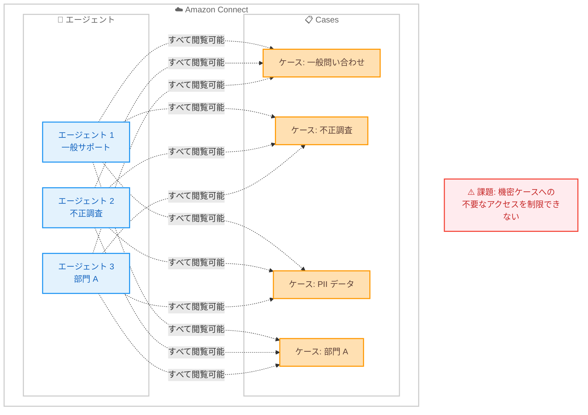
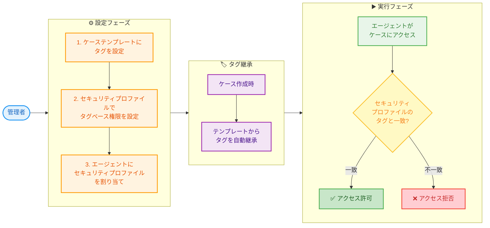

# Amazon Connect Cases - タグベースのアクセス制御

**リリース日**: 2026 年 1 月 27 日
**サービス**: Amazon Connect
**機能**: Cases のタグベースアクセス制御

## 概要

Amazon Connect は、ケース管理機能において、タグベースのアクセス制御をサポートしました。この機能により、管理者はケーステンプレートにタグを関連付け、セキュリティプロファイルを設定することで、誰がケースデータを表示・管理できるかを細かく制御できるようになります。

タグベースのアクセス制御により、部門、ケースタイプ、セキュリティ分類に基づいた詳細なアクセス権限を適用できます。ケースはケーステンプレートから自動的にタグを継承するため、エージェントが個別にタグを付ける必要がなく、一貫性のあるアクセス制御が可能になります。例えば、不正行為に関連するケースに `Department:Fraud` タグを付けて、不正対策チームのセキュリティプロファイルを持つユーザーのみがアクセスできるように制限できます。

この機能は、コンタクトセンターにおける内部統制とデータアクセスポリシーの実施を強化し、機密性の高い顧客情報を含むケースへのアクセスを適切に制限できるようにします。

**アップデート前の課題**

- すべてのエージェントが、権限を持つすべてのケースを表示・編集できてしまうため、機密情報を含むケースへのアクセスを制限できない
- 部門やチームごとにケースへのアクセス権限を分けることができず、不正調査や PII データを含むケースの管理が困難
- ケースごとに手動でアクセス権限を設定する必要があり、運用負荷が高く、人的ミスのリスクがある
- コンプライアンス要件や内部統制のために、詳細なアクセス制御を実装するには、複雑なカスタム実装が必要

**アップデート後の改善**

- ケーステンプレートにタグを設定することで、そのテンプレートから作成されるすべてのケースに自動的にタグが継承され、一貫性のあるアクセス制御が実現
- セキュリティプロファイルでタグベースの権限を設定することで、特定のタグを持つケースにのみアクセスできるユーザーを制御可能
- 部門別、ケースタイプ別、セキュリティ分類別など、きめ細かなアクセス権限の設定が可能になり、コンプライアンス要件への対応が容易に
- 不正調査チーム、個人情報保護チームなど、専門チームごとに適切なケースへのアクセスを制限でき、データガバナンスが向上

## アーキテクチャ図

### アップデート前: すべてのエージェントがすべてのケースにアクセス可能



すべてのエージェントがすべてのケースにアクセスできるため、機密情報を含むケースへのアクセス制御ができない状態でした。

### アップデート後: タグベースのアクセス制御により役割ベースのアクセスを実現

```mermaid
flowchart TD
    subgraph Connect["☁️ Amazon Connect"]
        subgraph Templates["📝 ケーステンプレート"]
            T1["テンプレート: 一般<br/>タグ: Type:General"]
            T2["テンプレート: 不正<br/>タグ: Department:Fraud"]
            T3["テンプレート: PII<br/>タグ: Security:PII"]
            T4["テンプレート: 部門 A<br/>タグ: Department:A"]
        end

        subgraph Cases["📋 ケース"]
            C1["ケース 1<br/>Type:General"]
            C2["ケース 2<br/>Department:Fraud"]
            C3["ケース 3<br/>Security:PII"]
            C4["ケース 4<br/>Department:A"]
        end

        subgraph Profiles["🔐 セキュリティプロファイル"]
            P1["一般サポート<br/>アクセス: Type:General"]
            P2["不正調査<br/>アクセス: Department:Fraud"]
            P3["部門 A サポート<br/>アクセス: Department:A"]
        end

        subgraph Agents["👥 エージェント"]
            A1["エージェント 1"]
            A2["エージェント 2"]
            A3["エージェント 3"]
        end
    end

    T1 -->|タグ継承| C1
    T2 -->|タグ継承| C2
    T3 -->|タグ継承| C3
    T4 -->|タグ継承| C4

    P1 --> A1
    P2 --> A2
    P3 --> A3

    A1 -->|閲覧可能| C1
    A2 -->|閲覧可能| C2
    A3 -->|閲覧可能| C4

    A1 -.x|アクセス拒否| C2
    A1 -.x|アクセス拒否| C3
    A1 -.x|アクセス拒否| C4

    A2 -.x|アクセス拒否| C1
    A2 -.x|アクセス拒否| C3
    A2 -.x|アクセス拒否| C4

    A3 -.x|アクセス拒否| C1
    A3 -.x|アクセス拒否| C2
    A3 -.x|アクセス拒否| C3

    Success["✅ タグベースのアクセス制御により<br/>適切なケースのみにアクセス可能"]

    classDef template fill:#E1BEE7,stroke:#9C27B0,stroke-width:2px,color:#4A148C
    classDef case fill:#FFE0B2,stroke:#FF9800,stroke-width:2px,color:#5D4037
    classDef profile fill:#C8E6C9,stroke:#4CAF50,stroke-width:2px,color:#1B5E20
    classDef agent fill:#E3F2FD,stroke:#2196F3,stroke-width:2px,color:#1565C0
    classDef success fill:#E8F5E9,stroke:#4CAF50,stroke-width:2px,color:#2E7D32
    classDef container fill:none,stroke:#CCCCCC,stroke-width:2px,color:#666666

    class T1,T2,T3,T4 template
    class C1,C2,C3,C4 case
    class P1,P2,P3 profile
    class A1,A2,A3 agent
    class Success success
    class Connect,Templates,Cases,Profiles,Agents container
```

ケーステンプレートにタグを設定し、セキュリティプロファイルでタグベースの権限を設定することで、エージェントは自分の役割に応じた適切なケースのみにアクセスできます。

### タグベースアクセス制御のフロー



管理者がケーステンプレートとセキュリティプロファイルを設定することで、ケース作成時に自動的にタグが継承され、エージェントのアクセス権限が制御されます。

## サービスアップデートの詳細

### 主要機能

1. **ケーステンプレートへのタグ付け**
   - ケーステンプレートにタグを設定することで、そのテンプレートから作成されるすべてのケースに自動的にタグが継承されます
   - タグは Key:Value 形式で設定され、部門 (Department:Fraud)、ケースタイプ (Type:General)、セキュリティ分類 (Security:PII) などの分類が可能
   - Amazon Connect 管理ウェブサイトまたは API (CreateTemplate、UpdateTemplate) を使用してタグを設定できます
   - ケース作成時に API リクエストでタグを指定した場合、テンプレートのタグを上書きできます

2. **セキュリティプロファイルでのタグベース権限設定**
   - セキュリティプロファイルに Cases リソースに対するタグベースの権限を設定できます
   - 管理ウェブサイトのセキュリティプロファイルページで「詳細オプションを表示」を選択し、アクセス制御タグを設定します
   - 1 つのセキュリティプロファイルに最大 4 つのアクセス制御タグを設定可能
   - 複数のタグを設定すると、すべてのタグを持つリソースのみにアクセス可能になります (AND 条件)
   - ユーザーには、アクセス制御タグを含むセキュリティプロファイルを最大 3 つまで割り当て可能

3. **ケースに対する権限の種類**
   - **Cases - Create**: 新しいケースを作成する権限 (作成時に適用されるタグへの権限が必要)
   - **Cases - View**: 一致するタグを持つ既存のケースを表示する権限
   - **Cases - Edit**: 一致するタグを持つ既存のケースを変更する権限
   - これらの権限とタグベースのアクセス制御を組み合わせることで、詳細な権限管理が可能

4. **タグの継承と上書きの仕組み**
   - ケーステンプレートを使用してケースを作成すると、ケースは自動的にテンプレートに設定されたタグを継承します
   - CreateCase API リクエストでタグを明示的に指定した場合、競合するテンプレートのタグを上書きします
   - 例: `Department:Fraud` タグを持つテンプレートを使用しても、API リクエストで `Department:Finance` を指定すると、ケースには `Department:Finance` が適用されます

## 技術仕様

### タグベースアクセス制御の設定

| 項目 | 制限値 | 詳細 |
|------|--------|------|
| セキュリティプロファイルごとのアクセス制御タグ | 最大 4 個 | 複数のタグを設定すると AND 条件で制限が強化されます |
| ユーザーごとのアクセス制御タグ付きセキュリティプロファイル | 最大 3 個 | 複数のプロファイルを割り当てると OR 条件で制限が緩和されます |
| タグキーの長さ | 1-128 文字 | AWS タグ標準に準拠 |
| タグ値の長さ | 1-256 文字 | AWS タグ標準に準拠 |
| リソースごとのタグ | 最大 50 個 | AWS タグ標準に準拠 |

### セキュリティプロファイル設定例

以下は、不正調査チーム向けのセキュリティプロファイル設定例です。

```json
{
  "SecurityProfileName": "FraudInvestigationTeam",
  "Description": "不正調査チーム専用のセキュリティプロファイル",
  "Permissions": [
    "Cases - View",
    "Cases - Edit",
    "Cases - Create"
  ],
  "TagRestrictedResources": ["Cases"],
  "AllowedAccessControlTags": {
    "Department": "Fraud"
  }
}
```

このプロファイルを持つユーザーは、`Department:Fraud` タグを持つケースのみを表示・編集・作成できます。

### ケーステンプレート設定例

以下は、不正調査用のケーステンプレートにタグを設定する例です。

```json
{
  "TemplateId": "fraud-investigation-template",
  "Name": "不正調査ケース",
  "Description": "不正行為に関する調査ケース用のテンプレート",
  "Fields": [
    {
      "Id": "title",
      "Type": "Text",
      "Required": true
    },
    {
      "Id": "fraud_type",
      "Type": "SingleSelect",
      "Required": true,
      "Options": ["クレジットカード不正利用", "なりすまし", "その他"]
    }
  ],
  "Tags": {
    "Department": "Fraud",
    "Security": "Confidential"
  }
}
```

このテンプレートから作成されるすべてのケースには、`Department:Fraud` と `Security:Confidential` のタグが自動的に適用されます。

### IAM スタイルのポリシー例

API/SDK を使用してタグベースのアクセス制御を実装する場合の IAM ポリシー例です。

```json
{
  "Version": "2012-10-17",
  "Statement": [
    {
      "Effect": "Allow",
      "Action": [
        "cases:GetCase",
        "cases:UpdateCase"
      ],
      "Resource": "arn:aws:cases:us-east-1:123456789012:domain/*/case/*",
      "Condition": {
        "StringEquals": {
          "aws:ResourceTag/Department": "Fraud"
        }
      }
    },
    {
      "Effect": "Allow",
      "Action": [
        "cases:CreateCase"
      ],
      "Resource": "arn:aws:cases:us-east-1:123456789012:domain/*",
      "Condition": {
        "StringEquals": {
          "aws:RequestTag/Department": "Fraud"
        }
      }
    }
  ]
}
```

このポリシーは、`Department:Fraud` タグを持つケースの表示と更新、および同じタグを持つケースの作成を許可します。

### 複数タグによる詳細制御の例

複数のタグを組み合わせることで、より詳細なアクセス制御が可能です。

```json
{
  "SecurityProfileName": "HighSecurityFraudTeam",
  "AllowedAccessControlTags": {
    "Department": "Fraud",
    "Security": "Confidential",
    "Region": "APAC"
  }
}
```

このプロファイルでは、3 つのタグすべてを持つケースのみにアクセスできます (AND 条件)。

```json
{
  "User": "fraud-investigator-1",
  "SecurityProfiles": [
    {
      "Name": "FraudTeam-APAC",
      "Tags": {"Department": "Fraud", "Region": "APAC"}
    },
    {
      "Name": "FraudTeam-EMEA",
      "Tags": {"Department": "Fraud", "Region": "EMEA"}
    }
  ]
}
```

このユーザーは、APAC または EMEA リージョンの不正調査ケースにアクセスできます (OR 条件)。

## 設定方法

### 前提条件

1. Amazon Connect インスタンスが作成済みであること
2. Amazon Connect Cases が有効化されていること (Customer Profiles が必要)
3. 管理者権限または適切な IAM 権限を持っていること
4. 2018 年 10 月以降に作成されたインスタンス、またはサービスリンクロールが有効化されていること

### 手順

#### ステップ 1: ケーステンプレートにタグを設定

1. Amazon Connect 管理ウェブサイトにログインします
2. 左側のナビゲーションメニューから「エージェントアプリケーション」>「ケーステンプレート」を選択します
3. 既存のテンプレートを編集するか、新しいテンプレートを作成します
4. テンプレート編集画面で「ケースタグ」セクションを見つけます
5. タグを追加します (例: `Department:Fraud`、`Security:PII`)
6. テンプレートを保存します

API を使用する場合:

```bash
aws connect create-case-template \
  --instance-id "your-instance-id" \
  --domain-id "your-domain-id" \
  --name "Fraud Investigation" \
  --description "Template for fraud investigation cases" \
  --tags Department=Fraud,Security=Confidential
```

このコマンドは、不正調査用のケーステンプレートを作成し、2 つのタグを設定します。

#### ステップ 2: セキュリティプロファイルでタグベース権限を設定

1. Amazon Connect 管理ウェブサイトにログインします
2. 左側のナビゲーションメニューから「ユーザーとアクセス許可」>「セキュリティプロファイル」を選択します
3. 既存のセキュリティプロファイルを編集するか、新しいプロファイルを作成します
4. 「詳細オプションを表示」を選択します
5. 「アクセス制御」セクションで「Cases」リソースを選択します
6. アクセス制御タグを追加します (例: Key: `Department`、Value: `Fraud`)
7. Cases の権限 (View、Edit、Create) を設定します
8. プロファイルを保存します

これにより、このセキュリティプロファイルを持つユーザーは、指定したタグを持つケースのみにアクセスできるようになります。

#### ステップ 3: エージェントにセキュリティプロファイルを割り当て

1. Amazon Connect 管理ウェブサイトにログインします
2. 左側のナビゲーションメニューから「ユーザーとアクセス許可」>「ユーザー」を選択します
3. 対象のユーザーを選択します
4. 「セキュリティプロファイル」セクションで、作成したセキュリティプロファイルを割り当てます
5. 変更を保存します

これで、エージェントは自分のセキュリティプロファイルに設定されたタグに一致するケースのみにアクセスできるようになります。

#### ステップ 4: 動作確認

1. 設定したテンプレートを使用して新しいケースを作成します
2. ケースにタグが自動的に継承されていることを確認します
3. 異なるセキュリティプロファイルを持つエージェントでログインし、適切なケースのみが表示されることを確認します

## メリット

### ビジネス面

- **コンプライアンス要件への対応**: 金融機関や医療機関など、厳格なデータアクセス制御が求められる業界において、規制要件を満たすことが容易になります
- **内部統制の強化**: 不正調査、PII データ、機密顧客情報など、アクセスを制限すべきケースへの不要なアクセスを防止し、内部統制を強化します
- **業務効率の向上**: エージェントは自分の担当範囲のケースのみを表示できるため、関連性の低いケースに混乱することなく、業務に集中できます
- **監査証跡の改善**: 誰がどのケースにアクセスできるかが明確になり、監査時の説明責任が向上します
- **セキュリティインシデントのリスク低減**: 機密情報へのアクセスを必要最小限に制限することで、内部からの情報漏洩リスクを低減します

### 技術面

- **自動タグ継承**: ケーステンプレートにタグを設定するだけで、すべてのケースに自動的にタグが継承されるため、運用負荷が低く、人的ミスを防止できます
- **柔軟な権限管理**: 複数のタグを組み合わせることで、部門、リージョン、セキュリティ分類など、多次元の権限管理が可能です
- **既存の AWS タグ機能との統合**: AWS の標準的なタグ機能と IAM ポリシーの仕組みを活用しているため、他の AWS サービスと一貫性のあるアクセス制御を実装できます
- **API サポート**: API/SDK を使用してプログラマティックにアクセス制御を管理できるため、Infrastructure as Code や自動化が可能です
- **スケーラビリティ**: 新しい部門やチームが追加されても、ケーステンプレートとセキュリティプロファイルを追加するだけで対応できます

## デメリット・制約事項

### 制限事項

- セキュリティプロファイルごとのアクセス制御タグは最大 4 個まで
- ユーザーごとにアクセス制御タグを含むセキュリティプロファイルは最大 3 個まで割り当て可能
- タグベースのアクセス制御が適用されたユーザーは、制限されたリソースの履歴変更ログにアクセスできない
- 2018 年 10 月以前に作成されたインスタンスでは、サービスリンクロールを手動で有効化する必要がある
- タグベースのアクセス制御を適用する場合、特定のモジュール (ダッシュボード、フロー表示など) へのアクセスを無効化することがベストプラクティスとされている

### 考慮すべき点

- タグベースのアクセス制御は高度な設定機能であり、適切に設定しないと、意図しないアクセス拒否や過度なアクセス許可が発生する可能性があります
- 複数のセキュリティプロファイルを割り当てる際、タグベースのアクセス制御を含まないプロファイルが優先されるため、権限設計を慎重に行う必要があります
- リソースレベルでアクセス制御を有効化する場合、すべての関連リソース (ユーザー、セキュリティプロファイル、キューなど) に対して一貫して適用することがベストプラクティスです
- 既存の運用に影響を与える可能性があるため、本番環境への導入前に十分なテストを実施することが推奨されます
- タグの命名規則を事前に定義し、組織全体で一貫性のあるタグ付けを行う必要があります

## ユースケース

### ユースケース 1: 不正調査チームへのアクセス制限

**シナリオ**: 金融機関のコンタクトセンターにおいて、クレジットカード不正利用や詐欺に関するケースは、専門の不正調査チームのみがアクセスできるように制限する必要があります。一般のカスタマーサポートエージェントには、これらの機密情報を含むケースを表示させたくありません。

**実装例**:

ケーステンプレート設定:
```json
{
  "Name": "不正調査ケース",
  "Tags": {
    "Department": "Fraud",
    "Security": "Confidential"
  }
}
```

セキュリティプロファイル設定:
```json
{
  "SecurityProfileName": "FraudInvestigators",
  "TagRestrictedResources": ["Cases"],
  "AllowedAccessControlTags": {
    "Department": "Fraud"
  },
  "Permissions": [
    "Cases - View",
    "Cases - Edit",
    "Cases - Create"
  ]
}
```

**効果**: 不正調査チームのメンバーのみが不正関連のケースを表示・編集でき、一般のエージェントはこれらのケースを見ることができません。これにより、機密情報の不要な露出を防止し、コンプライアンス要件を満たすことができます。

### ユースケース 2: PII データを含むケースの保護

**シナリオ**: 医療機関や保険会社のコンタクトセンターでは、個人を特定できる情報 (PII) を含むケースへのアクセスを、適切なトレーニングを受け、プライバシー保護の責任を理解しているエージェントのみに制限する必要があります。

**実装例**:

ケーステンプレート設定:
```json
{
  "Name": "医療記録関連ケース",
  "Tags": {
    "DataClassification": "PII",
    "Compliance": "HIPAA"
  }
}
```

セキュリティプロファイル設定:
```json
{
  "SecurityProfileName": "PIIAuthorizedAgents",
  "TagRestrictedResources": ["Cases"],
  "AllowedAccessControlTags": {
    "DataClassification": "PII"
  },
  "Permissions": [
    "Cases - View",
    "Cases - Edit"
  ]
}
```

IAM ポリシー例:
```json
{
  "Version": "2012-10-17",
  "Statement": [
    {
      "Effect": "Allow",
      "Action": [
        "cases:GetCase",
        "cases:UpdateCase"
      ],
      "Resource": "*",
      "Condition": {
        "StringEquals": {
          "aws:ResourceTag/DataClassification": "PII"
        }
      }
    }
  ]
}
```

**効果**: PII データへのアクセスを必要最小限に制限することで、HIPAA や GDPR などのプライバシー規制への準拠が容易になり、データ漏洩のリスクを低減します。また、監査時にアクセス権限を明確に示すことができます。

### ユースケース 3: 部門別ケース管理

**シナリオ**: 大規模な組織では、異なる部門 (営業、技術サポート、請求、返品処理など) がそれぞれ独自のケースを管理しています。各部門のエージェントは、自分の部門に関連するケースのみを表示し、他部門のケースには干渉しないようにしたいと考えています。

**実装例**:

複数のケーステンプレート:
```json
[
  {
    "Name": "営業サポートケース",
    "Tags": {"Department": "Sales"}
  },
  {
    "Name": "技術サポートケース",
    "Tags": {"Department": "TechnicalSupport"}
  },
  {
    "Name": "請求サポートケース",
    "Tags": {"Department": "Billing"}
  },
  {
    "Name": "返品処理ケース",
    "Tags": {"Department": "Returns"}
  }
]
```

部門別セキュリティプロファイル:
```json
[
  {
    "SecurityProfileName": "SalesTeam",
    "AllowedAccessControlTags": {"Department": "Sales"}
  },
  {
    "SecurityProfileName": "TechnicalSupportTeam",
    "AllowedAccessControlTags": {"Department": "TechnicalSupport"}
  },
  {
    "SecurityProfileName": "BillingTeam",
    "AllowedAccessControlTags": {"Department": "Billing"}
  },
  {
    "SecurityProfileName": "ReturnsTeam",
    "AllowedAccessControlTags": {"Department": "Returns"}
  }
]
```

**効果**: 各部門のエージェントは自分の担当ケースのみを表示できるため、以下のメリットがあります:
- ケース一覧が整理され、エージェントが必要なケースをすばやく見つけられる
- 部門間のケース情報の混乱を防止できる
- 各部門が独立してケース管理のプロセスを最適化できる
- 誤って他部門のケースを編集するリスクを排除できる

### ユースケース 4: リージョン別アクセス制御

**シナリオ**: グローバル企業のコンタクトセンターでは、データレジデンシー要件により、特定のリージョンの顧客データは、そのリージョンのエージェントのみがアクセスできるようにする必要があります。

**実装例**:

リージョン別テンプレート:
```json
[
  {
    "Name": "APAC カスタマーケース",
    "Tags": {
      "Region": "APAC",
      "DataResidency": "Required"
    }
  },
  {
    "Name": "EMEA カスタマーケース",
    "Tags": {
      "Region": "EMEA",
      "DataResidency": "Required"
    }
  },
  {
    "Name": "Americas カスタマーケース",
    "Tags": {
      "Region": "Americas",
      "DataResidency": "Required"
    }
  }
]
```

リージョン別セキュリティプロファイル:
```json
{
  "SecurityProfileName": "APAC_Agents",
  "AllowedAccessControlTags": {
    "Region": "APAC"
  },
  "Permissions": [
    "Cases - View",
    "Cases - Edit",
    "Cases - Create"
  ]
}
```

グローバルスーパーバイザー向け設定 (複数リージョンへのアクセス):
```json
{
  "User": "global-supervisor",
  "SecurityProfiles": [
    {
      "Name": "APAC_Supervisor",
      "Tags": {"Region": "APAC"}
    },
    {
      "Name": "EMEA_Supervisor",
      "Tags": {"Region": "EMEA"}
    },
    {
      "Name": "Americas_Supervisor",
      "Tags": {"Region": "Americas"}
    }
  ]
}
```

**効果**: データレジデンシー要件を満たし、各リージョンの顧客データが適切に保護されます。グローバルスーパーバイザーには複数のセキュリティプロファイルを割り当てることで、必要に応じて複数リージョンのケースを監視できます。

## 料金

Amazon Connect Cases は従量課金制で、アクティブなケース数に基づいて課金されます。タグベースのアクセス制御機能の使用に追加料金は発生しません。

### 料金体系

- **アクティブケース**: 月額 $0.50 USD/ケース
- **クローズされたケース**: 無料 (ストレージコストのみ)

アクティブなケースとは、その月に作成されたか、更新されたケースを指します。クローズされたケースは、再度更新されるまで課金されません。

### 料金例

| 月間アクティブケース数 | 月額料金 (概算) |
|------------------------|-----------------|
| 100 ケース | $50 USD |
| 1,000 ケース | $500 USD |
| 10,000 ケース | $5,000 USD |

**注意**: 上記の料金は Amazon Connect Cases のケース料金のみです。Amazon Connect の通話料金、チャット料金、Customer Profiles 料金などは別途発生します。最新の料金情報は [Amazon Connect 料金ページ](https://aws.amazon.com/connect/pricing/) をご確認ください。

### AWS 無料利用枠

新規の Amazon Connect のお客様は、最初の 12 か月間、以下の無料利用枠を利用できます:
- 90 分のサービス使用時間
- 1 つの DID 番号
- 30 分の着信/発信通話

ただし、Amazon Connect Cases 自体には専用の無料利用枠はありません。

## 利用可能リージョン

この機能は、以下の AWS リージョンで利用可能です。

- US East (N. Virginia) - us-east-1
- US West (Oregon) - us-west-2
- Canada (Central) - ca-central-1
- Europe (Frankfurt) - eu-central-1
- Europe (London) - eu-west-2
- Asia Pacific (Seoul) - ap-northeast-2
- Asia Pacific (Singapore) - ap-southeast-1
- Asia Pacific (Sydney) - ap-southeast-2
- Asia Pacific (Tokyo) - ap-northeast-1
- Africa (Cape Town) - af-south-1

最新のリージョン情報については、[AWS リージョナルサービスリスト](https://aws.amazon.com/about-aws/global-infrastructure/regional-product-services/) をご確認ください。

## 関連サービス・機能

- **Amazon Connect Customer Profiles**: Cases を使用するには Customer Profiles の有効化が必要です。顧客プロファイルと統合することで、ケースと顧客情報を関連付けられます
- **Amazon Connect Tasks**: ケースに関連するタスクを作成・管理できます。タグベースのアクセス制御は Tasks にも適用可能です
- **Amazon Connect Contact Lens**: 通話やチャットの分析結果をケースに関連付けて、より深い顧客理解を実現できます
- **AWS IAM (Identity and Access Management)**: API/SDK を使用する場合、IAM ポリシーでタグベースのアクセス制御を実装できます
- **AWS CloudTrail**: ケースへのアクセスやタグの変更をログに記録し、監査証跡を確保できます
- **Amazon Connect Flows**: フロー内で Cases ブロックを使用して、自動的にケースを作成し、タグを適用できます

## 参考リンク

- [公式発表 (What's New)](https://aws.amazon.com/about-aws/whats-new/2026/01/amazon-connect-cases-granular-access-controls/)
- [ドキュメント: Set up tag-based access controls on cases](https://docs.aws.amazon.com/connect/latest/adminguide/cases-tag-based-access-control.html)
- [ドキュメント: Apply tag-based access control in Amazon Connect](https://docs.aws.amazon.com/connect/latest/adminguide/tag-based-access-control.html)
- [ドキュメント: Security profile permissions for Amazon Connect Cases](https://docs.aws.amazon.com/connect/latest/adminguide/assign-security-profile-cases.html)
- [ドキュメント: Add tags to resources in Amazon Connect](https://docs.aws.amazon.com/connect/latest/adminguide/tagging.html)
- [Amazon Connect 料金ページ](https://aws.amazon.com/connect/pricing/)
- [Amazon Connect Cases](https://aws.amazon.com/connect/cases/)

## まとめ

Amazon Connect Cases のタグベースアクセス制御機能により、コンタクトセンターにおける機密ケースへのアクセス管理が大幅に向上しました。ケーステンプレートに自動的に継承されるタグと、セキュリティプロファイルでの詳細な権限設定を組み合わせることで、部門別、セキュリティ分類別、リージョン別など、きめ細かなアクセス制御が実現できます。

この機能は、金融機関、医療機関、保険会社など、厳格なコンプライアンス要件が求められる業界において特に有用です。不正調査、PII データ保護、データレジデンシー要件など、さまざまなユースケースに対応できます。

既存の Amazon Connect Cases をご利用の場合は、この機能を活用して、ケースへのアクセス制御を強化することをお勧めします。ケーステンプレートへのタグ設定とセキュリティプロファイルの設定は比較的簡単に実施でき、運用上の大きな変更を必要としません。本番環境への導入前に、テスト環境で十分に動作確認を行うことで、スムーズな移行が可能です。
