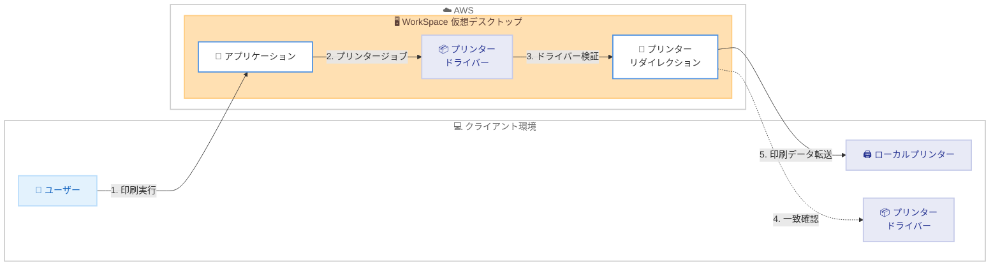

# Amazon WorkSpaces - 高度なプリンターリダイレクション機能

**リリース日**: 2026 年 1 月 27 日
**サービス**: Amazon WorkSpaces Personal
**機能**: 高度なプリンターリダイレクション (Advanced Printer Redirection)

## 概要

AWS は Amazon WorkSpaces Personal で高度なプリンターリダイレクション機能を発表しました。この機能により、Windows ユーザーは仮想デスクトップ環境からプリンターの全機能セットにアクセスできるようになります。これまで基本的な印刷機能のみをサポートしていた WorkSpaces が、両面印刷、用紙トレイ選択、仕上げオプション (ホチキス止め、パンチ穴あけ)、カラーマネジメントなど、プリンター固有の高度な機能を直接利用できるようになりました。

この機能は、汎用ドライバーではなくプリンター固有のドライバーを必要とする専門的な印刷機能に対応します。プロフェッショナルなドキュメント、ラベル、または専門的な出力に高度な印刷機能を必要とする組織のユーザーに最適です。管理者は、互換性と機能サポートのバランスを取るために、設定可能なドライバー検証モード (完全一致、部分一致、名前のみの一致) を選択できます。一致するドライバーが見つからない場合、WorkSpaces は自動的に基本的な印刷モードにフォールバックし、ユーザーが常に印刷できることを保証します。

**アップデート前の課題**

- 仮想デスクトップ環境から高度なプリンター機能 (両面印刷、ホチキス止めなど) を利用できませんでした
- プリンター固有のドライバーが必要な専門的な印刷タスクには、別の手段が必要でした
- 汎用プリンタードライバーでは、プロフェッショナルなドキュメント印刷の要件を満たせませんでした

**アップデート後の改善**

- WorkSpace から直接、プリンター固有の高度な機能 (両面印刷、用紙トレイ選択、ホチキス止め、パンチ穴あけ、カラーマネジメント) を利用できるようになりました
- ドライバー検証モードを設定することで、環境に最適な互換性と機能サポートのバランスを取れるようになりました
- 一致するドライバーがない場合も基本的な印刷モードへの自動フォールバックにより、常に印刷が可能になりました

## アーキテクチャ図

高度なプリンターリダイレクションは、WorkSpace 上のプリンタードライバーとクライアント側のドライバーを照合し、一致する場合はプリンター固有の機能を利用できるようにします。

## サービスアップデートの詳細

### 主要機能

1. **プリンター固有の高度な機能へのアクセス**
   - 両面印刷 (Duplex printing)
   - 用紙トレイ選択 (Paper tray selection)
   - 仕上げオプション: ホチキス止め (Stapling)、パンチ穴あけ (Hole-punching)
   - カラーマネジメント (Color management)
   - これらの機能を WorkSpace から直接利用可能

2. **設定可能なドライバー検証モード**
   - **Exact match (完全一致)**: WorkSpace とクライアントのドライバーが完全に一致する場合のみ機能を有効化
   - **Partial match (部分一致)**: ドライバーの一部が一致する場合に機能を有効化
   - **Name-only matching (名前のみの一致)**: プリンター名が一致する場合に機能を有効化
   - 管理者は環境に応じて最適なモードを選択可能

3. **自動フォールバック機能**
   - 一致するドライバーが見つからない場合、自動的に基本的な印刷モードにフォールバック
   - ユーザーは常に印刷を実行できることを保証
   - シームレスな印刷体験を提供

## 技術仕様

### 対応環境

| 項目 | 詳細 |
|------|------|
| 対応 WorkSpace タイプ | Amazon WorkSpaces Personal (Windows のみ) |
| 対応クライアント | Windows クライアントのみ |
| 必要な WorkSpaces Agent バージョン | 2.2.0.2116 以降 |
| 必要な Windows クライアントバージョン | 5.31 以降 |
| ドライバー要件 | WorkSpace とクライアントデバイスの両方に一致するプリンタードライバーが必要 |

### API 変更履歴

この機能は既存の WorkSpaces の機能拡張であり、新しい API は追加されていません。

## 設定方法

### 前提条件

1. Amazon WorkSpaces Personal (Windows) が稼働していること
2. WorkSpaces Agent version 2.2.0.2116 以降がインストールされていること
3. Windows クライアント version 5.31 以降がインストールされていること
4. WorkSpace とクライアントデバイスの両方に一致するプリンタードライバーがインストールされていること

### 手順

#### ステップ 1: プリンタードライバーの確認

WorkSpace とクライアントデバイスの両方に、使用するプリンターのドライバーがインストールされていることを確認します。

#### ステップ 2: グループポリシー設定

1. WorkSpaces 管理ガイドの [Configure Printer Support for DCV](https://docs.aws.amazon.com/workspaces/latest/adminguide/group_policy.html) を参照
2. グループポリシー設定でドライバー検証モードを選択
   - 完全一致モード: 最も厳密な検証、最大限の機能サポート
   - 部分一致モード: 互換性と機能のバランス
   - 名前のみの一致モード: 最も柔軟な検証、広範な互換性

#### ステップ 3: 機能の有効化と検証

1. WorkSpace を再起動
2. クライアントから WorkSpace に接続
3. アプリケーションから印刷を実行し、高度な印刷オプションが利用可能か確認

## メリット

### ビジネス面

- **生産性の向上**: 仮想デスクトップ環境から直接、プロフェッショナルな印刷機能を利用可能
- **ユーザー満足度の向上**: オンプレミス環境と同等の印刷体験を提供
- **コスト削減**: 専門的な印刷タスクのために別のソリューションを用意する必要がなくなる

### 技術面

- **柔軟な設定オプション**: 環境に応じて最適なドライバー検証モードを選択可能
- **自動フォールバック**: ドライバーが一致しない場合も基本的な印刷は常に可能
- **シンプルな導入**: 既存の WorkSpaces 環境にシームレスに統合

## デメリット・制約事項

### 制限事項

- Windows WorkSpaces と Windows クライアントの組み合わせのみサポート
- WorkSpaces Agent version 2.2.0.2116 以降が必要
- Windows クライアント version 5.31 以降が必要
- WorkSpace とクライアントデバイスの両方に一致するプリンタードライバーが必要

### 考慮すべき点

- ドライバー検証モードの選択により、互換性と機能サポートのトレードオフが発生する
- プリンタードライバーのバージョン管理とメンテナンスが必要
- 複数のプリンターモデルを使用する環境では、ドライバー管理の複雑さが増す可能性がある

## ユースケース

### ユースケース 1: 法律事務所での専門文書印刷

**シナリオ**: 法律事務所のスタッフが WorkSpace から契約書や法的文書を印刷する際、両面印刷とホチキス止めが必要です。

**実装例**:
1. WorkSpace とクライアントに同じプリンタードライバーをインストール
2. グループポリシーで「完全一致」モードを設定
3. 印刷時に両面印刷とホチキス止めオプションを選択

**効果**: オンプレミス環境と同等のプロフェッショナルな文書作成が可能になり、生産性が向上します。

### ユースケース 2: 製造業でのラベル印刷

**シナリオ**: 製造業の現場で、WorkSpace から製品ラベルや出荷ラベルを専用プリンターで印刷する必要があります。

**実装例**:
1. ラベルプリンターの専用ドライバーを WorkSpace とクライアントにインストール
2. グループポリシーで「部分一致」モードを設定
3. 用紙トレイ選択機能を利用して適切なラベル用紙を選択

**効果**: 専用プリンターの機能を最大限活用し、効率的なラベル印刷が可能になります。

### ユースケース 3: デザイン会社でのカラーマネジメント

**シナリオ**: デザイン会社のデザイナーが WorkSpace からカラーマネジメント機能を使用して正確な色再現で印刷する必要があります。

**実装例**:
1. カラープロファイル対応プリンターのドライバーをインストール
2. グループポリシーで「完全一致」モードを設定
3. カラーマネジメント機能を利用してカラープロファイルを適用

**効果**: 仮想デスクトップ環境でも正確な色再現が可能になり、デザインワークフローが改善されます。

## 料金

この機能は Amazon WorkSpaces Personal の標準機能として提供され、追加料金は発生しません。WorkSpaces の通常の利用料金が適用されます。

## 利用可能リージョン

この機能は、Amazon WorkSpaces Personal が提供されているすべての AWS リージョンで利用可能です。

## 関連サービス・機能

- **Amazon WorkSpaces Core**: 自社の VDI ソリューションを AWS で実行する場合の選択肢
- **AWS Directory Service**: WorkSpaces のユーザー認証とアクセス管理
- **Amazon CloudWatch**: WorkSpaces のモニタリングとログ管理

## 参考リンク

- [公式発表 (What's New)](https://aws.amazon.com/about-aws/whats-new/2026/01/amazon-workspaces-advanced-printer-redirection/)
- [ドキュメント - Configure Printer Support for DCV](https://docs.aws.amazon.com/workspaces/latest/adminguide/group_policy.html)
- [Amazon WorkSpaces 製品ページ](https://aws.amazon.com/workspaces-family/workspaces/)

## まとめ

Amazon WorkSpaces Personal の高度なプリンターリダイレクション機能により、仮想デスクトップ環境からプリンター固有の高度な機能を利用できるようになりました。これにより、オンプレミス環境と同等のプロフェッショナルな印刷体験が提供され、ユーザーの生産性と満足度が向上します。既存の WorkSpaces 環境を使用している場合は、WorkSpaces Agent とクライアントを最新バージョンに更新し、この機能を有効化することをお勧めします。
