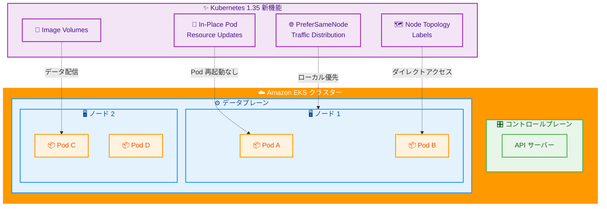

# Amazon EKS - Kubernetes バージョン 1.35 サポート

**リリース日**: 2026 年 01 月 28 日
**サービス**: Amazon EKS (Elastic Kubernetes Service)
**機能**: Kubernetes バージョン 1.35 サポート

## 概要

Amazon EKS と Amazon EKS Distro が Kubernetes バージョン 1.35 のサポートを開始しました。本日より、EKS コンソール、eksctl コマンドラインインターフェース、またはインフラストラクチャコード (IaC) ツールを使用して、バージョン 1.35 で新しい EKS クラスターを作成したり、既存のクラスターをバージョン 1.35 にアップグレードしたりできます。

Kubernetes バージョン 1.35 では、Pod を再起動することなく CPU とメモリを調整できる In-Place Pod Resource Updates、リモートノードにルーティングする前にローカルエンドポイントを優先してレイテンシーを削減する PreferSameNode Traffic Distribution、API サーバークエリなしで Pod がリージョンとゾーン情報にアクセスできる Node Topology Labels via Downward API、OCI コンテナイメージを使用してデータアーティファクトを配信する Image Volumes など、いくつかの重要な改善が導入されています。

EKS は、AWS GovCloud (US) リージョンを含む EKS が利用可能な全ての AWS リージョンで Kubernetes バージョン 1.35 をサポートしています。

**アップデート前の課題**

- Pod のリソース (CPU やメモリ) を調整するには Pod を再起動する必要があり、アプリケーションのダウンタイムが発生していた
- トラフィックディストリビューションでローカルエンドポイントを優先する方法が限定的で、レイテンシーが発生する可能性があった
- Pod がリージョンやゾーン情報を取得するには API サーバーにクエリする必要があり、API サーバーへの負荷が高かった
- AI モデルなどの大きなデータアーティファクトを Pod に配信する標準的な方法が不足していた

**アップデート後の改善**

- In-Place Pod Resource Updates により、Pod を再起動することなく CPU とメモリを調整可能
- PreferSameNode Traffic Distribution により、ローカルエンドポイントを優先してレイテンシーを削減
- Node Topology Labels via Downward API により、API サーバーにクエリすることなく Pod がリージョンとゾーン情報にアクセス可能
- Image Volumes により、OCI コンテナイメージを使用して AI モデルなどのデータアーティファクトを配信可能

## アーキテクチャ図



この図は、Kubernetes 1.35 の主要な新機能と EKS クラスターの関係を示しています。各機能は Pod やノードレベルで動作し、パフォーマンスと柔軟性を向上させます。

## サービスアップデートの詳細

### 主要機能

1. **In-Place Pod Resource Updates**
   - Pod を再起動することなく、CPU とメモリのリソース制限を調整可能
   - アプリケーションのダウンタイムを最小化
   - リソース要件の変化に柔軟に対応

2. **PreferSameNode Traffic Distribution**
   - リモートノードにルーティングする前に、ローカルエンドポイントを優先
   - ネットワークレイテンシーを削減
   - 同じノード内のトラフィックを最適化

3. **Node Topology Labels via Downward API**
   - API サーバーにクエリすることなく、Pod がリージョンとゾーン情報にアクセス可能
   - API サーバーへの負荷を削減
   - Pod 起動時のレイテンシーを改善

4. **Image Volumes**
   - OCI コンテナイメージを使用してデータアーティファクト (AI モデルなど) を配信
   - 標準的なコンテナイメージフォーマットを活用
   - データの配信とバージョン管理を簡素化

## 設定方法

### 前提条件

1. AWS CLI または eksctl がインストールされていること
2. EKS クラスターを作成または管理する権限があること
3. Kubernetes 1.35 にアップグレードする前に、EKS cluster insights で互換性問題を確認すること

### 手順

#### ステップ 1: 新しい EKS クラスターを Kubernetes 1.35 で作成

```bash
# eksctl を使用して Kubernetes 1.35 クラスターを作成
eksctl create cluster \
    --name my-cluster \
    --version 1.35 \
    --region us-west-2 \
    --nodegroup-name standard-workers \
    --node-type t3.medium \
    --nodes 3 \
    --nodes-min 1 \
    --nodes-max 4
```

このコマンドは、Kubernetes 1.35 を使用する新しい EKS クラスターを作成します。

#### ステップ 2: 既存クラスターを Kubernetes 1.35 にアップグレード

```bash
# EKS cluster insights で互換性問題を確認
aws eks list-insights \
    --region us-west-2 \
    --cluster-name my-cluster

# eksctl を使用してクラスターをアップグレード
eksctl upgrade cluster \
    --name my-cluster \
    --version 1.35 \
    --region us-west-2 \
    --approve
```

このコマンドは、既存の EKS クラスターを Kubernetes 1.35 にアップグレードします。アップグレード前に必ず互換性問題を確認してください。

#### ステップ 3: ノードグループのアップグレード

```bash
# ノードグループをアップグレード
eksctl upgrade nodegroup \
    --name standard-workers \
    --cluster my-cluster \
    --region us-west-2 \
    --kubernetes-version 1.35
```

コントロールプレーンのアップグレード後、ノードグループも Kubernetes 1.35 にアップグレードする必要があります。

## メリット

### ビジネス面

- **ダウンタイムの削減**: In-Place Pod Resource Updates により、アプリケーションを再起動することなくリソースを調整可能
- **コスト最適化**: リソースを動的に調整することで、リソースの無駄を削減
- **パフォーマンス向上**: ローカルトラフィック優先によりレイテンシーを削減

### 技術面

- **柔軟なリソース管理**: Pod を再起動することなく CPU とメモリを調整
- **レイテンシー削減**: PreferSameNode Traffic Distribution によりネットワークレイテンシーを削減
- **API サーバー負荷軽減**: Downward API を使用してトポロジー情報にアクセスすることで API サーバーへのクエリを削減
- **標準的なデータ配信**: Image Volumes により OCI コンテナイメージを使用してデータを配信

## デメリット・制約事項

### 制限事項

- アップグレード前に EKS cluster insights で互換性問題を確認する必要がある
- コントロールプレーンのアップグレード後、ノードグループも個別にアップグレードする必要がある
- 一部の機能は特定のノードタイプやネットワーク設定でのみ利用可能

### 考慮すべき点

- Kubernetes 1.35 へのアップグレードは一方向のみで、ダウングレードはサポートされていない
- アップグレード前に本番環境以外でテストすることを強く推奨
- EKS のバージョンライフサイクルポリシーを確認し、計画的にアップグレードを実施

## ユースケース

### ユースケース 1: 動的リソース調整によるコスト最適化

**シナリオ**: アプリケーションの負荷が時間帯によって変動し、リソースを動的に調整したいが、Pod の再起動によるダウンタイムを避けたい。

**効果**: In-Place Pod Resource Updates により、Pod を再起動することなくリソースを調整でき、ダウンタイムなしでコストを最適化できる。

### ユースケース 2: レイテンシー重視のマイクロサービス

**シナリオ**: マイクロサービスアーキテクチャでサービス間通信のレイテンシーを最小化したい。

**効果**: PreferSameNode Traffic Distribution により、同じノード内のサービス間通信を優先し、ネットワークレイテンシーを削減できる。

### ユースケース 3: AI モデルの配信

**シナリオ**: 機械学習アプリケーションで、大きな AI モデルを Pod に配信する標準的な方法が必要。

**効果**: Image Volumes により、OCI コンテナイメージを使用して AI モデルを配信でき、バージョン管理と配信を簡素化できる。

## 料金

Kubernetes バージョン 1.35 の使用に追加料金はかかりません。標準の EKS 料金が適用されます。

- **EKS コントロールプレーン**: クラスターあたり $0.10/時間
- **ワーカーノード**: EC2 インスタンス料金が適用

詳細な料金情報については、[Amazon EKS 料金ページ](https://aws.amazon.com/eks/pricing/)を参照してください。

## 利用可能リージョン

Kubernetes バージョン 1.35 は、AWS GovCloud (US) リージョンを含む EKS が利用可能な全ての AWS リージョンで提供されています。

## 関連サービス・機能

- **Amazon EKS Distro**: Kubernetes バージョン 1.35 のビルドを ECR Public Gallery と GitHub で提供
- **EKS Cluster Insights**: Kubernetes クラスターのアップグレードに影響を与える可能性のある問題を確認
- **eksctl**: EKS クラスターの作成とアップグレードを簡素化するコマンドラインツール
- **Amazon ECR**: コンテナイメージを保存および管理

## 参考リンク

- [公式発表 (What's New)](https://aws.amazon.com/about-aws/whats-new/2026/01/amazon-eks-distro-kubernetes-version-1-35/)
- [EKS ドキュメント](https://docs.aws.amazon.com/eks/latest/userguide/kubernetes-versions-standard.html)
- [Kubernetes 1.35 リリースノート](https://github.com/kubernetes/kubernetes/blob/master/CHANGELOG/CHANGELOG-1.35.md)
- [EKS Cluster Insights](https://docs.aws.amazon.com/eks/latest/userguide/cluster-insights.html)

## まとめ

Amazon EKS の Kubernetes バージョン 1.35 サポートにより、Pod を再起動することなくリソースを調整できる In-Place Pod Resource Updates、レイテンシーを削減する PreferSameNode Traffic Distribution、API サーバーへの負荷を軽減する Node Topology Labels via Downward API、データアーティファクトを配信する Image Volumes など、重要な新機能が利用可能になりました。これらの機能により、アプリケーションのダウンタイムを削減し、パフォーマンスを向上させ、リソースを効率的に管理できます。既存の EKS クラスターをアップグレードする場合は、EKS cluster insights で互換性問題を確認し、計画的に実施してください。
