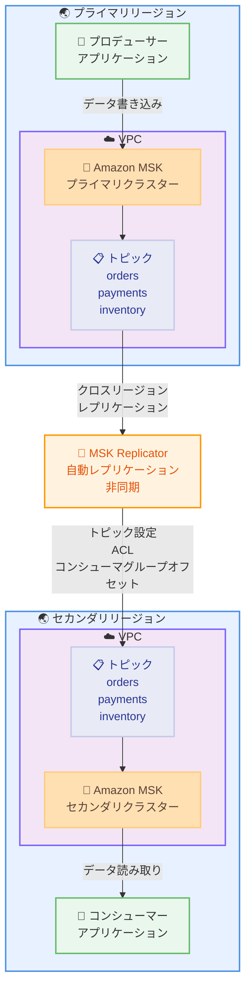

# Amazon MSK Replicator - アジアパシフィック (ニュージーランド) リージョンで利用可能

**リリース日**: 2026 年 01 月 28 日
**サービス**: Amazon MSK
**機能**: MSK Replicator のリージョン拡大

## 概要

Amazon MSK Replicator が、アジアパシフィック (ニュージーランド) リージョン (ap-southeast-5、オークランド) で利用可能になりました。MSK Replicator は、Amazon Managed Streaming for Apache Kafka (Amazon MSK) の機能で、異なる AWS リージョンまたは同じリージョン内の MSK クラスター間でデータを数回のクリックで確実にレプリケートできます。

MSK Replicator を使用することで、地域的にレジリエントなストリーミングアプリケーションを簡単に構築でき、可用性とビジネス継続性を向上させることができます。MSK Replicator は、MSK クラスター間で自動的に非同期レプリケーションを提供し、カスタムコードの作成、インフラストラクチャの管理、クロスリージョンネットワークの設定が不要です。

**アップデート前の課題**

- ニュージーランドリージョンでは MSK Replicator が利用できず、クロスリージョンレプリケーションを構築するには独自の実装が必要だった
- オープンソースツールのセットアップやカスタムコードの記述が必要だった
- インフラストラクチャの管理とスケーリングに手動の作業が必要だった

**アップデート後の改善**

- ニュージーランドリージョンで MSK Replicator を使用できるようになった
- 数回のクリックでクロスリージョンレプリケーションを設定可能になった
- 自動スケーリングにより、オンデマンドでデータをレプリケートできるようになった

## アーキテクチャ図



この図は、東京リージョンのプライマリ MSK クラスターからニュージーランドリージョンのセカンダリ MSK クラスターへの自動レプリケーションを示しています。

## サービスアップデートの詳細

### 主要機能

1. **自動クロスリージョンレプリケーション**
   - MSK クラスター間で自動的にデータをレプリケート
   - 非同期レプリケーションにより、最小限のレイテンシでデータを転送
   - トピックデータだけでなく、トピック設定、ACL、コンシューマグループオフセットもレプリケート

2. **自動スケーリング**
   - レプリケーションのスループットに応じて自動的にリソースをスケール
   - 容量の監視やスケーリングの必要なし
   - オンデマンドでデータをレプリケート可能

3. **マネージドインフラストラクチャ**
   - カスタムコードの作成やオープンソースツールのセットアップが不要
   - インフラストラクチャの管理を AWS が自動的に実行
   - クロスリージョンネットワークの設定を自動化

## 技術仕様

### レプリケートされるメタデータ

| メタデータ | 説明 |
|------|------|
| トピック設定 | パーティション数、レプリケーション係数、リテンション設定など |
| Access Control Lists (ACL) | トピックへのアクセス権限 |
| コンシューマグループオフセット | コンシューマグループの読み取り位置 |

### サポートされるクラスタートポロジー

| トポロジー | 説明 | 使用シーン |
|------|------|------|
| Active-Active | 両方のクラスターが読み書きを処理 | ゼロ復旧時間、複数リージョンでの同時運用 |
| Active-Passive | 1 つのクラスターがアクティブ、もう 1 つはスタンバイ | フェイルオーバー用、データ処理順序の制御が必要な場合 |

### レプリケーション設定

```json
{
  "ReplicatorName": "tokyo-to-newzealand-replicator",
  "SourceKafkaCluster": {
    "AmazonMskCluster": {
      "MskClusterArn": "arn:aws:kafka:ap-northeast-1:123456789012:cluster/primary-cluster/xxxxx"
    }
  },
  "TargetKafkaCluster": {
    "AmazonMskCluster": {
      "MskClusterArn": "arn:aws:kafka:ap-southeast-5:123456789012:cluster/secondary-cluster/xxxxx"
    }
  },
  "TopicReplication": {
    "TopicsToReplicate": ["orders", "payments", "inventory"],
    "CopyTopicConfigurations": true,
    "CopyAccessControlListsForTopics": true,
    "DetectAndCopyNewTopics": true
  },
  "ConsumerGroupReplication": {
    "ConsumerGroupsToReplicate": ["*"],
    "SynchroniseConsumerGroupOffsets": true
  }
}
```

## 設定方法

### 前提条件

1. ソースリージョンとターゲットリージョンに MSK クラスターが作成されていること
2. MSK クラスターが Provisioned または Serverless モードであること
3. IAM ロールに MSK クラスターへのアクセス権限があること
4. ソースクラスターとターゲットクラスター間のネットワーク接続が確立されていること

### 手順

#### ステップ 1: ソースとターゲットの MSK クラスターを作成

```bash
# ソースリージョン 東京 にプライマリクラスターを作成
aws kafka create-cluster \
  --cluster-name primary-cluster \
  --kafka-version 3.5.1 \
  --broker-node-group-info file://broker-config.json \
  --region ap-northeast-1

# ターゲットリージョン ニュージーランド にセカンダリクラスターを作成
aws kafka create-cluster \
  --cluster-name secondary-cluster \
  --kafka-version 3.5.1 \
  --broker-node-group-info file://broker-config.json \
  --region ap-southeast-5
```

これらのコマンドは、東京とニュージーランドリージョンに MSK クラスターを作成します。

#### ステップ 2: MSK Replicator を作成

```bash
# MSK Replicator を作成して東京からニュージーランドへレプリケート
aws kafka create-replicator \
  --replicator-name tokyo-to-newzealand-replicator \
  --source-kafka-cluster-arn arn:aws:kafka:ap-northeast-1:123456789012:cluster/primary-cluster/xxxxx \
  --target-kafka-cluster-arn arn:aws:kafka:ap-southeast-5:123456789012:cluster/secondary-cluster/xxxxx \
  --topics-to-replicate "orders,payments,inventory" \
  --replication-starting-position EARLIEST \
  --region ap-southeast-5
```

このコマンドは、東京のプライマリクラスターからニュージーランドのセカンダリクラスターへデータをレプリケートする MSK Replicator を作成します。

#### ステップ 3: レプリケーションステータスを確認

```bash
# レプリケーターのステータスを確認
aws kafka describe-replicator \
  --replicator-arn arn:aws:kafka:ap-southeast-5:123456789012:replicator/tokyo-to-newzealand-replicator/xxxxx \
  --region ap-southeast-5
```

このコマンドは、MSK Replicator のステータスとレプリケーションの進行状況を確認します。

#### ステップ 4: レプリケーションメトリクスを監視

```bash
# CloudWatch メトリクスでレプリケーションラグを監視
aws cloudwatch get-metric-statistics \
  --namespace AWS/Kafka \
  --metric-name ReplicationLatency \
  --dimensions Name=Replicator,Value=tokyo-to-newzealand-replicator \
  --start-time 2026-01-28T00:00:00Z \
  --end-time 2026-01-28T23:59:59Z \
  --period 300 \
  --statistics Average \
  --region ap-southeast-5
```

このコマンドは、レプリケーションのレイテンシを監視して、データ転送の遅延を確認します。

## メリット

### ビジネス面

- **ビジネス継続性の向上**: リージョン障害が発生しても、別のリージョンでデータ処理を継続可能
- **グローバル展開の加速**: ニュージーランドリージョンでのデータ利用が容易になり、オセアニア市場への展開が加速
- **運用コストの削減**: インフラストラクチャの管理が不要になり、運用コストを削減

### 技術面

- **自動レプリケーション**: カスタムコードやオープンソースツールのセットアップが不要
- **メタデータの完全なレプリケーション**: トピック設定、ACL、コンシューマグループオフセットも自動的にレプリケート
- **シームレスなフェイルオーバー**: コンシューマグループオフセットがレプリケートされるため、フェイルオーバー後もデータ処理を継続可能

## デメリット・制約事項

### 制限事項

- レプリケーションは非同期で行われるため、最小限のデータ損失が発生する可能性がある
- コンシューマーはフェイルオーバー後に重複メッセージを処理する可能性があるため、冪等性を考慮する必要がある
- MSK Replicator は「At Least Once」の配信セマンティクスを使用

### 考慮すべき点

- クロスリージョンデータ転送には追加のコストがかかる
- レプリケーションのレイテンシは、リージョン間のネットワーク距離に依存する
- Active-Active トポロジーでは、両方のクラスターでデータの競合が発生する可能性がある

## ユースケース

### ユースケース 1: ディザスタリカバリ

**シナリオ**: 東京リージョンで障害が発生した場合に、ニュージーランドリージョンにフェイルオーバーしてビジネスを継続したい場合。

**実装例**:
```bash
# Active-Passive トポロジーで MSK Replicator を設定
aws kafka create-replicator \
  --replicator-name disaster-recovery-replicator \
  --source-kafka-cluster-arn arn:aws:kafka:ap-northeast-1:123456789012:cluster/primary-cluster/xxxxx \
  --target-kafka-cluster-arn arn:aws:kafka:ap-southeast-5:123456789012:cluster/secondary-cluster/xxxxx \
  --topics-to-replicate "*" \
  --consumer-group-replication '{"ConsumerGroupsToReplicate": ["*"], "SynchroniseConsumerGroupOffsets": true}' \
  --region ap-southeast-5

# プライマリリージョンで障害が発生した場合、セカンダリリージョンにフェイルオーバー
# コンシューマーアプリケーションの接続先をセカンダリクラスターに変更
```

**効果**: リージョン障害が発生しても、コンシューマグループオフセットが保持されているため、データ処理をシームレスに継続できます。

### ユースケース 2: グローバルデータ集約

**シナリオ**: 複数のリージョンからデータを収集し、ニュージーランドリージョンで分析したい場合。

**実装例**:
```bash
# 東京からニュージーランドへレプリケート
aws kafka create-replicator \
  --replicator-name tokyo-to-nz-aggregation \
  --source-kafka-cluster-arn arn:aws:kafka:ap-northeast-1:123456789012:cluster/tokyo-cluster/xxxxx \
  --target-kafka-cluster-arn arn:aws:kafka:ap-southeast-5:123456789012:cluster/analytics-cluster/xxxxx \
  --topics-to-replicate "logs,metrics,events" \
  --region ap-southeast-5

# シドニーからニュージーランドへレプリケート
aws kafka create-replicator \
  --replicator-name sydney-to-nz-aggregation \
  --source-kafka-cluster-arn arn:aws:kafka:ap-southeast-2:123456789012:cluster/sydney-cluster/xxxxx \
  --target-kafka-cluster-arn arn:aws:kafka:ap-southeast-5:123456789012:cluster/analytics-cluster/xxxxx \
  --topics-to-replicate "logs,metrics,events" \
  --region ap-southeast-5
```

**効果**: 複数のリージョンからデータを集約し、ニュージーランドリージョンで一元的に分析できます。

### ユースケース 3: ローカル書き込み、グローバル読み取り

**シナリオ**: 各リージョンでローカルに書き込み、すべてのリージョンでデータを読み取りたい場合。

**実装例**:
```bash
# Active-Active トポロジーで双方向レプリケーションを設定
# 東京 → ニュージーランド
aws kafka create-replicator \
  --replicator-name tokyo-to-nz \
  --source-kafka-cluster-arn arn:aws:kafka:ap-northeast-1:123456789012:cluster/tokyo-cluster/xxxxx \
  --target-kafka-cluster-arn arn:aws:kafka:ap-southeast-5:123456789012:cluster/nz-cluster/xxxxx \
  --topics-to-replicate "*" \
  --region ap-southeast-5

# ニュージーランド → 東京
aws kafka create-replicator \
  --replicator-name nz-to-tokyo \
  --source-kafka-cluster-arn arn:aws:kafka:ap-southeast-5:123456789012:cluster/nz-cluster/xxxxx \
  --target-kafka-cluster-arn arn:aws:kafka:ap-northeast-1:123456789012:cluster/tokyo-cluster/xxxxx \
  --topics-to-replicate "*" \
  --region ap-northeast-1
```

**効果**: 各リージョンでローカルに書き込み、レイテンシを最小限に抑えながら、すべてのリージョンでデータを読み取れます。

## 料金

MSK Replicator の料金は、レプリケートされたデータ量と、レプリケーターが実行されている時間に基づいて計算されます。

### 料金例

| 使用量 | 月額料金 (概算) |
|--------|------------------|
| レプリケーターの実行時間 (730 時間/月) | リージョンによって異なる |
| クロスリージョンデータ転送 100 GB (東京 → ニュージーランド) | $20.00 ($0.20/GB) |
| クロスリージョンデータ転送 1 TB (東京 → ニュージーランド) | $200.00 ($0.20/GB) |

詳細な料金については、[MSK Replicator の料金ページ](https://aws.amazon.com/msk/pricing/)を参照してください。

## 利用可能リージョン

今回のアップデートにより、MSK Replicator は合計 36 の AWS リージョンで利用可能になりました。

## 関連サービス・機能

- **Amazon Managed Streaming for Apache Kafka (MSK)**: フルマネージド Apache Kafka サービス
- **Amazon CloudWatch**: レプリケーションのメトリクスとログを監視
- **AWS IAM**: MSK クラスターへのアクセス制御を管理

## 参考リンク

- [公式発表 (What's New)](https://aws.amazon.com/about-aws/whats-new/2026/01/amazon-msk-replicator-asia-pacific-new-zealand/)
- [MSK Replicator ドキュメント](https://docs.aws.amazon.com/msk/latest/developerguide/msk-replicator.html)
- [MSK Replicator 製品ページ](https://aws.amazon.com/msk/features/msk-replicator/)
- [MSK Replicator 料金](https://aws.amazon.com/msk/pricing/)

## まとめ

Amazon MSK Replicator がニュージーランドリージョンで利用可能になったことで、オセアニア地域でのデータストリーミングアプリケーションの可用性とレジリエンシーを向上させることができます。ディザスタリカバリ、グローバルデータ集約、ローカル書き込み・グローバル読み取りなどのユースケースで、MSK Replicator を活用してビジネス継続性を確保することをお勧めします。
