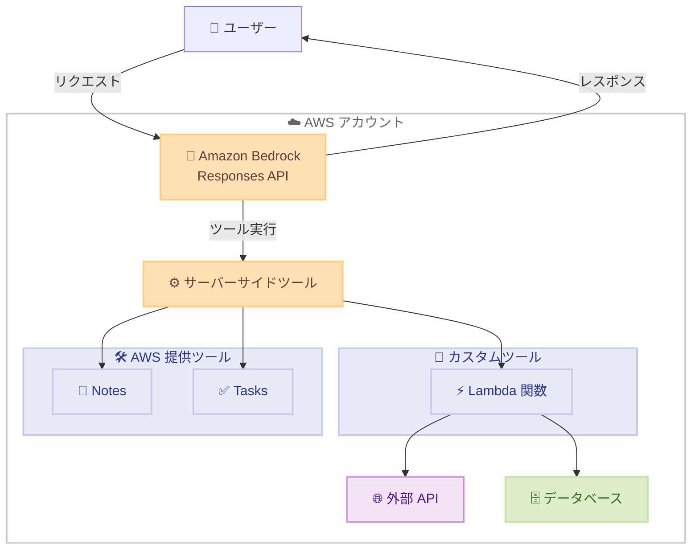

# Amazon Bedrock - サーバーサイドカスタムツール Responses API 対応

**リリース日**: 2026年1月29日
**サービス**: Amazon Bedrock
**機能**: Responses API でのサーバーサイドツールサポート

## 概要

Amazon Bedrock が、Responses API において OpenAI API 互換サービスエンドポイントを使用したサーバーサイドツールをサポート開始しました。これにより、AI アプリケーションは、クライアントを介さずに Amazon Bedrock がツールを直接呼び出し、Web 検索、コード実行、データベース更新などのリアルタイムでマルチステップのアクションを AWS アカウントの組織、ガバナンス、コンプライアンス、セキュリティの境界内で実行できるようになります。

Bedrock は従来から Converse API、Chat Completions API、Responses API でクライアントサイドツール使用をサポートしていましたが、今回のアップデートにより、Responses API でサーバーサイドツールの実行が可能になりました。カスタム Lambda 関数を送信してカスタムツールを実行するか、AWS が提供するノートやタスクなどのツールを使用できます。

この機能は、OpenAI の GPT OSS 20B/120B モデルで利用可能で、US East (N. Virginia)、US East (Ohio)、US West (Oregon)、Asia Pacific (Tokyo)、Asia Pacific (Mumbai)、South America (São Paulo)、Europe (Ireland)、Europe (London)、Europe (Milan) リージョンで提供されています。

**アップデート前の課題**

- クライアントサイドツールでは、開発者がツールを呼び出し、結果をモデルに送信する必要があった
- ツール実行がクライアント側で行われるため、セキュリティとガバナンスの制御が難しかった
- クライアントとモデル間で複数回のラウンドトリップが必要で、レイテンシーが増加していた
- 組織のセキュリティ境界内でツールを実行する仕組みが限定的だった

**アップデート後の改善**

- サーバーサイドでツールを実行できるため、信頼された環境でセキュアにツールを実行可能
- AWS アカウントの組織、ガバナンス、コンプライアンス、セキュリティの境界内でツールを実行できる
- クライアント側でのツール実行コードが不要になり、アーキテクチャがシンプル化
- リアルタイムでマルチステップのアクションを実行できる
- カスタム Lambda 関数または AWS 提供ツール (notes、tasks) を利用可能

## アーキテクチャ図



サーバーサイドツールは AWS アカウント内で実行され、セキュリティとガバナンスの境界内でツールを安全に実行できます。

## サービスアップデートの詳細

### 主要機能

1. **サーバーサイドツール実行**
   - Amazon Bedrock がクライアントを介さずに直接ツールを呼び出す
   - AWS アカウント内でツールを実行し、組織のセキュリティポリシーに準拠
   - リアルタイムでマルチステップのアクションを実行可能

2. **カスタム Lambda 関数サポート**
   - カスタム Lambda 関数を定義してツールとして使用可能
   - MCP (Model Context Protocol) プロトコルを実装した Lambda 関数をデプロイ
   - Web 検索、コード実行、データベース更新などの任意のアクションを実装可能

3. **AWS 提供ツール**
   - **Notes ツール**: 会話セッション内でキー・バリューペアを保存・取得
   - **Tasks ツール**: 会話セッション内でタスクを管理 (LIFO スタック)
   - すぐに使用可能なツールとして提供

## 技術仕様

### サポートモデルとリージョン

| 項目 | 詳細 |
|------|------|
| サポートモデル | OpenAI GPT OSS 20B/120B |
| 利用可能リージョン | US East (N. Virginia)、US East (Ohio)、US West (Oregon)、Asia Pacific (Tokyo)、Asia Pacific (Mumbai)、South America (São Paulo)、Europe (Ireland)、Europe (London)、Europe (Milan) |
| API | Responses API (OpenAI API 互換) |
| サポート予定 | 他のリージョンとモデルも順次サポート予定 |

### ツールの種類

| ツール種別 | 説明 |
|-----------|------|
| カスタム Lambda 関数 | MCP プロトコルを実装した Lambda 関数を定義してカスタムツールとして使用 |
| AWS 提供ツール (Notes) | 会話セッション内でキー・バリューペアを保存・取得 |
| AWS 提供ツール (Tasks) | 会話セッション内でタスクを管理 (LIFO スタック) |

### Lambda 関数によるカスタムツールの実装

カスタムツールとして Lambda 関数を使用する場合、以下の要件を満たす必要があります。

1. MCP (Model Context Protocol) プロトコルを実装
2. ツール定義を Responses API のリクエストに含める
3. Lambda 関数に適切な IAM 権限を設定

## 設定方法

### 前提条件

1. AWS アカウント
2. Amazon Bedrock へのアクセス権限
3. OpenAI SDK または HTTP クライアント
4. カスタムツールを使用する場合、Lambda 関数の作成とデプロイ

### 手順

#### ステップ 1: Lambda 関数の作成 (カスタムツールの場合)

```python
# Lambda 関数例: データベースクエリツール
import json
import boto3

def lambda_handler(event, context):
    # MCP プロトコルに従った処理
    tool_name = event['tool_name']
    parameters = event['parameters']

    # ツール実行処理
    if tool_name == 'query_database':
        query = parameters['query']
        # データベースクエリ実行 (例)
        result = execute_query(query)
        return {
            'statusCode': 200,
            'body': json.dumps(result)
        }
```

MCP プロトコルを実装した Lambda 関数を作成し、デプロイします。

#### ステップ 2: Responses API を使用してツールを呼び出す

```python
import openai

# OpenAI SDK を使用して Responses API を呼び出す
openai.api_key = "AWS_CREDENTIALS"
openai.api_base = "https://bedrock-runtime.us-east-1.amazonaws.com/v1"

response = openai.Responses.create(
    model="gpt-oss-20b",
    messages=[
        {"role": "user", "content": "データベースから最新のユーザー情報を取得してください"}
    ],
    tools=[
        {
            "type": "function",
            "function": {
                "name": "query_database",
                "description": "データベースからデータを取得する",
                "parameters": {
                    "type": "object",
                    "properties": {
                        "query": {
                            "type": "string",
                            "description": "実行するSQLクエリ"
                        }
                    },
                    "required": ["query"]
                },
                "backend": {
                    "type": "lambda",
                    "function_arn": "arn:aws:lambda:us-east-1:123456789012:function:query-database"
                }
            }
        }
    ],
    tool_choice="auto"
)
```

Responses API を使用してツールを定義し、サーバーサイドで実行します。

#### ステップ 3: AWS 提供ツールの使用

```python
response = openai.Responses.create(
    model="gpt-oss-20b",
    messages=[
        {"role": "user", "content": "重要な情報をメモしておいてください"}
    ],
    tools=[
        {
            "type": "aws_provided",
            "name": "notes"
        }
    ]
)
```

AWS 提供ツール (notes、tasks) を使用する場合は、ツールタイプを指定するだけで利用可能です。

## メリット

### ビジネス面

- **セキュリティとコンプライアンス**: AWS アカウントの組織、ガバナンス、コンプライアンス、セキュリティの境界内でツールを実行できる
- **開発生産性向上**: クライアント側のツール実行コードが不要になり、アーキテクチャがシンプル化
- **リアルタイム処理**: Web 検索、コード実行、データベース更新などのマルチステップアクションをリアルタイムで実行可能

### 技術面

- **低レイテンシー**: クライアントとモデル間のラウンドトリップが削減され、レスポンス時間が短縮
- **柔軟性**: カスタム Lambda 関数で任意のロジックを実装可能
- **統合容易性**: OpenAI API 互換エンドポイントにより、既存の OpenAI SDK やツールをそのまま使用可能
- **AWS エコシステム統合**: Lambda、データベース、外部 API などの AWS サービスとシームレスに統合

## デメリット・制約事項

### 制限事項

- 現時点では OpenAI GPT OSS 20B/120B モデルのみサポート
- 一部のリージョンでのみ利用可能 (他のリージョンは順次サポート予定)
- カスタムツールを使用する場合、MCP プロトコルの実装が必要

### 考慮すべき点

- Lambda 関数の実行時間とコストを考慮する必要がある
- Lambda 関数の同時実行制限に注意
- ツール実行のエラーハンドリングとリトライロジックを適切に設計する必要がある

## ユースケース

### ユースケース 1: リアルタイムデータベースクエリ

**シナリオ**: AI チャットボットがユーザーの質問に応じて、データベースから最新の情報を取得して回答する

**実装例**:
```python
# Lambda 関数でデータベースクエリを実行
def query_database(query):
    # RDS または DynamoDB からデータを取得
    return execute_query(query)

# Responses API でツールを呼び出す
response = openai.Responses.create(
    model="gpt-oss-20b",
    messages=[
        {"role": "user", "content": "過去30日間の売上トップ10を教えてください"}
    ],
    tools=[
        {
            "type": "function",
            "function": {
                "name": "query_database",
                "backend": {"type": "lambda", "function_arn": "..."}
            }
        }
    ]
)
```

**効果**: ユーザーはリアルタイムでデータベースの最新情報を取得でき、AI がデータに基づいた正確な回答を提供

### ユースケース 2: Web 検索による情報取得

**シナリオ**: AI アシスタントが Web 検索を実行し、最新の情報をユーザーに提供する

**実装例**:
```python
# Lambda 関数で Web 検索を実行
def web_search(query):
    # 外部検索 API を呼び出す
    return search_api.search(query)

# Responses API でツールを呼び出す
response = openai.Responses.create(
    model="gpt-oss-20b",
    messages=[
        {"role": "user", "content": "最新のAWSアップデート情報を教えてください"}
    ],
    tools=[
        {
            "type": "function",
            "function": {
                "name": "web_search",
                "backend": {"type": "lambda", "function_arn": "..."}
            }
        }
    ]
)
```

**効果**: AI が最新の情報を Web から取得し、ユーザーに正確で最新の情報を提供

### ユースケース 3: タスク管理

**シナリオ**: AI アシスタントがユーザーのタスクを管理し、LIFO スタックで処理順序を管理する

**実装例**:
```python
# AWS 提供の Tasks ツールを使用
response = openai.Responses.create(
    model="gpt-oss-20b",
    messages=[
        {"role": "user", "content": "明日の会議の準備をタスクに追加してください"}
    ],
    tools=[
        {
            "type": "aws_provided",
            "name": "tasks"
        }
    ]
)
```

**効果**: AI がタスクを自動的に管理し、ユーザーの生産性を向上

## 料金

Amazon Bedrock の料金は、モデルの使用量、ツールの実行回数、Lambda 関数の実行時間に基づいて課金されます。

- **モデル使用料**: トークン数に応じた従量課金
- **Lambda 実行料**: Lambda 関数の実行時間とリクエスト数に応じた課金
- **その他**: データ転送料金が発生する場合がある

詳細は Amazon Bedrock の料金ページを参照してください。

### 料金例

| 使用量 | 月額料金 (概算) |
|--------|------------------|
| 100万トークン + 10,000 Lambda 実行 | $10-20 |
| 1,000万トークン + 100,000 Lambda 実行 | $100-200 |

## 利用可能リージョン

- US East (N. Virginia)
- US East (Ohio)
- US West (Oregon)
- Asia Pacific (Tokyo)
- Asia Pacific (Mumbai)
- South America (São Paulo)
- Europe (Ireland)
- Europe (London)
- Europe (Milan)

他のリージョンとモデルも順次サポート予定です。

## 関連サービス・機能

- **AWS Lambda**: カスタムツールを実装するために使用
- **Amazon Bedrock Converse API**: クライアントサイドツール使用をサポート
- **Amazon Bedrock Chat Completions API**: OpenAI 互換の会話型 API
- **Amazon Bedrock Responses API**: ステートフル会話管理をサポート

## 参考リンク

- [公式発表 (What's New)](https://aws.amazon.com/about-aws/whats-new/2026/01/amazon-bedrock-server-side-custom-tools-responses-api/)
- [ドキュメント](https://docs.aws.amazon.com/bedrock/latest/userguide/tool-use.html)
- [Amazon Bedrock 料金ページ](https://aws.amazon.com/bedrock/pricing/)

## まとめ

Amazon Bedrock の Responses API でサーバーサイドツールがサポートされたことにより、AI アプリケーションは AWS アカウントのセキュリティ境界内でリアルタイムのマルチステップアクションを実行できるようになりました。カスタム Lambda 関数または AWS 提供ツールを使用して、Web 検索、コード実行、データベース更新などの高度な AI アプリケーションを構築できます。OpenAI API 互換エンドポイントにより、既存のツールや SDK をそのまま使用できるため、簡単に移行・統合が可能です。
