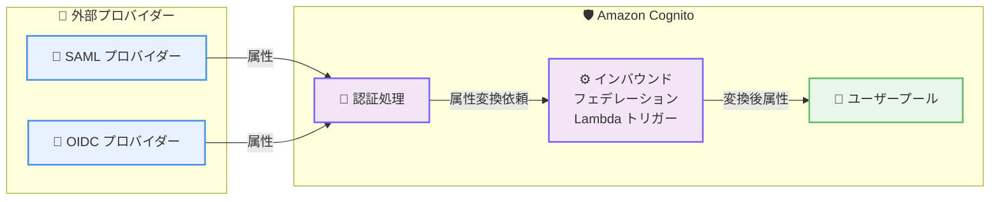

# Amazon Cognito - インバウンドフェデレーション Lambda トリガー

**リリース日**: 2026 年 1 月 29 日
**サービス**: Amazon Cognito
**機能**: インバウンドフェデレーション Lambda トリガー

## 概要

Amazon Cognito がインバウンドフェデレーション Lambda トリガーを導入し、SAML および OIDC プロバイダーからのユーザー属性を認証プロセス中に変換・カスタマイズできるようになりました。外部アイデンティティプロバイダーからのレスポンスをユーザープールに保存する前に修正でき、フェデレーションワークフロー全体のプログラマティック制御が実現でき、アイデンティティプロバイダー側の設定変更が不要になります。

**アップデート前の課題**

- 外部 SAML/OIDC プロバイダーの大きなグループ属性が Cognito の 2,048 文字制限を超える場合、認証フローがブロックされた
- 不要な属性を選別して保存することができず、ユーザープール内のデータが不必要に増加した
- フェデレーション属性の変換に ID プロバイダー側の設定変更が必要だった

**アップデート後の改善**

- 外部プロバイダーからの属性を Lambda で加工でき、Cognito の制限を回避可能に
- 属性を追加、オーバーライド、または抑制できるようになり、属性管理の柔軟性が向上
- ID プロバイダー設定変更なしにフェデレーションロジックを完全にカスタマイズ可能

## アーキテクチャ図



外部 SAML/OIDC プロバイダーからの属性が Lambda トリガーで変換され、カスタマイズされた形でユーザープールに保存。

## サービスアップデートの詳細

### 主要機能

1. **属性変換のプログラマティック制御**
   - Lambda 関数でフェデレーション属性を加工
   - 属性サイズ制限への対応
   - 属性の追加、修正、削除が実装可能

2. **大規模属性への対応**
   - 2,048 文字を超えるグループ属性も処理可能
   - 大規模属性を複数の小さな属性に分割可能
   - 認証フロー中に属性制限エラーが発生しない

3. **選別的属性保存**
   - 不要な属性を フィルタリング
   - 必要な属性のみをユーザープールに保存
   - ユーザープール容量の最適化

4. **完全カスタマイズ**
   - AWS Management Console
   - AWS CLI
   - AWS SDK
   - AWS CloudFormation
   - AWS CDK
   でトリガー設定可能

5. **Hosted UI と Managed Login で対応**
   - Hosted UI (Classic) でのフェデレーション対応
   - Managed Login でのフェデレーション対応
   - すべての Cognito アイデンティティプロバイダーで利用可能

## 技術仕様

### トリガー実装

| 項目 | 詳細 |
|------|------|
| トリガー名 | インバウンドフェデレーション Lambda トリガー |
| 実行タイミング | 外部プロバイダーからのレスポンス取得後、ユーザープール保存前 |
| 入力 | 外部プロバイダーからのユーザー属性 |
| 出力 | 変換後のユーザー属性 |
| 設定パラメータ | User Pool LambdaConfig への新規パラメータ追加 |

### 対応認証フロー

- Hosted UI (Classic)
- Managed Login
- すべての AWS リージョン

## 設定方法

### 前提条件

1. Amazon Cognito ユーザープール
2. SAML または OIDC フェデレーション設定済み
3. Lambda 関数作成権限
4. IAM ロール設定権限

### 手順

#### ステップ1: Lambda 関数を作成

インバウンドフェデレーション用の Lambda 関数を作成します。外部プロバイダーからのユーザー属性を入力として受け取り、変換後の属性を返すコードを実装します。

```python
def lambda_handler(event, context):
    # event には外部プロバイダーからの属性が含まれる
    user_attributes = event['userAttributes']
    
    # 大規模な group 属性を処理
    if 'groups' in user_attributes:
        groups = user_attributes['groups'].split(',')
        # グループを複数属性に分割
        for i, group in enumerate(groups):
            user_attributes[f'custom:group_{i}'] = group
        # 元のグループ属性を削除
        del user_attributes['groups']
    
    return {
        'userAttributes': user_attributes
    }
```

#### ステップ2: Cognito ユーザープール設定を更新

AWS コンソール、CLI、SDK、CloudFormation、または CDK を使用して、ユーザープールの LambdaConfig にインバウンドフェデレーション Lambda トリガーを追加します。

```bash
aws cognito-idp update-user-pool \
  --user-pool-id us-east-1_xxxxxxxxx \
  --lambda-config '{"InboundFederation": "arn:aws:lambda:us-east-1:123456789012:function:my-inbound-federation-function"}'
```

#### ステップ3: フェデレーション認証をテスト

Cognito Hosted UI または Managed Login 経由でフェデレーション認証をテストし、属性変換が正常に機能していることを確認します。

## メリット

### 技術面

- **属性カスタマイズの完全制御**: Lambda でプログラマティックに属性を変換可能
- **サイズ制限の克服**: 大規模属性を複数の小さな属性に分割し、Cognito の制限を回避
- **属性選別**: 必要な属性のみをユーザープールに保存し、容量とコストを最適化

### ビジネス面

- **ID プロバイダー非依存**: ID プロバイダー側の設定変更なしにカスタマイズ可能
- **スケーラビリティ**: 複雑な属性変換要件でも対応可能
- **セキュリティ**: 不要な属性をフィルタリングし、ユーザープール内の情報を最小化

### 運用面

- **統合の簡素化**: ID プロバイダーとの設定調整が不要
- **保守性向上**: Lambda 関数の修正のみで属性ロジックを変更可能
- **デバッグの容易性**: Lambda ログで属性変換プロセスを追跡可能

## 制限事項

- Lambda 関数の実行に Lambda 実行コストが発生
- Lambda 関数の実行時間がフェデレーション認証のレイテンシに影響
- 複雑な変換ロジックの実装にはプログラミング知識が必要

## ユースケース

### ユースケース1: エンタープライズ SAML フェデレーション

**シナリオ**: 大企業が Active Directory を SAML プロバイダーとして使用しており、AD の memberOf 属性が Cognito の 2,048 文字制限を超える場合がある。

**実装**: Lambda 関数で memberOf 属性を分割し、複数の custom:role_* 属性に変換

**効果**: SAML フェデレーション認証が完全に機能するようになり、すべてのユーザーが正常にサインインでき、エンタープライズディレクトリとの完全な統合が実現

### ユースケース2: SaaS マルチテナント環境

**シナリオ**: SaaS プロバイダーが複数の企業テナントをサポートし、各テナントが異なる属性構造を持つ OIDC プロバイダーを使用している。

**実装**: Lambda 関数でテナント固有の属性マッピングを実装

**効果**: 各テナントの独自の属性要件に対応でき、個別の Cognito ユーザープール設定が不要になり、運用負担が削減

### ユースケース3: 属性ベースアクセス制御 (ABAC)

**シナリオ**: アプリケーションが属性ベースアクセス制御を実装しており、外部プロバイダーの属性を標準化して一貫性のあるアクセス制御を実装したい。

**実装**: Lambda 関数で外部属性を標準化された形式に変換

**効果**: 複数のプロバイダーからのユーザーに一貫したアクセス制御ポリシーを適用可能

## 利用可能リージョン

Amazon Cognito が利用可能なすべての AWS リージョン

## 関連サービス・機能

- **AWS Lambda**: フェデレーション属性変換ロジック実装
- **Amazon Cognito User Pools**: ユーザーディレクトリとアイデンティティ管理
- **SAML/OIDC プロバイダー**: 外部アイデンティティプロバイダー
- **AWS IAM**: ロールベースアクセス制御

## 参考リンク

- [公式発表 (What's New)](https://aws.amazon.com/about-aws/whats-new/2026/01/amazon-cognito-inbound-federation-lambda-trigger/)
- [Amazon Cognito Developer Guide - インバウンドフェデレーション](https://docs.aws.amazon.com/cognito/latest/developerguide/user-pool-lambda-inbound-federation.html)
- [Amazon Cognito](https://aws.amazon.com/cognito/)
- [AWS Lambda](https://aws.amazon.com/lambda/)

## まとめ

インバウンドフェデレーション Lambda トリガーにより、Amazon Cognito ユーザーはフェデレーションワークフローの完全なプログラマティック制御が実現でき、複雑な属性マッピング要件、サイズ制限への対応、マルチテナント環境での属性標準化など、エンタープライズレベルのアイデンティティ管理ユースケースに完全に対応できるようになります。ID プロバイダー側の設定変更が不要なため、既存システムへの影響を最小化しながら属性ロジックをカスタマイズできる重要な機能です。
