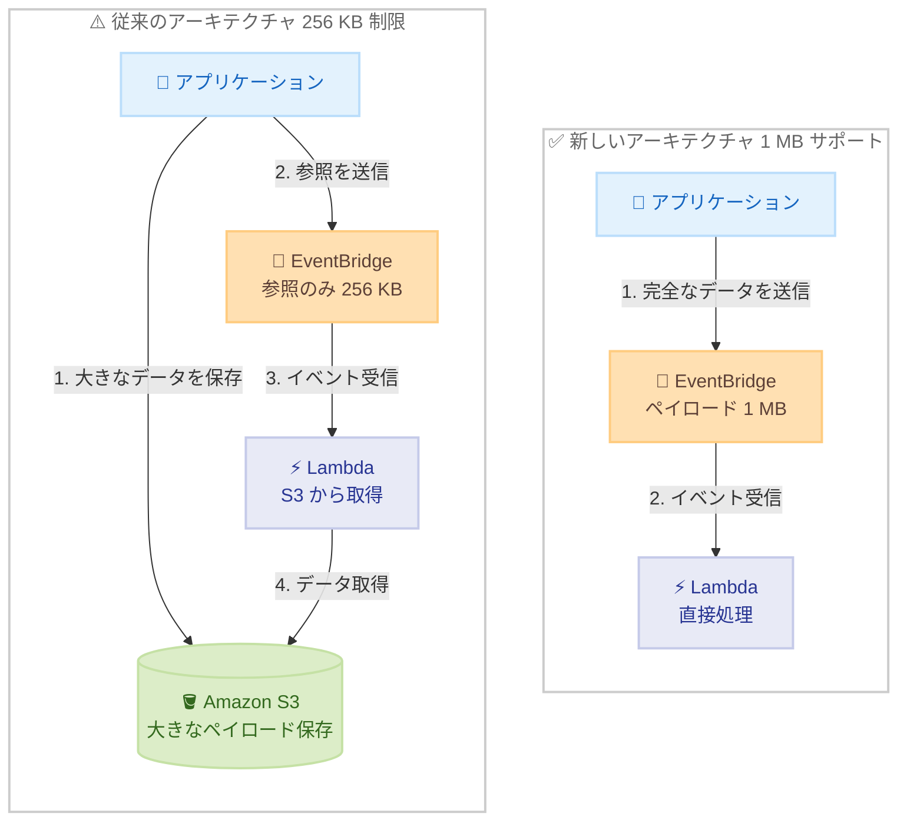

# Amazon EventBridge - イベントペイロードサイズ 1 MB サポート

**リリース日**: 2026 年 1 月 29 日
**サービス**: Amazon EventBridge
**機能**: イベントペイロードサイズの拡大 (256 KB → 1 MB)

## 概要

Amazon EventBridge は、イベントペイロードサイズの上限を 256 KB から 1 MB に拡大しました。この機能強化により、開発者はイベント駆動型ワークロードで、データの分割、圧縮、または外部ストレージへの保存を行うことなく、より豊富で複雑なペイロードを取り込むことができるようになりました。

Amazon EventBridge は、アプリケーション、サードパーティ SaaS アプリケーション、AWS サービス間でイベントをルーティングして、スケーラブルなイベント駆動型アプリケーションを作成できるサーバーレスイベントルーターです。これらのアプリケーションは、大規模言語モデル (LLM) プロンプト、テレメトリシグナル、機械学習出力の複雑な JSON 構造など、豊富なコンテキストデータを処理する必要があることがよくあります。新しい 1 MB ペイロードサポートにより、開発者は 1 つのイベントに包括的なデータを含めることができ、アーキテクチャを簡素化し、複雑なデータチャンキングや外部ストレージソリューションの必要性を減らすことができます。

**アップデート前の課題**

- 256 KB の制限により、大きなペイロードを扱う場合、データを分割する必要があった
- 大きなデータを扱う際に、圧縮処理を実装する必要があった
- ペイロードが大きい場合、Amazon S3 などの外部ストレージに保存し、イベントには参照のみを含める必要があった
- LLM プロンプトや複雑な JSON 構造を含むイベントを処理する際、アーキテクチャが複雑化していた

**アップデート後の改善**

- 1 MB までのペイロードを 1 つのイベントに含めることが可能になった
- データの分割、圧縮、外部ストレージへの保存が不要になり、アーキテクチャが簡素化された
- LLM プロンプト、テレメトリシグナル、機械学習出力などの豊富なコンテキストデータを 1 つのイベントで処理できるようになった
- イベント処理のレイテンシが改善された (外部ストレージへのアクセスが不要)

## アーキテクチャ図



従来は 256 KB の制限により外部ストレージを使用する必要がありましたが、1 MB サポートにより、完全なデータを 1 つのイベントに含めることができ、アーキテクチャが大幅に簡素化されます。

## サービスアップデートの詳細

### 主要機能

1. **ペイロードサイズの拡大**
   - イベントペイロードサイズが 256 KB から 1 MB に拡大
   - EventBridge Event Bus での 1 MB ペイロードサポート
   - PutEvents API の総リクエストサイズ制限も 1 MB に対応

2. **アーキテクチャの簡素化**
   - 1 つのイベントに包括的なデータを含めることが可能
   - データチャンキングロジックが不要
   - 外部ストレージソリューションの削減

3. **パフォーマンスの向上**
   - 外部ストレージへのアクセスが不要になることで、レイテンシが改善
   - イベント処理のシンプル化により、エラーハンドリングが容易に

## 技術仕様

### ペイロードサイズの計算

| 項目 | 詳細 |
|------|------|
| 最大ペイロードサイズ | 1 MB (1,048,576 バイト) |
| 計算対象フィールド | `Time`, `Source`, `DetailType`, `Detail`, `Resources` の UTF-8 エンコード形式 |
| 旧制限 | 256 KB (262,144 バイト) |
| 対応 API | PutEvents |

### PutEvents API の制限

```json
{
  "Entries": [
    {
      "Time": "2026-01-29T12:00:00Z",
      "Source": "my.application",
      "DetailType": "LLM Prompt",
      "Detail": "{...}", // 最大 1 MB
      "Resources": ["arn:aws:..."]
    }
  ]
}
```

PutEvents リクエストの総サイズ (すべてのエントリの合計) は 1 MB 未満である必要があります。

## 設定方法

### 前提条件

1. AWS アカウントと適切な IAM 権限 (`events:PutEvents`)
2. Amazon EventBridge が利用可能なリージョン (除外リージョンを参照)
3. イベントを処理するターゲット (Lambda、Step Functions など)

### 手順

#### ステップ 1: イベントの送信 (AWS CLI)

```bash
aws events put-events --entries '[
  {
    "Source": "my.application",
    "DetailType": "Large Payload Event",
    "Detail": "{\"prompt\": \"... up to 1 MB of data ...\"}"
  }
]'
```

このコマンドは、1 MB までのペイロードを含むイベントを EventBridge に送信します。

#### ステップ 2: イベントルールの作成

```bash
aws events put-rule \
  --name my-large-payload-rule \
  --event-pattern '{"source": ["my.application"], "detail-type": ["Large Payload Event"]}' \
  --state ENABLED
```

特定のソースとタイプのイベントをフィルタリングするルールを作成します。

#### ステップ 3: ターゲットの設定

```bash
aws events put-targets \
  --rule my-large-payload-rule \
  --targets "Id"="1","Arn"="arn:aws:lambda:us-east-1:123456789012:function:MyFunction"
```

イベントを処理する Lambda 関数などのターゲットを設定します。

## メリット

### ビジネス面

- **開発速度の向上**: データチャンキングや外部ストレージの実装が不要になり、開発が迅速化
- **運用コストの削減**: 外部ストレージ (S3) へのアクセスが減少し、リクエスト数とコストが削減
- **アーキテクチャの簡素化**: シンプルなアーキテクチャにより、保守性が向上し、長期的な運用コストが削減

### 技術面

- **レイテンシの改善**: 外部ストレージへのアクセスが不要になり、イベント処理が高速化
- **エラーハンドリングの簡素化**: データの分割・結合処理が不要になり、エラーポイントが削減
- **スケーラビリティの向上**: 1 つのイベントで処理が完結するため、並列処理が容易に

## デメリット・制約事項

### 制限事項

- 一部のリージョンでは利用不可: Asia Pacific (New Zealand)、Asia Pacific (Thailand)、Asia Pacific (Malaysia)、Asia Pacific (Taipei)、Mexico (Central)
- PutEvents API の総リクエストサイズは 1 MB 未満である必要がある
- 1 MB を超えるペイロードは引き続き S3 などの外部ストレージを使用する必要がある

### 考慮すべき点

- ペイロードサイズが大きくなると、ネットワーク転送時間が増加する可能性がある
- ターゲット (Lambda など) が大きなペイロードを処理できるか確認する必要がある
- 料金は変更されないが、大きなペイロードを頻繁に送信する場合は総コストを確認すること

## ユースケース

### ユースケース 1: LLM プロンプトとレスポンスの処理

**シナリオ**: 生成 AI アプリケーションで、ユーザープロンプトとモデルのレスポンスを含むイベントを処理する場合。

**実装例**:
```json
{
  "Source": "ai.application",
  "DetailType": "LLM Completion",
  "Detail": {
    "prompt": "大規模なプロンプトテキスト...",
    "response": "モデルからの詳細なレスポンス...",
    "metadata": {
      "model": "claude-3-5-sonnet",
      "tokens": 50000,
      "timestamp": "2026-01-29T12:00:00Z"
    }
  }
}
```

**効果**: プロンプトとレスポンスを 1 つのイベントに含めることで、S3 への保存と取得が不要になり、処理レイテンシが削減されます。

### ユースケース 2: テレメトリデータの集約

**シナリオ**: IoT デバイスから大量のテレメトリデータを収集し、リアルタイムで処理する場合。

**実装例**:
```json
{
  "Source": "iot.telemetry",
  "DetailType": "Sensor Data Batch",
  "Detail": {
    "deviceId": "sensor-12345",
    "readings": [
      { "timestamp": "2026-01-29T12:00:00Z", "temperature": 25.5, "humidity": 60 },
      // ... 数千件のレコード
    ]
  }
}
```

**効果**: 複数のセンサー読み取り値を 1 つのイベントにまとめることで、イベント数が削減され、処理効率が向上します。

### ユースケース 3: 機械学習モデルの推論結果

**シナリオ**: 機械学習モデルの推論結果を含む複雑な JSON 構造を処理する場合。

**実装例**:
```json
{
  "Source": "ml.inference",
  "DetailType": "Model Prediction",
  "Detail": {
    "modelId": "object-detection-v2",
    "inputImage": "s3://bucket/image.jpg",
    "predictions": [
      {
        "class": "person",
        "confidence": 0.98,
        "boundingBox": { "x": 100, "y": 200, "width": 50, "height": 100 },
        "features": [ /* 詳細な特徴ベクトル */ ]
      }
      // ... 多数の検出結果
    ]
  }
}
```

**効果**: 推論結果のすべてを 1 つのイベントに含めることで、結果の分割・結合が不要になり、下流処理が簡素化されます。

## 料金

EventBridge の料金は変更されません。引き続き、イベントの送信数に基づいて課金されます。

- カスタムイベント: $1.00 / 100 万イベント
- サードパーティイベント: $1.00 / 100 万イベント
- クロスリージョンイベント: $0.01 / GB (データ転送)

ペイロードサイズが大きくなっても、イベントあたりの料金は変わりません。ただし、クロスリージョンイベントの場合、データ転送料金が増加する可能性があります。

### 料金例

| シナリオ | 月間イベント数 | ペイロードサイズ | 月額料金 (概算) |
|---------|---------------|-----------------|------------------|
| 小規模アプリケーション | 100 万イベント | 平均 10 KB | $1.00 |
| 中規模アプリケーション | 1,000 万イベント | 平均 500 KB | $10.00 |
| 大規模アプリケーション | 1 億イベント | 平均 800 KB | $100.00 |

注: クロスリージョンのデータ転送料金は別途発生します。

## 利用可能リージョン

この機能は、Amazon EventBridge が提供されているすべての商用 AWS リージョンで利用可能です。ただし、以下のリージョンは除外されます。

- Asia Pacific (New Zealand)
- Asia Pacific (Thailand)
- Asia Pacific (Malaysia)
- Asia Pacific (Taipei)
- Mexico (Central)

詳細は [AWS Regional Services List](https://aws.amazon.com/about-aws/global-infrastructure/regional-product-services/) を参照してください。

## 関連サービス・機能

- **AWS Lambda**: EventBridge からの大きなペイロードを処理するコンピューティングサービス
- **Amazon S3**: 1 MB を超えるペイロードを保存するためのオブジェクトストレージ
- **AWS Step Functions**: 大きなペイロードを含む複雑なワークフローを調整するサービス
- **Amazon SQS**: EventBridge のターゲットとして、大きなメッセージを処理するキューサービス

## 参考リンク

- [公式発表 (What's New)](https://aws.amazon.com/about-aws/whats-new/2026/01/amazon-eventbridge-increases-event-payload-size-256-kb-1-mb/)
- [EventBridge ドキュメント](https://docs.aws.amazon.com/eventbridge/latest/userguide/eb-event-bus.html)
- [PutEvents API リファレンス](https://docs.aws.amazon.com/eventbridge/latest/userguide/eb-putevents.html)
- [料金ページ](https://aws.amazon.com/eventbridge/pricing/)

## まとめ

Amazon EventBridge のイベントペイロードサイズ拡大 (256 KB → 1 MB) により、開発者は LLM プロンプト、テレメトリデータ、機械学習出力などの豊富なコンテキストデータを 1 つのイベントで処理できるようになりました。この機能により、アーキテクチャが簡素化され、外部ストレージへのアクセスが不要になり、レイテンシが改善されます。イベント駆動型アプリケーションを構築している場合は、この新機能を活用してアーキテクチャを見直し、運用効率を向上させることをお勧めします。
