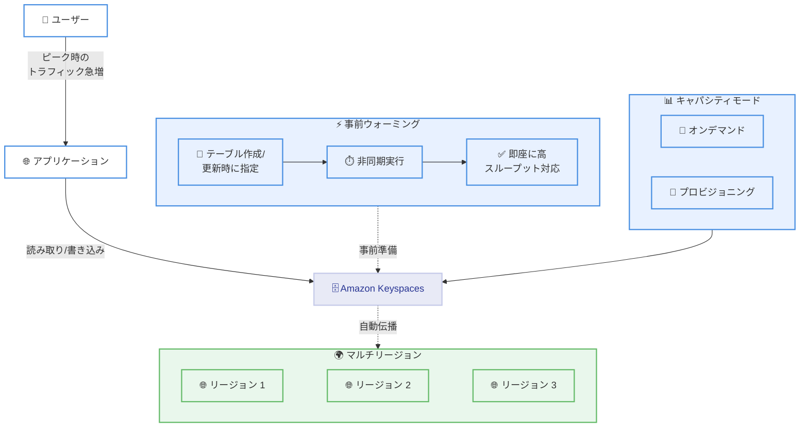

# Amazon Keyspaces - テーブル事前ウォーミング機能 WarmThroughput

**リリース日**: 2026年1月29日
**サービス**: Amazon Keyspaces (for Apache Cassandra)
**機能**: テーブル事前ウォーミング (Pre-warming with WarmThroughput)

## 概要

Amazon Keyspaces (for Apache Cassandra) が、テーブルの事前ウォーミング機能をサポート開始しました。この機能により、新規および既存のテーブルを将来のトラフィック需要に備えて事前に準備できます。プロビジョニングキャパシティモードとオンデマンドキャパシティモードの両方に対応し、マルチリージョンレプリケートされたテーブルでも利用可能です。

Amazon Keyspaces は自動的にワークロードの増加に応じてスケーリングしますが、アプリケーションのローンチ、マーケティングキャンペーン、季節的なイベントなど、通常のスケーリングパターンを超える突然のトラフィック急増が発生する可能性があります。事前ウォーミング機能を使用すると、テーブル作成時または更新時にピークスループット要件を手動で指定し、スケーリング遅延やエラー率の増加なしに、大規模なトラフィック急増に即座に対応できます。

事前ウォーミングプロセスは非破壊的で非同期に実行されるため、事前ウォーミング進行中でも他のテーブル変更を継続できます。この機能は、Amazon Keyspaces が提供されているすべての AWS Commercial および AWS GovCloud (US) リージョンで利用可能です。

**アップデート前の課題**

- アプリケーションのローンチやイベント時に突然のトラフィック急増が発生すると、自動スケーリングが追いつかず、スロットリングが発生していた
- オンデマンドテーブルでは、大規模なトラフィック急増時に組み込みの遅延が発生していた
- ピーク時のトラフィックに対応するために、事前にキャパシティを手動で調整する必要があった
- マルチリージョンテーブルでは、すべてのリージョンで個別に設定が必要だった

**アップデート後の改善**

- テーブル作成時または更新時にピークスループット要件を指定できる
- スケーリング遅延やエラー率の増加なしに、大規模なトラフィック急増に即座に対応可能
- 非破壊的で非同期に実行されるため、他のテーブル変更と並行して実行可能
- マルチリージョンテーブルでは、すべてのリージョンに自動的に設定が伝播
- プロビジョニングモードとオンデマンドモードの両方で利用可能

## アーキテクチャ図



事前ウォーミング機能により、テーブルは即座に高スループットに対応でき、マルチリージョンテーブルでは自動的にすべてのリージョンに設定が伝播されます。

## サービスアップデートの詳細

### 主要機能

1. **手動ウォームスループット設定**
   - テーブル作成時または更新時にウォームスループット値を手動で指定可能
   - 読み取りおよび書き込み操作の両方に対して設定可能
   - ウォームスループットは、テーブルが即座にサポートできる読み取りおよび書き込み操作の数を指す

2. **非破壊的な非同期実行**
   - 事前ウォーミングプロセスは非破壊的で非同期に実行される
   - 事前ウォーミング進行中でも他のテーブル変更を継続可能
   - 同時に複数の事前ウォーミングリクエストを送信可能

3. **マルチリージョン対応**
   - マルチリージョンテーブルのすべてのレプリカに自動的に適用
   - すべての AWS リージョンに設定が自動伝播
   - リージョンごとに個別設定する必要がない

4. **両キャパシティモード対応**
   - プロビジョニングキャパシティモード対応
   - オンデマンドキャパシティモード対応
   - どちらのモードでも事前ウォーミング可能

## 技術仕様

### 対応モードとリージョン

| 項目 | 詳細 |
|------|------|
| キャパシティモード | プロビジョニング、オンデマンド |
| テーブルタイプ | 新規テーブル、既存テーブル、マルチリージョンテーブル |
| 利用可能リージョン | すべての AWS Commercial および AWS GovCloud (US) リージョン |
| 実行モード | 非同期 (非破壊的) |

### ウォームスループットの設定

| 設定項目 | 説明 |
|---------|------|
| 読み取りキャパシティユニット (RCU) | 読み取り操作のウォームスループット値 |
| 書き込みキャパシティユニット (WCU) | 書き込み操作のウォームスループット値 |
| デフォルト値 | Amazon Keyspaces が使用状況に基づいて自動調整 |
| 手動設定 | ピーク時のトラフィックに備えて手動で増加可能 |

### 料金

- 事前ウォーミングは、指定した値とベースラインキャパシティの差分に基づいて一回限りの料金が発生
- 料金は、テーブルが配置されているリージョンのプロビジョニング WCU および RCU のコストに基づいて計算
- 一時的なトラフィック急増イベントの場合、プロビジョニングモードに切り替えるよりもコスト効率が良い場合がある

## 設定方法

### 前提条件

1. Amazon Keyspaces テーブルが作成済み、または新規作成予定
2. IAM 権限が適切に設定されていること
3. ピーク時のトラフィック要件を見積もっていること

### 手順

#### ステップ 1: ウォームスループット値の見積もり

```bash
# 想定されるピーク時のトラフィックを見積もる
# 例: 10,000 RCU、5,000 WCU
```

ピーク時のトラフィック要件を正確に見積もります。過大見積もりはコスト増加につながり、過小見積もりはスロットリングのリスクがあります。

#### ステップ 2: テーブル作成時に事前ウォーミングを設定

```bash
# AWS CLI を使用してテーブルを作成し、事前ウォーミングを設定
aws keyspaces create-table \
    --keyspace-name my_keyspace \
    --table-name my_table \
    --schema-definition "allColumns=[{name=id,type=text},{name=data,type=text}],partitionKeys=[{name=id}]" \
    --warm-throughput "readCapacityUnits=10000,writeCapacityUnits=5000"
```

テーブル作成時にウォームスループット値を指定します。

#### ステップ 3: 既存テーブルの事前ウォーミング更新

```bash
# 既存テーブルのウォームスループットを更新
aws keyspaces update-table \
    --keyspace-name my_keyspace \
    --table-name my_table \
    --warm-throughput "readCapacityUnits=10000,writeCapacityUnits=5000"
```

既存テーブルでもウォームスループット値を更新できます。

#### ステップ 4: CloudWatch でパフォーマンスを監視

```bash
# CloudWatch メトリクスを使用してテーブルパフォーマンスを監視
aws cloudwatch get-metric-statistics \
    --namespace AWS/Cassandra \
    --metric-name ConsumedReadCapacityUnits \
    --dimensions Name=Keyspace,Value=my_keyspace Name=TableName,Value=my_table \
    --start-time 2026-01-29T00:00:00Z \
    --end-time 2026-01-29T23:59:59Z \
    --period 300 \
    --statistics Sum
```

事前ウォーミング後、CloudWatch メトリクスを使用してテーブルパフォーマンスを監視します。

## メリット

### ビジネス面

- **ダウンタイムゼロ**: スケーリング遅延やエラー率の増加なしに、ピーク時のトラフィックに即座に対応
- **顧客体験の向上**: 重要な販売イベント中もスムーズな顧客体験を提供
- **運用リスクの軽減**: 突然のトラフィック急増に対する運用リスクを軽減

### 技術面

- **即座の高スループット対応**: テーブルが即座に高スループットをサポート
- **非破壊的な実行**: 事前ウォーミング進行中でも他のテーブル変更を継続可能
- **マルチリージョン自動伝播**: マルチリージョンテーブルではすべてのリージョンに自動的に設定が伝播
- **柔軟な設定**: プロビジョニングモードとオンデマンドモードの両方で利用可能

## デメリット・制約事項

### 制限事項

- 事前ウォーミングには一回限りの料金が発生する
- ウォームスループット値の見積もりが不正確な場合、コスト増加またはスロットリングのリスクがある
- 事前ウォーミング時間はテーブルサイズと設定値に依存する

### 考慮すべき点

- ピーク時のトラフィック要件を正確に見積もる必要がある
- テーブルスキーマを考慮する (大きな行はより多くのパーティションを必要とする可能性がある)
- デフォルトのクォータを超える場合、事前にクォータ引き上げをリクエストする必要がある
- 一時的なトラフィック急増イベントの場合、事前ウォーミングがプロビジョニングモードよりもコスト効率が良い場合がある

## ユースケース

### ユースケース 1: アプリケーションローンチ

**シナリオ**: 新しいモバイルアプリケーションをローンチし、初日から大量のユーザーアクセスが予想される

**実装例**:
```bash
# テーブル作成時に事前ウォーミングを設定
aws keyspaces create-table \
    --keyspace-name mobile_app \
    --table-name user_sessions \
    --schema-definition "allColumns=[{name=user_id,type=text},{name=session_data,type=text}],partitionKeys=[{name=user_id}]" \
    --warm-throughput "readCapacityUnits=50000,writeCapacityUnits=25000"
```

**効果**: アプリローンチ初日から大量のトラフィックに即座に対応でき、ユーザー体験の低下を防止

### ユースケース 2: マーケティングキャンペーン

**シナリオ**: ブラックフライデーなどの大規模セールイベントで、一時的に大量のトラフィック急増が予想される

**実装例**:
```bash
# イベント前に既存テーブルを事前ウォーミング
aws keyspaces update-table \
    --keyspace-name ecommerce \
    --table-name orders \
    --warm-throughput "readCapacityUnits=100000,writeCapacityUnits=50000"
```

**効果**: セールイベント中も注文処理がスムーズに行われ、売上機会を逃さない

### ユースケース 3: 季節的なトラフィック急増

**シナリオ**: 年末年始やホリデーシーズンに予測可能なトラフィック急増が発生する

**実装例**:
```bash
# 季節的なピーク前に事前ウォーミング
aws keyspaces update-table \
    --keyspace-name retail \
    --table-name inventory \
    --warm-throughput "readCapacityUnits=30000,writeCapacityUnits=15000"
```

**効果**: 季節的なピーク時もシステムの安定性を維持し、顧客満足度を向上

## 料金

事前ウォーミングは、指定した値とベースラインキャパシティの差分に基づいて一回限りの料金が発生します。

### 料金計算例

| 項目 | 値 |
|------|------|
| ベースライン RCU | 1,000 |
| ウォーム RCU | 10,000 |
| 差分 RCU | 9,000 |
| プロビジョニング RCU 料金 (例) | $0.00013/時間 |
| 一回限りの料金 (概算) | 9,000 × $0.00013 = $1.17 |

### 料金例

| 使用量 | 一回限りの料金 (概算) |
|--------|----------------------|
| 5,000 RCU + 2,500 WCU | $1-2 |
| 50,000 RCU + 25,000 WCU | $10-20 |

## 利用可能リージョン

すべての AWS Commercial および AWS GovCloud (US) リージョンで Amazon Keyspaces が提供されている場合に利用可能です。

## 関連サービス・機能

- **Amazon Keyspaces オンデマンドモード**: 使用量に応じて自動的にスケーリング
- **Amazon Keyspaces プロビジョニングモード**: 予測可能なトラフィックパターンに対応
- **Amazon CloudWatch**: テーブルパフォーマンスの監視
- **AWS Identity and Access Management (IAM)**: 事前ウォーミング操作の権限管理

## 参考リンク

- [公式発表 (What's New)](https://aws.amazon.com/about-aws/whats-new/2026/01/amazon-keyspaces-apache-cassandra-pre-warming-warmthroughput-tables/)
- [AWS Blog](https://aws.amazon.com/blogs/database/introducing-pre-warming-for-amazon-keyspaces-tables/)
- [ドキュメント](https://docs.aws.amazon.com/keyspaces/latest/devguide/warm-throughput.html)
- [Amazon Keyspaces 料金ページ](https://aws.amazon.com/keyspaces/pricing/)

## まとめ

Amazon Keyspaces のテーブル事前ウォーミング機能により、アプリケーションのローンチ、マーケティングキャンペーン、季節的なイベントなど、予測可能なトラフィック急増に対して事前に準備できるようになりました。非破壊的で非同期に実行されるため、運用への影響を最小限に抑えつつ、スケーリング遅延やエラー率の増加なしに大規模なトラフィック急増に即座に対応できます。マルチリージョンテーブルでは自動的にすべてのリージョンに設定が伝播されるため、グローバルなアプリケーションでも一貫したパフォーマンスを提供できます。
