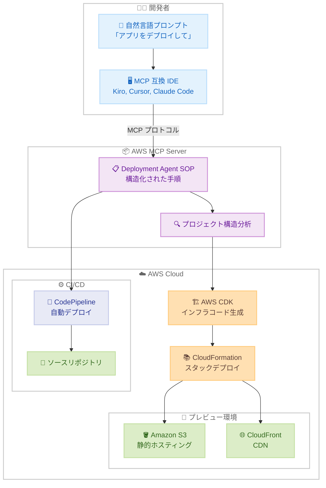

# AWS MCP Server - Deployment Agent SOPs (プレビュー)

**リリース日**: 2026 年 1 月 29 日
**サービス**: AWS MCP Server
**機能**: Deployment Standard Operating Procedures (SOPs)

## 概要

AWS は、AWS MCP Server にデプロイメント Standard Operating Procedures (SOPs) を導入しました (プレビュー)。SOP は、AI エージェントが複雑な複数ステップのタスクを一貫性のある信頼性の高い効率的な動作で実行できるよう導く、構造化された自然言語の指示です。この自動化された手順により、顧客は Kiro、Kiro CLI、Cursor、Claude Code などの MCP 互換 IDE または CLI から自然言語プロンプトを使用して、Web アプリケーションを AWS アカウントにデプロイできます。

デプロイメントは、AWS CDK インフラストラクチャの生成、CloudFormation スタックのデプロイ、推奨される AWS セキュリティのベストプラクティスを備えた CI/CD パイプラインの作成によって機能します。従来、開発者は DevOps のベストプラクティスを適用して、vibe-coded アプリケーションを本番環境に移行することに苦労していました。現在、開発者はわずか 1 つのプロンプトでプロトタイプから本番環境に迅速に移行できます。

**アップデート前の課題**

- AI で生成したアプリケーションを DevOps ベストプラクティスと共に本番環境にデプロイすることが困難だった
- インフラストラクチャのコード化、CI/CD パイプラインの設定に専門知識が必要だった
- プロトタイプから本番環境への移行に時間がかかっていた

**アップデート後の改善**

- 自然言語プロンプトでアプリケーションをデプロイ可能になった
- CDK インフラストラクチャ、CloudFormation スタック、CI/CD パイプラインが自動生成される
- プロトタイプから本番環境へ 1 つのプロンプトで移行できるようになった
- デプロイメントドキュメントが自動作成され、エージェントがセッション間で作業を再開可能

## アーキテクチャ図



AI エージェントは SOP に従って、プロジェクト構造を分析し、CDK インフラストラクチャを生成し、プレビュー環境をデプロイし、CI/CD パイプラインを設定します。

## サービスアップデートの詳細

### 主要機能

1. **自然言語によるデプロイメント**
   - MCP 互換 IDE (Kiro、Cursor、Claude Code) から自然言語プロンプトでデプロイ
   - AI エージェントが SOP に従って複数ステップのタスクを実行
   - 専門知識不要で DevOps ベストプラクティスを適用

2. **自動インフラストラクチャ生成**
   - AWS CDK を使用したインフラストラクチャコードの自動生成
   - CloudFormation スタックの自動デプロイ
   - AWS セキュリティベストプラクティスの適用

3. **プレビュー環境とCI/CD**
   - Amazon S3 と CloudFront でホストされるプレビュー環境の自動作成
   - AWS CodePipeline を使用した自動本番デプロイメントの設定
   - ソースリポジトリからの CI/CD 自動設定

4. **ドキュメント自動生成**
   - デプロイメントドキュメントがリポジトリに自動作成
   - エージェントが将来のデプロイメントを処理
   - ログのクエリとトラブルシューティングが容易
   - セッション間での作業再開が可能

### サポートフレームワーク

- React
- Vue.js
- Angular
- Next.js

## 技術仕様

### Agent SOPs の実行フロー

| ステップ | 説明 |
|---------|------|
| 1. プロジェクト構造分析 | AI エージェントがプロジェクトの構造とフレームワークを分析 |
| 2. CDK インフラ生成 | AWS CDK を使用してインフラストラクチャコードを生成 |
| 3. プレビュー環境デプロイ | S3 と CloudFront にプレビュー環境をデプロイ |
| 4. CI/CD パイプライン設定 | CodePipeline を設定し、自動デプロイメントを有効化 |
| 5. ドキュメント作成 | デプロイメントドキュメントをリポジトリに作成 |

### 必要な権限

```json
{
  "Version": "2012-10-17",
  "Statement": [
    {
      "Effect": "Allow",
      "Action": [
        "s3:*",
        "cloudfront:*",
        "cloudformation:*",
        "codepipeline:*",
        "iam:*"
      ],
      "Resource": "*"
    }
  ]
}
```

## 設定方法

### 前提条件

1. AWS アカウントと適切な IAM 権限
2. MCP 互換 IDE (Kiro、Cursor、Claude Code) のインストール
3. AWS MCP Server の設定
4. ソースリポジトリ (GitHub、GitLab など) のアクセス権限

### 手順

#### ステップ 1: AWS MCP Server の設定

AWS MCP Server を MCP 互換 IDE に設定します。詳細は [AWS MCP Server ドキュメント](https://docs.aws.amazon.com/aws-mcp/latest/userguide/what-is-mcp-server.html) を参照してください。

#### ステップ 2: プロジェクトのデプロイ

MCP 互換 IDE で自然言語プロンプトを使用してデプロイメントを開始します。

```
「この React アプリケーションを AWS にデプロイして、プレビュー環境と本番 CI/CD パイプラインを設定してください」
```

AI エージェントが Agent SOP に従って、以下を自動実行します。

1. プロジェクト構造の分析
2. CDK インフラストラクチャの生成
3. CloudFormation スタックのデプロイ
4. S3 と CloudFront へのプレビュー環境デプロイ
5. CodePipeline の設定

#### ステップ 3: デプロイメントの確認

プレビュー環境の URL が提供され、アプリケーションにアクセスできます。CI/CD パイプラインはソースリポジトリへのコミットで自動的にトリガーされます。

## メリット

### ビジネス面

- **開発速度の向上**: プロトタイプから本番環境へ 1 つのプロンプトで移行
- **運用コストの削減**: DevOps の専門知識不要でベストプラクティスを適用
- **品質の向上**: AWS のセキュリティベストプラクティスが自動適用

### 技術面

- **自動化**: インフラストラクチャコード、デプロイメント、CI/CD が自動生成
- **再現性**: SOP により一貫した信頼性の高いデプロイメントを実現
- **保守性**: ドキュメント自動生成により、保守が容易

## デメリット・制約事項

### 制限事項

- プレビュー段階のため、本番環境での使用は推奨されない
- US East (N. Virginia) リージョンのみ利用可能
- サポートされるフレームワークは React、Vue.js、Angular、Next.js のみ

### 考慮すべき点

- 生成されたインフラストラクチャコードの内容を確認し、要件に合致するか検証する必要がある
- セキュリティ設定を本番環境の要件に合わせて調整する必要がある
- AI エージェントの動作を理解し、適切に監視する必要がある

## ユースケース

### ユースケース 1: プロトタイプの迅速なデプロイ

**シナリオ**: React で開発したプロトタイプを迅速に AWS にデプロイし、ステークホルダーに共有する。

**実装例**:
```
「この React アプリをデプロイして、プレビュー URL を生成してください」
```

**効果**: 専門知識不要で、数分でプレビュー環境が作成され、ステークホルダーと共有できます。

### ユースケース 2: CI/CD パイプラインの自動設定

**シナリオ**: Vue.js アプリケーションに本番環境の CI/CD パイプラインを設定する。

**実装例**:
```
「この Vue.js アプリに GitHub からの自動デプロイメントパイプラインを設定してください」
```

**効果**: CodePipeline が自動設定され、GitHub へのコミットで本番環境が自動更新されます。

### ユースケース 3: トラブルシューティングとログ確認

**シナリオ**: デプロイされたアプリケーションのログを確認し、問題をトラブルシューティングする。

**実装例**:
```
「デプロイメントログを確認して、エラーがあれば教えてください」
```

**効果**: AI エージェントがログをクエリし、問題を特定してレポートします。

## 料金

AWS MCP Server の Agent SOP 自体に追加料金はかかりません。作成した AWS リソースと該当するデータ転送コストに対してのみ料金が発生します。

- **S3 ストレージ**: $0.023 / GB / 月
- **CloudFront**: $0.085 / GB (最初の 10 TB)
- **CodePipeline**: $1.00 / アクティブパイプライン / 月
- **CloudFormation**: 無料 (リソース作成に対する料金のみ)

### 料金例

| シナリオ | 月間コスト (概算) |
|---------|------------------|
| 小規模 Web アプリ (S3 + CloudFront) | $5-10 |
| 中規模 Web アプリ (S3 + CloudFront + CodePipeline) | $10-30 |
| 大規模 Web アプリ (複数環境 + CI/CD) | $30-100 |

## 利用可能リージョン

Agent SOP は現在、プレビューとして **US East (N. Virginia)** リージョンのみで利用可能です。

## 関連サービス・機能

- **AWS CDK**: インフラストラクチャをコードとして定義するフレームワーク
- **AWS CloudFormation**: インフラストラクチャのプロビジョニングと管理
- **Amazon S3**: 静的 Web サイトホスティング
- **Amazon CloudFront**: コンテンツ配信ネットワーク (CDN)
- **AWS CodePipeline**: 継続的デリバリーサービス

## 参考リンク

- [公式発表 (What's New)](https://aws.amazon.com/about-aws/whats-new/2025/01/aws-announces-deployment-agent-sops-in-aws-mcp-server-preview/)
- [AWS MCP Server ドキュメント](https://docs.aws.amazon.com/aws-mcp/latest/userguide/what-is-mcp-server.html)
- [Deployment Agent SOPs ドキュメント](https://docs.aws.amazon.com/aws-mcp/latest/userguide/agent-sops-deployment.html)

## まとめ

AWS MCP Server の Deployment Agent SOPs により、開発者は自然言語プロンプトでわずか数分でプロトタイプから本番環境に移行できるようになりました。AI エージェントが CDK インフラストラクチャの生成、CloudFormation デプロイメント、CI/CD パイプラインの設定を自動実行し、DevOps のベストプラクティスを適用します。プレビュー段階ですが、迅速なプロトタイピングと MVP 開発に非常に有用です。MCP 互換 IDE を使用している場合は、ぜひこの新機能を試してみることをお勧めします。
