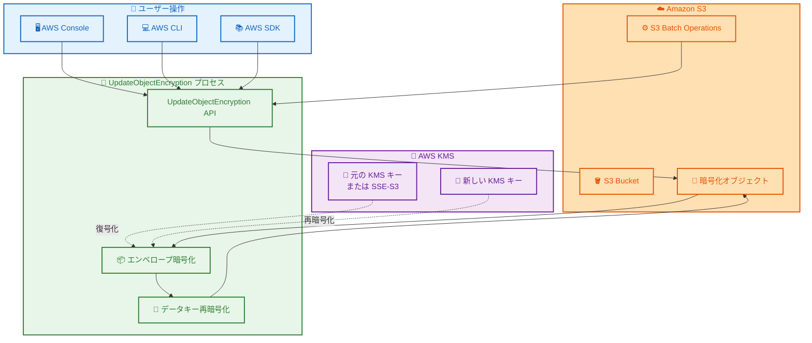

# Amazon S3 - UpdateObjectEncryption API

**リリース日**: 2026 年 01 月 29 日
**サービス**: Amazon S3
**機能**: UpdateObjectEncryption API

## 概要

Amazon S3 が、暗号化されたオブジェクトのサーバー側暗号化タイプをデータ移動なしで変更できる新しい `UpdateObjectEncryption` API を提供開始しました。この API を使用することで、オブジェクトのサイズやストレージクラスに関係なく、暗号化キーをアトミックに変更できます。S3 Batch Operations と組み合わせることで、バケット全体のオブジェクトに対して大規模に暗号化タイプを標準化でき、オブジェクトのプロパティと S3 Lifecycle の適格性を保持したまま処理できます。

多くの業界でデータセキュリティとプライバシーに関する監査およびコンプライアンス要件が厳しくなっており、保存データに対してより厳格な暗号化標準が求められています。これらのコンプライアンスフレームワークの一般的な要件として、キー管理サービスを使用したデータの暗号化が挙げられます。UpdateObjectEncryption により、既存の暗号化オブジェクトの暗号化タイプを、Amazon S3 マネージドサーバー側暗号化 (SSE-S3) から AWS KMS キーによるサーバー側暗号化 (SSE-KMS) に変更できるようになりました。

この API は全ての AWS リージョンで利用可能で、AWS マネジメントコンソールまたは最新の AWS SDK を使用して利用できます。

**アップデート前の課題**

- 既存の暗号化オブジェクトの暗号化タイプを変更するには、オブジェクトをコピーする必要があった
- S3 Glacier Flexible Retrieval や S3 Glacier Deep Archive にアーカイブされたオブジェクトの暗号化を変更するには、オブジェクトを復元する必要があった
- オブジェクトのコピー時に、オブジェクトのプロパティ (作成日、最終更新日、ETag など) が変更される可能性があった
- 大規模なバケットでの暗号化タイプの変更には、大量のデータ転送コストと時間がかかった
- カスタムキーローテーション標準に準拠するために、既存オブジェクトのキーを変更する方法が限られていた

**アップデート後の改善**

- データ移動なしで、既存の暗号化オブジェクトの暗号化タイプをアトミックに変更可能
- S3 Glacier Flexible Retrieval や S3 Glacier Deep Archive のオブジェクトを復元することなく、暗号化タイプを変更可能
- オブジェクトのメタデータプロパティ (ストレージクラス、作成日、最終更新日、ETag、チェックサムプロパティ) を保持したまま暗号化タイプを変更可能
- S3 Batch Operations を使用して、バケット全体のオブジェクトに対して大規模に暗号化タイプを標準化可能
- オブジェクトサイズやストレージクラスに関係なく、通常ミリ秒単位で処理が完了
- S3 Bucket Keys を有効にして KMS リクエストを削減し、コストを最適化可能

## アーキテクチャ図



この図は UpdateObjectEncryption API の動作フローを示しています。ユーザーは AWS Console、CLI、または SDK を通じて API を呼び出し、S3 はエンベロープ暗号化を使用してデータキーを再暗号化します。この処理はデータ移動なしで完了します。

## サービスアップデートの詳細

### 主要機能

1. **データ移動なしの暗号化タイプ変更**
   - エンベロープ暗号化を使用してデータキーを再暗号化
   - オブジェクトデータのコピーや移動は不要
   - S3 Glacier Flexible Retrieval や S3 Glacier Deep Archive のオブジェクトも復元不要
   - オブジェクトサイズやストレージクラスに関係なく処理可能

2. **オブジェクトプロパティの保持**
   - ストレージクラスの保持
   - 作成日と最終更新日の保持
   - ETag とチェックサムプロパティの保持
   - S3 Lifecycle の適格性の保持
   - S3 Intelligent-Tiering のアクセスとしてカウントされない

3. **S3 Batch Operations との統合**
   - 単一リクエストで複数オブジェクトの暗号化タイプを変更
   - プレフィックス、ストレージクラス、作成日、暗号化タイプなどのメタデータに基づいてオブジェクトリストを生成
   - 進捗追跡、通知、詳細な完了レポートを提供
   - 数十億のオブジェクトとペタバイト規模のデータに対応

4. **柔軟な暗号化オプション**
   - SSE-S3 から SSE-KMS への変更
   - 異なるカスタマーマネージド KMS キーへの変更
   - S3 Bucket Keys の有効化による KMS リクエスト削減

## 技術仕様

### サポートされる暗号化タイプの変更

| 元の暗号化タイプ | 変更可能な暗号化タイプ | サポート状況 |
|-----------------|----------------------|------------|
| SSE-S3 | SSE-KMS | ✅ サポート |
| SSE-KMS | SSE-KMS (異なる KMS キー) | ✅ サポート |
| SSE-KMS (Bucket Key なし) | SSE-KMS (Bucket Key あり) | ✅ サポート |
| 暗号化なし | SSE-KMS | ❌ 非サポート |
| SSE-C | SSE-KMS | ❌ 非サポート |
| DSSE-KMS | SSE-KMS | ❌ 非サポート |
| SSE-S3/SSE-KMS | SSE-S3 | ❌ 非サポート |

### サポートされるストレージクラス

UpdateObjectEncryption API は、汎用バケットでサポートされる全ての S3 ストレージクラスをサポートします。

- S3 Standard
- S3 Intelligent-Tiering
- S3 Standard-IA
- S3 One Zone-IA
- S3 Glacier Instant Retrieval
- S3 Glacier Flexible Retrieval
- S3 Glacier Deep Archive

### 必要な IAM 権限

```json
{
    "Version": "2012-10-17",
    "Statement": [{
        "Sid": "AllowUpdateObjectEncryption",
        "Effect": "Allow",
        "Action": [
            "s3:PutObject",
            "s3:UpdateObjectEncryption",
            "kms:Encrypt",
            "kms:Decrypt",
            "kms:GenerateDataKey",
            "kms:ReEncrypt*",
            "organizations:DescribeAccount"
        ],
        "Resource": [
            "arn:aws:s3:::example-bucket",
            "arn:aws:s3:::example-bucket/*",
            "arn:aws:kms:us-east-1:111122223333:key/01234567-89ab-cdef-0123-456789abcdef"
        ]
    }]
}
```

## 設定方法

### 前提条件

1. AWS CLI がインストールされ、設定されていること
2. 必要な IAM 権限が付与されていること
3. 変更対象のオブジェクトが SSE-S3 または SSE-KMS で暗号化されていること
4. SSE-KMS に変更する場合、KMS キーの完全な ARN を準備すること (エイリアス名やエイリアス ARN は使用不可)

### 手順

#### ステップ 1: 単一オブジェクトの暗号化タイプを変更

```bash
aws s3api update-object-encryption \
    --bucket example-bucket \
    --key example-object.txt \
    --server-side-encryption aws:kms \
    --ssekms-key-id arn:aws:kms:us-east-1:111122223333:key/01234567-89ab-cdef-0123-456789abcdef
```

このコマンドは、指定されたオブジェクトの暗号化タイプを SSE-KMS に変更します。`--ssekms-key-id` には KMS キーの完全な ARN を指定する必要があります。

#### ステップ 2: S3 Bucket Keys を有効にして暗号化タイプを変更

```bash
aws s3api update-object-encryption \
    --bucket example-bucket \
    --key example-object.txt \
    --server-side-encryption aws:kms \
    --ssekms-key-id arn:aws:kms:us-east-1:111122223333:key/01234567-89ab-cdef-0123-456789abcdef \
    --bucket-key-enabled
```

このコマンドは、暗号化タイプを変更しながら S3 Bucket Keys を有効にします。これにより KMS リクエストが削減され、コストを最適化できます。

#### ステップ 3: バージョン管理されたオブジェクトの特定バージョンを変更

```bash
aws s3api update-object-encryption \
    --bucket example-bucket \
    --key example-object.txt \
    --version-id versionId123 \
    --server-side-encryption aws:kms \
    --ssekms-key-id arn:aws:kms:us-east-1:111122223333:key/01234567-89ab-cdef-0123-456789abcdef
```

このコマンドは、S3 バージョニングが有効なバケット内の特定バージョンのオブジェクトの暗号化タイプを変更します。バージョン ID を指定しない場合は、現在のバージョンが対象になります。

#### ステップ 4: S3 Batch Operations を使用した大規模変更

S3 Batch Operations を使用してバケット全体のオブジェクトに対して暗号化タイプを変更する場合は、AWS マネジメントコンソールから以下の手順で実行します。

1. S3 コンソールで「Batch Operations」を選択
2. 「Create job」をクリック
3. 操作タイプとして「Update object encryption」を選択
4. 対象オブジェクトのリストを指定 (S3 インベントリレポートまたはカスタムリスト)
5. 新しい暗号化設定 (SSE-KMS と KMS キー ARN) を指定
6. IAM ロールを指定してジョブを作成

## メリット

### ビジネス面

- **コンプライアンス要件への対応**: 既存データを KMS キーで暗号化することで、厳格なデータセキュリティ要件を満たせる
- **運用コストの削減**: データ移動が不要なため、データ転送コストと時間を大幅に削減
- **ダウンタイムなし**: オブジェクトのプロパティを保持したまま暗号化タイプを変更できるため、アプリケーションへの影響を最小化
- **監査証跡の維持**: CloudTrail データイベントと S3 サーバーアクセスログに記録されるため、完全な監査証跡を維持

### 技術面

- **高速処理**: オブジェクトサイズに関係なく、通常ミリ秒単位で処理が完了
- **大規模処理対応**: S3 Batch Operations を使用して数十億のオブジェクトを処理可能
- **アトミック操作**: エンベロープ暗号化により、データキーの再暗号化がアトミックに実行される
- **柔軟なキー管理**: カスタムキーローテーション標準に準拠するために、使用する KMS キーを柔軟に変更可能
- **コスト最適化**: S3 Bucket Keys を有効にすることで KMS リクエストを削減し、KMS コストを最適化

## デメリット・制約事項

### 制限事項

- 暗号化されていないオブジェクトには使用できない
- SSE-C (カスタマー提供キーによる暗号化) で暗号化されたオブジェクトには使用できない
- DSSE-KMS (AWS KMS キーによる二重層サーバー側暗号化) で暗号化されたオブジェクトには使用できない
- SSE-S3 を新しい暗号化タイプとして指定できない (SSE-KMS への変更のみサポート)
- S3 Object Lock の保持モードまたは法的保持が適用されたオブジェクトには使用できない (ガバナンスモードの保持または法的保持は削除後に使用可能、コンプライアンスモードの保持が適用されたオブジェクトには使用不可)
- デフォルトでは、バケット所有者の AWS アカウントが所有する KMS キーのみ使用可能 (AWS Organizations を使用している場合は、AWS サポートに連絡して他のメンバーアカウントが所有する KMS キーの使用を有効化可能)
- KMS キーの完全な ARN を指定する必要がある (エイリアス名やエイリアス ARN は使用不可)

### 考慮すべき点

- ライブレプリケーションが有効なソースバケットでは、レプリカイベントは開始されない (ソースと宛先の両方のバケットで個別に UpdateObjectEncryption リクエストを実行する必要がある)
- S3 Batch Replication を使用してクロスリージョンでデータセットをレプリケートし、オブジェクトの暗号化タイプを SSE-S3 から SSE-KMS に変更した場合、追加の権限が必要になる場合がある
- UpdateObjectEncryption リクエストは、PUT、COPY、POST、LIST リクエストと同じ料金で課金される (1,000 リクエストあたり)
- 基になるオブジェクトのストレージクラスに関係なく、常に S3 Standard ストレージクラスリクエストとして課金される

## ユースケース

### ユースケース 1: コンプライアンス要件対応のための既存データの暗号化タイプ変更

**シナリオ**: 医療機関が新しいコンプライアンス要件に対応するため、既存の患者データを SSE-S3 から SSE-KMS に変更する必要がある。データは S3 Glacier Deep Archive に保存されており、ペタバイト規模のデータ量がある。

**実装例**:
```bash
# S3 Batch Operations ジョブの作成 (AWS CLI)
aws s3control create-job \
    --account-id 123456789012 \
    --operation '{
        "S3UpdateObjectEncryption": {
            "ServerSideEncryption": "aws:kms",
            "SSEKMSKeyId": "arn:aws:kms:us-east-1:123456789012:key/patient-data-key",
            "BucketKeyEnabled": true
        }
    }' \
    --manifest '{
        "Spec": {
            "Format": "S3InventoryReport_CSV_20211130"
        },
        "Location": {
            "ObjectArn": "arn:aws:s3:::inventory-bucket/inventory-manifest.json",
            "ETag": "example-etag"
        }
    }' \
    --report '{
        "Bucket": "arn:aws:s3:::report-bucket",
        "Format": "Report_CSV_20211130",
        "Enabled": true,
        "Prefix": "batch-operations-reports",
        "ReportScope": "AllTasks"
    }' \
    --priority 10 \
    --role-arn arn:aws:iam::123456789012:role/BatchOperationsRole \
    --region us-east-1
```

**効果**: データ移動やアーカイブからの復元なしで、ペタバイト規模のデータの暗号化タイプを変更でき、コンプライアンス要件を満たすことができる。データ転送コストと時間を大幅に削減。

### ユースケース 2: カスタムキーローテーション標準への準拠

**シナリオ**: 金融機関が年次のキーローテーションポリシーに準拠するため、既存の暗号化オブジェクトで使用している KMS キーを新しいキーに変更する必要がある。

**実装例**:
```bash
# 既存オブジェクトのリストを取得し、新しい KMS キーに変更
aws s3api list-objects-v2 \
    --bucket financial-data-bucket \
    --query "Contents[].Key" \
    --output text | \
while read key; do
    aws s3api update-object-encryption \
        --bucket financial-data-bucket \
        --key "$key" \
        --server-side-encryption aws:kms \
        --ssekms-key-id arn:aws:kms:us-east-1:123456789012:key/new-rotation-key-2026
done
```

**効果**: オブジェクトのプロパティとアクセスパターンを保持したまま、既存の全てのオブジェクトの暗号化キーを新しいキーに変更でき、カスタムキーローテーション標準に準拠できる。

### ユースケース 3: KMS コストの最適化

**シナリオ**: 大規模な機械学習データセットを保存している企業が、S3 Bucket Keys を有効にして KMS リクエストを削減し、KMS コストを最適化したい。

**実装例**:
```bash
# 既存の SSE-KMS オブジェクトに S3 Bucket Keys を有効化
aws s3api update-object-encryption \
    --bucket ml-dataset-bucket \
    --key training-data/dataset-001.parquet \
    --server-side-encryption aws:kms \
    --ssekms-key-id arn:aws:kms:us-west-2:123456789012:key/ml-data-key \
    --bucket-key-enabled

# S3 Batch Operations を使用してバケット全体に適用
# (上記のユースケース 1 の実装例を参照)
```

**効果**: S3 Bucket Keys を有効にすることで、AWS KMS へのリクエストトラフィックを削減し、KMS コストを最大 99% 削減できる。

## 料金

UpdateObjectEncryption API は、PUT、COPY、POST、LIST リクエストと同じ料金で課金されます。

### 料金体系

- **API リクエスト**: 1,000 リクエストあたりの料金 (S3 Standard ストレージクラスリクエストとして課金)
- **KMS リクエスト**: UpdateObjectEncryption 操作中の KMS API 呼び出しに対して KMS 料金が適用
- **S3 Batch Operations**: S3 Batch Operations を使用する場合、ジョブあたりの料金とオブジェクトあたりの料金が適用

### 料金例

| 使用量 | 月額料金 (米国東部) |
|--------|------------------|
| 1,000,000 オブジェクトの暗号化タイプ変更 | $5.00 (API リクエスト料金) + KMS 料金 |
| S3 Batch Operations で 10,000,000 オブジェクト | $25.00 (API リクエスト料金) + KMS 料金 + Batch Operations 料金 |

詳細な料金情報については、[Amazon S3 料金ページ](https://aws.amazon.com/s3/pricing/)と [AWS KMS 料金ページ](https://aws.amazon.com/kms/pricing/)を参照してください。

## 利用可能リージョン

UpdateObjectEncryption API は、全ての AWS リージョンで利用可能です。

## 関連サービス・機能

- **AWS KMS**: SSE-KMS 暗号化で使用する暗号化キーを管理
- **S3 Batch Operations**: バケット全体のオブジェクトに対して大規模に暗号化タイプを変更
- **S3 Bucket Keys**: KMS リクエストを削減してコストを最適化
- **S3 Versioning**: バージョン管理されたオブジェクトの特定バージョンの暗号化タイプを変更
- **AWS CloudTrail**: UpdateObjectEncryption API の呼び出しをデータイベントとして記録
- **S3 Server Access Logs**: UpdateObjectEncryption API の呼び出しをオブジェクトレベルのログとして記録

## 参考リンク

- [公式発表 (What's New)](https://aws.amazon.com/about-aws/whats-new/2026/01/change-the-server-side-encryption-type-of-s3-objects/)
- [ドキュメント](https://docs.aws.amazon.com/AmazonS3/latest/userguide/update-sse-encryption.html)
- [Amazon S3 料金ページ](https://aws.amazon.com/s3/pricing/)
- [AWS KMS 料金ページ](https://aws.amazon.com/kms/pricing/)

## まとめ

UpdateObjectEncryption API は、既存の暗号化オブジェクトの暗号化タイプをデータ移動なしで変更できる画期的な機能です。コンプライアンス要件への対応、カスタムキーローテーション標準への準拠、KMS コストの最適化など、様々なユースケースで活用できます。S3 Batch Operations と組み合わせることで、ペタバイト規模のデータに対しても効率的に暗号化タイプを変更できます。既存の暗号化オブジェクトの暗号化タイプを変更する必要がある場合は、この新しい API の利用を検討してください。
