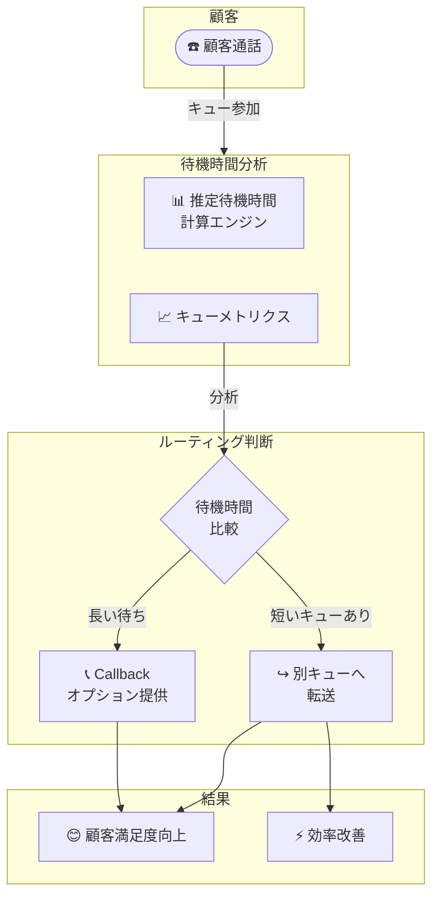

# Amazon Connect - 改善された推定待機時間機能

**リリース日**: 2026 年 1 月 30 日
**サービス**: Amazon Connect
**機能**: Improved Estimated Wait Time Metrics

📊 [このアップデートのインフォグラフィックを見る](https://takech9203.github.io/awsnews-summary/20260130-amazon-connect-launches-improved-wait-time.html)

## 概要

Amazon Connect が、キューと待機中のコンタクトの推定待機時間メトリクスを改善しました。この新機能により、コンタクトセンターは顧客に対してより正確な待機時間を伝え、コールバックなどの便利なオプションを提供できるようになり、顧客満足度の向上と効率的なリソース管理が実現されます。

改善された推定待機時間メトリクスは、複数キュー間のルーティング判断を支援し、リソースプランニングの可視性を向上させます。

**アップデート前の課題**

- 待機時間推定が不正確で、顧客に誤った情報を提供していた
- ピーク時間中の待機時間を正確に予測できなかった
- キュー間のトレードオフ判断 (15 分待ちの別チームへ転送) が困難だった
- リソース計画の根拠となる待機時間データが不足していた

**アップデート後の改善**

- より正確な推定待機時間で顧客期待値を適切に設定
- コールバックなどの選択肢を適切に提供可能に
- 複数キュー間での戦略的なルーティング判断が可能
- リソースプランニング用の信頼できるメトリクスが利用可能

## アーキテクチャ図



改善された推定待機時間メトリクスに基づいて、ルーティング判断がインテリジェントに実行されます。

## サービスアップデートの詳細

### 主要機能

1. **改善された推定待機時間メトリクス**
   - より正確な計算アルゴリズム
   - キュー深さ、エージェント効率を考慮した推定

2. **マルチキュー対応ルーティング**
   - 複数キュー間で推定待機時間を比較
   - 最適なキューへの転送を自動実行

3. **ルーティング基準との統合**
   - ルーティング基準でカスタム待機時間ロジックを設定可能
   - エージェント能力設定との組み合わせ

4. **ビジネスコンディション対応**
   - ピーク時間、オフピーク時の対応
   - 特殊なビジネスシナリオへの対応

## 技術仕様

| 項目 | 詳細 |
|------|------|
| メトリクスタイプ | 推定待機時間 (Estimated Wait Time - EWT) |
| 計算対象 | キュー深さ、エージェント効率、スキルレベル |
| 利用リージョン | Amazon Connect 提供全リージョン |
| ルーティング統合 | ルーティング基準、エージェント能力設定に統合 |
| データ精度 | リアルタイム更新 |

## 設定方法

### 前提条件

1. Amazon Connect インスタンスが構築済み
2. キュー、ルーティングプロファイルが設定済み
3. エージェント能力設定が完成

### 手順

#### ステップ 1: ルーティング基準での待機時間ルール設定

AWS Management Console から Amazon Connect の「Routing」セクションでルーティング基準を設定します。

```json
{
    "Name": "Intelligent Routing Based on Wait Time",
    "Condition": {
        "Type": "CompareEstimatedWaitTime",
        "Queue1": "Billing Support",
        "Queue2": "Cross-trained Team",
        "Threshold": 15,
        "Unit": "Minutes",
        "Action": "RouteToBestQueue"
    }
}
```

待機時間に基づくルーティングルールを定義します。

#### ステップ 2: エージェント能力との組み合わせ

ルーティング基準でエージェント能力設定と組み合わせて、最適なエージェントのいるキューへ転送します。

```json
{
    "RoutingCriteria": [
        {
            "Priority": 1,
            "Criteria": {
                "WaitTime": "LessThan2Minutes",
                "Skills": ["BillingSupport", "MultiLingual"]
            },
            "Destination": "Queue1"
        },
        {
            "Priority": 2,
            "Criteria": {
                "WaitTime": "Any",
                "Skills": ["Callback"]
            },
            "Destination": "CallbackOption"
        }
    ]
}
```

複数条件を組み合わせたルーティングが可能です。

#### ステップ 3: コールバックオプションの設定

待機時間が長い場合にコールバックオプションを提供する設定を行います。

```json
{
    "CallbackPolicy": {
        "EnableCallbackWhenWaitTimeExceeds": 10,
        "Unit": "Minutes",
        "Message": "お待たせしてしまい申し訳ございません。後ほどコールバック予定時間にお電話いたします。"
    }
}
```

顧客体験を改善するコールバック機能が自動発動されます。

## メリット

### ビジネス面

- **顧客満足度向上**: 正確な待機時間情報で顧客期待値を管理
- **効率化**: リソースを最適に配分し、待機時間を短縮
- **コスト削減**: 不必要な人員配置が削減

### 技術面

- **予測精度向上**: 機械学習アルゴリズムによる正確な推定
- **スケーラビリティ**: 複数キュー、複数スキルへの対応
- **リアルタイム対応**: ダイナミックなルーティング判断

## デメリット・制約事項

### 制限事項

- 予測精度は過去データに依存するため、新規キュー開設時は精度が低い可能性がある
- 極端な需要変動シナリオでは推定が外れる場合がある
- ルーティング設定の複雑さが増す可能性がある

### 考慮すべき点

- 待機時間メトリクスの定期的な監視と調整が必要
- エージェント配置とスキル設定を継続的に最適化
- 顧客フィードバックに基づいた改善が重要

## ユースケース

### ユースケース 1: ピーク時間帯での効率的ルーティング

**シナリオ**: 午前中のピーク時間に请求部門は 15 分待ち、クロストレーニング済みチームは 2 分待ちの場合、請求内容の問い合わせを適切にルーティング

**実装例**: 待機時間ベースのルーティング基準を設定し、2 分以下の待ちでエージェント確保可能なら転送

**効果**: 同じスキルでカバー可能なコールは 15 分待ちから 2 分待ちへと改善

### ユースケース 2: コールバック利用による顧客満足度向上

**シナリオ**: 待機時間が 10 分を超えるピーク時間帯

**実装例**: 顧客に対して待機時間情報を提供し、コールバックオプションを自動提供

**効果**: 顧客が電話を切らずに待つ必要がなくなり、満足度が向上

### ユースケース 3: リソースプランニング

**シナリオ**: 今後のピークシーズンに向けて人員配置計画を立案

**実装例**: 履歴的な待機時間メトリクス、キュー深さデータを分析してシフト計画を策定

**効果**: データドリブンなリソース計画が可能

## 料金

改善された推定待機時間機能は追加料金なしで利用可能です。Amazon Connect の標準料金のみで利用できます。

## 利用可能リージョン

この機能は、Amazon Connect が提供されているすべてのリージョンで利用可能です。

## 関連サービス・機能

- **Amazon Connect Contact Lens**: 通話品質分析と顧客満足度計測
- **Amazon Connect Wisdom**: AI エージェント支援
- **Amazon CloudWatch**: メトリクス監視とアラート
- **AWS Lambda**: カスタムルーティングロジック統合

## 参考リンク

- [公式発表 (What's New)](https://aws.amazon.com/about-aws/whats-new/2026/01/amazon-connect-launches-improved-wait-time/)
- [ドキュメント - Amazon Connect Administrator Guide](https://docs.aws.amazon.com/connect/latest/adminguide/set-routing-criteria.html)
- [Amazon Connect サイト](https://aws.amazon.com/connect/)
- [AWS リージョン別サービス](https://aws.amazon.com/about-aws/global-infrastructure/regional-product-services/)

## まとめ

改善された推定待機時間メトリクスにより、Amazon Connect は顧客体験の向上とコンタクトセンター効率の最適化を同時に実現できるようになりました。正確な待機時間情報、インテリジェントなルーティング、コールバックオプションの組み合わせが、顧客満足度向上と運用効率化をもたらします。既に Amazon Connect を利用中のコンタクトセンターは、この機能を活用してサービス品質の向上を検討することをお勧めします。
