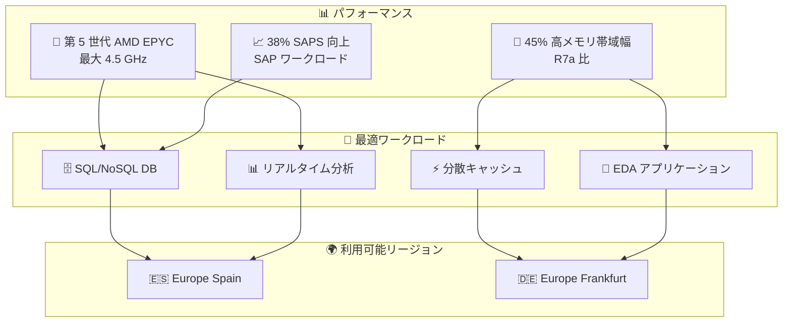

# Amazon EC2 - R8a インスタンス欧州リージョン対応

**リリース日**: 2026 年 1 月 30 日
**サービス**: Amazon Elastic Compute Cloud (EC2)
**機能**: R8a インスタンスタイプの欧州リージョン利用開始

## 概要

Amazon EC2 R8a インスタンスが Europe (Spain) および Europe (Frankfurt) リージョンで利用開始となり、欧州ユーザーも最新の高性能メモリ最適化インスタンスを利用できるようになりました。R8a インスタンスは第 5 世代 AMD EPYC プロセッサ (コード名 Turin) を搭載し、最大 4.5 GHz のクロック周波数で R7a インスタンス比で最大 30% のパフォーマンス向上と最大 19% の価格パフォーマンス改善を実現します。

特にレイテンシ感応型のワークロードでは、R8a インスタンスが R7a インスタンス比で 45% 多いメモリ帯域幅を提供し、GroovyJVM での最大 60% 高速化が期待できます。

**アップデート前の課題**

- 欧州ユーザーは第 5 世代 AMD EPYC プロセッサの高性能メモリ最適化インスタンスが利用できなかった
- グローバルアプリケーションを構成する際、リージョン間でのインスタンスタイプの非均一性があった
- 欧州地域内での低遅延メモリ集約的ワークロード処理に制限があった

**アップデート後の改善**

- 欧州地域でも最新 R8a インスタンスタイプが利用可能に
- R7a インスタンスより 30% 高いパフォーマンスが欧州地域で実現
- SAP ワークロードなど企業向けアプリケーションで 38% SAPS 向上

## アーキテクチャ図

第 5 世代 AMD EPYC の高性能と高メモリ帯域幅により、データベースやリアルタイム分析など様々なメモリ集約的ワークロードを欧州で実行可能に。

## サービスアップデートの詳細

### 主要機能

1. **第 5 世代 AMD EPYC プロセッサ (Turin)**
   - 最大クロック周波数 4.5 GHz
   - R7a インスタンス比で最大 30% のパフォーマンス向上
   - 最新の SIMD 命令セットとセキュリティ機能対応

2. **メモリ帯域幅の大幅向上**
   - R7a インスタンス比で 45% 多いメモリ帯域幅
   - レイテンシ感応型ワークロード向け最適化
   - GroovyJVM での最大 60% 高速化実現

3. **AWS Nitro System 第 6 世代**
   - 第 6 世代 Nitro カード採用
   - インスタンスセキュリティとパフォーマンスの向上
   - I/O 性能の最適化

4. **豊富なサイズ構成**
   - 12 種類のサイズから選択可能
   - ベアメタルサイズ 2 種類を含む
   - 小～大規模のワークロードに対応

5. **SAP 認定**
   - SAP ワークロード向けに認定
   - 38% の SAPS (SAP アプリケーション パフォーマンス スタンダード) 向上

## 技術仕様

### R8a インスタンスの仕様

| 項目 | 詳細 |
|------|------|
| プロセッサ | 第 5 世代 AMD EPYC (Turin) |
| 最大クロック周波数 | 4.5 GHz |
| メモリ帯域幅 | R7a 比 45% 向上 |
| パフォーマンス | R7a 比最大 30% 向上 |
| 価格パフォーマンス | R7a 比 19% 改善 |
| ベアメタルサイズ | 2 種類 |

### 利用可能リージョン

| リージョン | コード | 利用可能 |
|-----------|------|---------|
| Europe (Spain) | eu-south-2 | ✓ |
| Europe (Frankfurt) | eu-central-1 | ✓ |

### 対応ワークロード

- SQL および NoSQL データベース
- 分散型 Web スケール インメモリキャッシュ
- インメモリデータベース
- リアルタイムビッグデータ分析
- Electronic Design Automation (EDA) アプリケーション

## 設定方法

### 前提条件

1. AWS アカウントと、欧州リージョンへのアクセス権
2. EC2 インスタンス起動権限
3. VPC と セキュリティグループの設定

### 手順

#### ステップ1: AWS コンソールでインスタンスを起動

AWS Management Console の EC2 サービスにアクセスし、「インスタンスを起動」を選択します。

#### ステップ2: リージョン選択

Europe (Spain) または Europe (Frankfurt) リージョンを選択します。

#### ステップ3: R8a インスタンスタイプ選択

インスタンスタイプ選択画面で r8a.large または他の R8a サイズを選択します。

#### ステップ4: インスタンス設定

VPC、セキュリティグループ、ストレージなどを設定してインスタンスを起動します。

## メリット

### パフォーマンス面

- **CPU パフォーマンス**: R7a 比最大 30% 向上で、アプリケーション処理速度が大幅に向上
- **メモリアクセス**: 45% 高メモリ帯域幅により、メモリ集約型アプリケーションが高速化
- **Java アプリケーション**: GroovyJVM で最大 60% の高速化

### ビジネス面

- **レイテンシ削減**: 欧州ユーザーが低遅延で高性能インスタンスを利用可能
- **SAP 環境最適化**: 38% SAPS 向上で SAP ワークロードの効率が大幅改善
- **価格効率**: 19% 価格パフォーマンス改善で、コストあたりの性能が向上

## 制限事項

- 新しいプロセッサのため、一部の古いソフトウェアスタックとの互換性確認が必要な場合がある
- 利用可能リージョンが European リージョン 2 箇所に限定

## ユースケース

### ユースケース1: European e-commerce プラットフォーム

**シナリオ**: 欧州を中心とする大規模 e-commerce プラットフォームが、レイテンシ感応型の Redis キャッシュと MySQL データベースで構成されている。

**効果**: R8a インスタンスのメモリ帯域幅向上により、キャッシュヒット率が向上し、ユーザー体験が改善。R7a から R8a への移行で同一負荷でコストを削減可能

### ユースケース2: SAP ERP システムの欧州展開

**シナリオ**: 大手製造業が SAP ERP を欧州データセンターに新規展開し、現地ユーザーへ低遅延で提供したい。

**効果**: R8a インスタンスの 38% SAPS 向上により、SAP ワークロードのパフォーマンスが大幅改善。ユーザー数拡張時も既存インスタンスで対応可能

### ユースケース3: リアルタイム金融取引システム

**シナリオ**: ロンドンの金融機関がリアルタイムデータ分析を Frankfurt リージョンで実施し、低遅延トレーディング決定を行いたい。

**効果**: R8a インスタンスの高メモリ帯域幅と高クロック周波数により、複雑な分析計算を高速化。トレーディング機会を逃さない

## 利用可能リージョン

- Europe (Spain) - eu-south-2
- Europe (Frankfurt) - eu-central-1

## 関連サービス・機能

- **Amazon RDS**: マネージド型データベースサービス (R8a インスタンスベース)
- **Amazon ElastiCache**: マネージド型インメモリキャッシュ (Redis など)
- **AWS Nitro System**: インスタンス基盤技術
- **EC2 Instance Savings Plans**: コスト最適化

## 参考リンク

- [公式発表 (What's New)](https://aws.amazon.com/about-aws/whats-new/2026/01/amazon-ec2-r8a-instances-are-available-europe)
- [EC2 R8a インスタンスページ](https://aws.amazon.com/ec2/instance-types/r8a)
- [AWS Nitro System](https://aws.amazon.com/ec2/nitro/)
- [Amazon EC2](https://aws.amazon.com/ec2/)

## まとめ

R8a インスタンスの欧州リージョン対応により、欧州のユーザーは最新の高性能メモリ最適化インスタンスを地域内で利用でき、レイテンシ感応型ワークロードと SAP などのエンタープライズアプリケーションの性能を大幅に向上させることができます。特に金融、製造、e-commerce など高性能データ処理を必要とする産業において、重要なオプションとなります。
