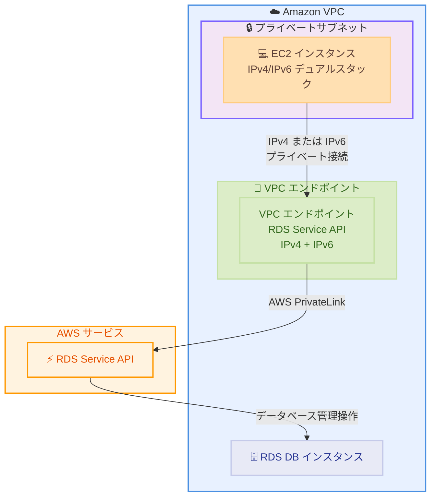

# Amazon RDS - VPC エンドポイントでの IPv6 サポート

**リリース日**: 2026 年 01 月 30 日
**サービス**: Amazon RDS
**機能**: VPC エンドポイントでの IPv6 サポート

## 概要

Amazon RDS が RDS Service API の VPC エンドポイントにおいて IPv6 をサポートしました。これにより、既存のパブリックエンドポイントに加えて、VPC エンドポイント経由で RDS Service API にアクセスする際に、IPv4 と IPv6 のデュアルスタック接続が利用可能になります。

この機能により、インターネットを経由せずに VPC 内から直接 RDS Service API にアクセスできるようになり、セキュリティと接続性が向上します。IPv6 は拡張されたアドレス空間を提供し、マイクロサービスに対する連続した IP 範囲の割り当てが容易になり、アプリケーションに対して事実上無制限のスケールを実現します。

**アップデート前の課題**

- RDS Service API の VPC エンドポイントは IPv4 のみをサポートしており、IPv6 環境との統合が困難だった
- IPv4 アドレス空間の制限により、大規模なマイクロサービスアーキテクチャでの IP 管理が複雑だった
- IPv6 への移行を段階的に行うことが困難だった

**アップデート後の改善**

- RDS Service API の VPC エンドポイントで IPv4 と IPv6 のデュアルスタック接続が可能になった
- インターネットを経由せずに VPC 内から直接 RDS Service API にアクセスできるようになり、セキュリティが向上した
- IPv4 から IPv6 へのアプリケーション移行を段階的に実施できるようになり、より安全な移行が可能になった

## アーキテクチャ図



この図は、VPC 内の EC2 インスタンスが VPC エンドポイントを経由して IPv4 または IPv6 で RDS Service API にアクセスする様子を示しています。

## サービスアップデートの詳細

### 主要機能

1. **デュアルスタック接続のサポート**
   - RDS Service API の VPC エンドポイントで IPv4 と IPv6 の両方をサポート
   - アプリケーションは IPv4、IPv6、または両方のプロトコルを使用して接続可能
   - 既存の IPv4 接続との互換性を維持しながら IPv6 を段階的に導入可能

2. **プライベート接続**
   - インターネットゲートウェイ、NAT デバイス、VPN 接続、または AWS Direct Connect を必要とせず、VPC 内から直接 RDS Service API にアクセス
   - AWS PrivateLink を使用してセキュアなプライベート接続を確立
   - データトラフィックがインターネットを経由しないため、セキュリティが向上

3. **拡張されたアドレス空間**
   - IPv6 により、IPv4 の制限を超えた拡張されたアドレス空間を提供
   - マイクロサービスに対して連続した IP 範囲を簡単に割り当て可能
   - アプリケーションに対して事実上無制限のスケールを実現

## 技術仕様

### サポートされる RDS Service API

RDS Service API には、データベースインスタンスとクラスターの管理、スナップショット、バックアップ、パラメータグループなどの操作が含まれます。

| API カテゴリ | 説明 |
|------|------|
| DB インスタンス管理 | CreateDBInstance、ModifyDBInstance、DeleteDBInstance など |
| DB クラスター管理 | CreateDBCluster、ModifyDBCluster、DeleteDBCluster など |
| スナップショット | CreateDBSnapshot、CopyDBSnapshot、RestoreDBInstanceFromDBSnapshot など |
| パラメータグループ | CreateDBParameterGroup、ModifyDBParameterGroup など |
| セキュリティグループ | AuthorizeDBSecurityGroupIngress など |

### VPC エンドポイントの設定要件

```json
{
  "ServiceName": "com.amazonaws.region.rds",
  "VpcEndpointType": "Interface",
  "SubnetIds": ["subnet-xxxxx"],
  "SecurityGroupIds": ["sg-xxxxx"],
  "PrivateDnsEnabled": true,
  "IpAddressType": "dualstack"
}
```

## 設定方法

### 前提条件

1. VPC と適切なサブネットが作成されていること
2. VPC エンドポイント用のセキュリティグループが設定されていること
3. IPv6 CIDR ブロックが VPC に関連付けられていること (IPv6 を使用する場合)
4. 適切な IAM 権限が付与されていること

### 手順

#### ステップ 1: VPC に IPv6 CIDR ブロックを関連付ける

```bash
aws ec2 associate-vpc-cidr-block \
  --vpc-id vpc-xxxxx \
  --amazon-provided-ipv6-cidr-block
```

このコマンドは、VPC に Amazon 提供の IPv6 CIDR ブロックを関連付けます。

#### ステップ 2: サブネットに IPv6 CIDR ブロックを関連付ける

```bash
aws ec2 associate-subnet-cidr-block \
  --subnet-id subnet-xxxxx \
  --ipv6-cidr-block 2600:1f16:xxxx:xxxx::/64
```

このコマンドは、サブネットに IPv6 CIDR ブロックを関連付けます。

#### ステップ 3: デュアルスタック VPC エンドポイントを作成する

```bash
aws ec2 create-vpc-endpoint \
  --vpc-id vpc-xxxxx \
  --service-name com.amazonaws.ap-northeast-1.rds \
  --vpc-endpoint-type Interface \
  --subnet-ids subnet-xxxxx \
  --security-group-ids sg-xxxxx \
  --ip-address-type dualstack \
  --private-dns-enabled
```

このコマンドは、デュアルスタック (IPv4 と IPv6) をサポートする RDS Service API 用の VPC エンドポイントを作成します。

#### ステップ 4: RDS Service API に接続する

AWS CLI または SDK を使用して、VPC エンドポイント経由で RDS Service API にアクセスできます。

```bash
# AWS CLI で RDS インスタンスを一覧表示
aws rds describe-db-instances
```

デュアルスタック VPC エンドポイントが設定されている場合、AWS CLI は自動的に適切なプロトコル (IPv4 または IPv6) を使用して接続します。

## メリット

### ビジネス面

- **コスト削減**: NAT ゲートウェイやインターネットゲートウェイが不要になり、インフラストラクチャコストを削減
- **スケーラビリティの向上**: IPv6 の拡張されたアドレス空間により、大規模なマイクロサービスアーキテクチャでも IP アドレス管理が容易
- **段階的な移行**: IPv4 から IPv6 への段階的な移行が可能になり、ビジネスの中断を最小限に抑制

### 技術面

- **セキュリティの向上**: インターネットを経由せずにプライベート接続を確立でき、データの露出リスクを低減
- **レイテンシの削減**: VPC 内から直接 API にアクセスできるため、ネットワークホップが減少し、レイテンシが改善
- **IPv6 の利点**: 拡張されたアドレス空間、シンプルな IP 管理、将来のネットワーク要件への対応

## デメリット・制約事項

### 制限事項

- IPv6 専用の DB インスタンスはサポートされていません (デュアルスタックのみ)
- RDS ネイティブ IPv6 サブネットはサポートされていません
- デュアルスタックモードを使用する DB インスタンスはプライベートである必要があります
- RDS Proxy はデュアルスタックモードの DB インスタンスと併用できません

### 考慮すべき点

- IPv6 を使用するには、VPC、サブネット、セキュリティグループの設定を更新する必要があります
- アプリケーションが IPv6 をサポートしていることを確認する必要があります
- DNS 設定が適切に構成されていることを確認する必要があります (VPC で DNS ホスト名と DNS 解決を有効化)

## ユースケース

### ユースケース 1: IPv6 専用マイクロサービスアーキテクチャ

**シナリオ**: 最新のマイクロサービスアーキテクチャを構築しており、IPv6 を標準プロトコルとして採用したい場合。

**実装例**:
```bash
# デュアルスタック VPC エンドポイントを作成
aws ec2 create-vpc-endpoint \
  --vpc-id vpc-xxxxx \
  --service-name com.amazonaws.ap-northeast-1.rds \
  --vpc-endpoint-type Interface \
  --subnet-ids subnet-xxxxx subnet-yyyyy \
  --security-group-ids sg-xxxxx \
  --ip-address-type dualstack \
  --private-dns-enabled

# アプリケーションから RDS Service API を呼び出す
aws rds create-db-instance \
  --db-instance-identifier mydb \
  --db-instance-class db.t3.micro \
  --engine postgres \
  --master-username admin \
  --master-user-password mypassword
```

**効果**: IPv6 ネイティブなマイクロサービスアーキテクチャを構築でき、IPv4 アドレス枯渇の問題を回避できます。

### ユースケース 2: セキュアなプライベート接続

**シナリオ**: コンプライアンス要件により、データベース管理トラフィックをインターネットに公開できない場合。

**実装例**:
```bash
# VPC エンドポイントポリシーを設定
{
  "Statement": [
    {
      "Effect": "Allow",
      "Principal": "*",
      "Action": "rds:*",
      "Resource": "*",
      "Condition": {
        "StringEquals": {
          "aws:SourceVpce": "vpce-xxxxx"
        }
      }
    }
  ]
}
```

**効果**: RDS Service API へのアクセスを特定の VPC エンドポイント経由のみに制限し、セキュリティを強化できます。

### ユースケース 3: 段階的な IPv6 移行

**シナリオ**: 既存の IPv4 ベースのインフラストラクチャを運用しながら、段階的に IPv6 に移行したい場合。

**実装例**:
```python
import boto3

# デュアルスタック VPC エンドポイントを使用
# AWS SDK は自動的に IPv4 または IPv6 を選択
rds_client = boto3.client('rds')

# 既存の IPv4 アプリケーションはそのまま動作
response = rds_client.describe_db_instances()

# 新しい IPv6 アプリケーションも同じエンドポイントを使用可能
```

**効果**: 既存のアプリケーションに影響を与えずに IPv6 を導入でき、段階的な移行が可能になります。

## 料金

この機能自体に追加料金はかかりません。ただし、VPC エンドポイントの使用に対して標準的な料金が適用されます。

### 料金例

| 使用量 | 月額料金 (概算) |
|--------|------------------|
| VPC エンドポイント 1 つ (東京リージョン) | 約 $7.30 (24 時間 × 30 日 × $0.01/時間) |
| データ処理 1 GB | $0.01 |
| データ処理 100 GB | $1.00 |

詳細な料金については、[AWS PrivateLink の料金ページ](https://aws.amazon.com/privatelink/pricing/)を参照してください。

## 利用可能リージョン

この機能は、すべての AWS 商用リージョンおよび AWS GovCloud (US) リージョンで利用可能です。

## 関連サービス・機能

- **AWS PrivateLink**: VPC エンドポイントの基盤技術で、プライベート接続を実現
- **Amazon VPC**: IPv6 CIDR ブロックの管理と VPC エンドポイントのホスティングを提供
- **Amazon RDS**: データベースインスタンスとクラスターの管理対象となるサービス

## 参考リンク

- [公式発表 (What's New)](https://aws.amazon.com/about-aws/whats-new/2026/01/amazon-rds-ipv6-vpc-endpoints-service-apis/)
- [RDS Service API エンドポイント](https://docs.aws.amazon.com/general/latest/gr/rds-service.html)
- [IPv6 ユーザーガイド](https://docs.aws.amazon.com/AmazonRDS/latest/AuroraUserGuide/USER_VPC.WorkingWithRDSInstanceinaVPC.html)
- [VPC エンドポイントドキュメント](https://docs.aws.amazon.com/AmazonRDS/latest/UserGuide/vpc-interface-endpoints.html)

## まとめ

Amazon RDS の VPC エンドポイントで IPv6 がサポートされたことにより、より安全でスケーラブルなデータベース管理が可能になりました。デュアルスタック接続により、IPv4 から IPv6 への段階的な移行が容易になり、セキュリティとネットワークパフォーマンスが向上します。IPv6 を活用したい組織や、プライベート接続を強化したい組織は、この機能の導入を検討することをお勧めします。
