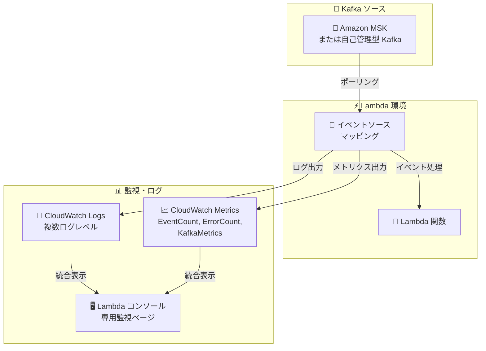

# AWS Lambda - Kafka イベントソースマッピングの拡張可観測性

**リリース日**: 2026 年 1 月 30 日
**サービス**: AWS Lambda
**機能**: Kafka イベントソースマッピングの拡張可観測性

## 概要

AWS Lambda が Kafka イベントソースマッピング (ESM) の拡張可観測性を導入し、CloudWatch Logs とメトリクスによるイベントポーリング設定、スケーリング、および処理ステートの監視が可能になりました。この機能により、顧客は Kafka イベントソースマッピングのセットアップ問題の診断と、ミッションクリティカルなデータストリーミングワークロードの運用を大幅に改善できます。

Amazon Managed Streaming for Apache Kafka (Amazon MSK) および自己管理型 Apache Kafka (SMK) の両方に対応しています。

**アップデート前の課題**

- イベントポーリング設定、スケーリング、処理ステートの可視性が不足していた
- パーミッション、設定、関数エラーに関連する問題の診断に時間がかかった
- トラブルシューティングの遅延により、平均復旧時間 (MTTR) が長くなり、運用オーバーヘッドが増加していた

**アップデート後の改善**

- CloudWatch Logs と複数のメトリクスグループでイベント処理の詳細な可視性が実現
- セットアップ問題を迅速に診断でき、修正アクションを素早く実施可能に
- 複数のログレベルオプションで柔軟な監視が実現可能

## アーキテクチャ図



Lambda が Kafka からイベントをポーリングし、イベントソースマッピングがログとメトリクスを CloudWatch に出力。CloudWatch コンソールの専用ページで一元監視が可能に。

## サービスアップデートの詳細

### 主要機能

1. **CloudWatch Logs の複数レベルオプション**
   - 警告およびエラーのみを記録する最小ログレベル
   - 詳細なイベント処理進捗情報を含む詳細ログレベル
   - 用途に応じた柔軟なログ取得が可能

2. **メトリクスグループ**
   - **EventCount**: 処理されたイベント数の追跡
   - **ErrorCount**: 処理エラーの監視
   - **KafkaMetrics**: Kafka ポーリング設定とスケーリング情報

3. **専用監視ページ**
   - AWS コンソール内でイベントソースマッピング用の統合監視ページ
   - ログとメトリクスを一元表示
   - セットアップ問題の迅速な診断が可能

4. **複数設定方法対応**
   - AWS Lambda Create and Update ESM API
   - AWS コンソール
   - AWS CLI
   - AWS SDK
   - AWS CloudFormation
   - AWS SAM

## 技術仕様

### ログレベル

| ログレベル | 説明 | 用途 |
|-----------|------|------|
| 警告・エラー | 問題が発生した場合のみ | 本番環境での監視最適化 |
| 詳細 | 設定からイベント処理までの全情報 | トラブルシューティングと開発 |

### メトリクスグループ

| メトリクスグループ | メトリクス例 | 説明 |
|------------------|------------|------|
| EventCount | ProcessedEvents | 処理されたイベント数 |
| ErrorCount | ProcessingErrors | エラーが発生したイベント数 |
| KafkaMetrics | PollingLatency, ScalingInfo | Kafka ポーリングと ESM スケーリング |

### 対応ソース

- Amazon Managed Streaming for Apache Kafka (Amazon MSK)
- 自己管理型 Apache Kafka (SMK)

### 対応リージョン

AWS Lambda の Provisioned モード for Kafka ESM がサポートされているすべての AWS Commercial Regions

## 設定方法

### 前提条件

1. AWS Lambda で Kafka イベントソースマッピングを使用する環境
2. CloudWatch Logs への基本的なアクセス権限
3. CloudWatch メトリクスの発行権限

### 手順

#### ステップ1: ESM ログ設定を有効化

AWS Lambda Create または Update ESM API を使用して、CloudWatch Logs 出力を有効化します。ログレベルを選択 (警告・エラー、または詳細)。

```bash
# AWS CLI での例
aws lambda create-event-source-mapping \
  --event-source-arn arn:aws:kafka:region:account-id:cluster/cluster-name \
  --function-name my-function \
  --enabled \
  --logging-config '{"LogFormat": "JSON", "LogGroup": "/aws/lambda/my-kafka-esm"}'
```

#### ステップ2: メトリクスグループを選択

EventCount、ErrorCount、KafkaMetrics の中から監視対象を選択します。

#### ステップ3: CloudWatch で監視を確認

CloudWatch コンソールで ESM 専用ページにアクセスし、ログとメトリクスが表示されていることを確認。

#### ステップ4: アラーム設定 (オプション)

ErrorCount メトリクスに基づいてアラームを設定し、エラー増加時に通知を受け取るように構成。

## メリット

### トラブルシューティング面

- **診断時間短縮**: セットアップ問題の原因を素早く特定できる
- **詳細な情報**: ポーリング設定、スケーリング、処理ステートの詳細な可視性

### 運用面

- **自動化対応**: CloudWatch Logs と Lambda を連携してアラーム対応を自動化
- **パフォーマンス監視**: イベント処理性能の詳細なメトリクス収集

### ビジネス面

- **MTTR 削減**: 問題検出と修正に要する時間を大幅に削減
- **ワークロード信頼性**: ミッションクリティカルなデータストリーミング処理の信頼性向上

## 制限事項

- CloudWatch Logs と CloudWatch メトリクスは標準料金で課金
- ログレベルを詳細に設定するとログ量が増加し、料金も増加
- Provisioned モード for Kafka ESM でのみ利用可能

## ユースケース

### ユースケース1: リアルタイムデータ処理パイプライン

**シナリオ**: Kafka からのイベントを Lambda で処理し、データウェアハウスに集約する場合、イベント処理の成功率と遅延を監視したい。

**効果**: EventCount と KafkaMetrics により、処理スループットとレイテンシーを追跡でき、SLA 達成状況を監視可能

### ユースケース2: エラー多発時のトラブルシューティング

**シナリオ**: Kafka ESM にエラーが多発している場合、原因が設定エラーか関数エラーかを素早く特定したい。

**効果**: CloudWatch Logs の詳細ログレベルにより、原因を数分以内に特定でき、修正アクション実施まで迅速

### ユースケース3: 本番環境の継続的監視

**シナリオ**: 本番環境で複数の Kafka ESM が稼働している場合、異常を素早く検出し、自動的に対応したい。

**効果**: ErrorCount メトリクスに基づいたアラームと Lambda を連携して、自動でスケーリングまたは通知が実現可能

## 利用可能リージョン

AWS Lambda の Provisioned モード for Kafka ESM がサポートされているすべての AWS Commercial Regions

## 料金

CloudWatch Logs と CloudWatch メトリクスは標準の CloudWatch 料金が適用されます。

### 料金例 (概算)

| 使用量 | 月額料金 |
|--------|---------|
| 100 GB ログ取得 | 約 50 USD |
| 10,000,000 メトリクスデータポイント | 約 10 USD |

## 関連サービス・機能

- **Amazon MSK**: マネージド型 Kafka サービス
- **CloudWatch Logs**: ログ管理と分析
- **CloudWatch メトリクス**: 監視とアラーム
- **AWS Lambda**: イベント駆動型コンピューティング

## 参考リンク

- [公式発表 (What's New)](https://aws.amazon.com/about-aws/whats-new/2026/01/aws-Lambda-observability-for-kafka-esm/)
- [Lambda Kafka ESM ドキュメント](https://docs.aws.amazon.com/lambda/latest/dg/with-kafka-esm.html)
- [CloudWatch 料金](https://aws.amazon.com/cloudwatch/pricing/)
- [AWS Lambda](https://aws.amazon.com/lambda/)

## まとめ

Kafka イベントソースマッピングの拡張可観測性により、Lambda ユーザーはリアルタイムデータストリーミング処理の信頼性と可視性を大幅に向上させることができます。ミッションクリティカルなアプリケーションにおいて、この機能は問題検出と迅速な対応を実現する重要な手段となります。
