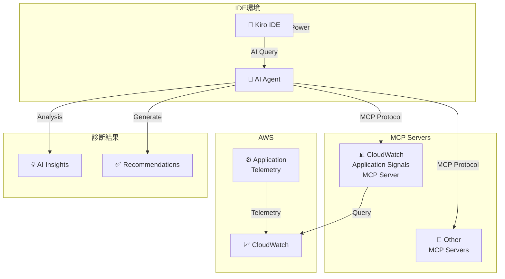

# Amazon CloudWatch Application Signals - Kiro Powers 統合

**リリース日**: 2026 年 1 月 30 日
**サービス**: Amazon CloudWatch Application Signals
**機能**: Kiro Powers による AI エージェント支援トラブルシューティング

📊 [このアップデートのインフォグラフィックを見る](https://takech9203.github.io/aws-news-summary/20260130-cloudwatch-application-signals-kiro-powers.html)

## 概要

AWS は Amazon CloudWatch Application Signals と Kiro Powers の統合を発表しました。Kiro Powers は、AWS パートナー企業が検証した MCP (Model Context Protocol) サーバー、ステアリングファイル、フックのキュレーション済みリポジトリです。

CloudWatch Application Signals の Kiro Power により、開発者は IDE 内から直接、AI エージェント支援によるアプリケーションヘルス調査を行うことが可能になり、トラブルシューティング時間が数時間から数分に短縮されます。

**アップデート前の課題**

- トラブルシューティングのために複数のツール、ダッシュボード間を切り替える必要があった
- アプリケーションヘルス問題の原因特定に時間がかかった
- SLO コンプライアンス確認が手動で行われていた
- IDE 外の環境でのコンテキスト切り替えが生産性低下につながっていた

**アップデート後の改善**

- IDE 内で AI エージェント支援によるアプリケーション診断が可能に
- CloudWatch Application Signals データを AI エージェントが自動的にコンテキストとして利用
- SLO コンプライアンス、サービスヘルス監視が IDE 統合で可能に
- トラブルシューティング時間が大幅に短縮

## アーキテクチャ図



Kiro IDE は MCP を通じて CloudWatch Application Signals データを AI エージェントに提供し、インテリジェント診断を実現します。

## サービスアップデートの詳細

### 主要機能

1. **CloudWatch Application Signals MCP Server**
   - Application Signals データを MCP インターフェースで提供
   - AI エージェントが自動的にコンテキスト データを取得

2. **ターゲット型オブザーバビリティガイダンス**
   - タスク固有のガイダンス情報を AI エージェントに提供
   - SLO コンプライアンス監視、サービスヘルス監視のコンテキスト情報

3. **IDE 統合**
   - Kiro IDE で一クリックインストール可能
   - 開発環境を離れずにトラブルシューティング

4. **全リージョン対応**
   - すべての AWS リージョンで利用可能

## 技術仕様

| 項目 | 詳細 |
|------|------|
| インターフェース | Model Context Protocol (MCP) |
| IDE 対応 | Kiro IDE |
| インストール方式 | One-click install |
| 対応範囲 | 全 AWS リージョン |
| 前提条件 | CloudWatch Application Signals 実装済み |

## 設定方法

### 前提条件

1. Kiro IDE をインストール
2. Amazon CloudWatch Application Signals を既に実装
3. AWS 認証情報が Kiro IDE に設定済み

### 手順

#### ステップ 1: Kiro IDE でのインストール

Kiro IDE を起動し、Kiro Powers ページまたは IDE 内から CloudWatch Application Signals Power を検索します。

一クリックで CloudWatch Application Signals Kiro Power がインストールされます。

#### ステップ 2: AI エージェント コンテキストの確認

AI エージェントが Application Signals MCP サーバーとの接続を確認します。

```
Kiro Agent: Analyzing your distributed application health...
Connected to CloudWatch Application Signals MCP Server
Available context: Service health, SLO compliance, Service map
```

MCP サーバー経由でアプリケーションテレメトリが利用可能になります。

#### ステップ 3: トラブルシューティングの開始

IDE 内で AI エージェントに質問を入力します。

```
Developer: "Why is my service SLO not being met?"
AI Agent: Analyzing SLO metrics...
- Service: payment-service
- Current SLO: 99.9%
- Current Performance: 98.2%
- Root cause: p99 latency spike detected
- Recommendation: Check database query performance
```

AI エージェントが CloudWatch データを自動的に分析し、診断結果を提供します。

## メリット

### ビジネス面

- **トラブルシューティング時間短縮**: 数時間が数分に短縮
- **開発生産性向上**: IDE を離れずに問題解決
- **MTTR 改善**: 平均修復時間が削減

### 技術面

- **アンダースタンディング向上**: AI による根本原因分析
- **推奨事項の自動生成**: AI が修復手順を提案
- **継続的学習**: AI エージェントがパターンを学習

## デメリット・制約事項

### 制限事項

- Application Signals が既に実装されていることが前提
- 複雑な問題は AI の推奨だけでは不十分な場合がある
- AI の推奨が常に正確とは限らず、検証が必要

### 考慮すべき点

- AI の推奨に基づいて重要な変更を行う前に、十分な検証を実施
- Application Signals の適切な計測設定が重要
- チーム内で AI エージェント使用方法のトレーニングが必要

## ユースケース

### ユースケース 1: 本番障害の迅速な診断

**シナリオ**: 本番環境で SLO ブレーチが発生し、原因を素早く特定する必要がある

**実装例**: Kiro IDE で AI エージェントに「SLO ブレーチの原因は?」と質問

**効果**: 数分で根本原因が特定でき、MTTR が大幅に短縮

### ユースケース 2: マイクロサービス間の問題診断

**シナリオ**: 分散アプリケーションで複数サービス間の遅延が発生

**実装例**: Application Signals のサービスマップをコンテキストとして、AI エージェントが分析

**効果**: 複雑なサービス依存関係を AI が自動的に分析

### ユースケース 3: デプロイ後の問題検出

**シナリオ**: 新しいバージョンをデプロイ後、パフォーマンス劣化を検出

**実装例**: CI/CD パイプラインでのテスト後、AI エージェント支援で影響分析

**効果**: デプロイ後のパフォーマンス問題を早期に発見・対応

## 料金

Kiro Powers の CloudWatch Application Signals Power は無料です。ただし、CloudWatch Application Signals の標準料金が別途発生します。

## 利用可能リージョン

CloudWatch Application Signals Kiro Power は、すべての AWS リージョンで利用可能です。

## 関連サービス・機能

- **CloudWatch Application Signals**: アプリケーションヘルス監視
- **AWS X-Ray**: 分散トレース
- **CloudWatch Logs**: ログ分析
- **AWS Lambda**: サーバーレスアプリケーション監視
- **Amazon DynamoDB**: データベースパフォーマンス監視

## 参考リンク

- [公式発表 (What's New)](https://aws.amazon.com/about-aws/whats-new/2026/01/cloudwatch-application-signals-kiro-powers)
- [ドキュメント - Application Signals MCP Server](https://awslabs.github.io/mcp/servers/cloudwatch-applicationsignals-mcp-server)
- [ドキュメント - CloudWatch Application Signals](https://docs.aws.amazon.com/AmazonCloudWatch/latest/monitoring/CloudWatch-Application-Monitoring-Sections.html)
- [Kiro IDE](https://kiro.dev/powers/#how-do-i-install-powers)
- [Kiro Powers ページ](https://kiro.dev/powers/)

## まとめ

CloudWatch Application Signals と Kiro Powers の統合により、AI エージェント支援による分散アプリケーションのトラブルシューティングが実現されました。IDE 内でアプリケーション問題を迅速に診断・解決できるようになり、開発生産性と運用効率が大幅に向上します。マイクロサービスアーキテクチャを採用している組織にとって、このアップデートは重要な開発効率化のツールです。Application Signals を既に導入している場合は、このアップデートを活用して開発ワークフローを改善することをお勧めします。
