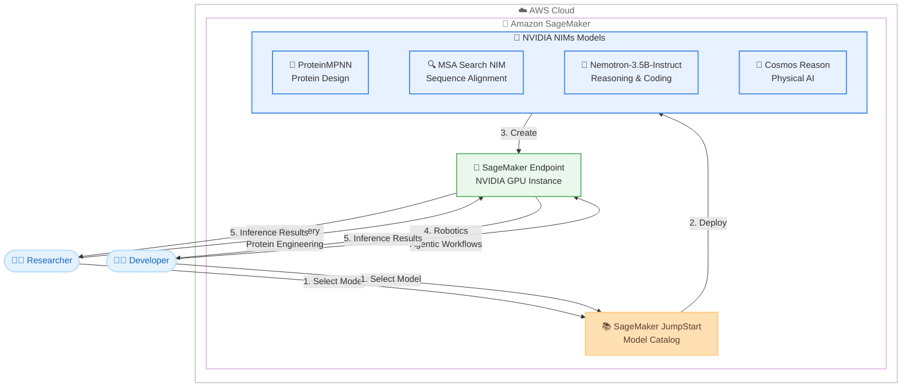

# Amazon SageMaker JumpStart - NVIDIA NIMs モデル追加

**リリース日**: 2026 年 2 月 2 日
**サービス**: Amazon SageMaker JumpStart
**機能**: NVIDIA NIMs モデルの提供開始 (ProteinMPNN、MSA Search NIM、Nemotron-3.5B-Instruct、Cosmos Reason)

## 概要

Amazon SageMaker JumpStart は、バイオサイエンスと物理 AI に特化した 4 つの NVIDIA NIMs モデルのワンクリックデプロイメントを可能にしました。NVIDIA NIM は、NVIDIA アクセラレーテッドインフラストラクチャ上で最新の AI モデルを迅速にデプロイするための、事前構築され最適化された推論マイクロサービスを提供します。

これらのモデルは、タンパク質設計、設定可能な出力を持つ推論、物理世界の理解にわたる高度な機能を提供し、お客様が AWS インフラストラクチャ上でバイオサイエンス研究、創薬、エンボディド AI アプリケーションを加速できるようにします。ProteinMPNN はタンパク質シーケンス最適化を実現し、MSA Search NIM は GPU アクセラレーテッド Multiple Sequence Alignment をサポートし、Nemotron-3.5B-Instruct は高度な推論性能と拡張コンテキスト処理を提供し、Cosmos Reason は物理 AI とロボティクスのための推論ビジョン言語モデルです。

SageMaker JumpStart を使用することで、お客様は数回のクリックでこれらのモデルをデプロイし、特定の AI ユースケースに対応できます。

**アップデート前の課題**

- バイオサイエンスと創薬のための特化した AI モデルを AWS インフラストラクチャ上で簡単にデプロイする手段が限られていました
- タンパク質設計やシーケンスアラインメントなどの計算集約的なバイオサイエンスタスクを GPU で効率的に実行するための最適化されたソリューションが不足していました
- 物理世界を理解し推論できるロボティクスと物理 AI のための基盤モデルへのアクセスが限られていました
- 高度な推論性能と拡張コンテキスト処理を持つコンパクトなモデルが不足していました

**アップデート後の改善**

- NVIDIA NIMs モデルを SageMaker JumpStart からワンクリックでデプロイでき、バイオサイエンスと物理 AI の研究開発を迅速に開始できるようになりました
- ProteinMPNN と MSA Search NIM により、タンパク質設計とシーケンスアラインメントを GPU アクセラレーテッドインフラストラクチャ上で効率的に実行できるようになりました
- Cosmos Reason により、物理世界を理解し推論できるロボティクスとビジョン AI エージェントを構築できるようになりました
- Nemotron-3.5B-Instruct により、256k トークンの拡張コンテキストウィンドウとネイティブツール呼び出しサポートを持つ高度な推論モデルを利用できるようになりました

## アーキテクチャ図



この図は、研究者と開発者が SageMaker JumpStart から NVIDIA NIMs モデルを選択し、NVIDIA GPU インスタンス上の SageMaker エンドポイントとしてデプロイして、創薬、タンパク質工学、ロボティクス、エージェントワークフローなどのユースケースで推論を実行するワークフローを示しています。

## サービスアップデートの詳細

### 主要機能

1. **ProteinMPNN - タンパク質シーケンス最適化**
   - 構造データに基づいた高速かつ効率的なタンパク質シーケンス最適化
   - 結合親和性と安定性が強化された高品質なシーケンスを生成
   - 実験結果によって検証済み
   - スケーラブルで柔軟な設計により、タンパク質工学ワークフローにシームレスに統合
   - 酵素設計や治療薬開発などのアプリケーションを変革

2. **MSA Search NIM - GPU アクセラレーテッド配列アラインメント**
   - クエリアミノ酸配列とタンパク質配列データベースセットの GPU アクセラレーテッド Multiple Sequence Alignment をサポート
   - クエリに類似した配列をデータベースから検索
   - タンパク質の長さとモチーフが異なる場合でも、類似した領域を確立するために配列のコレクションを整列
   - GPU により高速な配列検索とアラインメントを実現

3. **Nemotron-3.5B-Instruct - 推論とコーディング**
   - 高度な推論性能を提供
   - ネイティブツール呼び出しサポート
   - 256k トークンのコンテキストウィンドウによる拡張コンテキスト処理
   - 効率的なハイブリッド Mixture-of-Experts (MoE) アーキテクチャを採用
   - エージェントワークフローとコーディングワークロードで前世代よりも高いスループットを実現
   - より大きなモデルの推論深度を維持
   - マルチエージェントワークフロー、開発者生産性ツール、プロセス自動化、科学的および数学的推論分析などに最適

4. **Cosmos Reason - 物理 AI とロボティクス**
   - 物理 AI とロボティクスのためのオープンでカスタマイズ可能な推論ビジョン言語モデル
   - ロボットとビジョン AI エージェントが人間のように推論できるようにする
   - 事前知識、物理理解、常識を使用して現実世界を理解し行動
   - 空間、時間、基本的な物理法則を理解
   - エンボディドエージェントが次に取るべきステップを推論するための計画モデルとして機能

## 技術仕様

### NVIDIA NIMs モデル比較

| モデル | 主要機能 | 最適なユースケース |
|------|----------|-------------------|
| ProteinMPNN | タンパク質シーケンス最適化、結合親和性向上 | 酵素設計、治療薬開発、タンパク質工学 |
| MSA Search NIM | GPU アクセラレーテッド配列アラインメント | タンパク質配列分析、進化研究、バイオインフォマティクス |
| Nemotron-3.5B-Instruct | 推論、ツール呼び出し、256k コンテキスト | エージェントワークフロー、開発者ツール、科学的推論 |
| Cosmos Reason | 物理世界理解、空間時間推論 | ロボティクス、エンボディド AI、物理 AI |

### NVIDIA NIM とは

NVIDIA NIM は、NVIDIA アクセラレーテッドインフラストラクチャ上で最新の AI モデルを迅速にデプロイするための、事前構築され最適化された推論マイクロサービスです。以下の特徴があります。

- 事前最適化された推論パフォーマンス
- NVIDIA GPU インスタンスでの高速実行
- コンテナ化されたマイクロサービスアーキテクチャ
- SageMaker JumpStart とのシームレスな統合

## 設定方法

### 前提条件

1. AWS アカウントと適切な IAM 権限
2. Amazon SageMaker へのアクセス権限
3. NVIDIA GPU インスタンスを使用する SageMaker エンドポイントの作成権限

### 手順

#### ステップ 1: SageMaker コンソールから JumpStart にアクセス

AWS マネジメントコンソールから Amazon SageMaker サービスを開き、左側のナビゲーションメニューから「JumpStart」を選択します。

#### ステップ 2: NVIDIA NIMs モデルを検索

JumpStart モデルカタログで以下のいずれかの NVIDIA NIMs モデルを検索します。

- ProteinMPNN
- MSA Search NIM
- Nemotron-3.5B-Instruct
- Cosmos Reason

#### ステップ 3: モデルをデプロイ

選択したモデルの詳細ページで「Deploy」ボタンをクリックし、エンドポイント設定を行います。NVIDIA GPU インスタンスタイプを選択し、デプロイを開始します。

#### ステップ 4: Python SDK を使用したデプロイ

```python
from sagemaker.jumpstart.model import JumpStartModel

# NVIDIA NIM モデル ID を指定してデプロイ
model = JumpStartModel(model_id="nvidia-nim-proteinmpnn")
predictor = model.deploy()

# タンパク質シーケンス最適化の推論を実行
response = predictor.predict({
    "structure": protein_structure_data
})
optimized_sequence = response["sequence"]
```

モデル ID は SageMaker JumpStart のドキュメントまたはコンソールから取得できます。このコードは、指定した NVIDIA NIM モデルを SageMaker エンドポイントとしてデプロイし、推論を実行します。

## メリット

### ビジネス面

- **創薬の加速**: ProteinMPNN と MSA Search NIM により、タンパク質設計と配列分析を大幅に高速化し、創薬プロセスを加速
- **ロボティクスの進化**: Cosmos Reason により、物理世界を理解し推論できるロボットとビジョン AI エージェントを構築可能
- **開発者生産性の向上**: Nemotron-3.5B-Instruct により、エージェントワークフローとコーディングタスクの自動化を実現
- **ワンクリックデプロイ**: 複雑なインフラストラクチャ設定なしで、事前最適化された NVIDIA NIMs モデルをワンクリックでデプロイ可能

### 技術面

- **GPU 最適化**: NVIDIA NIM は NVIDIA GPU インスタンス上で最適化されたパフォーマンスを提供
- **スケーラブルなインフラストラクチャ**: SageMaker のマネージド推論エンドポイントにより、自動スケーリングと高可用性を実現
- **事前最適化された推論**: 事前構築され最適化された推論マイクロサービスにより、デプロイ後すぐに高パフォーマンスな推論を実行可能
- **最新のバイオサイエンスと物理 AI モデル**: NVIDIA の最新の専門モデルを AWS インフラストラクチャ上で即座に利用可能

## デメリット・制約事項

### 制限事項

- NVIDIA NIMs モデルは NVIDIA GPU インスタンスでの実行が推奨されるため、CPU インスタンスよりもコストが高くなる可能性があります
- 一部のモデルは特定のリージョンでのみ利用可能な場合があります
- モデルによっては、特定の入力形式やデータ構造を要求する場合があります

### 考慮すべき点

- NVIDIA GPU インスタンスのコストを考慮し、必要に応じてオンデマンドまたはスポットインスタンスの使用を検討してください
- バイオサイエンスの専門知識が必要なモデル (ProteinMPNN、MSA Search NIM) を使用する場合は、ドメインエキスパートとの協力が推奨されます
- モデルのライセンスと使用条件を確認し、エンドユーザーライセンス契約に同意する必要があります

## ユースケース

### ユースケース 1: タンパク質工学と酵素設計

**シナリオ**: バイオテクノロジー企業が新しい治療薬候補のタンパク質シーケンスを最適化し、結合親和性と安定性を向上させたい場合

**実装例**:
```python
from sagemaker.jumpstart.model import JumpStartModel

# ProteinMPNN モデルをデプロイ
model = JumpStartModel(model_id="nvidia-nim-proteinmpnn")
predictor = model.deploy()

# タンパク質構造データから最適化されたシーケンスを生成
response = predictor.predict({
    "structure": target_protein_structure,
    "constraints": binding_affinity_constraints
})
optimized_sequences = response["sequences"]
```

**効果**: 実験結果によって検証された高品質なタンパク質シーケンスを生成し、創薬プロセスを加速できます。

### ユースケース 2: バイオインフォマティクス配列分析

**シナリオ**: 研究機関が大規模なタンパク質配列データベースに対してクエリ配列の類似性検索とアラインメントを実行し、進化的関係を分析したい場合

**実装例**:
```python
from sagemaker.jumpstart.model import JumpStartModel

# MSA Search NIM モデルをデプロイ
model = JumpStartModel(model_id="nvidia-nim-msa-search")
predictor = model.deploy()

# GPU アクセラレーテッド配列検索とアラインメント
response = predictor.predict({
    "query_sequence": query_amino_acid_sequence,
    "databases": ["uniref90", "pfam"]
})
aligned_sequences = response["alignments"]
```

**効果**: GPU アクセラレーションにより、大規模データベースに対する配列検索とアラインメントを高速化し、研究の生産性を向上させます。

### ユースケース 3: ロボティクスの物理世界理解

**シナリオ**: ロボティクス企業が倉庫内で物体を認識し、物理法則を理解して適切な動作を計画できる自律ロボットを開発したい場合

**実装例**:
```python
from sagemaker.jumpstart.model import JumpStartModel

# Cosmos Reason モデルをデプロイ
model = JumpStartModel(model_id="nvidia-nim-cosmos-reason")
predictor = model.deploy()

# ビジョン入力から物理世界を推論
response = predictor.predict({
    "image": warehouse_camera_image,
    "question": "この物体を安全に持ち上げるための次のステップは何ですか?"
})
action_plan = response["reasoning_output"]
```

**効果**: 物理世界を理解し推論できるロボットを構築し、複雑な環境での自律動作を実現できます。

### ユースケース 4: エージェントワークフローの自動化

**シナリオ**: 開発チームが複雑な複数ステップのタスクを自動化するマルチエージェントシステムを構築し、ツール呼び出しと推論能力を活用したい場合

**実装例**:
```python
from sagemaker.jumpstart.model import JumpStartModel

# Nemotron-3.5B-Instruct モデルをデプロイ
model = JumpStartModel(model_id="nvidia-nim-nemotron-3-5b-instruct")
predictor = model.deploy()

# 拡張コンテキストとツール呼び出しを使用したエージェントワークフロー
response = predictor.predict({
    "instruction": "データベースから顧客情報を取得し、分析レポートを作成してください",
    "context": large_document_context,
    "tools": available_tools_definition
})
workflow_result = response["output"]
```

**効果**: 256k トークンの拡張コンテキストとネイティブツール呼び出しサポートにより、複雑なエージェントワークフローを効率的に実行できます。

## 料金

SageMaker JumpStart の NVIDIA NIMs モデル料金は、モデルをホストする SageMaker エンドポイントの NVIDIA GPU インスタンスタイプと稼働時間に基づいて課金されます。

### 料金体系

- **推論エンドポイント**: 使用する NVIDIA GPU インスタンスタイプと稼働時間に応じて課金
- **データ転送**: AWS リージョン間のデータ転送には追加料金が発生する場合があります

### 料金例

料金はリージョンと NVIDIA GPU インスタンスタイプにより異なります。詳細は [Amazon SageMaker 料金ページ](https://aws.amazon.com/sagemaker/pricing/) をご確認ください。

| インスタンスタイプ | 月額料金（概算・30 日稼働） |
|-------------------|----------------------------|
| ml.g5.xlarge | 約 $700 USD |
| ml.g5.2xlarge | 約 $1,100 USD |
| ml.g5.12xlarge | 約 $5,000 USD |

注: 実際の料金は使用状況とリージョンにより異なります。NVIDIA NIMs モデルは GPU 最適化されているため、適切な GPU インスタンスタイプの選択が重要です。

## 利用可能リージョン

SageMaker JumpStart は複数の AWS リージョンで利用可能です。NVIDIA GPU インスタンスの可用性はリージョンによって異なる場合があります。利用可能なリージョンの詳細については、[Amazon SageMaker のリージョン別サービス一覧](https://aws.amazon.com/about-aws/global-infrastructure/regional-product-services/) をご確認ください。

## 関連サービス・機能

- **Amazon SageMaker Studio**: JumpStart モデルのブラウズとデプロイのための統合開発環境
- **Amazon SageMaker Endpoints**: NVIDIA GPU インスタンス上でモデルの推論を実行するためのマネージドエンドポイント
- **Amazon SageMaker Python SDK**: プログラマティックにモデルをデプロイおよび管理するための SDK
- **NVIDIA NIM**: NVIDIA アクセラレーテッドインフラストラクチャ上で最適化された推論マイクロサービス
- **AWS HealthLake**: バイオサイエンスと医療データの管理と分析
- **AWS RoboMaker**: ロボティクスアプリケーションの開発とシミュレーション

## 参考リンク

- [公式発表 (What's New)](https://aws.amazon.com/about-aws/whats-new/2026/02/accelerate-biosciences-and-robotics-with-NVIDIA-NIMs-on-sagemaker-jumpstart/)
- [Amazon SageMaker JumpStart ドキュメント](https://docs.aws.amazon.com/sagemaker/latest/dg/studio-jumpstart.html)
- [SageMaker Python SDK での基盤モデル使用方法](https://docs.aws.amazon.com/sagemaker/latest/dg/jumpstart-foundation-models-use-python-sdk.html)
- [Amazon SageMaker 料金](https://aws.amazon.com/sagemaker/pricing/)

## まとめ

Amazon SageMaker JumpStart での NVIDIA NIMs モデル (ProteinMPNN、MSA Search NIM、Nemotron-3.5B-Instruct、Cosmos Reason) の提供開始により、バイオサイエンス、創薬、ロボティクス、物理 AI の分野で特化した機能を持つ最新の AI モデルをワンクリックで簡単にデプロイできるようになりました。これらのモデルは GPU 最適化された推論パフォーマンスを提供し、タンパク質工学から自律ロボットまで幅広いユースケースに対応します。SageMaker JumpStart のモデルカタログから目的に合った NVIDIA NIMs モデルを選択し、バイオサイエンスと物理 AI の研究開発を今すぐ加速してください。
