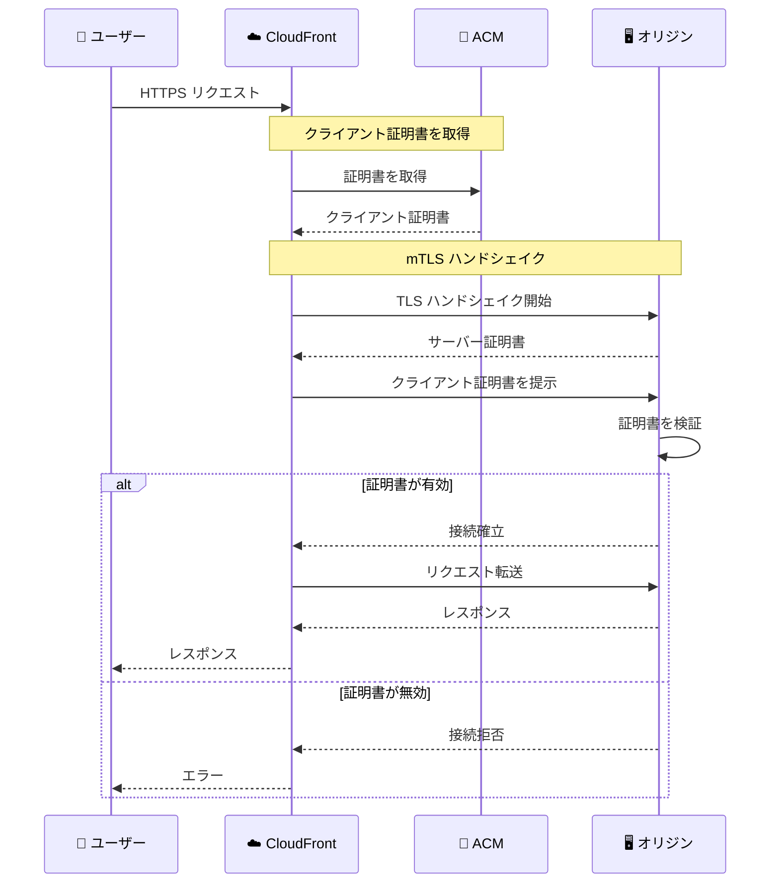

# Amazon CloudFront - オリジンへの相互 TLS 認証サポート

**リリース日**: 2026 年 2 月 2 日
**サービス**: Amazon CloudFront
**機能**: Mutual TLS (mTLS) for Origins

📊 [このアップデートのインフォグラフィックを見る](https://takech9203.github.io/aws-news-summary/20260202-amazon-cloudfront-mutual-tls-for-origins.html)

## 概要

Amazon CloudFront がオリジンサーバーへの相互 TLS 認証 (mTLS) をサポートするようになりました。この機能により、CloudFront ディストリビューションからオリジンサーバーへのリクエストが TLS 証明書を使用して認証され、認可された CloudFront ディストリビューションからのリクエストのみがオリジンに到達できることが保証されます。

従来、CloudFront からのリクエストを検証するには、共有シークレットヘッダーや IP 許可リストなどのカスタムセキュリティソリューションを構築・保守する必要がありました。オリジン mTLS により、これらの運用オーバーヘッドを排除し、証明書ベースの標準化されたアプローチを実装できます。

**アップデート前の課題**

- CloudFront からのリクエストを検証するためにカスタムセキュリティソリューションが必要だった
- 共有シークレットヘッダーの定期的なローテーションが運用負荷を増加させていた
- IP 許可リストの更新が必要で、メンテナンスが煩雑だった

**アップデート後の改善**

- 証明書ベースの標準的な認証アプローチを使用可能
- CloudFront の ID を暗号的に検証し、認可されたディストリビューションのみがオリジンに接続
- カスタムセキュリティソリューションの構築・保守が不要に

## アーキテクチャ図



CloudFront がオリジンに接続する際、クライアント証明書を提示し、オリジンサーバーがその証明書を検証してからリクエストを受け付けます。

## サービスアップデートの詳細

### 主要機能

1. **証明書ベースの認証**
   - CloudFront がクライアント証明書を使用してオリジンに認証
   - 認可された CloudFront ディストリビューションのみがオリジンに接続可能
   - カスタムセキュリティコントロールが不要

2. **柔軟な証明書管理**
   - AWS Private Certificate Authority (PCA) で発行された証明書をサポート
   - サードパーティのプライベート CA で発行された証明書を ACM 経由でインポート可能
   - 証明書のライフサイクル管理を AWS に委任

3. **幅広いオリジンサポート**
   - Application Load Balancer (ALB)
   - API Gateway
   - オンプレミスサーバー
   - カスタムオリジン
   - 外部 CDN

## 技術仕様

### サポートされるオリジンタイプ

| オリジンタイプ | サポート状況 |
|---------------|-------------|
| Application Load Balancer | ✅ |
| API Gateway | ✅ |
| オンプレミスサーバー | ✅ |
| カスタムオリジン | ✅ |
| サードパーティクラウド | ✅ |
| 外部 CDN | ✅ |

### 証明書要件

| 要件 | 詳細 |
|------|------|
| 証明書タイプ | X.509v3 |
| 拡張キー使用法 | clientAuth |
| 発行元 | AWS Private CA またはサードパーティプライベート CA |
| インポート方法 | AWS Certificate Manager (ACM) |

### 設定方法

#### AWS CLI での設定例

```bash
# ACM にクライアント証明書をインポート
aws acm import-certificate \
    --certificate file://certificate.pem \
    --private-key file://private-key.pem \
    --certificate-chain file://certificate-chain.pem \
    --region us-east-1

# CloudFront ディストリビューションでオリジン mTLS を設定
aws cloudfront update-distribution \
    --id EDFDVBD6EXAMPLE \
    --distribution-config '{
        "Origins": {
            "Items": [{
                "Id": "myOrigin",
                "DomainName": "origin.example.com",
                "CustomOriginConfig": {
                    "HTTPSPort": 443,
                    "OriginProtocolPolicy": "https-only",
                    "OriginMtls": {
                        "Enabled": true,
                        "CertificateArn": "arn:aws:acm:us-east-1:123456789012:certificate/abc123"
                    }
                }
            }]
        }
    }'
```

## 設定方法

### 前提条件

1. AWS アカウント
2. CloudFront ディストリビューション
3. mTLS をサポートするオリジンサーバー
4. AWS Private CA またはサードパーティ CA からの証明書

### 手順

#### ステップ 1: 証明書の準備

```bash
# AWS Private CA で証明書を発行
aws acm-pca issue-certificate \
    --certificate-authority-arn arn:aws:acm-pca:us-east-1:123456789012:certificate-authority/abc123 \
    --csr file://csr.pem \
    --signing-algorithm "SHA256WITHRSA" \
    --validity Value=365,Type="DAYS" \
    --template-arn arn:aws:acm-pca:::template/EndEntityCertificate/V1
```

AWS Private CA またはサードパーティ CA からクライアント証明書を発行します。

#### ステップ 2: 証明書を ACM にインポート

```bash
# 証明書を ACM にインポート
aws acm import-certificate \
    --certificate file://client-cert.pem \
    --private-key file://client-key.pem \
    --certificate-chain file://ca-chain.pem
```

発行された証明書を AWS Certificate Manager にインポートします。

#### ステップ 3: オリジンサーバーの設定

オリジンサーバーを mTLS を要求するように設定し、CloudFront の証明書を発行した CA を信頼するように構成します。

#### ステップ 4: CloudFront でオリジン mTLS を有効化

CloudFront コンソールまたは API を使用して、オリジン設定でクライアント証明書を指定します。

## メリット

### ビジネス面

- **セキュリティ強化**: 認可された CloudFront ディストリビューションのみがオリジンにアクセス可能
- **運用コスト削減**: カスタムセキュリティソリューションの構築・保守が不要
- **コンプライアンス対応**: ゼロトラストアーキテクチャの実装を支援

### 技術面

- **暗号的な ID 検証**: IP ベースや共有シークレットベースの認証より強力
- **標準化されたアプローチ**: 業界標準の mTLS プロトコルを使用
- **シームレスな統合**: ACM との統合により証明書管理が簡素化

## デメリット・制約事項

### 制限事項

- 証明書の管理と更新が必要
- オリジンサーバーが mTLS をサポートしている必要がある
- 初回接続時に若干のレイテンシオーバーヘッドが発生する可能性

### 考慮すべき点

- 証明書の有効期限管理を適切に行う必要がある
- オリジンサーバーのトラストストア設定が必要
- 証明書のローテーション計画を策定

## ユースケース

### ユースケース 1: プライベート API の保護

**シナリオ**: バックエンド API への直接アクセスを防ぎ、CloudFront 経由のアクセスのみを許可したい

**実装例**:
```bash
# ALB で mTLS を設定
aws elbv2 modify-listener \
    --listener-arn arn:aws:elasticloadbalancing:us-east-1:123456789012:listener/app/my-alb/... \
    --mutual-authentication Mode=verify,TrustStoreArn=arn:aws:elasticloadbalancing:...
```

**効果**: API Gateway や ALB への直接アクセス試行をブロックし、CloudFront 経由のトラフィックのみを許可

### ユースケース 2: オンプレミスオリジンの保護

**シナリオ**: オンプレミスのアプリケーションサーバーへのアクセスを CloudFront からのみに制限したい

**実装例**:
```nginx
# Nginx でクライアント証明書検証を設定
ssl_client_certificate /etc/nginx/certs/cloudfront-ca.crt;
ssl_verify_client on;
```

**効果**: オンプレミスサーバーへの不正アクセスを防止し、CloudFront を経由したトラフィックのみを受け入れ

### ユースケース 3: マルチ CDN 環境でのオリジン保護

**シナリオ**: 複数の CDN を使用しており、各 CDN からのリクエストを個別に認証したい

**実装例**:
```bash
# 各 CDN に異なるクライアント証明書を発行
# オリジンで証明書に基づいてトラフィックを識別・制御
```

**効果**: 各 CDN からのトラフィックを暗号的に識別し、アクセス制御を適用

## 料金

オリジン mTLS 機能自体に追加料金はありません。標準の CloudFront 料金が適用されます。Business および Premium フラットレートプランでも利用可能です。

関連するコスト:
- AWS Private CA: 証明書発行に対する料金
- AWS Certificate Manager: パブリック証明書は無料、プライベート証明書は PCA 料金が適用

## 利用可能リージョン

オリジン mTLS は CloudFront がサポートするすべてのリージョンで利用可能です。

## 関連サービス・機能

- **AWS Private Certificate Authority**: クライアント証明書の発行と管理
- **AWS Certificate Manager (ACM)**: 証明書のインポートと管理
- **CloudFront Viewer mTLS**: エンドユーザーとの相互 TLS 認証 (エンドツーエンドの mTLS)

## 参考リンク

- 📊 [インフォグラフィック](https://takech9203.github.io/aws-news-summary/20260202-amazon-cloudfront-mutual-tls-for-origins.html)
- [公式発表 (What's New)](https://aws.amazon.com/about-aws/whats-new/2026/01/amazon-cloudfront-mutual-tls-for-origins/)
- [AWS Blog - Amazon CloudFront now supports mTLS authentication to origins](https://aws.amazon.com/blogs/networking-and-content-delivery/amazon-cloudfront-now-supports-mtls-authentication-to-origins/)
- [CloudFront Origin mTLS ドキュメント](https://docs.aws.amazon.com/AmazonCloudFront/latest/DeveloperGuide/origin-mtls-authentication.html)
- [AWS Private CA ドキュメント](https://docs.aws.amazon.com/privateca/latest/userguide/PcaWelcome.html)

## まとめ

CloudFront のオリジン mTLS サポートは、オリジンサーバーのセキュリティを大幅に強化する機能です。証明書ベースの認証により、カスタムセキュリティソリューションを置き換え、運用オーバーヘッドを削減できます。ゼロトラストアーキテクチャを採用している組織や、オリジンへの不正アクセスを防止したい組織は、この機能の導入を検討することを強く推奨します。
