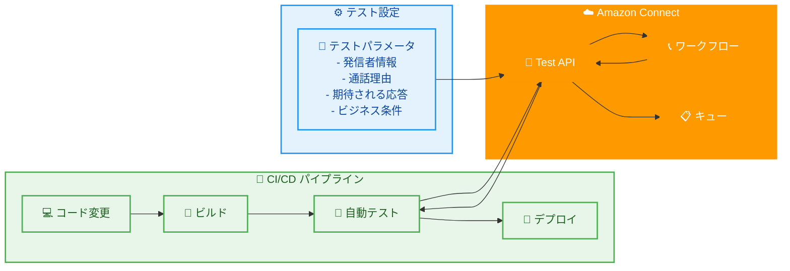

# Amazon Connect - ボイスインタラクションテスト API

**リリース日**: 2026 年 02 月 02 日
**サービス**: Amazon Connect
**機能**: ボイスインタラクションのテストとシミュレーション API

## 概要

Amazon Connect が、コンタクトセンターエクスペリエンスをシミュレートするテストを設定および実行するための API を提供開始しました。これらの API により、ワークフロー、セルフサービスボイスインタラクション、およびその結果を簡単に検証できます。これらの API を使用すると、発信者の電話番号や顧客プロファイル、通話の理由 (「注文ステータスを確認する必要がある」など)、期待される応答 (「リクエストは処理されました」など)、営業時間外シナリオやコールキューが満杯などのビジネス条件を含むテストパラメータをプログラムで設定できます。

このリリースにより、テストを CI/CD パイプラインに直接統合し、複数のテストを同時に実行してワークフローを大規模に検証し、デプロイメントサイクルの一部として自動回帰テストを有効にすることもできます。これらの機能により、ワークフローへの変更を迅速に検証し、新しいカスタマーエクスペリエンスを本番環境に自信を持ってデプロイできます。

これらの機能は、アジアパシフィック (ムンバイ)、アフリカ (ケープタウン)、ヨーロッパ (フランクフルト)、米国東部 (バージニア北部)、アジアパシフィック (ソウル)、ヨーロッパ (ロンドン)、アジアパシフィック (東京)、米国西部 (オレゴン)、アジアパシフィック (シンガポール)、アジアパシフィック (シドニー)、カナダ (中部) リージョンで利用可能です。

**アップデート前の課題**

- ワークフローとセルフサービスボイスインタラクションの検証が手動で時間がかかっていた
- CI/CD パイプラインにテストを統合する標準的な方法がなかった
- 大規模なワークフロー変更の回帰テストが困難だった
- 営業時間外やキュー満杯などのビジネス条件のテストが複雑だった
- テストの自動化と並列実行が限定的だった

**アップデート後の改善**

- API を使用してテストをプログラムで設定および実行可能
- CI/CD パイプラインに直接テストを統合可能
- 複数のテストを同時に実行してワークフローを大規模に検証可能
- 営業時間外やキュー満杯などのビジネス条件を簡単にシミュレート可能
- 自動回帰テストをデプロイメントサイクルの一部として実行可能

## アーキテクチャ図



この図は、Amazon Connect テスト API が CI/CD パイプラインに統合され、自動テストを実行する流れを示しています。

## サービスアップデートの詳細

### 主要機能

1. **プログラム可能なテスト設定**
   - 発信者の電話番号や顧客プロファイルを設定
   - 通話の理由と期待される応答を定義
   - 営業時間外やキュー満杯などのビジネス条件を指定
   - API を使用してテストパラメータを動的に設定

2. **CI/CD パイプライン統合**
   - テストを CI/CD パイプラインに直接統合
   - デプロイ前に自動的にワークフローを検証
   - 回帰テストを自動化してデプロイメントサイクルの一部として実行
   - テスト結果をパイプラインに返して自動判定

3. **大規模並列テスト**
   - 複数のテストを同時に実行
   - ワークフローを大規模に検証
   - テスト時間を大幅に短縮
   - 複雑なシナリオを効率的にテスト

4. **ビジネス条件のシミュレーション**
   - 営業時間外シナリオをシミュレート
   - コールキューが満杯の状態をテスト
   - さまざまなビジネス条件でワークフローを検証
   - 実際の運用環境を再現

## 技術仕様

### API パラメータ

| パラメータ | 説明 |
|----------|------|
| `callerPhoneNumber` | 発信者の電話番号 |
| `customerProfile` | 顧客プロファイル情報 |
| `callReason` | 通話の理由 (例: 「注文ステータスを確認する必要がある」) |
| `expectedResponse` | 期待される応答 (例: 「リクエストは処理されました」) |
| `businessConditions` | ビジネス条件 (例: 営業時間外、キュー満杯) |

### API エンドポイント

Amazon Connect は、テストの設定と実行のための以下の API を提供しています。

- `CreateTest`: 新しいテストを作成
- `UpdateTest`: 既存のテストを更新
- `RunTest`: テストを実行
- `GetTestResult`: テスト結果を取得
- `ListTests`: テストのリストを取得

詳細については、[Amazon Connect API リファレンス](https://docs.aws.amazon.com/connect/latest/APIReference/Welcome.html)を参照してください。

## 設定方法

### 前提条件

1. Amazon Connect インスタンスが作成されていること
2. テスト対象のワークフローが設定されていること
3. AWS CLI または SDK がインストールされていること
4. Amazon Connect API を呼び出す権限があること

### 手順

#### ステップ 1: テストの作成

```python
# Python SDK を使用してテストを作成
import boto3

connect = boto3.client('connect')

response = connect.create_test(
    InstanceId='your-instance-id',
    TestName='OrderStatusCheck',
    TestConfig={
        'callerPhoneNumber': '+1234567890',
        'customerProfile': {
            'customerId': 'CUST-12345'
        },
        'callReason': '注文ステータスを確認する必要がある',
        'expectedResponse': 'リクエストは処理されました',
        'businessConditions': {
            'afterHours': False,
            'queueFull': False
        }
    }
)

test_id = response['TestId']
print(f"Test created: {test_id}")
```

このコードは、新しいテストを作成し、テストパラメータを設定します。

#### ステップ 2: テストの実行

```python
# テストを実行
response = connect.run_test(
    InstanceId='your-instance-id',
    TestId=test_id
)

execution_id = response['ExecutionId']
print(f"Test execution started: {execution_id}")
```

このコードは、作成したテストを実行します。

#### ステップ 3: テスト結果の取得

```python
# テスト結果を取得
import time

# テストの完了を待つ
time.sleep(30)

response = connect.get_test_result(
    InstanceId='your-instance-id',
    ExecutionId=execution_id
)

result = response['TestResult']
print(f"Test result: {result['Status']}")
print(f"Details: {result['Details']}")
```

このコードは、テスト結果を取得し、成功または失敗を確認します。

## メリット

### ビジネス面

- **品質向上**: 自動テストによりワークフローの品質を向上
- **迅速なデプロイ**: CI/CD 統合により変更を迅速に検証してデプロイ
- **リスク軽減**: 回帰テストにより既存機能への影響を早期に検出
- **コスト削減**: 手動テストの時間とコストを削減

### 技術面

- **自動化**: テストを完全に自動化して効率を向上
- **並列実行**: 複数のテストを同時に実行して時間を短縮
- **CI/CD 統合**: デプロイメントパイプラインにシームレスに統合
- **柔軟性**: さまざまなビジネス条件とシナリオをテスト

## ユースケース

### ユースケース 1: CI/CD パイプラインでの自動回帰テスト

**シナリオ**: コンタクトセンターのワークフローを頻繁に更新しており、デプロイ前に自動的に回帰テストを実行したい。

**効果**: テスト API を CI/CD パイプラインに統合することで、変更が既存機能に影響を与えないことを自動的に検証し、自信を持ってデプロイできる。

### ユースケース 2: 営業時間外シナリオのテスト

**シナリオ**: 営業時間外に顧客が電話をかけた場合のワークフローが正しく機能することを確認したい。

**効果**: ビジネス条件として営業時間外を設定することで、実際に営業時間外を待つことなく、営業時間外シナリオをテストできる。

### ユースケース 3: 大規模ワークフローの並列テスト

**シナリオ**: 複数のワークフローを同時にテストして、全体のテスト時間を短縮したい。

**効果**: 複数のテストを並列実行することで、テスト時間を大幅に短縮し、迅速にフィードバックを得られる。

## 料金

Amazon Connect テスト API の使用に追加料金はかかりません。標準の Amazon Connect 料金が適用されます。

詳細な料金情報については、[Amazon Connect 料金ページ](https://aws.amazon.com/connect/pricing/)を参照してください。

## 利用可能リージョン

テスト API は以下のリージョンで利用可能です。

- アジアパシフィック (ムンバイ)
- アフリカ (ケープタウン)
- ヨーロッパ (フランクフルト)
- 米国東部 (バージニア北部)
- アジアパシフィック (ソウル)
- ヨーロッパ (ロンドン)
- アジアパシフィック (東京)
- 米国西部 (オレゴン)
- アジアパシフィック (シンガポール)
- アジアパシフィック (シドニー)
- カナダ (中部)

## 関連サービス・機能

- **Amazon Connect ワークフロー**: テスト対象のコンタクトフロー
- **AWS Lambda**: カスタムロジックの実装
- **Amazon CloudWatch**: テスト結果の監視とログ記録
- **AWS CodePipeline**: CI/CD パイプラインとの統合

## 参考リンク

- [公式発表 (What's New)](https://aws.amazon.com/about-aws/whats-new/2026/02/amazon-connect-provides-apis-test-simulate-voice-interactions/)
- [Amazon Connect API リファレンス](https://docs.aws.amazon.com/connect/latest/APIReference/Welcome.html)
- [Amazon Connect 管理者ガイド](https://docs.aws.amazon.com/connect/latest/adminguide/what-is-amazon-connect.html)

## まとめ

Amazon Connect のボイスインタラクションテスト API により、コンタクトセンターのワークフローとセルフサービスボイスインタラクションをプログラムで検証できるようになりました。CI/CD パイプラインに統合することで、変更を自動的にテストし、自信を持って本番環境にデプロイできます。複数のテストを並列実行して時間を短縮し、営業時間外やキュー満杯などのビジネス条件を簡単にシミュレートできます。コンタクトセンターのワークフローを頻繁に更新している場合は、この新しいテスト API の活用を検討してください。
