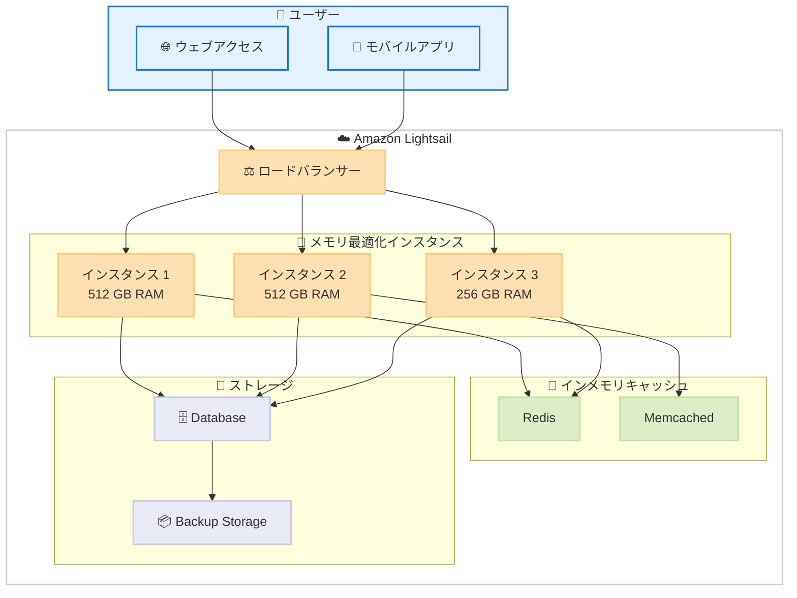

# Amazon Lightsail - メモリ最適化インスタンスバンドル

**リリース日**: 2026 年 2 月 2 日
**サービス**: Amazon Lightsail
**機能**: メモリ最適化インスタンスバンドル (最大 512 GB)

## 概要

Amazon Lightsail がメモリ最適化インスタンスバンドルを導入しました。最大 512 GB のメモリを搭載した 7 つのサイズのインスタンスが利用可能です。Linux および Windows OS と複数のアプリケーションブループリント、IPv6 のみおよびデュアルスタックネットワーク設定に対応します。

メモリ集約的なワークロード（インメモリデータベース、リアルタイムビッグデータ分析、高パフォーマンスコンピューティング）向けに設計されており、高い RAM-to-vCPU 比率を必要とするアプリケーション向けに最適化されています。

**アップデート前の課題**

- Lightsail の標準インスタンスではメモリが限定的で、メモリ集約的なワークロードに対応できない
- インメモリデータベース（Redis など）を大規模に運用できない
- ビッグデータ分析タスクのパフォーマンスが制限される
- 大規模データセット処理には EC2 への移行が必要だった

**アップデート後の改善**

- 最大 512 GB メモリのインスタンスが Lightsail で直接利用可能
- メモリ集約型ワークロードを Lightsail で実行可能に
- シンプルな管理画面で高性能インスタンスを運用
- EC2 への移行コストを削減

## サービスアップデートの詳細

### 主要機能

1. **複数メモリサイズのバンドル**
   - 7 つのサイズオプション (詳細な仕様は AWS ドキュメント参照)
   - 最大 512 GB メモリ搭載
   - スケーラブルな構成選択

2. **OS およびアプリケーションブループリント**
   - Linux: Amazon Linux、Ubuntu、CentOS、Debian、AlmaLinux
   - Windows オペレーティングシステム
   - アプリケーション: WordPress、cPanel & WHM、Plesk、Drupal、Magento、MEAN、LAMP、Node.js、Ruby on Rails

3. **ネットワーク構成**
   - IPv6 のみ
   - デュアルスタック (IPv4 + IPv6)

## 利用可能リージョン

Amazon Lightsail が利用可能なすべての AWS リージョンで提供されます。

## メリット

### ビジネス面

- **コスト最適化**: 必要な機能を Lightsail で実現、EC2 移行コスト削減
- **運用の簡素化**: 直感的なコンソールでメモリ集約型ワークロード管理
- **スケーラビリティ**: アプリケーション成長に応じた段階的スケーリング

### 技術面

- **パフォーマンス向上**: 十分なメモリにより、キャッシュ効率が向上
- **柔軟な構成**: アプリケーション特性に合わせたインスタンスサイズ選択
- **シンプルな管理**: Lightsail の使いやすいインターフェースで運用

## デメリット・制約事項

### 制限事項

- Lightsail の管理性は EC2 より限定的
- 複雑なネットワーク構成には EC2 のほうが適切な場合がある

### 考慮すべき点

- メモリサイズに応じた月額費用確認が必要
- 適切なバージョンの OS とアプリケーションの選択

## ユースケース

### ユースケース1: 中規模 Redis キャッシュ環境

**シナリオ**: 分散キャッシュレイヤーとして 256 GB 程度の Redis インスタンスを運用

**実装例**:
- メモリ最適化インスタンス (256 GB) を選択
- Redis ブループリント (またはカスタムインストール)
- デュアルスタック IP 設定で柔軟なネットワーク接続

**効果**: シンプルな管理画面でハイパフォーマンスなキャッシュレイヤーを構築

### ユースケース2: リアルタイムビッグデータ分析

**シナリオ**: Apache Spark を使用した大規模データ分析を運用

**実装例**:
- メモリ最適化インスタンス (512 GB) を選択
- LAMP または MEAN ブループリント
- ストレージスケーリングオプション

**効果**: EC2 より簡単に大規模分析環境を構築、運用コスト削減

### ユースケース3: 高性能企業向けアプリケーション

**シナリオ**: 複数のアプリケーションサーバーを統合するメモリ集約型サーバー

**実装例**:
- メモリ最適化インスタンス (128 GB～256 GB) を複数台
- Magento、Drupal など EC コマースプラットフォーム
- ロードバランシング構成

**効果**: シンプルな構成で複数のアプリケーション環境を効率的に運用

## アーキテクチャ図

メモリ最適化インスタンスを使用した高パフォーマンスアーキテクチャです。

## 技術仕様

| 項目 | 詳細 |
|------|------|
| メモリ範囲 | 最大 512 GB |
| サイズ | 7 種類のプリセット |
| OS | Linux (複数ディストリビューション)、Windows |
| ネットワーク | IPv6 のみ、デュアルスタック |
| アプリケーション | WordPress、cPanel、Plesk、Drupal、Magento、MEAN、LAMP、Node.js、Rails |
| 管理方法 | AWS Lightsail コンソール |

## 関連サービス・機能

- **Amazon Lightsail Load Balancer**: インスタンス間のトラフィック分散
- **Amazon Lightsail Database**: マネージドデータベース
- **Amazon CloudWatch**: モニタリング
- **Amazon EC2**: より高度な要件向けの選択肢

## 参考リンク

- [公式発表 (What's New)](https://aws.amazon.com/about-aws/whats-new/2026/02/amazon-lightsail-memory-optimized-instances/)
- [Amazon Lightsail 料金](https://aws.amazon.com/lightsail/pricing/)
- [Amazon Lightsail ドキュメント - リージョン](https://docs.aws.amazon.com/lightsail/latest/userguide/understanding-regions-and-availability-zones-in-amazon-lightsail.html)

## まとめ

メモリ最適化インスタンスバンドルにより、Amazon Lightsail の適用範囲が大幅に拡大しました。以前は EC2 への移行が必要だったメモリ集約型ワークロードが、Lightsail のシンプルな管理画面で実装可能になります。インメモリキャッシング、リアルタイム分析、高性能データベースなどのユースケースで、コスト効率と運用効率を同時に実現する重要なアップデートです。
