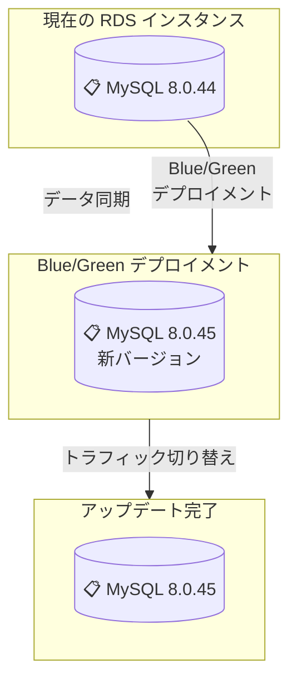

# Amazon RDS for MySQL - マイナーバージョン 8.0.45 および 8.4.8 対応

**リリース日**: 2026 年 2 月 2 日
**サービス**: Amazon RDS for MySQL
**機能**: MySQL マイナーバージョンアップデート対応

📊 [このアップデートのインフォグラフィックを見る](https://takech9203.github.io/aws-news-summary/20260202-amazon-rds-mysql-minor-versions.html)

## 概要

Amazon RDS for MySQL は、MySQL コミュニティがリリースした最新マイナーバージョン 8.0.45 および 8.4.8 のサポートを開始しました。これらの新しいバージョンには、セキュリティ脆弱性の修正、バグ修正、パフォーマンス改善、および新機能が含まれています。

RDS は自動マイナーバージョンアップグレード機能とマネージド Blue/Green デプロイメントを通じて、安全かつシンプルなアップデート方法を提供しています。

**アップデート前の課題**

- 古いマイナーバージョンに存在する既知のセキュリティ脆弱性に対応する必要があった
- バージョンアップデート時にダウンタイムを最小限に抑える方法が限定的だった
- 新しいバグ修正やパフォーマンス改善の恩恵を受けられなかった

**アップデート後の改善**

- MySQL コミュニティの最新マイナーバージョンでセキュリティ脆弱性に対応できるようになった
- 自動マイナーバージョンアップグレード機能でスケジュール内にアップデートを自動化可能
- マネージド Blue/Green デプロイメントでゼロダウンタイムでのアップデートが可能
- バグ修正とパフォーマンス改善の恩恵を受けられるようになった

## アーキテクチャ図



Blue/Green デプロイメントはアップデート中にダウンタイムなしで新しいバージョンに切り替えることができます。

## サービスアップデートの詳細

### 主要機能

1. **MySQL 8.0.45 対応**
   - MySQL 8.0 シリーズの最新マイナーバージョン
   - セキュリティ脆弱性修正を含む
   - バグ修正とパフォーマンス最適化

2. **MySQL 8.4.8 対応**
   - MySQL 8.4 シリーズの最新マイナーバージョン
   - 新機能と改善を含む

3. **自動マイナーバージョンアップグレード**
   - スケジュール メンテナンスウィンドウ中に自動アップグレード
   - 運用負荷の削減

4. **マネージド Blue/Green デプロイメント**
   - ゼロダウンタイムでのアップデート
   - より安全なバージョンアップグレード方法

## 技術仕様

| 項目 | 詳細 |
|------|------|
| 対応マイナーバージョン | 8.0.45、8.4.8 |
| 推奨アクション | セキュリティ脆弱性対応のためアップグレードを推奨 |
| アップグレード方法 | 自動アップグレード、マネージド Blue/Green デプロイメント |
| ダウンタイム | Blue/Green 使用時は最小限 |

## 設定方法

### 前提条件

1. AWS RDS Management Console へのアクセス権限
2. MySQL 互換性の確認
3. バックアップの取得

### 手順

#### ステップ 1: 自動マイナーバージョンアップグレードの有効化

AWS Management Console から RDS インスタンスの設定で「Auto Minor Version Upgrade」を有効にします。

```bash
# AWS CLI で有効化する場合
aws rds modify-db-instance \
    --db-instance-identifier your-instance-name \
    --auto-minor-version-upgrade \
    --apply-immediately
```

自動アップグレードはメンテナンスウィンドウ中に実行されます。

#### ステップ 2: マネージド Blue/Green デプロイメントでのアップグレード

RDS Management Console で「Create Blue/Green Deployment」を選択し、新しいバージョンを指定します。

```bash
# AWS CLI での作成例
aws rds create-blue-green-deployment \
    --blue-green-deployment-name my-upgrade \
    --source arn:aws:rds:region:account:db:instance-name
```

テスト後にトラフィックを切り替えます。

## メリット

### ビジネス面

- **セキュリティ向上**: 既知の脆弱性を解決し、システムセキュリティを強化
- **運用効率化**: 自動アップグレード機能で手動作業を削減
- **信頼性向上**: Blue/Green デプロイメントで低リスクでのアップデート

### 技術面

- **パフォーマンス改善**: MySQL コミュニティの最適化を享受
- **バグ修正**: 既知の問題が解決され、安定性が向上
- **新機能**: 最新 MySQL の新機能の利用が可能

## デメリット・制約事項

### 制限事項

- アップグレード前に互換性テストが必要な場合がある
- Blue/Green デプロイメント中は追加の RDS リソースが必要
- 大規模データベースのアップグレードには時間がかかる場合がある

### 考慮すべき点

- アプリケーションの MySQL 互換性を事前に確認
- 本番環境でのアップグレード前にテスト環境で検証
- バックアップを取得してからアップグレードを実行

## ユースケース

### ユースケース 1: セキュリティパッチの自動適用

**シナリオ**: 組織内の多数の RDS インスタンスに対して、セキュリティ脆弱性を定期的に自動修正したい

**実装例**: 自動マイナーバージョンアップグレードを有効化し、メンテナンスウィンドウを設定

**効果**: セキュリティ脆弱性への対応が自動化され、運用負荷が削減される

### ユースケース 2: ゼロダウンタイムでのアップグレード

**シナリオ**: 本番環境のデータベースを新しいバージョンにアップグレードしたいが、ダウンタイムは許容できない

**実装例**: マネージド Blue/Green デプロイメントでアップグレードを実行

**効果**: サービス中断なしに新しいバージョンに移行でき、顧客への影響がない

### ユースケース 3: パフォーマンス最適化

**シナリオ**: MySQL の最新パフォーマンス改善を活用したい

**実装例**: 新しいマイナーバージョンにアップグレード

**効果**: バグ修正とパフォーマンス改善により、クエリ実行速度が向上

## 料金

既存の RDS for MySQL 料金に変更はありません。マイナーバージョンのアップグレード自体に追加料金は不要です。マネージド Blue/Green デプロイメント使用時は、デプロイメント期間中の追加 RDS インスタンス料金が発生します。

## 利用可能リージョン

Amazon RDS for MySQL 8.0.45 および 8.4.8 は、Amazon RDS をサポートするすべての AWS リージョンで利用可能です。

## 関連サービス・機能

- **AWS Database Migration Service (DMS)**: MySQL データベースの移行
- **RDS バックアップ**: アップグレード前のデータ保護
- **AWS Systems Manager**: 複数 RDS インスタンスの一括管理
- **CloudWatch**: データベースパフォーマンスの監視

## 参考リンク

- [公式発表 (What's New)](https://aws.amazon.com/about-aws/whats-new/2026/02/amazon-rds-mysql-minor-versions/)
- [ドキュメント - MySQL バージョン管理](https://docs.aws.amazon.com/AmazonRDS/latest/UserGuide/MySQL.Concepts.VersionMgmt.html)
- [ドキュメント - インスタンスアップグレード](https://docs.aws.amazon.com/AmazonRDS/latest/UserGuide/USER_UpgradeDBInstance.MySQL.html)
- [ドキュメント - Blue/Green デプロイメント](https://docs.aws.amazon.com/AmazonRDS/latest/UserGuide/blue-green-deployments.html)
- [料金ページ](https://aws.amazon.com/rds/mysql/pricing/)

## まとめ

MySQL 8.0.45 および 8.4.8 のサポート開始により、セキュリティ脆弱性の修正とパフォーマンス改善が利用可能になりました。自動マイナーバージョンアップグレードとマネージド Blue/Green デプロイメントの組み合わせにより、安全かつ効率的なバージョン管理が実現できます。セキュリティを重視する組織は、早期のアップグレードを検討することをお勧めします。
