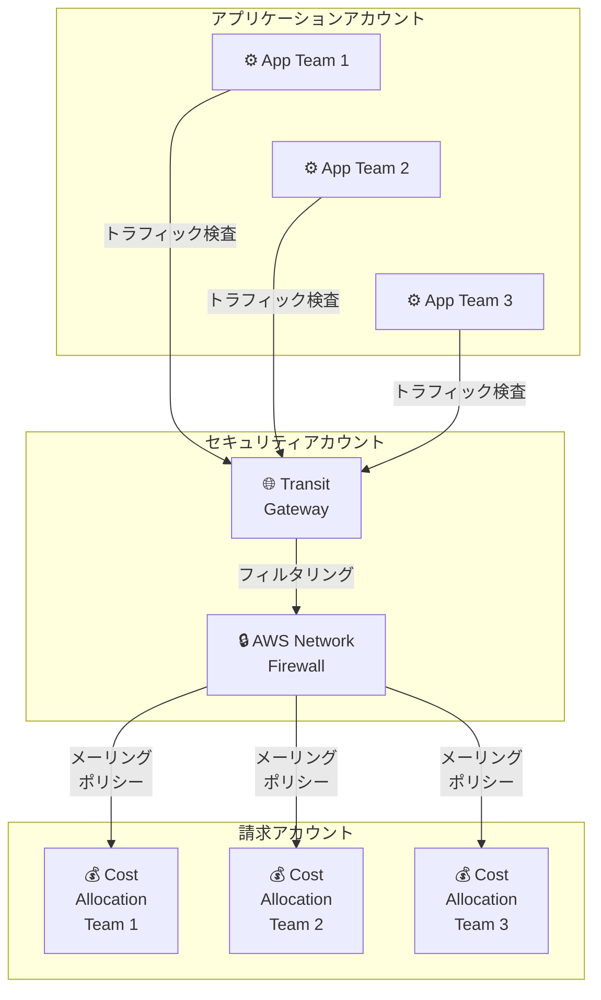

# AWS Network Firewall - GovCloud での柔軟なコスト配分対応

**リリース日**: 2026 年 2 月 2 日
**サービス**: AWS Network Firewall、AWS Transit Gateway
**機能**: Flexible Cost Allocation (柔軟なコスト配分)

📊 [このアップデートのインフォグラフィックを見る](https://takech9203.github.io/aws-news-summary/20260202-aws-flexible-cost-allocation-govcloud.html)

## 概要

AWS Network Firewall が AWS Transit Gateway のネイティブアタッチメントを通じて、AWS GovCloud (US) リージョンでのコスト配分機能をサポートしました。この機能により、集中管理されたファイアウォールのデータ処理コストを複数の AWS アカウント間で自動的に配分できるようになり、セキュリティと財務管理の効率化が実現されます。

組織は、ファイアウォール所有者アカウントにコストを集約するのではなく、実際の使用量に基づいて各アプリケーションチームに利用料金を自動配分できるようになりました。

**アップデート前の課題**

- 集中管理されたファイアウォール費用がすべてファイアウォール所有者アカウントに集約される
- アプリケーションチーム別の利用コストの可視化が困難
- チャージバック (内部請求) の仕組みを手動で構築する必要があった
- スケール環境でのコスト管理が複雑だった

**アップデート後の改善**

- メーリングポリシーでデータ処理コストを自動的に複数アカウントに配分
- 組織のチャージバック要件に基づいたコスト配分が可能
- セキュリティ統制を保ちながらコスト管理の分散化が実現
- カスタムコスト管理ソリューション開発が不要に

## アーキテクチャ図



メーリングポリシーにより、各アプリケーションチームの実際のトラフィック検査コストが自動配分されます。

## サービスアップデートの詳細

### 主要機能

1. **メーリングポリシー**
   - データ処理コストを複数アカウント間で自動配分
   - 組織のチャージバック要件に基づいた柔軟な設定

2. **Transit Gateway ネイティブアタッチメント対応**
   - Transit Gateway を通じた集中管理ファイアウォール
   - 複数アカウント間のコスト追跡

3. **使用量ベースのコスト配分**
   - 実際のデータ処理量に基づいたチャージバック
   - アプリケーションチームの利用コスト可視化

4. **GovCloud 対応**
   - AWS GovCloud (US-East) と AWS GovCloud (US-West) で利用可能

## 技術仕様

| 項目 | 詳細 |
|------|------|
| サービス | AWS Network Firewall + Transit Gateway |
| 対応リージョン | GovCloud (US-East)、GovCloud (US-West) |
| 配分方式 | メーリングポリシー |
| 課金ベース | データ処理量 (実際の使用量) |
| 追加料金 | なし (通常の Network Firewall、Transit Gateway 料金のみ) |

## 設定方法

### 前提条件

1. AWS GovCloud アカウントへのアクセス
2. AWS Network Firewall の構築済み環境
3. Transit Gateway の構築済み環境
4. Organization または複数アカウント管理の実装

### 手順

#### ステップ 1: Transit Gateway アタッチメント作成

AWS Management Console または CLI で Transit Gateway にネイティブアタッチメントを作成します。

```bash
# Transit Gateway アタッチメント作成
aws ec2 create-transit-gateway-attachment \
    --transit-gateway-id tgw-xxxxx \
    --resource-type network-interface \
    --resource-id eni-xxxxx \
    --region us-gov-east-1
```

Network Firewall エンドポイントを Transit Gateway に接続します。

#### ステップ 2: メーリングポリシー設定

```bash
# メーリングポリシーの作成
aws ec2 create-transit-gateway-route-table \
    --transit-gateway-id tgw-xxxxx \
    --region us-gov-east-1

# メーリングポリシー属性の設定
aws ec2 modify-transit-gateway-route-table-options \
    --transit-gateway-route-table-id tgw-rtb-xxxxx \
    --options MeteringPolicyState=enabled
```

メーリングポリシーを有効化し、コスト配分を開始します。

#### ステップ 3: アカウント別コスト追跡設定

AWS Cost Explorer または AWS Billing Console でコスト配分タグを設定し、各アカウントへの請求を確認します。

## メリット

### ビジネス面

- **コスト可視化**: アプリケーションチーム別の利用コストが明確に
- **チャージバック効率化**: 自動配分で財務管理業務が削減
- **予算管理**: 部門別の予算計画と実績管理が容易

### 技術面

- **スケーラビリティ**: 多数のアカウントで統制されたコスト管理
- **自動化**: 手動のコスト計算やチャージバックが不要
- **セキュリティ維持**: 集中管理ファイアウォールのセキュリティ統制を保持

## デメリット・制約事項

### 制限事項

- GovCloud リージョンのみの利用可能 (現在)
- Transit Gateway ネイティブアタッチメントが必須
- メーリングポリシーの詳細設定には運用経験が必要

### 考慮すべき点

- 複数アカウント管理体制の構築が前提
- メーリングポリシー設定の検証が重要
- 配分結果の監視と調整が必要な場合がある

## ユースケース

### ユースケース 1: 部門別チャージバック

**シナリオ**: 複数の事業部がそれぞれアカウントを持ち、集中管理ファイアウォール経由でインターネット接続をしている

**実装例**: メーリングポリシーを設定し、各事業部アカウントのトラフィック量に基づいてコストを配分

**効果**: 各事業部に対して利用量ベースの正確なチャージバック請求が可能

### ユースケース 2: クラウド利用コストの可視化

**シナリオ**: GovCloud でのセキュリティコストの透明性を求める政府機関

**実装例**: 複数アカウント間でのコスト配分ポリシーを設定し、部門別コスト追跡

**効果**: セキュリティ投資対効果の可視化

### ユースケース 3: 成長段階でのコスト管理

**シナリオ**: 新しいアプリケーションチームが増加し、ファイアウォール経由のトラフィックが増加している

**実装例**: メーリングポリシーで新チームの利用コストを自動配分

**効果**: スケール時のコスト管理が自動化される

## 料金

Flexible Cost Allocation 機能自体に追加料金はかかりません。AWS Network Firewall と AWS Transit Gateway の標準料金のみで利用可能です。

## 利用可能リージョン

現在、AWS GovCloud (US-East) と AWS GovCloud (US-West) でのみ利用可能です。他の商用リージョンへの対応は現在のところ発表されていません。

## 関連サービス・機能

- **AWS Transit Gateway**: 複数アカウント / VPC の統合管理
- **AWS Network Firewall**: 集中管理ファイアウォール
- **AWS Cost Explorer**: コスト分析と可視化
- **AWS Billing**: チャージバック管理

## 参考リンク

- [公式発表 (What's New)](https://aws.amazon.com/about-aws/whats-new/2026/01/aws-flexible-cost-allocation-govcloud/)
- [ドキュメント - Metering Policy](https://docs.aws.amazon.com/vpc/latest/tgw/metering-policy.html)
- [AWS Network Firewall 料金](https://aws.amazon.com/network-firewall/pricing/)
- [AWS Transit Gateway 料金](https://aws.amazon.com/transit-gateway/pricing/)

## まとめ

GovCloud での Flexible Cost Allocation の導入により、集中管理ファイアウォール環境でのコスト透明性と管理効率が大幅に向上します。政府機関や複数部門を持つ大規模組織にとって、このアップデートは財務管理とセキュリティ統制の両立に大きく貢献する機能です。GovCloud をご利用の組織は、この機能の導入を検討することをお勧めします。
