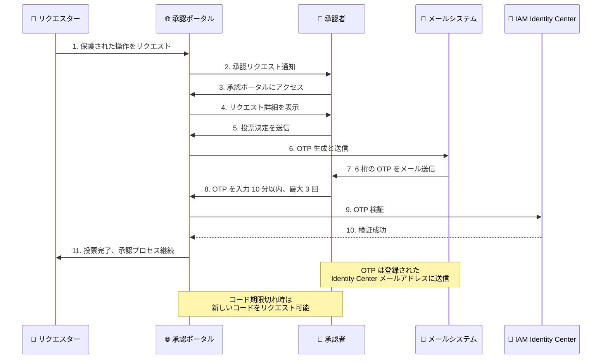

# AWS Multi-party approval - ワンタイムパスワード検証の必須化

**リリース日**: 2026 年 02 月 02 日
**サービス**: AWS Multi-party approval
**機能**: 投票時のワンタイムパスワード (OTP) 検証

## 概要

AWS Multi-party approval が、承認者の投票アクションにワンタイムパスワード (OTP) による検証を必須化しました。この追加のセキュリティ層により、AWS IAM Identity Center 管理者が、認証情報のリセットや認証エンドポイントの変更を通じて承認者になりすますことで、多者承認制御を回避することを防止します。

承認者が承認ポータルにアクセスし、保護された操作に対する投票を試みると、システムは 6 桁の検証コードを生成し、承認者の登録された AWS Identity Center メールアドレスに送信します。承認者は、このコードを 10 分以内に入力して投票を完了する必要があり、最大 3 回の試行が許可されます。

**アップデート前の課題**

このアップデート以前は、以下のような制限がありました。

- IAM Identity Center 管理者が、承認者の認証情報をリセットしたり、認証エンドポイントを変更したりすることで、承認者になりすまして投票できた
- 多者承認制御が、管理者の不正な操作によって回避される可能性があった
- 承認者の身元を確実に検証するための追加のセキュリティ層がなかった
- 承認プロセスのセキュリティが、認証システムのみに依存していた

**アップデート後の改善**

今回のアップデートにより、以下が可能になりました。

- 承認者のメールアドレスに送信される OTP により、承認者の身元を確実に検証できる
- IAM Identity Center 管理者による不正な承認者のなりすましを防止し、多者承認制御の整合性が保たれる
- 承認プロセスに追加のセキュリティ層が追加され、承認の信頼性が向上
- 承認者は、投票を送信する際にのみ OTP 検証が必要となり、承認リクエストの詳細は事前に確認できる

## アーキテクチャ図



この図は、承認者が投票を送信する際の OTP 検証フローを示しています。投票を送信する際にのみ OTP が要求され、承認者の身元が確実に検証されます。

## サービスアップデートの詳細

### 主要機能

1. **ワンタイムパスワード (OTP) による検証**
   - 承認者が投票を送信する際、6 桁の検証コードが生成される
   - コードは、承認者の登録された AWS Identity Center メールアドレスに送信される
   - 承認者は、コードを 10 分以内に入力する必要があり、最大 3 回の試行が許可される

2. **承認者のなりすまし防止**
   - IAM Identity Center 管理者が、承認者の認証情報をリセットしたり、認証エンドポイントを変更したりしても、OTP を持っていなければ投票できない
   - OTP は、承認者のメールアドレスにのみ送信されるため、管理者がアクセスできない
   - 多者承認制御の整合性が保たれ、承認プロセスのセキュリティが向上

3. **柔軟な OTP リクエスト**
   - 承認者がメールを受信できなかった場合や、コードの有効期限が切れた場合、新しいコードをリクエストできる
   - 承認ポータルのインターフェースから、簡単に新しいコードをリクエスト可能
   - 承認者は、投票決定を送信する前に、すべての承認リクエストの詳細を確認できる (OTP 検証は投票送信時のみ)

## 技術仕様

### OTP 検証の仕様

| 項目 | 詳細 |
|------|------|
| コード形式 | 6 桁の数字 |
| 送信先 | 承認者の登録された AWS Identity Center メールアドレス |
| 有効期限 | 10 分 |
| 最大試行回数 | 3 回 |
| リクエスト可能回数 | 制限なし (新しいコードをリクエスト可能) |

### 承認プロセスの流れ

1. **承認リクエストの受信**: 承認者は、保護された操作に対する承認リクエストを受信する
2. **承認ポータルへのアクセス**: 承認者は、承認ポータルにアクセスし、AWS IAM Identity Center で認証する
3. **リクエスト詳細の確認**: 承認者は、承認リクエストのすべての詳細を確認する (この時点では OTP は不要)
4. **投票決定の送信**: 承認者が投票決定 (承認または拒否) を送信すると、OTP 検証プロセスが開始される
5. **OTP の受信と入力**: 承認者は、メールで受信した 6 桁の OTP を 10 分以内に入力する
6. **投票の完了**: OTP が検証されると、投票が完了し、承認プロセスが継続される

## 設定方法

### 前提条件

1. AWS Multi-party approval が有効化されている
2. 承認者が AWS IAM Identity Center に登録されている
3. 承認者の Identity Center プロファイルにメールアドレスが登録されている
4. 保護された操作に対する承認ルールが設定されている

### 手順

#### ステップ 1: AWS Multi-party approval の有効化確認

```bash
# AWS Multi-party approval が有効化されていることを確認
# AWS Organizations で Multi-party approval を有効化している必要があります
```

AWS Organizations の設定で、Multi-party approval が有効化されていることを確認します。有効化されていない場合は、AWS Management Console から有効化します。

#### ステップ 2: 承認者の登録とメールアドレスの確認

```bash
# AWS IAM Identity Center で承認者のメールアドレスを確認
aws identitystore describe-user \
    --identity-store-id d-1234567890 \
    --user-id user-id-12345
```

承認者が AWS IAM Identity Center に登録されており、メールアドレスが設定されていることを確認します。OTP は、このメールアドレスに送信されます。

#### ステップ 3: 保護された操作の設定

```bash
# 保護された操作に対する承認ルールを設定
# AWS Management Console または AWS CLI を使用
```

保護された操作 (例: S3 バケットの削除、IAM ポリシーの変更など) に対する承認ルールを設定します。承認が必要な操作と、必要な承認者数を定義します。

#### ステップ 4: 承認ポータルへのアクセスとテスト

承認者は、承認ポータルにアクセスし、テスト承認リクエストを作成して、OTP 検証フローをテストします。

1. 承認ポータルにアクセス
2. AWS IAM Identity Center で認証
3. テスト承認リクエストを作成
4. 投票決定を送信
5. メールで OTP を受信
6. OTP を入力して投票を完了

#### ステップ 5: 承認者へのトレーニング

承認者に対して、OTP 検証プロセスについてトレーニングを実施します。

**トレーニング内容:**
- OTP が送信されるメールアドレスの確認
- OTP の有効期限 (10 分) と最大試行回数 (3 回) の理解
- メールを受信できなかった場合の対処方法 (新しいコードのリクエスト)
- 投票決定を送信する前に、承認リクエストの詳細を確認できることの理解

## メリット

### ビジネス面

- **セキュリティの強化**: IAM Identity Center 管理者による不正な承認者のなりすましを防止し、多者承認制御の整合性が保たれる
- **コンプライアンス対応**: 承認プロセスに追加のセキュリティ層が追加され、コンプライアンス要件を満たしやすくなる
- **信頼性の向上**: 承認者の身元を確実に検証することで、承認プロセスの信頼性が向上する

### 技術面

- **多層防御の実現**: 認証システムに加えて、OTP による検証を追加することで、多層防御が実現される
- **管理者権限の制限**: IAM Identity Center 管理者が、認証情報のリセットや認証エンドポイントの変更を通じて承認者になりすますことを防止
- **柔軟な OTP リクエスト**: 承認者がメールを受信できなかった場合や、コードの有効期限が切れた場合、新しいコードをリクエストできる
- **追加料金なし**: この機能は追加料金なしで利用可能

## デメリット・制約事項

### 制限事項

- 承認者は、投票を送信するたびに OTP を入力する必要があるため、承認プロセスに若干の時間がかかる
- 承認者がメールにアクセスできない場合、投票を完了できない
- OTP の有効期限は 10 分で、最大試行回数は 3 回に制限されている

### 考慮すべき点

- 承認者のメールアドレスが正しく登録されていることを確認する必要がある
- メールシステムが正常に動作していることを確認し、OTP メールが確実に配信されるようにする
- 承認者がメールにアクセスできない緊急時の対処方法を事前に計画する必要がある
- OTP 検証プロセスについて、承認者にトレーニングを実施する必要がある

## ユースケース

### ユースケース 1: 本番環境の重要なリソース削除の承認

**シナリオ**: 本番環境の S3 バケットや RDS データベースなどの重要なリソースを削除する際、複数の承認者による承認が必要。IAM Identity Center 管理者による不正な承認を防止したい。

**実装例**:
```bash
# 保護された操作として、S3 バケット削除を設定
# 承認ルール: 2 名の承認者による承認が必要

# 承認者 1 が投票
# 1. 承認ポータルにアクセス
# 2. リクエスト詳細を確認
# 3. 投票決定を送信
# 4. メールで OTP を受信
# 5. OTP を入力して投票を完了

# 承認者 2 が同様に投票
# 2 名の承認が完了すると、S3 バケット削除が実行される
```

**効果**: IAM Identity Center 管理者が、承認者の認証情報をリセットしても、OTP を持っていなければ投票できないため、不正な承認が防止される。

### ユースケース 2: IAM ポリシーの変更承認

**シナリオ**: 組織が、IAM ポリシーの変更に対して多者承認を要求している。特に、管理者権限を持つポリシーの変更には、複数の承認者による承認が必要。

**実装例**:
```bash
# 保護された操作として、IAM ポリシー変更を設定
# 承認ルール: 3 名の承認者による承認が必要

# リクエスター: IAM ポリシー変更をリクエスト
# 承認者 1、2、3: それぞれ投票決定を送信し、OTP を入力して投票を完了
# 3 名の承認が完了すると、IAM ポリシー変更が実行される
```

**効果**: IAM ポリシーの変更に対して、確実に複数の承認者による承認が得られ、不正な変更が防止される。

### ユースケース 3: 緊急時のアクセス承認

**シナリオ**: 緊急時に、通常はアクセスが制限されているリソースへのアクセスが必要な場合、複数の承認者による承認を経て、一時的なアクセスを許可する。

**実装例**:
```bash
# 保護された操作として、緊急アクセスを設定
# 承認ルール: 2 名の承認者による承認が必要

# リクエスター: 緊急アクセスをリクエスト
# 承認者 1、2: 緊急性を確認し、投票決定を送信
# OTP を入力して投票を完了
# 2 名の承認が完了すると、一時的なアクセスが許可される
```

**効果**: 緊急時でも、複数の承認者による承認を経ることで、不正なアクセスが防止され、セキュリティが保たれる。

## 料金

AWS Multi-party approval の OTP 検証機能は、追加料金なしで利用できます。Multi-party approval 自体も追加料金なしで利用可能です。

## 利用可能リージョン

この機能は、AWS Multi-party approval が提供されているすべての AWS リージョンで利用可能です。

**利用可能なリージョン:**
- すべての商用 AWS リージョン
- AWS GovCloud (US) リージョン

詳細は [AWS Regional Services List](https://aws.amazon.com/about-aws/global-infrastructure/regional-product-services/) を参照してください。

## 関連サービス・機能

- **AWS IAM Identity Center**: 承認者の認証とメールアドレス管理を提供する
- **AWS Organizations**: Multi-party approval を有効化し、組織全体で承認ルールを管理する
- **AWS CloudTrail**: 承認プロセスのすべてのアクションをログに記録し、監査証跡を提供する
- **Amazon SES**: OTP メールの送信に使用される (内部的に)

## 参考リンク

- [公式発表 (What's New)](https://aws.amazon.com/about-aws/whats-new/2026/02/aws-multi-party-approval-requires-one-time-password-verification-for-voting/)
- [AWS Multi-party approval ドキュメント](https://docs.aws.amazon.com/organizations/latest/userguide/multi-party-approval.html)

## まとめ

AWS Multi-party approval のワンタイムパスワード (OTP) 検証機能は、承認プロセスに追加のセキュリティ層を追加し、IAM Identity Center 管理者による不正な承認者のなりすましを防止する重要なアップデートです。OTP により承認者の身元を確実に検証することで、多者承認制御の整合性が保たれ、組織のセキュリティとコンプライアンスが強化されます。追加料金なしで利用でき、すべての Multi-party approval が提供されているリージョンで利用可能なため、多者承認を使用しているすべてのお客様が導入を検討すべき機能です。承認者のメールアドレスが正しく登録されていることを確認し、OTP 検証プロセスについて承認者にトレーニングを実施することで、スムーズな導入が可能です。
