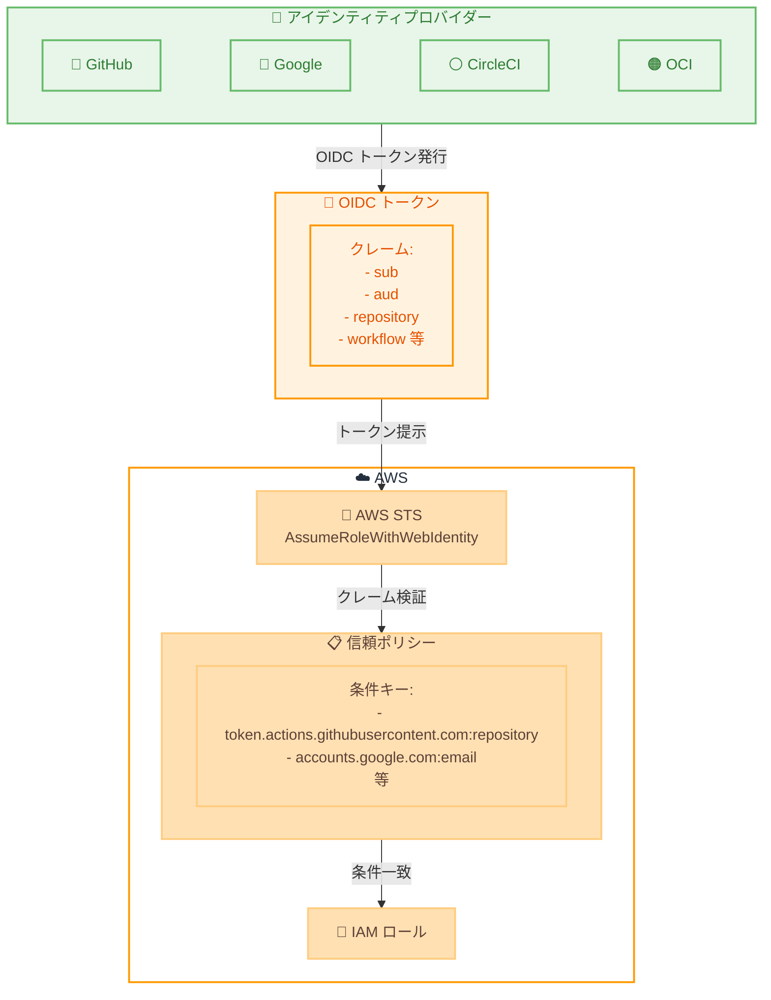

# AWS STS - アイデンティティプロバイダー固有クレームの検証サポート

**リリース日**: 2026 年 2 月 2 日
**サービス**: AWS Security Token Service (STS)
**機能**: Identity Provider Claims Validation

📊 [このアップデートのインフォグラフィックを見る](https://takech9203.github.io/awsnews-summary/20260202-aws-sts-supports-validation-identity-provider-claims.html)

## 概要

AWS Security Token Service (STS) が、Google、GitHub、CircleCI、Oracle Cloud Infrastructure (OCI) からの特定のアイデンティティプロバイダー固有クレームの検証をサポートするようになりました。この機能により、OpenID Connect (OIDC) フェデレーションを使用した AssumeRoleWithWebIdentity API 呼び出しにおいて、IAM ロール信頼ポリシーとリソースコントロールポリシーでこれらのカスタムクレームを条件キーとして参照できるようになります。

この拡張により、フェデレーテッドアイデンティティに対するきめ細かなアクセス制御を実装し、データ境界の確立を支援します。

**アップデート前の課題**

- 標準的な OIDC クレームのみが条件キーとして使用可能だった
- プロバイダー固有のカスタムクレームを信頼ポリシーで参照できなかった
- GitHub Actions や CircleCI などの CI/CD パイプラインからのアクセス制御が制限されていた

**アップデート後の改善**

- Google、GitHub、CircleCI、OCI の特定クレームを条件キーとして使用可能
- より詳細なアクセス制御ポリシーを実装可能
- CI/CD パイプラインからの AWS アクセスをより安全に制御

## アーキテクチャ図



外部 IdP から発行された OIDC トークンのプロバイダー固有クレームを AWS STS が検証し、IAM ロールの信頼ポリシーで条件として使用できます。

## サービスアップデートの詳細

### 主要機能

1. **プロバイダー固有クレームの検証**
   - GitHub: リポジトリ、ワークフロー、ブランチなどのクレーム
   - Google: メールアドレス、ドメインなどのクレーム
   - CircleCI: プロジェクト、ジョブなどのクレーム
   - OCI: コンパートメント、テナンシーなどのクレーム

2. **IAM ポリシーでの条件キー使用**
   - IAM ロール信頼ポリシーでカスタムクレームを条件として指定可能
   - リソースコントロールポリシー (RCP) でも使用可能
   - きめ細かなアクセス制御を実装

3. **データ境界の強化**
   - 特定のリポジトリ、ワークフロー、環境からのみアクセスを許可
   - 不正なアクセス試行をブロック

## 技術仕様

### サポートされるプロバイダーとクレーム例

| プロバイダー | 条件キープレフィックス | 主なクレーム例 |
|-------------|----------------------|---------------|
| GitHub | token.actions.githubusercontent.com | repository, workflow, ref, environment |
| Google | accounts.google.com | email, email_verified, hd |
| CircleCI | oidc.circleci.com | project_id, vcs_url |
| OCI | identity.oraclecloud.com | tenancy_id, compartment_id |

### GitHub Actions 用信頼ポリシー例

```json
{
    "Version": "2012-10-17",
    "Statement": [
        {
            "Effect": "Allow",
            "Principal": {
                "Federated": "arn:aws:iam::123456789012:oidc-provider/token.actions.githubusercontent.com"
            },
            "Action": "sts:AssumeRoleWithWebIdentity",
            "Condition": {
                "StringEquals": {
                    "token.actions.githubusercontent.com:aud": "sts.amazonaws.com"
                },
                "StringLike": {
                    "token.actions.githubusercontent.com:sub": "repo:my-org/my-repo:*",
                    "token.actions.githubusercontent.com:repository": "my-org/my-repo"
                }
            }
        }
    ]
}
```

### CircleCI 用信頼ポリシー例

```json
{
    "Version": "2012-10-17",
    "Statement": [
        {
            "Effect": "Allow",
            "Principal": {
                "Federated": "arn:aws:iam::123456789012:oidc-provider/oidc.circleci.com/org/my-org-id"
            },
            "Action": "sts:AssumeRoleWithWebIdentity",
            "Condition": {
                "StringEquals": {
                    "oidc.circleci.com/org/my-org-id:aud": "my-org-id",
                    "oidc.circleci.com/org/my-org-id:project_id": "my-project-uuid"
                }
            }
        }
    ]
}
```

## 設定方法

### 前提条件

1. AWS アカウント
2. IAM OIDC プロバイダーの設定
3. 対象の外部 IdP (GitHub, Google, CircleCI, OCI) のアカウント

### 手順

#### ステップ 1: OIDC プロバイダーの作成

```bash
# GitHub Actions 用 OIDC プロバイダーを作成
aws iam create-open-id-connect-provider \
    --url https://token.actions.githubusercontent.com \
    --client-id-list sts.amazonaws.com \
    --thumbprint-list 6938fd4d98bab03faadb97b34396831e3780aea1
```

対象の IdP に対応する OIDC プロバイダーを作成します。

#### ステップ 2: IAM ロールと信頼ポリシーの作成

```bash
# 信頼ポリシーを含む IAM ロールを作成
aws iam create-role \
    --role-name GitHubActionsRole \
    --assume-role-policy-document file://trust-policy.json
```

プロバイダー固有のクレームを条件に含む信頼ポリシーを設定した IAM ロールを作成します。

#### ステップ 3: GitHub Actions ワークフローでの使用

```yaml
# .github/workflows/deploy.yml
jobs:
  deploy:
    runs-on: ubuntu-latest
    permissions:
      id-token: write
      contents: read
    steps:
      - name: Configure AWS credentials
        uses: aws-actions/configure-aws-credentials@v4
        with:
          role-to-assume: arn:aws:iam::123456789012:role/GitHubActionsRole
          aws-region: us-east-1
```

GitHub Actions ワークフローで OIDC を使用して AWS 認証情報を取得します。

## メリット

### ビジネス面

- **セキュリティ強化**: 特定のリポジトリやプロジェクトからのみアクセスを許可
- **コンプライアンス対応**: データ境界の確立と監査証跡の改善
- **運用効率**: 長期認証情報の管理が不要

### 技術面

- **きめ細かな制御**: プロバイダー固有の属性に基づくアクセス制御
- **標準準拠**: OIDC 標準に基づく安全なフェデレーション
- **柔軟性**: 複数の IdP と条件を組み合わせた複雑なポリシーが可能

## デメリット・制約事項

### 制限事項

- サポートされる IdP は現時点で Google、GitHub、CircleCI、OCI に限定
- すべてのプロバイダー固有クレームがサポートされているわけではない
- IAM OIDC プロバイダーの事前設定が必要

### 考慮すべき点

- クレーム値の変更に注意 (リポジトリ名の変更など)
- 条件キーの正確な構文を確認
- IdP 側の設定も適切に行う必要がある

## ユースケース

### ユースケース 1: GitHub Actions からの安全なデプロイ

**シナリオ**: 特定のリポジトリの main ブランチからのみ本番環境にデプロイを許可したい

**実装例**:
```json
{
    "Condition": {
        "StringEquals": {
            "token.actions.githubusercontent.com:repository": "my-org/my-app",
            "token.actions.githubusercontent.com:ref": "refs/heads/main"
        }
    }
}
```

**効果**: 本番環境へのデプロイを特定のリポジトリとブランチに制限

### ユースケース 2: Google Workspace ユーザーのアクセス制御

**シナリオ**: 特定のドメインの Google アカウントからのみ AWS リソースへのアクセスを許可したい

**実装例**:
```json
{
    "Condition": {
        "StringEquals": {
            "accounts.google.com:hd": "mycompany.com",
            "accounts.google.com:email_verified": "true"
        }
    }
}
```

**効果**: 会社ドメインの確認済みメールアドレスを持つユーザーのみアクセスを許可

### ユースケース 3: CircleCI パイプラインの分離

**シナリオ**: 各プロジェクトの CircleCI パイプラインを専用の IAM ロールに制限したい

**実装例**:
```json
{
    "Condition": {
        "StringEquals": {
            "oidc.circleci.com/org/my-org-id:project_id": "project-uuid-123"
        }
    }
}
```

**効果**: 特定のプロジェクトからのみ IAM ロールを引き受け可能

## 料金

この機能に追加料金はありません。AWS STS の標準料金が適用されます (AssumeRoleWithWebIdentity は無料)。

## 利用可能リージョン

この機能は、AWS STS が利用可能なすべての AWS リージョンで利用可能です。

## 関連サービス・機能

- **AWS IAM Identity Center**: 組織全体のアイデンティティ管理
- **AWS IAM Roles Anywhere**: X.509 証明書ベースのフェデレーション
- **AWS Organizations SCP**: サービスコントロールポリシーとの連携

## 参考リンク

- 📊 [インフォグラフィック](https://takech9203.github.io/awsnews-summary/20260202-aws-sts-supports-validation-identity-provider-claims.html)
- [公式発表 (What's New)](https://aws.amazon.com/about-aws/whats-new/2026/01/aws-sts-supports-validation-identity-provider-claims)
- [IAM OIDC フェデレーション ドキュメント](https://docs.aws.amazon.com/IAM/latest/UserGuide/id_roles_providers_oidc.html)
- [GitHub Actions OIDC 設定ガイド](https://docs.github.com/en/actions/deployment/security-hardening-your-deployments/configuring-openid-connect-in-amazon-web-services)

## まとめ

AWS STS のアイデンティティプロバイダー固有クレーム検証サポートは、CI/CD パイプラインや外部 IdP からの AWS アクセスをより安全に制御するための重要な機能です。GitHub Actions、Google、CircleCI、OCI からのアクセスを特定のリポジトリ、プロジェクト、ドメインに制限することで、セキュリティを強化しながら開発者体験を損なうことなくワークフローを自動化できます。OIDC フェデレーションを使用している組織は、この機能を活用してデータ境界を確立し、最小権限の原則を適用することを推奨します。
