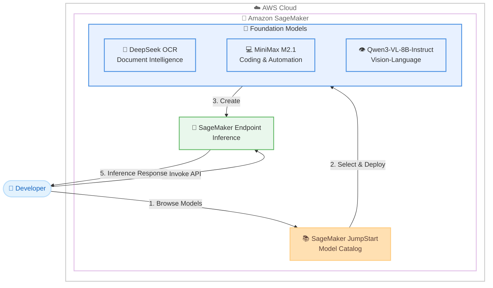

# Amazon SageMaker JumpStart - 新規基盤モデル追加

**リリース日**: 2026 年 2 月 2 日
**サービス**: Amazon SageMaker JumpStart
**機能**: DeepSeek OCR、MiniMax M2.1、Qwen3-VL-8B-Instruct モデルの提供開始

## 概要

AWS は、Amazon SageMaker JumpStart で DeepSeek OCR、MiniMax M2.1、Qwen3-VL-8B-Instruct の 3 つの新しい基盤モデルの提供を開始しました。これらのモデルは、ドキュメントインテリジェンス、多言語コーディング、高度なマルチモーダル推論、ビジョン言語理解など、特化した機能を提供し、AWS インフラストラクチャ上で多様なユースケースに対応する高度な AI アプリケーションの構築を可能にします。

各モデルは異なるエンタープライズ AI の課題に対応する専門的な機能を備えています。DeepSeek OCR はドキュメント処理のためのビジュアルテキスト圧縮を探求し、複雑なドキュメントから構造化情報を抽出できます。MiniMax M2.1 はコーディング、ツール使用、指示追従、長期計画に最適化されており、多言語ソフトウェア開発の自動化と複雑な複数ステップのオフィスワークフローを実行できます。Qwen3-VL-8B-Instruct は優れたテキスト理解と生成、深いビジュアル認識と推論、拡張されたコンテキスト長、強化された空間理解とビデオダイナミクス理解、強力なエージェントインタラクション機能を提供します。

SageMaker JumpStart を使用することで、お客様は数回のクリックでこれらのモデルをデプロイし、特定の AI ユースケースに対応できます。

**アップデート前の課題**

- 特定のドキュメント処理タスクに最適化された基盤モデルが限られており、フォーム、請求書、図表、複雑なテキストレイアウトを持つドキュメントから構造化情報を効率的に抽出することが困難でした
- 多言語ソフトウェア開発の自動化や複雑な複数ステップのワークフローを実行できる基盤モデルの選択肢が限られていました
- ビジョンと言語を統合した高度な推論能力を持つコンパクトなモデルが不足しており、マルチモーダル AI アプリケーションの構築に制約がありました

**アップデート後の改善**

- DeepSeek OCR により、ドキュメント処理に特化したビジュアルテキスト圧縮技術を活用し、フォーム、請求書、図表などの複雑なドキュメントから高精度で構造化情報を抽出できるようになりました
- MiniMax M2.1 により、コーディング、ツール使用、指示追従、長期計画に最適化されたモデルを使用して、多言語ソフトウェア開発を自動化し、複雑なオフィスワークフローを実行できるようになりました
- Qwen3-VL-8B-Instruct により、優れたテキスト理解と生成、深いビジュアル認識と推論、拡張されたコンテキスト処理、強化された空間とビデオダイナミクス理解を持つマルチモーダルモデルをデプロイできるようになりました

## アーキテクチャ図



この図は、開発者が SageMaker JumpStart のモデルカタログから新しい基盤モデルを選択し、SageMaker エンドポイントとしてデプロイして推論 API を呼び出す基本的なワークフローを示しています。

## サービスアップデートの詳細

### 主要機能

1. **DeepSeek OCR - ドキュメントインテリジェンス**
   - ドキュメント処理のためのビジュアルテキスト圧縮技術を探求
   - フォーム、請求書、図表、複雑なテキストレイアウトを持つドキュメントから構造化情報を抽出
   - 密なテキストレイアウトを持つ複雑なドキュメントの処理に最適化

2. **MiniMax M2.1 - コーディングと自動化**
   - コーディング、ツール使用、指示追従、長期計画に最適化
   - 多言語ソフトウェア開発の自動化を実現
   - 複雑な複数ステップのオフィスワークフローを実行
   - 開発者が自律的なアプリケーションを構築することを支援

3. **Qwen3-VL-8B-Instruct - ビジョン言語理解**
   - 優れたテキスト理解と生成能力
   - 深いビジュアル認識と推論機能
   - 拡張されたコンテキスト長のサポート
   - 強化された空間理解とビデオダイナミクス理解
   - 強力なエージェントインタラクション機能

## 技術仕様

### モデル比較

| モデル | 主要機能 | 最適なユースケース |
|------|----------|-------------------|
| DeepSeek OCR | ビジュアルテキスト圧縮、ドキュメント構造理解 | フォーム処理、請求書抽出、複雑なドキュメント分析 |
| MiniMax M2.1 | コーディング、ツール使用、長期計画 | 多言語ソフトウェア開発、オフィスワークフロー自動化 |
| Qwen3-VL-8B-Instruct | マルチモーダル理解、拡張コンテキスト、空間・ビデオ理解 | ビジョン言語タスク、マルチモーダル AI アプリケーション |

### デプロイメント方法

SageMaker JumpStart では、以下の 2 つの方法でモデルをデプロイできます。

1. **SageMaker コンソール**: JumpStart モデルカタログから数回のクリックでデプロイ
2. **SageMaker Python SDK**: プログラマティックにモデルをデプロイ

## 設定方法

### 前提条件

1. AWS アカウントと適切な IAM 権限
2. Amazon SageMaker へのアクセス権限
3. モデルをホストするための SageMaker エンドポイントの作成権限

### 手順

#### ステップ 1: SageMaker コンソールから JumpStart にアクセス

AWS マネジメントコンソールから Amazon SageMaker サービスを開き、左側のナビゲーションメニューから「JumpStart」を選択します。

#### ステップ 2: モデルを選択

JumpStart モデルカタログで以下のいずれかのモデルを検索します。

- DeepSeek OCR
- MiniMax M2.1
- Qwen3-VL-8B-Instruct

#### ステップ 3: モデルをデプロイ

選択したモデルの詳細ページで「Deploy」ボタンをクリックし、エンドポイント設定を行います。インスタンスタイプと初期インスタンス数を選択し、デプロイを開始します。

#### ステップ 4: Python SDK を使用したデプロイ

```python
from sagemaker.jumpstart.model import JumpStartModel

# モデル ID を指定してモデルをデプロイ
model = JumpStartModel(model_id="<model-id>")
predictor = model.deploy()

# 推論を実行
response = predictor.predict({"inputs": "your input data"})
```

モデル ID は SageMaker JumpStart のドキュメントまたはコンソールから取得できます。このコードは、指定したモデルを SageMaker エンドポイントとしてデプロイし、推論を実行します。

## メリット

### ビジネス面

- **特化した AI 機能へのアクセス**: ドキュメント処理、コーディング自動化、マルチモーダル理解など、特定のビジネスニーズに最適化されたモデルを簡単に利用可能
- **開発期間の短縮**: 事前トレーニング済みの基盤モデルを数回のクリックでデプロイできるため、AI アプリケーションの開発期間を大幅に短縮
- **多様なユースケースへの対応**: 3 つの異なる特性を持つモデルにより、ドキュメント分析からソフトウェア開発自動化、ビジョン AI まで幅広いユースケースに対応可能

### 技術面

- **簡単なデプロイメント**: SageMaker JumpStart により、コンソールまたは Python SDK から数回のクリックまたはコマンドでモデルをデプロイ可能
- **スケーラブルなインフラストラクチャ**: SageMaker のマネージド推論エンドポイントにより、自動スケーリングと高可用性を実現
- **最新の AI モデルへのアクセス**: 最新の基盤モデルを AWS インフラストラクチャ上で即座に利用可能

## デメリット・制約事項

### 制限事項

- モデルごとに異なるインスタンスタイプの推奨があり、適切なインスタンスタイプの選択が必要です
- 一部のモデルは特定のリージョンでのみ利用可能な場合があります
- モデルのファインチューニングには追加の設定とトレーニングデータが必要です

### 考慮すべき点

- 各モデルの特性を理解し、ユースケースに最適なモデルを選択する必要があります
- 推論コストはインスタンスタイプとリクエスト数に依存するため、コスト最適化の検討が必要です
- モデルのライセンスと使用条件を確認し、エンドユーザーライセンス契約に同意する必要がある場合があります

## ユースケース

### ユースケース 1: ドキュメント処理の自動化

**シナリオ**: 金融機関が大量の請求書やフォームから構造化データを抽出し、自動処理パイプラインを構築したい場合

**実装例**:
```python
from sagemaker.jumpstart.model import JumpStartModel

# DeepSeek OCR モデルをデプロイ
model = JumpStartModel(model_id="deepseek-ocr")
predictor = model.deploy()

# ドキュメント画像から構造化データを抽出
response = predictor.predict({"image": document_image})
extracted_data = response["structured_output"]
```

**効果**: 手動でのデータ入力作業を削減し、ドキュメント処理の精度と速度を向上させることができます。

### ユースケース 2: コーディングアシスタントの構築

**シナリオ**: ソフトウェア開発チームが多言語コーディングをサポートする AI アシスタントを構築し、開発者の生産性を向上させたい場合

**実装例**:
```python
from sagemaker.jumpstart.model import JumpStartModel

# MiniMax M2.1 モデルをデプロイ
model = JumpStartModel(model_id="minimax-m2-1")
predictor = model.deploy()

# コーディングタスクを実行
response = predictor.predict({
    "instruction": "Python で CSV ファイルを読み込み、データをフィルタリングする関数を作成してください"
})
generated_code = response["output"]
```

**効果**: 多言語でのコード生成とツール使用を自動化し、開発者の生産性を大幅に向上させることができます。

### ユースケース 3: マルチモーダル AI アプリケーション

**シナリオ**: E コマースサイトが商品画像とテキスト説明を組み合わせて、より詳細な商品分析とレコメンデーションを提供したい場合

**実装例**:
```python
from sagemaker.jumpstart.model import JumpStartModel

# Qwen3-VL-8B-Instruct モデルをデプロイ
model = JumpStartModel(model_id="qwen3-vl-8b-instruct")
predictor = model.deploy()

# 画像とテキストを組み合わせた推論
response = predictor.predict({
    "image": product_image,
    "text": "この商品の特徴を詳しく説明してください"
})
analysis = response["output"]
```

**効果**: ビジョンと言語を統合した深い理解により、より正確な商品分析とパーソナライズされたレコメンデーションを提供できます。

## 料金

SageMaker JumpStart のモデル料金は、モデルをホストする SageMaker エンドポイントのインスタンスタイプと稼働時間に基づいて課金されます。

### 料金体系

- **推論エンドポイント**: 使用するインスタンスタイプと稼働時間に応じて課金
- **データ転送**: AWS リージョン間のデータ転送には追加料金が発生する場合があります

### 料金例

料金はリージョンとインスタンスタイプにより異なります。詳細は [Amazon SageMaker 料金ページ](https://aws.amazon.com/sagemaker/pricing/) をご確認ください。

| インスタンスタイプ | 月額料金（概算・30 日稼働） |
|-------------------|----------------------------|
| ml.g5.xlarge | 約 $700 USD |
| ml.g5.2xlarge | 約 $1,100 USD |

注: 実際の料金は使用状況とリージョンにより異なります。

## 利用可能リージョン

SageMaker JumpStart は複数の AWS リージョンで利用可能です。利用可能なリージョンの詳細については、[Amazon SageMaker のリージョン別サービス一覧](https://aws.amazon.com/about-aws/global-infrastructure/regional-product-services/) をご確認ください。

## 関連サービス・機能

- **Amazon SageMaker Studio**: JumpStart モデルのブラウズとデプロイのための統合開発環境
- **Amazon SageMaker Endpoints**: モデルの推論を実行するためのマネージドエンドポイント
- **Amazon SageMaker Python SDK**: プログラマティックにモデルをデプロイおよび管理するための SDK
- **AWS Marketplace**: 追加のサードパーティ製基盤モデルへのアクセス

## 参考リンク

- [公式発表 (What's New)](https://aws.amazon.com/about-aws/whats-new/2026/01/new-models-on-sagemaker-jumpstart/)
- [Amazon SageMaker JumpStart ドキュメント](https://docs.aws.amazon.com/sagemaker/latest/dg/studio-jumpstart.html)
- [SageMaker Python SDK での基盤モデル使用方法](https://docs.aws.amazon.com/sagemaker/latest/dg/jumpstart-foundation-models-use-python-sdk.html)
- [Amazon SageMaker 料金](https://aws.amazon.com/sagemaker/pricing/)

## まとめ

Amazon SageMaker JumpStart での DeepSeek OCR、MiniMax M2.1、Qwen3-VL-8B-Instruct の提供開始により、お客様はドキュメント処理、コーディング自動化、マルチモーダル AI など、特化した機能を持つ最新の基盤モデルを数回のクリックで簡単にデプロイできるようになりました。これらのモデルは、幅広いエンタープライズ AI ユースケースに対応し、開発期間の短縮とビジネス価値の向上を実現します。SageMaker JumpStart のモデルカタログから目的に合ったモデルを選択し、AI アプリケーションの構築を今すぐ開始してください。
