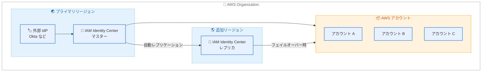

# AWS IAM Identity Center - マルチリージョン対応

**リリース日**: 2026 年 2 月 3 日
**サービス**: AWS IAM Identity Center
**機能**: マルチリージョンサポート

📊 [このアップデートのインフォグラフィックを見る](https://takech9203.github.io/aws-news-summary/20260203-aws-iam-identity-center-multi-region-aws-account-access-and-application-deployment.html)

## 概要

AWS IAM Identity Center が複数の AWS リージョンでの運用をサポートするようになりました。この機能により、プライマリリージョンで有効化した IAM Identity Center を追加のリージョンにレプリケートできます。これにより、ユーザーの AWS アカウントへのアクセスの回復力が向上し、アプリケーションのデータレジデンシー要件やユーザーへの近接性に基づいたリージョン選択が可能になります。

プライマリリージョンで障害が発生した場合でも、追加リージョンで既にプロビジョニングされた権限を使用して、ユーザーは引き続き AWS アカウントにアクセスできます。

**アップデート前の課題**

- IAM Identity Center は単一リージョンでのみ運用可能だった
- プライマリリージョンの障害時にユーザーが AWS アカウントにアクセスできなくなるリスクがあった
- アプリケーションのリージョン要件に合わせた柔軟なデプロイが困難だった

**アップデート後の改善**

- ID、権限、その他の情報が自動的に追加リージョンにレプリケートされる
- プライマリリージョン障害時も追加リージョンからアカウントアクセスを継続可能
- AWS アプリケーションを最適なリージョンにデプロイしながら、Identity Center は一元管理

## アーキテクチャ図



プライマリリージョンから追加リージョンへの自動レプリケーションにより、高可用性を実現します。

## サービスアップデートの詳細

### 主要機能

1. **自動レプリケーション**
   - ID 情報、権限、その他の設定を自動的にレプリケート
   - プライマリリージョンでの変更が追加リージョンに同期
   - 管理はプライマリリージョンで一元的に実施

2. **回復力の向上**
   - プライマリリージョン障害時も追加リージョンからアクセス継続
   - 既にプロビジョニングされた権限を使用
   - ユーザーへの影響を最小化

3. **柔軟なアプリケーションデプロイ**
   - AWS アプリケーションを最適なリージョンにデプロイ可能
   - データレジデンシー要件への対応
   - ユーザーへの近接性に基づくリージョン選択

## 技術仕様

### 前提条件

| 要件 | 詳細 |
|------|------|
| IdP 接続 | 外部 ID プロバイダー (Okta など) に接続された組織インスタンス |
| KMS 設定 | マルチリージョン対応のカスタマー管理キー (CMK) |
| リージョン | 17 のデフォルト有効商用リージョン |

### API 変更履歴

| 日付 | サービス | 変更内容 |
|------|----------|----------|
| 2026/02/03 | [AWS Single Sign-On Admin](https://awsapichanges.com/archive/changes/104e8e-sso.html) | 4 new 2 updated methods - マルチリージョンレプリケーションをサポートする新しい Region 管理 API を追加 |

### サポートされる AWS アプリケーション

追加リージョンでのデプロイをサポートする AWS アプリケーションについては、[AWS applications that you can use with IAM Identity Center](https://docs.aws.amazon.com/singlesignon/latest/userguide/awsapps-that-work-with-identity-center.html) を参照してください。

## 設定方法

### 前提条件

1. 外部 ID プロバイダー (Okta など) に接続された IAM Identity Center 組織インスタンス
2. マルチリージョン対応のカスタマー管理 KMS キー
3. 追加リージョンの有効化

### 手順

#### ステップ 1: マルチリージョン KMS キーの作成

```bash
aws kms create-key \
    --description "IAM Identity Center Multi-Region Key" \
    --multi-region
```

マルチリージョン対応の KMS キーを作成します。

#### ステップ 2: IAM Identity Center でマルチリージョンを有効化

AWS マネジメントコンソールの IAM Identity Center から、追加リージョンへのレプリケーションを設定します。

#### ステップ 3: レプリケーション状態の確認

```bash
aws sso-admin list-instances --region ap-northeast-1
aws sso-admin list-instances --region us-east-1
```

プライマリリージョンと追加リージョンの両方でインスタンスが利用可能か確認します。

## メリット

### ビジネス面

- **事業継続性の向上**: リージョン障害時もユーザーアクセスを維持
- **コンプライアンス対応**: データレジデンシー要件への対応
- **グローバル展開の効率化**: ユーザーに近いリージョンからのアクセス

### 技術面

- **高可用性**: 複数リージョンでの冗長構成
- **一元管理**: プライマリリージョンでの統合管理を維持
- **自動同期**: 手動でのレプリケーション作業が不要

## デメリット・制約事項

### 制限事項

- 外部 IdP (Okta など) に接続された組織インスタンスのみサポート
- マルチリージョン対応の KMS キーが必須
- 17 のデフォルト有効商用リージョンでのみ利用可能

### 考慮すべき点

- KMS キーの追加コストが発生
- レプリケーション遅延による一時的な不整合の可能性
- 追加リージョンでのアプリケーション対応状況の確認が必要

## ユースケース

### ユースケース 1: リージョン障害対策

**シナリオ**: プライマリリージョンの障害時にもユーザーが AWS リソースにアクセスできるようにする

**実装例**:
```
プライマリ: ap-northeast-1 (東京)
追加リージョン: us-east-1 (バージニア北部)
```

**効果**: 東京リージョン障害時もバージニア北部経由でアカウントアクセスを継続

### ユースケース 2: データレジデンシー対応

**シナリオ**: EU のデータレジデンシー要件に対応しながら、グローバルな ID 管理を実現

**実装例**:
```
プライマリ: eu-west-1 (アイルランド)
追加リージョン: eu-central-1 (フランクフルト)
```

**効果**: EU 内でデータを保持しながら、複数リージョンでの冗長性を確保

### ユースケース 3: グローバル分散チーム対応

**シナリオ**: 世界各地の開発者が最寄りのリージョンから低レイテンシーでアクセス

**実装例**:
```
プライマリ: ap-northeast-1 (東京)
追加リージョン: us-west-2 (オレゴン)、eu-west-1 (アイルランド)
```

**効果**: APAC、Americas、EMEA の各チームが最適なリージョンからアクセス

## 料金

IAM Identity Center 自体は追加料金なしで利用可能です。マルチリージョン KMS キーの使用に対して標準の [AWS KMS 料金](https://aws.amazon.com/kms/pricing/) が適用されます。

### 料金例

| 項目 | 料金 |
|------|------|
| KMS キー保管 | $1.00 / 月 / リージョン |
| KMS API リクエスト | $0.03 / 10,000 リクエスト |

## 利用可能リージョン

17 のデフォルト有効商用 AWS リージョンで利用可能です。詳細は [AWS リージョン一覧](https://docs.aws.amazon.com/accounts/latest/reference/manage-acct-regions.html#manage-acct-regions-regional-availability) を参照してください。

## 関連サービス・機能

- **AWS KMS**: マルチリージョンキーによる暗号化
- **AWS Organizations**: 組織全体の ID 管理
- **外部 IdP 連携**: Okta、Azure AD、Ping Identity など

## 参考リンク

- 📊 [インフォグラフィック](https://takech9203.github.io/aws-news-summary/20260203-aws-iam-identity-center-multi-region-aws-account-access-and-application-deployment.html)
- [公式発表 (What's New)](https://aws.amazon.com/about-aws/whats-new/2026/02/aws-iam-identity-center-multi-region-aws-account-access-and-application-deployment/)
- [IAM Identity Center 製品ページ](https://aws.amazon.com/iam/identity-center/)
- [IAM Identity Center ユーザーガイド - マルチリージョン](https://docs.aws.amazon.com/singlesignon/latest/userguide/multi-region-iam-identity-center.html)
- [AWS KMS 料金](https://aws.amazon.com/kms/pricing/)

## まとめ

IAM Identity Center のマルチリージョンサポートは、エンタープライズ組織の事業継続性とグローバル展開を大幅に強化する重要な機能です。外部 IdP を使用している組織は、プライマリリージョン障害時のリスク軽減のために、マルチリージョン構成への移行を検討してください。
