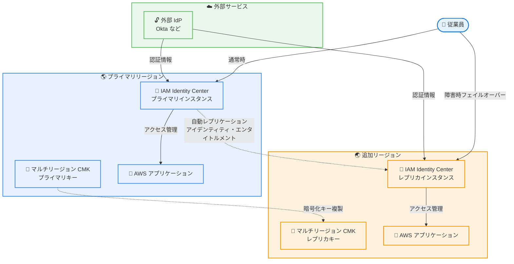

# AWS IAM Identity Center - マルチリージョンデプロイメント

**リリース日**: 2026年02月03日
**サービス**: AWS IAM Identity Center
**機能**: マルチリージョンデプロイメントのサポート

📊 [このアップデートのインフォグラフィックを見る](https://takech9203.github.io/aws-news-summary/20260203-aws-iam-identity-center-multi-region-deployment.html)
<!-- GitLab Pages URL: https://takech9203.github.io/aws-news-summary/20260203-aws-iam-identity-center-multi-region-deployment.html -->

## 概要

AWS IAM Identity Center が、プライマリ AWS リージョンから追加のリージョンへのレプリケーションをサポートするマルチリージョンデプロイメントを発表しました。この機能により、組織はプライマリリージョンで障害が発生した場合でも、従業員のアクセスを継続できるようになり、レジリエンスが大幅に向上します。

この機能は、外部アイデンティティプロバイダー (Okta など) を使用している組織向けに設計されており、アイデンティティ、エンタイトルメント、その他の情報が自動的に追加リージョンにレプリケートされます。AWS アプリケーションを追加リージョンにデプロイする際も、標準のワークフローを使用できます。

**アップデート前の課題**

- プライマリリージョンで障害が発生した場合、IAM Identity Center を使用したユーザーアクセスが中断される可能性があった
- 災害復旧シナリオにおいて、アイデンティティ管理の継続性を確保することが困難だった
- リージョン障害時に従業員が AWS アカウントやアプリケーションにアクセスできなくなるリスクがあった

**アップデート後の改善**

- プライマリリージョンで障害が発生しても、追加リージョンから継続的にユーザーアクセスを提供できるようになった
- アイデンティティ、エンタイトルメント、設定情報が自動的に複数リージョンに複製され、管理負荷が軽減された
- ビジネス継続性とディザスタリカバリ戦略において、アイデンティティ管理の信頼性が向上した

## アーキテクチャ図



この図は、プライマリリージョンから追加リージョンへの自動レプリケーションと、障害時のフェイルオーバーフローを示しています。

## サービスアップデートの詳細

### 主要機能

1. **マルチリージョン自動レプリケーション**
   - アイデンティティ情報が自動的に追加リージョンに複製される
   - エンタイトルメント (アクセス権限) も同期される
   - 設定情報やポリシーも一貫して複製される

2. **レジリエンス強化**
   - プライマリリージョンで障害が発生しても、追加リージョンからアクセスを継続
   - RTO (目標復旧時間) と RPO (目標復旧時点) の大幅な改善
   - ビジネス継続性の向上

3. **AWS アプリケーションのマルチリージョン展開**
   - 標準ワークフローで AWS アプリケーションを追加リージョンにデプロイ可能
   - 既存のデプロイメントプロセスとの統合が容易
   - 一貫したアクセス制御を複数リージョンで実現

## 技術仕様

### 前提条件

| 項目 | 詳細 |
|------|------|
| 組織インスタンス | 17 の商用 AWS リージョンで利用可能 |
| 外部 IdP | 必須 (例: Okta, Azure AD など) |
| KMS キー | マルチリージョンカスタマー管理キーが必要 |
| リージョン | プライマリリージョン + 追加リージョン |

### マルチリージョン KMS キーの要件

AWS IAM Identity Center のマルチリージョンデプロイメントでは、マルチリージョンカスタマー管理キー (CMK) の使用が必須です。これにより、複数リージョン間で暗号化されたデータを一貫して保護できます。

```json
{
  "KeyPolicy": {
    "Version": "2012-10-17",
    "Statement": [
      {
        "Sid": "Enable IAM Identity Center to use the key",
        "Effect": "Allow",
        "Principal": {
          "Service": "sso.amazonaws.com"
        },
        "Action": [
          "kms:Decrypt",
          "kms:DescribeKey",
          "kms:CreateGrant"
        ],
        "Resource": "*"
      }
    ]
  }
}
```

### レプリケーション対象データ

- ユーザーおよびグループ情報
- AWS アカウントへのアクセス権限設定
- アプリケーションへのアクセス権限設定
- パーミッションセット
- 組織設定

## 設定方法

### 前提条件

1. AWS Organizations で組織インスタンスが有効化されている
2. 外部アイデンティティプロバイダー (Okta など) が設定されている
3. マルチリージョンカスタマー管理キーが作成されている
4. 追加リージョンが利用可能な 17 の商用 AWS リージョンのいずれかである

### 手順

#### ステップ 1: マルチリージョン KMS キーの作成

```bash
# プライマリリージョンでマルチリージョン KMS キーを作成
aws kms create-key \
  --multi-region \
  --description "Multi-Region key for IAM Identity Center" \
  --key-usage ENCRYPT_DECRYPT \
  --origin AWS_KMS \
  --region us-east-1
```

プライマリリージョンでマルチリージョン KMS キーを作成します。このキーは、IAM Identity Center がデータを暗号化するために使用されます。

#### ステップ 2: レプリカキーの作成

```bash
# 追加リージョンでレプリカキーを作成
aws kms replicate-key \
  --key-id <primary-key-id> \
  --replica-region us-west-2 \
  --region us-east-1
```

追加リージョンでレプリカキーを作成します。これにより、複数リージョン間で同じキーマテリアルを使用できます。

#### ステップ 3: IAM Identity Center のマルチリージョン設定

AWS Management Console から IAM Identity Center の設定を開き、マルチリージョンデプロイメントを有効化します。追加リージョンとマルチリージョン KMS キーを指定します。

#### ステップ 4: レプリケーションの確認

```bash
# レプリケーションステータスの確認
aws sso-admin describe-instance \
  --instance-arn <instance-arn> \
  --region us-west-2
```

追加リージョンで IAM Identity Center インスタンスが正常にレプリケートされていることを確認します。

## メリット

### ビジネス面

- **ビジネス継続性の向上**: リージョン障害時でも従業員のアクセスを維持でき、業務の中断を最小限に抑えられる
- **コンプライアンス要件の充足**: データレジデンシーや災害復旧に関する規制要件に対応しやすくなる
- **運用負荷の軽減**: 手動での災害復旧手順が不要になり、IT 運用チームの負担が削減される

### 技術面

- **自動レプリケーション**: アイデンティティとエンタイトルメントが自動的に複製されるため、手動同期が不要
- **高可用性の実現**: 複数リージョンでのアクティブ・アクティブ構成により、可用性が大幅に向上
- **シームレスなフェイルオーバー**: プライマリリージョン障害時に、追加リージョンへの自動フェイルオーバーが可能

## デメリット・制約事項

### 制限事項

- 外部アイデンティティプロバイダー (Okta など) の使用が必須
- マルチリージョンカスタマー管理キーの作成と管理が必要
- 組織インスタンスのみサポート (アカウントインスタンスは非対応)

### 考慮すべき点

- AWS KMS のマルチリージョンキー使用に対する料金が発生する
- 追加リージョンへのレプリケーションに若干の遅延が発生する可能性がある
- 初期セットアップには既存の IAM Identity Center 設定の見直しが必要

## ユースケース

### ユースケース 1: グローバル企業の災害復旧

**シナリオ**: 複数のリージョンでビジネスを展開するグローバル企業が、リージョン障害時でも従業員のアクセスを継続したい。

**実装例**:
```bash
# プライマリリージョン: us-east-1
# 追加リージョン: eu-west-1, ap-southeast-1

# マルチリージョン KMS キーの作成
aws kms create-key --multi-region --region us-east-1

# 各リージョンでレプリカキーを作成
aws kms replicate-key --key-id <key-id> --replica-region eu-west-1
aws kms replicate-key --key-id <key-id> --replica-region ap-southeast-1

# IAM Identity Center でマルチリージョンを有効化
```

**効果**: 北米リージョンで障害が発生しても、欧州やアジアパシフィックリージョンから従業員がアクセスを継続でき、ビジネスの中断を回避できる。

### ユースケース 2: コンプライアンス対応

**シナリオ**: 金融機関が、規制要件により複数リージョンでのデータレジデンシーとディザスタリカバリを求められている。

**実装例**:
```bash
# プライマリリージョン: us-east-1 (米国)
# 追加リージョン: eu-central-1 (ドイツ)

# 各リージョンでマルチリージョン KMS キーを使用
# IAM Identity Center のマルチリージョンデプロイメントを設定
```

**効果**: 各地域のデータレジデンシー要件を満たしつつ、リージョン障害時の継続性も確保できる。

### ユースケース 3: ミッションクリティカルなワークロード

**シナリオ**: 24 時間 365 日の稼働が求められるミッションクリティカルなアプリケーションで、アイデンティティ管理の可用性を最大化したい。

**実装例**:
```bash
# プライマリリージョン: us-east-1
# 追加リージョン: us-west-2

# 同一国内の複数リージョンでマルチリージョンデプロイメント
# アプリケーションも両リージョンにデプロイ
```

**効果**: プライマリリージョンで障害が発生しても、追加リージョンから即座にサービスを継続でき、ダウンタイムを最小化できる。

## 料金

AWS IAM Identity Center 自体は追加料金なしで提供されます。ただし、マルチリージョンデプロイメントを使用する場合、以下の料金が発生します。

### 料金例

| 使用量 | 月額料金 (概算) |
|--------|-----------------|
| マルチリージョン KMS キー (2 リージョン) | $2.00 (各リージョン $1.00) |
| KMS API リクエスト (10,000 リクエスト/月) | $0.03 |
| 合計 | 約 $2.03/月 |

**注意**: 上記は KMS 料金の概算です。実際の料金は使用量やリージョンによって異なります。詳細は AWS KMS の料金ページをご確認ください。

## 利用可能リージョン

以下の 17 の商用 AWS リージョンで組織インスタンスのマルチリージョンデプロイメントが利用可能です。

- 米国東部 (バージニア北部) - us-east-1
- 米国東部 (オハイオ) - us-east-2
- 米国西部 (オレゴン) - us-west-2
- 欧州 (アイルランド) - eu-west-1
- 欧州 (ロンドン) - eu-west-2
- 欧州 (フランクフルト) - eu-central-1
- アジアパシフィック (東京) - ap-northeast-1
- アジアパシフィック (シンガポール) - ap-southeast-1
- アジアパシフィック (シドニー) - ap-southeast-2
- その他の商用リージョン

## 関連サービス・機能

- **AWS Organizations**: IAM Identity Center の組織インスタンスを管理する基盤サービス
- **AWS KMS**: マルチリージョンカスタマー管理キーによるデータ暗号化を提供
- **外部アイデンティティプロバイダー (Okta, Azure AD など)**: ユーザー認証とアイデンティティ情報のソース

## 参考リンク

- 📊 [インフォグラフィック](https://takech9203.github.io/aws-news-summary/20260203-aws-iam-identity-center-multi-region-deployment.html)
- [公式発表 (What's New)](https://aws.amazon.com/about-aws/whats-new/2026/02/aws-iam-identity-center-multi-region-deployment/)
- [ドキュメント](https://docs.aws.amazon.com/singlesignon/latest/userguide/multi-region-deployment.html)
- [AWS KMS マルチリージョンキー](https://docs.aws.amazon.com/kms/latest/developerguide/multi-region-keys-overview.html)

## まとめ

AWS IAM Identity Center のマルチリージョンデプロイメントは、組織のアイデンティティ管理のレジリエンスを大幅に向上させる重要なアップデートです。プライマリリージョンで障害が発生した場合でも、従業員のアクセスを継続できるため、ビジネス継続性とディザスタリカバリ戦略において大きな価値を提供します。外部アイデンティティプロバイダーとマルチリージョン KMS キーを使用することで、セキュアかつ自動的なレプリケーションが実現されます。ミッションクリティカルなワークロードや、グローバルに展開する企業にとって、この機能の導入を検討することを強く推奨します。
