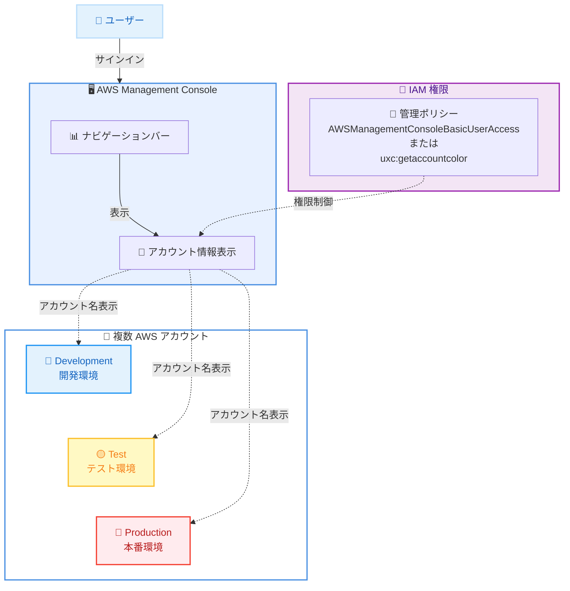

# AWS Management Console - ナビゲーションバーへのアカウント名表示

**リリース日**: 2026 年 02 月 03 日
**サービス**: AWS Management Console
**機能**: ナビゲーションバーでのアカウント名表示

## 概要

AWS Management Console が、すべてのパブリックリージョンでナビゲーションバーにアカウント名を表示する機能の一般提供を開始しました。これにより、AWS のお客様は、アカウントをひと目で簡単に識別できるようになります。ユーザーは、そのアカウントで承認されたすべてのユーザーに表示されるナビゲーションバーのアカウント名を使用して、アカウントを視覚的にすばやく区別できるようになります。

AWS のお客様は、開発環境と本番環境で異なるアカウントを維持したり、異なるビジネスユニット用にアカウントを分けたりするなど、ワークロードを分離するために複数のアカウントを管理しています。以前は、ユーザーはアカウント番号に依存してアカウントを識別する必要がありました。この新機能により、承認されたすべてのユーザーは、ナビゲーションバーに表示されるアカウント名を使用してアカウントをすばやく識別できるようになります。

**アップデート前の課題**

このアップデート以前は、以下のような制限がありました。

- ユーザーは 12 桁のアカウント番号でアカウントを識別する必要があり、視覚的に区別しにくかった
- 複数のアカウントを切り替える際に、どのアカウントにサインインしているか確認するためにアカウント番号を確認する必要があった
- 開発環境と本番環境のアカウントを間違えるリスクがあり、誤った環境での操作につながる可能性があった
- アカウント番号だけでは、そのアカウントの目的や用途がわかりにくかった

**アップデート後の改善**

今回のアップデートにより、以下が可能になりました。

- ナビゲーションバーにアカウント名が表示され、アカウントをひと目で識別可能
- 開発環境、本番環境、テスト環境などの名前を付けることで、視覚的に区別しやすくなる
- アカウント番号を記憶したり確認したりする必要がなくなり、ユーザーエクスペリエンスが向上
- アカウントの誤操作リスクが低減され、より安全な運用が可能

## アーキテクチャ図



この図は、AWS Management Console のナビゲーションバーにアカウント名が表示され、ユーザーが複数のアカウントを視覚的に区別できることを示しています。

## サービスアップデートの詳細

### 主要機能

1. **ナビゲーションバーへのアカウント名表示**
   - AWS Management Console の上部ナビゲーションバーにアカウント名が表示される
   - アカウントにサインインしている間、常にアカウント名が表示される
   - アカウント名は、そのアカウントで承認されたすべてのユーザーに表示される

2. **視覚的な識別の向上**
   - アカウント番号ではなく、わかりやすいアカウント名で識別可能
   - 開発環境、テスト環境、本番環境など、目的に応じた名前を付けることで視覚的に区別できる
   - アカウント名は管理者が設定可能

3. **IAM 権限による制御**
   - アカウント名の表示は、IAM 管理ポリシーによって制御される
   - 管理者は、誰がアカウント名を表示できるかを制御可能
   - AWS 管理ポリシー `AWSManagementConsoleBasicUserAccess` または カスタム権限 `uxc:getaccountcolor` を使用

## 技術仕様

### IAM 権限要件

| 項目 | 詳細 |
|------|------|
| 必要な権限 | `uxc:getaccountcolor` アクション |
| AWS 管理ポリシー | `AWSManagementConsoleBasicUserAccess` |
| 権限の付与対象 | アカウント名を表示したいユーザー |

### IAM ポリシー例

**カスタム IAM ポリシー:**
```json
{
  "Version": "2012-10-17",
  "Statement": [
    {
      "Effect": "Allow",
      "Action": [
        "uxc:GetAccountColor"
      ],
      "Resource": "*"
    }
  ]
}
```

**AWS 管理ポリシー (推奨):**
```json
{
  "PolicyName": "AWSManagementConsoleBasicUserAccess",
  "PolicyArn": "arn:aws:iam::aws:policy/AWSManagementConsoleBasicUserAccess"
}
```

### アカウント名の設定方法

管理者は、AWS Management Console のアカウント設定から、アカウント名を設定できます。

1. AWS Management Console にサインイン
2. ナビゲーションバーの右上にあるアカウントメニューをクリック
3. "Account" オプションを選択
4. アカウント名を入力または変更
5. 変更を保存

## 設定方法

### 前提条件

1. AWS アカウントの管理者権限がある
2. アカウント名を設定する権限がある
3. ユーザーに IAM 権限を付与する権限がある

### 手順

#### ステップ 1: アカウント名の設定

```bash
# アカウント名は AWS Management Console から設定
# CLI や API での設定は現在サポートされていないため、Console を使用
```

AWS Management Console にサインインし、ナビゲーションバーの右上にあるアカウントメニューから "Account" を選択します。アカウント名を入力し、保存します。

#### ステップ 2: IAM ポリシーの作成とアタッチ

```bash
# IAM ポリシーを作成
aws iam create-policy \
    --policy-name ViewAccountName \
    --policy-document '{
      "Version": "2012-10-17",
      "Statement": [
        {
          "Effect": "Allow",
          "Action": ["uxc:GetAccountColor"],
          "Resource": "*"
        }
      ]
    }'

# ユーザーにポリシーをアタッチ
aws iam attach-user-policy \
    --user-name alice \
    --policy-arn arn:aws:iam::123456789012:policy/ViewAccountName
```

アカウント名を表示したいユーザーに、必要な IAM 権限を付与します。AWS 管理ポリシー `AWSManagementConsoleBasicUserAccess` を使用するか、カスタムポリシーを作成します。

#### ステップ 3: ユーザーグループへの権限付与 (推奨)

```bash
# ユーザーグループにポリシーをアタッチ
aws iam attach-group-policy \
    --group-name Developers \
    --policy-arn arn:aws:iam::aws:policy/AWSManagementConsoleBasicUserAccess
```

個別のユーザーではなく、ユーザーグループに権限を付与することで、管理が簡素化されます。

#### ステップ 4: 機能の有効化確認

管理者が機能を有効化していることを確認します。機能は、AWS Management Console の設定から有効化できます。

#### ステップ 5: ユーザーへの通知

ユーザーに対して、ナビゲーションバーにアカウント名が表示されるようになったことを通知します。ユーザーは、AWS Management Console にサインインすることで、アカウント名を確認できます。

## メリット

### ビジネス面

- **運用ミスの削減**: アカウント名によってアカウントを視覚的に区別できるため、誤った環境での操作リスクが低減される
- **ユーザーエクスペリエンスの向上**: アカウント番号を記憶する必要がなくなり、ユーザーがより直感的にアカウントを識別できる
- **セキュリティの向上**: 本番環境と開発環境を明確に区別することで、本番環境での誤操作を防止できる

### 技術面

- **視覚的な識別**: アカウント名によって、開発、テスト、本番環境を一目で区別できる
- **追加料金なし**: この機能は追加料金なしで利用可能
- **IAM による細かな制御**: 誰がアカウント名を表示できるかを IAM ポリシーで制御できる
- **すべてのリージョンで利用可能**: すべてのパブリック AWS リージョンで利用可能

## デメリット・制約事項

### 制限事項

- アカウント名の設定は、AWS Management Console からのみ可能 (CLI や API での設定は現在サポートされていない)
- アカウント名は、管理者が設定する必要がある
- ユーザーが自分でアカウント名を変更することはできない

### 考慮すべき点

- アカウント名を表示するには、管理者が機能を有効化し、ユーザーに適切な IAM 権限を付与する必要がある
- アカウント名は、そのアカウントで承認されたすべてのユーザーに表示されるため、機密性の高い情報を含めないように注意する
- アカウント名は、視覚的な識別のために使用されるが、アクセス制御には使用されない (IAM ポリシーでアクセスを制御)

## ユースケース

### ユースケース 1: 開発・テスト・本番環境の視覚的な区別

**シナリオ**: 組織が開発、テスト、本番環境用に別々の AWS アカウントを使用しており、ユーザーが誤った環境で操作するリスクを軽減したい。

**実装例**:
```
開発環境アカウント名: "Development - MyApp"
テスト環境アカウント名: "Test - MyApp"
本番環境アカウント名: "Production - MyApp"
```

各アカウントにわかりやすい名前を付け、ナビゲーションバーに表示することで、ユーザーは現在どのアカウントにサインインしているかを一目で確認できます。

**効果**: 本番環境での誤操作リスクが低減され、開発者は安心して作業できる。

### ユースケース 2: マルチアカウント戦略での視覚的な管理

**シナリオ**: 組織が AWS Organizations を使用してマルチアカウント戦略を採用しており、複数のビジネスユニットやプロジェクトごとにアカウントを分けている。

**実装例**:
```
ビジネスユニット A アカウント名: "BU-A Production"
ビジネスユニット B アカウント名: "BU-B Production"
共有サービスアカウント名: "Shared Services"
セキュリティアカウント名: "Security and Compliance"
```

各アカウントに目的を示す名前を付けることで、ユーザーは複数のアカウントを切り替える際に、どのアカウントにサインインしているかをすぐに確認できます。

**効果**: マルチアカウント環境での運用が容易になり、ユーザーが誤ったアカウントで作業するリスクが低減される。

### ユースケース 3: コンプライアンスとセキュリティの向上

**シナリオ**: 組織がコンプライアンス要件により、本番環境と開発環境を厳密に分離する必要がある。

**実装例**:
```
本番環境アカウント名: "🔴 PRODUCTION - DO NOT TEST"
開発環境アカウント名: "🔵 DEVELOPMENT"
```

アカウント名に警告メッセージや絵文字を含めることで、ユーザーに対して現在のアカウントが本番環境であることを明確に示し、慎重な操作を促すことができます。

**効果**: 本番環境での誤操作が防止され、コンプライアンス要件を満たすことができる。

## 料金

この機能は追加料金なしで利用できます。すべての AWS アカウントで、追加コストなしでナビゲーションバーにアカウント名を表示できます。

## 利用可能リージョン

この機能は、すべてのパブリック AWS リージョンで利用可能です。

**利用可能なリージョン:**
- すべての商用 AWS リージョン
- AWS GovCloud (US) リージョン
- 中国リージョン (北京、寧夏)

## 関連サービス・機能

- **AWS Organizations**: マルチアカウント環境を管理し、アカウント間のアクセスを制御する
- **AWS IAM Identity Center**: 複数の AWS アカウントへのシングルサインオンを提供し、アカウント切り替えを容易にする
- **AWS Management Console アカウントカラー機能**: アカウントに色を割り当て、視覚的に区別する機能 (2025 年 8 月リリース)
- **AWS IAM**: アカウント名の表示権限を制御し、誰がアカウント名を表示できるかを管理する

## 参考リンク

- [公式発表 (What's New)](https://aws.amazon.com/about-aws/whats-new/2026/02/console-displays-account-name-on-nav-bar/)
- [AWS Management Console ドキュメント: 管理ポリシー](https://docs.aws.amazon.com/awsconsolehelpdocs/latest/gsg/security-iam-awsmanpol.html)
- [AWS Management Console](https://console.aws.amazon.com/)

## まとめ

AWS Management Console のナビゲーションバーへのアカウント名表示機能は、複数の AWS アカウントを管理するお客様にとって、視覚的な識別を容易にする重要なアップデートです。アカウント番号ではなく、わかりやすいアカウント名でアカウントを識別できるため、誤った環境での操作リスクが低減され、ユーザーエクスペリエンスが向上します。追加料金なしで利用でき、すべてのパブリック AWS リージョンで利用可能なため、複数のアカウントを使用しているすべてのお客様が導入を検討すべき機能です。管理者は、この機能を有効化し、適切な IAM 権限をユーザーに付与することで、より安全で効率的な AWS 環境を実現できます。
