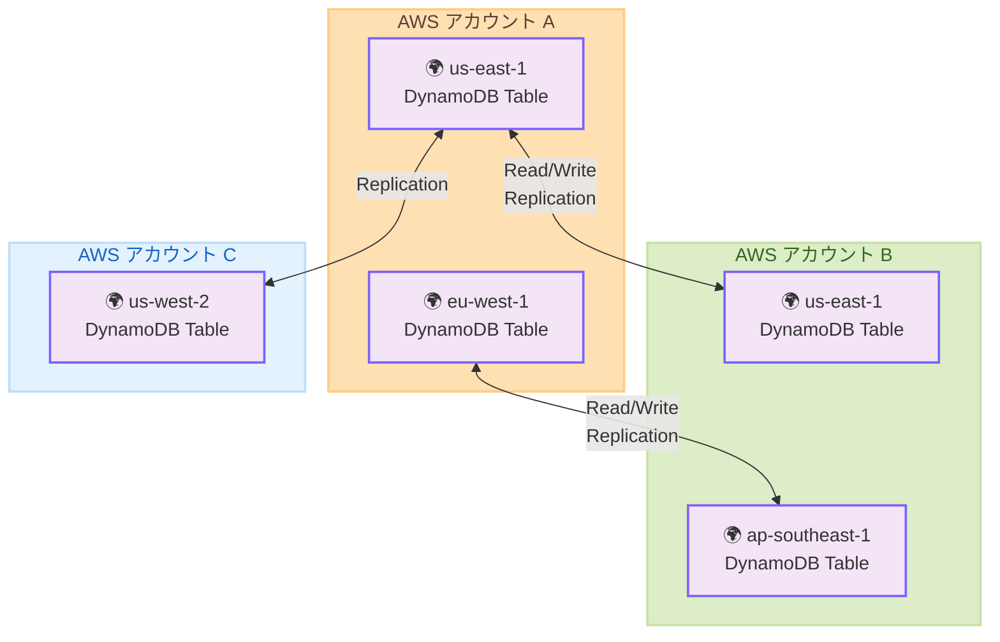

# Amazon DynamoDB - グローバルテーブルのマルチアカウントレプリケーション対応

**リリース日**: 2026年2月3日
**サービス**: Amazon DynamoDB
**機能**: Multi-Account Global Tables

## 概要

Amazon DynamoDB グローバルテーブルが複数 AWS アカウント間でのレプリケーション機能をサポート開始しました。グローバルテーブルがリージョン間レプリケーションに加え、アカウント間でのレプリケーションに対応することで、フォールトトレランス向上、ワークロード分離、セキュリティ・ガバナンスの強化が可能になります。マルチアカウント戦略を採用する組織や AWS Organizations を活用した環境での可用性と分離性が大幅に向上します。

**アップデート前の課題**

- グローバルテーブルが同一アカウント内のリージョン間レプリケーションに限定されていた
- アカウント間での高可用なデータレプリケーションが容易でなかった
- アカウントレベルの障害時にデータ可用性が失われるリスクがあった
- マルチアカウント戦略下での災害復旧(DR)構成が複雑だった

**アップデート後の改善**

- グローバルテーブルが複数 AWS アカウント間でのレプリケーションに対応
- アカウントレベルの障害が発生しても、別アカウントのレプリカからサービス継続可能
- ワークロード分離とセキュリティ隔離が実現
- AWS Organizations との統合でアカウント管理がより柔軟に
- 既存の グローバルテーブル料金体系で利用可能

## アーキテクチャ図

複数 AWS アカウント間でのマルチリージョン、マルチアクティブレプリケーションが実現されます。各アカウントは独立したセキュリティ・ガバナンスを適用できます。

## 主要機能

1. **マルチアカウントレプリケーション**
   - 複数 AWS アカウント間での自動レプリケーション
   - 各アカウントで独立した読み書きが可能(マルチアクティブモデル)

2. **アカウント間のフォールトトレランス**
   - アカウントレベルの障害に対応した可用性
   - 他アカウントのレプリカからの継続的なサービス提供

3. **セキュリティ・ガバナンス強化**
   - アカウント単位でのアクセス制御
   - 組織ポリシーに基づいた分離

4. **AWS Organizations 統合**
   - マルチアカウント環境の統一管理
   - 組織全体の一貫したデータ戦略

## メリット

### ビジネス面

- **可用性向上**: アカウントレベルの障害に対応した高可用性
- **セキュリティ強化**: アカウント単位のセキュリティ隔離
- **スケーラビリティ**: 複数ビジネスユニット・組織の独立運用

### 技術面

- **マルチアクティブ**: 複数アカウントでの読み書き可能
- **自動レプリケーション**: 手動同期不要
- **柔軟な展開**: ビジネス要件に応じた配置が可能

## ユースケース

### ユースケース1: マルチアカウント災害復旧戦略

**シナリオ**: Production アカウントでサービスを運用し、DR 用に別アカウントでスタンバイを構成。アカウント障害時に継続稼働する場合

**効果**: グローバルテーブルがマルチアカウント対応により、自動フェイルオーバーが実現。RTO 短縮、データロス防止

### ユースケース2: ビジネスユニット間のワークロード分離

**シナリオ**: 複数ビジネスユニットが共有データを必要とするが、セキュリティ・ガバナンスを独立管理する場合

**効果**: 各ユニットが独立アカウントで運用、グローバルテーブルで共有データをレプリケーション。分離とデータ共有が両立

### ユースケース3: マルチリージョン + マルチアカウント分析環境

**シナリオ**: Production(Account A)、バックアップ(Account B)、分析(Account C)を分離し、全体で統一データベースを構成する場合

**効果**: グローバルテーブルが複数アカウント間のマルチリージョン構成を実現。各環境が独立ガバナンスで安全に動作

## デメリット・制約事項

### 制限事項

- マルチアカウント構成では IAM クロスアカウントアクセス設定が必要
- AWS Organizations での組織単位の管理はベストプラクティスが必須

## 利用可能リージョン

すべての AWS リージョンで利用可能です。既存のグローバルテーブル料金体系が適用されます。

## 技術構成

| 要素 | 説明 |
|---|---|
| レプリケーション | 完全マルチアクティブ(すべてのアカウント/リージョンで読み書き可能) |
| 一貫性 | 最終一貫性(Eventual Consistency) |
| ネットワーク | クロスアカウント VPC ピアリング、PrivateLink 対応 |

## 関連サービス・機能

- **AWS Organizations**: マルチアカウント管理
- **AWS Identity and Access Management (IAM)**: クロスアカウントアクセス制御
- **AWS CloudTrail**: マルチアカウント監査ログ
- **Amazon EventBridge**: クロスアカウント イベント駆動型処理

## 参考リンク

- [公式発表 (What's New)](https://aws.amazon.com/about-aws/whats-new/2026/02/dynamodb-gt-multi-account/)
- [DynamoDB グローバルテーブル ドキュメント](https://docs.aws.amazon.com/amazondynamodb/latest/developerguide/GlobalTables.html)
- [マルチアカウント戦略ガイド](https://docs.aws.amazon.com/amazondynamodb/latest/developerguide/globaltables-MultiAccount.html)
- [DynamoDB 料金ページ](https://aws.amazon.com/dynamodb/pricing/)

## まとめ

DynamoDB グローバルテーブルのマルチアカウント対応により、マルチアカウント戦略をとる組織での高可用性、セキュリティ隔離、災害復旧が実現されます。AWS Organizations と組み合わせることで、エンタープライズレベルの運用ガバナンスが構築できます。
