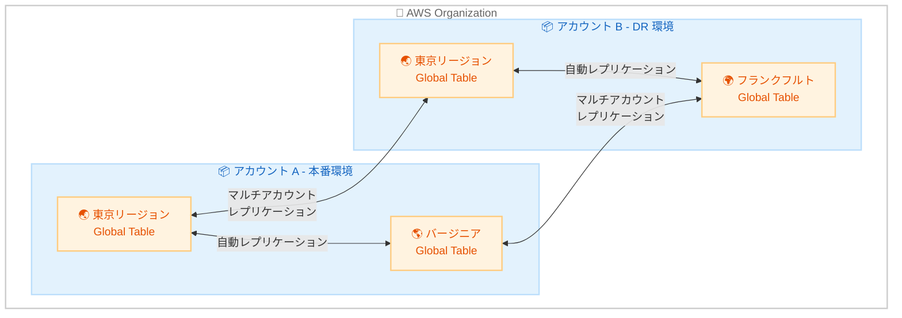

# Amazon DynamoDB Global Tables - マルチアカウントレプリケーション

**リリース日**: 2026 年 2 月 3 日
**サービス**: Amazon DynamoDB
**機能**: Global Tables マルチアカウントレプリケーション

📊 [このアップデートのインフォグラフィックを見る](https://takech9203.github.io/aws-news-summary/20260203-dynamodb-gt-multi-account.html)

## 概要

Amazon DynamoDB Global Tables で、複数の AWS アカウント間でのテーブルレプリケーションがサポートされました。これまでは同一アカウント内の複数リージョン間でのレプリケーションのみが可能でしたが、今回のアップデートにより、異なる AWS アカウント間でもテーブルを自動的にレプリケートできるようになりました。

この機能により、マルチアカウント戦略を採用している組織は、アカウントレベルの障害分離を実現しながら、グローバルに分散したアプリケーションを構築できます。AWS Organizations を使用してセキュリティ分離を強化している企業や、事業部門ごとにアカウントを分離している組織に特に有用です。

**アップデート前の課題**

- Global Tables のレプリケーションは同一アカウント内に限定されていた
- アカウントレベルの障害分離を実現するには、カスタムレプリケーション実装が必要だった
- 事業部門ごとにアカウントを分離している組織では、データ共有の実装が複雑だった

**アップデート後の改善**

- 複数の AWS アカウント間でテーブルを自動レプリケート可能に
- DynamoDB がマネージドでレプリケーションを処理し、運用負荷を軽減
- 組織のセキュリティ要件やガバナンス要件に合わせたデータ配置が可能に

## アーキテクチャ図



複数のアカウントとリージョンにまたがるグローバルテーブルの自動レプリケーション構成を示しています。

## サービスアップデートの詳細

### 主要機能

1. **マルチアカウントレプリケーション**
   - 異なる AWS アカウント間でテーブルを自動レプリケート
   - 既存の Global Tables 機能 (マルチリージョン・マルチアクティブ) を維持
   - DynamoDB が自動的にデータ同期を処理

2. **柔軟なアカウント構成**
   - AWS Organizations との統合
   - 事業部門ごとのアカウント分離に対応
   - セキュリティ境界を維持しながらデータ共有

3. **既存料金体系の維持**
   - 追加のマルチアカウント料金なし
   - 既存の Global Tables 料金が適用

## 技術仕様

### CreateTable API の新しいパラメータ

| パラメータ | 説明 |
|-----------|------|
| `GlobalTableSourceArn` | レプリケート元のテーブル ARN を指定 |
| `GlobalTableSettingsReplicationMode` | レプリケーション設定の同期モードを指定 |

### API 変更履歴

| 日付 | サービス | 変更内容 |
|------|----------|----------|
| 2026/02/03 | [Amazon DynamoDB](https://awsapichanges.com/archive/changes/104e8e-dynamodb.html) | 9 updated methods - CreateTable に GlobalTableSourceArn と GlobalTableSettingsReplicationMode を追加 |

### IAM ポリシー例

```json
{
  "Version": "2012-10-17",
  "Statement": [
    {
      "Effect": "Allow",
      "Action": [
        "dynamodb:CreateTable",
        "dynamodb:DescribeTable",
        "dynamodb:UpdateTable"
      ],
      "Resource": "arn:aws:dynamodb:*:*:table/MyGlobalTable"
    },
    {
      "Effect": "Allow",
      "Action": [
        "dynamodb:CreateGlobalTable",
        "dynamodb:DescribeGlobalTable",
        "dynamodb:UpdateGlobalTable"
      ],
      "Resource": "arn:aws:dynamodb::*:global-table/MyGlobalTable"
    }
  ]
}
```

## 設定方法

### 前提条件

1. AWS Organizations でマルチアカウント環境を構成済み
2. ソースアカウントに既存の Global Table が存在
3. ターゲットアカウントに適切な IAM 権限を設定

### 手順

#### ステップ 1: ソースアカウントでの Global Table 作成

```bash
aws dynamodb create-table \
    --table-name MyGlobalTable \
    --attribute-definitions AttributeName=pk,AttributeType=S \
    --key-schema AttributeName=pk,KeyType=HASH \
    --billing-mode PAY_PER_REQUEST
```

ソースアカウントで基本となる DynamoDB テーブルを作成します。

#### ステップ 2: ターゲットアカウントでのレプリカ作成

```bash
aws dynamodb create-table \
    --table-name MyGlobalTable \
    --attribute-definitions AttributeName=pk,AttributeType=S \
    --key-schema AttributeName=pk,KeyType=HASH \
    --billing-mode PAY_PER_REQUEST \
    --global-table-source-arn arn:aws:dynamodb:ap-northeast-1:111111111111:table/MyGlobalTable \
    --global-table-settings-replication-mode INHERIT
```

ターゲットアカウントで `--global-table-source-arn` を指定してレプリカテーブルを作成します。

#### ステップ 3: レプリケーション状態の確認

```bash
aws dynamodb describe-table --table-name MyGlobalTable
```

テーブルのレプリケーション状態と各リージョンのステータスを確認します。

## メリット

### ビジネス面

- **障害分離の強化**: アカウントレベルの障害が他のアカウントに影響しない
- **コンプライアンス対応**: 組織のガバナンス要件に合わせたデータ配置が可能
- **ディザスタリカバリの向上**: アカウント障害時も別アカウントで事業継続

### 技術面

- **マネージドレプリケーション**: カスタム実装不要で自動同期
- **低レイテンシー**: グローバル分散アプリケーションでローカルアクセス
- **一貫性の保証**: 結果整合性モデルによる高可用性

## デメリット・制約事項

### 制限事項

- レプリケーション遅延は結果整合性モデルに基づく (通常数秒以内)
- クロスアカウントアクセスには適切な IAM 設定が必要
- Global Tables の既存の制約 (書き込みスループット制限など) は継続

### 考慮すべき点

- アカウント間のネットワークコストが発生
- IAM ポリシーとリソースポリシーの適切な設計が必要
- データ整合性の要件に応じたアプリケーション設計

## ユースケース

### ユースケース 1: マルチアカウント DR 構成

**シナリオ**: 本番アカウントと DR アカウントを分離し、アカウントレベルの障害に備える

**実装例**:
```bash
# 本番アカウント (111111111111)
aws dynamodb create-table --table-name OrdersTable ...

# DR アカウント (222222222222)
aws dynamodb create-table \
    --table-name OrdersTable \
    --global-table-source-arn arn:aws:dynamodb:ap-northeast-1:111111111111:table/OrdersTable
```

**効果**: 本番アカウント全体の障害時も DR アカウントで即座にフェイルオーバー可能

### ユースケース 2: 事業部門間のデータ共有

**シナリオ**: 複数の事業部門が独自のアカウントを持ちながら、共通のマスターデータを参照

**実装例**:
```bash
# 共有サービスアカウント (マスターデータ)
aws dynamodb create-table --table-name ProductCatalog ...

# 事業部門 A アカウント (読み取り用レプリカ)
aws dynamodb create-table \
    --table-name ProductCatalog \
    --global-table-source-arn arn:aws:dynamodb:ap-northeast-1:shared-account:table/ProductCatalog
```

**効果**: 各事業部門が自アカウント内でローカルアクセスしながら、データの一貫性を維持

### ユースケース 3: 規制対応のためのデータ分離

**シナリオ**: 地域ごとの規制要件に対応するため、データを地域別アカウントに分離

**実装例**:
```bash
# グローバルアカウント (マスター)
# 日本アカウント (APAC 規制対応)
# EU アカウント (GDPR 対応)
```

**効果**: 規制要件に応じたデータガバナンスを維持しながら、グローバルなデータ同期を実現

## 料金

マルチアカウントレプリケーションに追加料金はありません。既存の Global Tables 料金が適用されます。

### 料金例

| 項目 | 料金 |
|------|------|
| レプリケートされた書き込みリクエスト単位 (rWRU) | $1.875 / 100 万単位 |
| レプリケートされた読み取りリクエスト単位 (rRRU) | $0.375 / 100 万単位 |
| ストレージ | $0.25 / GB-月 |

※ 最新の料金は [DynamoDB 料金ページ](https://aws.amazon.com/dynamodb/pricing/) を参照してください。

## 利用可能リージョン

Amazon DynamoDB Global Tables がサポートされているすべての AWS リージョンで利用可能です。

## 関連サービス・機能

- **AWS Organizations**: マルチアカウント管理と統合
- **AWS Resource Access Manager (RAM)**: クロスアカウントリソース共有
- **Amazon DynamoDB Streams**: 変更データキャプチャとの連携

## 参考リンク

- 📊 [インフォグラフィック](https://takech9203.github.io/aws-news-summary/20260203-dynamodb-gt-multi-account.html)
- [公式発表 (What's New)](https://aws.amazon.com/about-aws/whats-new/2026/02/dynamodb-gt-multi-account/)
- [DynamoDB Global Tables ドキュメント](https://docs.aws.amazon.com/amazondynamodb/latest/developerguide/GlobalTables.html)
- [マルチアカウント Global Tables ガイド](https://docs.aws.amazon.com/amazondynamodb/latest/developerguide/globaltables-MultiAccount.html)
- [料金ページ](https://aws.amazon.com/dynamodb/pricing/)

## まとめ

DynamoDB Global Tables のマルチアカウントレプリケーションは、エンタープライズ組織のマルチアカウント戦略を強力にサポートする重要な機能です。アカウントレベルの障害分離、事業部門間のデータ共有、規制対応など、多様なユースケースに対応できます。既に Global Tables を使用している組織は、DR 戦略の強化のためにマルチアカウント構成への移行を検討してください。
