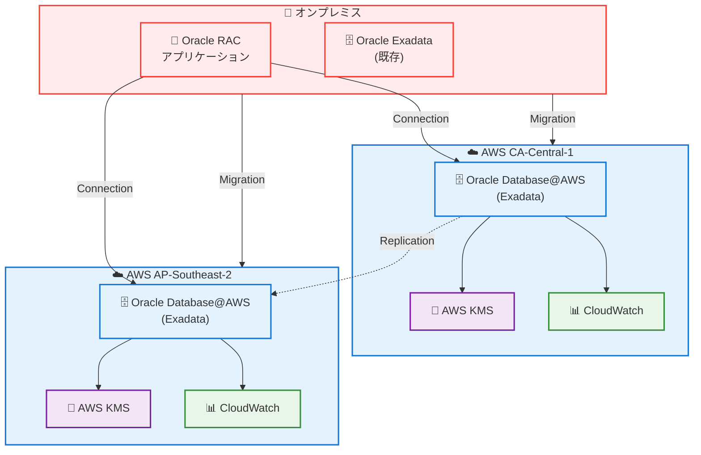

# Oracle Database@AWS - カナダ中部・シドニーリージョン対応

**リリース日**: 2026 年 2 月 3 日
**サービス**: Oracle Database@AWS
**機能**: CA-Central-1 (カナダ中部) および AP-Southeast-2 (シドニー) リージョン対応

## 概要

Oracle Database@AWS がカナダ中部とシドニーの 2 つのリージョンで利用可能になりました。各リージョンで 1 つの利用可能ゾーン (AZ) から開始します。

Oracle Database@AWS により、オンプレミスの Oracle Exadata および Oracle Real Application Clusters (RAC) アプリケーションを、AWS データセンター内で実行される Oracle Cloud Infrastructure (OCI) 管理の Exadata システムへ移行できます。AWS Key Management Service (KMS) による暗号化および AWS CloudWatch によるモニタリングなど、AWS サービスとの統合も可能です。

**アップデート前の課題**

- カナダおよびオーストラリア地域でのデータレジデンシー要件を満たすことが困難
- Oracle Exadata/RAC をこれらの地域で実行する選択肢が限定されていた
- オンプレミス環境から移行する場合、別の地域を利用する必要があった

**アップデート後の改善**

- カナダおよびオーストラリア地域でネイティブに Oracle Database@AWS を利用可能
- データレジデンシー要件を満たしながら、完全な Oracle Exadata 環境を実装可能
- AWS サービスとの統合による管理性向上

## サービスアップデートの詳細

### 主要機能

1. **マネージド Oracle Exadata 環境**
   - Oracle Cloud Infrastructure (OCI) による完全管理
   - 高パフォーマンスなデータベース実行
   - スケーラビリティとフェイルオーバー機能

2. **AWS サービスとの統合**
   - AWS Key Management Service (KMS) による暗号化
   - AWS CloudWatch によるモニタリング
   - AWS Identity and Access Management (IAM) での権限管理

3. **オンプレミスからの移行**
   - Oracle Exadata/RAC の like-for-like 移行
   - 最小限のアプリケーション変更
   - ダウンタイムの最小化

## 利用可能リージョン

Oracle Database@AWS は以下のリージョンで利用可能です:

- **US-East-1 (N. Virginia)**
- **US-West-2 (Oregon)**
- **US-East-2 (Ohio)**
- **EU-Central-1 (Frankfurt)**
- **AP-Northeast-1 (Tokyo)**
- **CA-Central-1 (Canada Central) - 新規追加**
- **AP-Southeast-2 (Sydney) - 新規追加**

## メリット

### ビジネス面

- **コンプライアンス対応**: カナダ・オーストラリアのデータレジデンシー要件充足
- **移行リスク低減**: like-for-like 移行で既存アプリケーションの互換性を保証
- **グローバル展開支援**: 地域別要件に対応した展開が可能

### 技術面

- **高可用性**: Exadata による信頼性と冗長性
- **パフォーマンス**: Oracle Exadata のハードウェア最適化
- **AWS 統合**: KMS、CloudWatch など AWS サービスとのシームレス連携

## デメリット・制約事項

### 制限事項

- 各リージョンで初期段階は 1 AZ のみから開始
- Oracle Database@AWS は AWS Marketplace 経由の契約が必要

### 考慮すべき点

- ライセンス費用の確認 (Oracle + AWS)
- ネットワークレイテンシー (オンプレミス環境との接続性)

## ユースケース

### ユースケース1: カナダ金融機関の Oracle 環境移行

**シナリオ**: カナダに本社を置く大型金融機関がオンプレミス Oracle Exadata を AWS へ移行

**実装例**:
- CA-Central-1 に Oracle Database@AWS インスタンスを配置
- KMS でデータ暗号化を有効化
- CloudWatch で 24/7 モニタリング

**効果**: PIPEDA などのカナダの規制要件を満たしながら、クラウドの利点を活用

### ユースケース2: オーストラリア企業のグローバル展開

**シナリオ**: オーストラリア本社の企業がアジア太平洋地域で事業を拡大

**実装例**:
- AP-Southeast-2 (Sydney) に主要環境を配置
- AP-Northeast-1 (Tokyo) とのレプリケーション
- リージョン間バックアップ

**効果**: ローカルデータレジデンシー要件を満たしつつ、地域別展開が可能

### ユースケース3: グローバル企業のマルチリージョン展開

**シナリオ**: グローバル企業が各地域でデータレジデンシー対応が必要

**実装例**:
- 複数リージョンに Oracle Database@AWS を配置
- 各地域で独立したインスタンスを運用
- Cross-region backup/replication

**効果**: コンプライアンス要件を満たしながら、グローバル運用を一元管理

## アーキテクチャ図

オンプレミス環境から AWS への Oracle Exadata/RAC 移行アーキテクチャです。

## 技術仕様

| 項目 | 詳細 |
|------|------|
| マネージドサービス | Oracle Cloud Infrastructure (OCI) |
| ハードウェア | Oracle Exadata システム |
| 対応DB | Oracle Exadata、Oracle RAC |
| 暗号化 | AWS Key Management Service (KMS) |
| モニタリング | AWS CloudWatch |
| リージョン | CA-Central-1、AP-Southeast-2 |
| 初期 AZ | 各リージョン 1 AZ |

## 関連サービス・機能

- **AWS Key Management Service (KMS)**: データ暗号化
- **AWS CloudWatch**: モニタリング・ロギング
- **AWS Direct Connect**: 専用ネットワーク接続
- **AWS Backup**: バックアップ・リカバリ

## 参考リンク

- [公式発表 (What's New)](https://aws.amazon.com/about-aws/whats-new/2026/02/oracle-database-aws-available-canada-central-sydney-aws-regions)
- [Oracle Database@AWS AWS Marketplace](https://aws.amazon.com/marketplace/featured-seller/oracle)
- [Oracle Database@AWS ドキュメント](https://docs.aws.amazon.com/odb/latest/UserGuide/getting-started.html)

## まとめ

Oracle Database@AWS のカナダ・シドニーリージョン対応により、これらの地域でのデータレジデンシー要件を満たしながら、Oracle Exadata/RAC をクラウドで実行可能になります。オンプレミス環境からのシームレスな移行を支援し、AWS サービス統合による運用効率化を実現する重要な拡張です。
