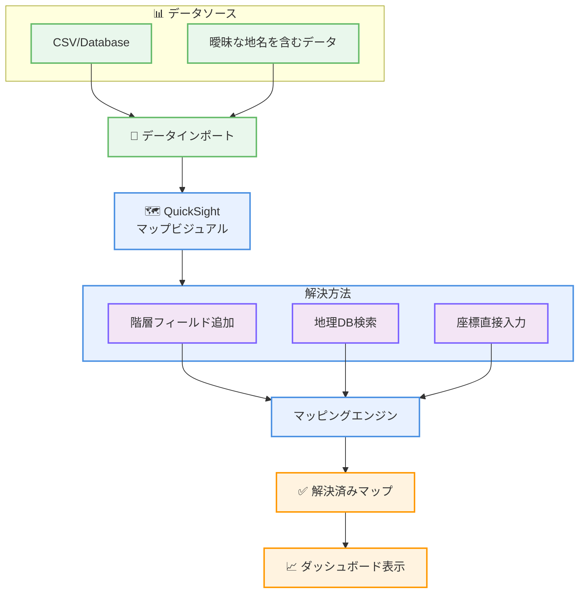

# Amazon QuickSight - 曖昧な場所名の解決機能

**リリース日**: 2026 年 2 月 3 日
**サービス**: Amazon QuickSight (Amazon Quick Suite)
**機能**: 曖昧な地理情報の解決と位置情報マッピング

## 概要

Amazon QuickSight が、曖昧な地名を解決するための直感的なマッピング機能を追加しました。複数の州や地域に存在する地名（例: Springfield、Abbeville など）を含むデータセットで、ダッシュボード作成者が正確な地理コンテキストを明示的に定義できるようになりました。

ユーザーは 3 つの方法で位置情報を解決できます: 地理的階層を作成するための補助フィールド追加、QuickSight の地理データベースからの位置検索、または緯度・経度座標の直接入力です。

**アップデート前の課題**

- 複数の地域に存在する地名がマップで誤って表現される
- 位置情報の曖昧性を手動で解決する負担が大きい
- ダッシュボード作成者が複雑な前処理を必要としていた
- 位置情報マッピングエラーによる分析信頼性の低下

**アップデート後の改善**

- マップビジュアル内から直接、曖昧な場所を解決可能
- 「Resolve now」オプションで直感的に対応
- 位置情報のステータス追跡（Unmatched、Matched、Unused）
- 複雑なデータ前処理が不要に

## サービスアップデートの詳細

### 主要機能

1. **直感的な位置情報解決**
   - マップビジュアル内での「Resolve now」ボタン
   - 「Geo data match」オプションへのアクセス
   - ドラッグ&ドロップベースの位置修正

2. **複数の解決方法**
   - 地理的階層フィールドの追加による解決
   - QuickSight 地理データベースからの検索
   - 緯度・経度座標の直接入力

3. **位置情報ステータス管理**
   - Unmatched: 解決されていない位置
   - Matched: 正常にマッチした位置
   - Unused: データに含まれるが使用されていない位置

## 利用可能リージョン

Amazon QuickSight が提供されるすべてのリージョンで利用可能です。

## メリット

### ビジネス面

- **データ品質向上**: 正確な地理分析による信頼できるインサイト
- **ダッシュボード作成時間短縮**: 手動前処理が不要に
- **分析の信頼性向上**: 位置情報エラーの排除

### 技術面

- **ユーザーエクスペリエンス改善**: 直感的な UI による位置情報管理
- **柔軟な解決方法**: 複数のマッピング手段から選択可能
- **効率的なメタデータ管理**: QuickSight 地理データベースの活用

## ユースケース

### ユースケース1: 全米小売分析

**シナリオ**: 全米 50 州に存在する複数の Springfield を含む売上データを可視化

**効果**: 各 Springfield を正確にマッピングし、州別の詳細な売上分析が可能に

### ユースケース2: 国際展開企業

**シナリオ**: 複数の国に存在する同名の都市を含むグローバルデータ分析

**実装例**: 階層フィールド（国 → 州 → 市）の設定により、曖昧性を自動解決

**効果**: 複雑な地理データの自動処理で、ダッシュボード作成効率が向上

### ユースケース3: 地域別マーケット分析

**シナリオ**: 郵便番号ベースのマッピングで複数の同名地域を整理

**実装例**: 緯度・経度データを活用した精密マッピング

**効果**: より正確な地域別インサイトが得られる

## アーキテクチャ図

位置情報の曖昧性を複数の方法で解決し、正確なマップビジュアルを生成するプロセスです。

## 関連サービス・機能

- **Amazon QuickSight Geospatial Charts**: 地理空間データ可視化
- **AWS Glue**: データクリーニング・準備
- **Amazon Athena**: 地理データクエリ

## 参考リンク

- [公式発表 (What's New)](https://aws.amazon.com/about-aws/whats-new/2026/02/quick-ambiguous-locations-resolution)
- [QuickSight 地図・地理空間チャート作成ガイド](https://docs.aws.amazon.com/quicksuite/latest/userguide/geospatial-charts.html)
- [AWS Blog - 曖昧な場所名マッピング](https://aws.amazon.com/blogs/business-intelligence/ambiguous-location-mapping-for-map-visuals-in-amazon-quick-sight/)

## まとめ

曖昧な場所名解決機能は、地理データを扱う分析ワークロードの効率と精度を大幅に向上させます。ダッシュボード作成者の負担軽減と分析信頼性の向上により、QuickSight での地理分析がより実用的で強力になります。
