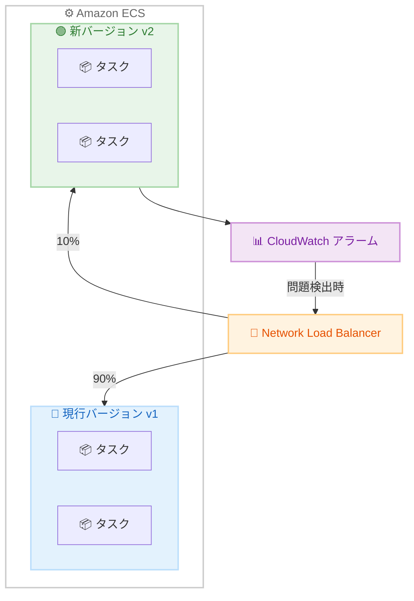

# Amazon ECS - NLB 対応 Linear/Canary デプロイメント

**リリース日**: 2026 年 2 月 4 日
**サービス**: Amazon ECS
**機能**: Network Load Balancer 対応 Linear/Canary デプロイメント

📊 [このアップデートのインフォグラフィックを見る](https://takech9203.github.io/aws-news-summary/20260204-amazon-ecs-nlb-linear-canary-deployments.html)

## 概要

Amazon Elastic Container Service (ECS) が、Network Load Balancer (NLB) を使用するサービスで Linear および Canary デプロイメント戦略をネイティブにサポートするようになりました。これにより、TCP/UDP ベースの接続、低レイテンシー、長時間接続、静的 IP アドレスを必要とするアプリケーションでも、段階的なトラフィックシフトによるデプロイメントが可能になります。

これまで NLB を使用するアプリケーションでは、ローリングアップデートのみが利用可能でしたが、今回のアップデートにより、トラフィックを段階的にシフトしながら更新をデプロイし、各ステップでアプリケーションの動作を観察できるようになりました。

**アップデート前の課題**

- NLB を使用する ECS サービスではローリングアップデートのみが選択可能だった
- トラフィックの段階的シフトには CodeDeploy などの追加サービスが必要だった
- ゲームバックエンドやリアルタイムメッセージングなど、NLB 必須のワークロードで安全なデプロイが困難だった

**アップデート後の改善**

- NLB を使用するサービスで Linear/Canary デプロイをネイティブサポート
- ECS コンソール、CLI、IaC ツールから直接設定可能
- CloudWatch アラームとの統合で自動ロールバックが可能

## アーキテクチャ図



Canary デプロイメントでは、まず少量のトラフィック (例: 10%) を新バージョンに流し、CloudWatch アラームで監視しながら段階的にトラフィックをシフトします。

## サービスアップデートの詳細

### 主要機能

1. **Linear デプロイメント**
   - トラフィックを均等な増分で段階的にシフト
   - 例: 10% ずつ 10 分間隔でシフト
   - 予測可能で制御された移行

2. **Canary デプロイメント**
   - 最初に小さな割合のトラフィックで検証
   - 問題がなければ残りのトラフィックをシフト
   - リスクを最小化した検証フェーズ

3. **CloudWatch アラーム統合**
   - メトリクスに基づく自動監視
   - 問題検出時の自動停止/ロールバック
   - 運用負荷の軽減

## 技術仕様

### デプロイメント戦略の比較

| 戦略 | トラフィックシフト | ユースケース |
|------|-------------------|--------------|
| Linear | 均等増分 (例: 10% x 10 回) | 予測可能な段階移行 |
| Canary | 少量 → 残り全部 (例: 10% → 90%) | 初期検証重視 |
| Rolling Update | 一括置換 | シンプルな更新 |

### NLB の特徴

| 特徴 | 説明 |
|------|------|
| プロトコル | TCP、UDP、TLS |
| レイテンシー | 極めて低レイテンシー |
| 接続 | 長時間接続のサポート |
| IP アドレス | 静的 IP アドレス/Elastic IP |

### 推奨ワークロード

- オンラインゲームバックエンド
- 金融取引システム
- リアルタイムメッセージングサービス
- IoT デバイス接続

## 設定方法

### 前提条件

1. ECS クラスターと NLB の設定
2. 複数のターゲットグループ
3. CloudWatch アラーム (自動ロールバック用)

### 手順

#### ステップ 1: ECS サービス定義の更新

```json
{
  "serviceName": "my-game-service",
  "cluster": "my-cluster",
  "deploymentConfiguration": {
    "deploymentType": "LINEAR",
    "linearConfiguration": {
      "trafficShiftPercentage": 10,
      "trafficShiftInterval": 600
    }
  },
  "loadBalancers": [
    {
      "targetGroupArn": "arn:aws:elasticloadbalancing:...",
      "containerName": "game-server",
      "containerPort": 7777
    }
  ]
}
```

Linear デプロイメントでは、10% ずつ 600 秒 (10 分) 間隔でトラフィックをシフトします。

#### ステップ 2: Canary デプロイメントの設定

```bash
aws ecs update-service \
    --cluster my-cluster \
    --service my-game-service \
    --deployment-configuration '{
        "deploymentType": "CANARY",
        "canaryConfiguration": {
            "initialTrafficPercentage": 10,
            "bakingPeriod": 900
        }
    }'
```

Canary デプロイメントでは、最初に 10% のトラフィックで 15 分間 (900 秒) 検証します。

#### ステップ 3: CloudWatch アラームとの連携

```bash
aws ecs update-service \
    --cluster my-cluster \
    --service my-game-service \
    --deployment-configuration '{
        "alarms": {
            "alarmNames": ["my-error-rate-alarm"],
            "enable": true,
            "rollback": true
        }
    }'
```

CloudWatch アラームを設定し、問題検出時に自動ロールバックを有効化します。

## メリット

### ビジネス面

- **リスク軽減**: 段階的なデプロイで本番環境への影響を最小化
- **ダウンタイム削減**: 問題発生時の迅速なロールバック
- **顧客体験の保護**: ゲームやリアルタイムサービスでの中断を防止

### 技術面

- **ネイティブ統合**: 追加サービス不要で ECS から直接利用
- **自動化**: CloudWatch アラームによる監視と自動ロールバック
- **IaC 対応**: CloudFormation、Terraform からの設定が可能

## デメリット・制約事項

### 制限事項

- 複数のターゲットグループの設定が必要
- デプロイ時間が通常のローリングアップデートより長くなる
- ステートフルなアプリケーションでは追加の考慮が必要

### 考慮すべき点

- 長時間接続のドレイン設定
- セッションスティッキネスの影響
- コスト (同時に複数バージョンのタスクが稼働)

## ユースケース

### ユースケース 1: オンラインゲームサーバー

**シナリオ**: マルチプレイヤーゲームのバックエンドを安全に更新

**実装例**:
```json
{
  "deploymentType": "CANARY",
  "canaryConfiguration": {
    "initialTrafficPercentage": 5,
    "bakingPeriod": 1800
  }
}
```

**効果**: 5% のプレイヤーで 30 分間テストし、問題がなければ全体にデプロイ

### ユースケース 2: 金融取引システム

**シナリオ**: 低レイテンシーが重要な取引システムの更新

**実装例**:
```json
{
  "deploymentType": "LINEAR",
  "linearConfiguration": {
    "trafficShiftPercentage": 10,
    "trafficShiftInterval": 300
  }
}
```

**効果**: 5 分ごとに 10% ずつシフトし、各段階でレイテンシーを監視

### ユースケース 3: IoT メッセージブローカー

**シナリオ**: 大量の IoT デバイスが接続するメッセージブローカーの更新

**実装例**:
```json
{
  "deploymentType": "LINEAR",
  "linearConfiguration": {
    "trafficShiftPercentage": 20,
    "trafficShiftInterval": 600
  }
}
```

**効果**: 長時間接続の切断を最小限に抑えながら段階的に更新

## 料金

Linear/Canary デプロイメント機能自体に追加料金はありません。ECS と NLB の標準料金が適用されます。

### 料金例

| 項目 | 料金 |
|------|------|
| ECS on Fargate (vCPU) | $0.04048 / vCPU-hour |
| ECS on Fargate (メモリ) | $0.004445 / GB-hour |
| NLB | $0.0225 / hour + LCU 料金 |

## 利用可能リージョン

AWS 商用リージョンおよび AWS GovCloud (US) リージョンで利用可能です。

## 関連サービス・機能

- **Amazon CloudWatch**: アラームベースの監視とロールバック
- **AWS App Mesh**: サービスメッシュとの組み合わせ
- **AWS CodePipeline**: CI/CD パイプラインとの統合

## 参考リンク

- 📊 [インフォグラフィック](https://takech9203.github.io/aws-news-summary/20260204-amazon-ecs-nlb-linear-canary-deployments.html)
- [公式発表 (What's New)](https://aws.amazon.com/about-aws/whats-new/2026/02/amazon-ecs-nlb-linear-canary-deployments/)
- [Linear デプロイメント ドキュメント](https://docs.aws.amazon.com/AmazonECS/latest/developerguide/deployment-type-linear.html)
- [Canary デプロイメント ドキュメント](https://docs.aws.amazon.com/AmazonECS/latest/developerguide/canary-deployment.html)

## まとめ

Amazon ECS の NLB 対応 Linear/Canary デプロイメントは、TCP/UDP ベースのワークロードで安全なデプロイを実現する重要な機能です。ゲームバックエンド、金融取引システム、リアルタイムメッセージングなど、NLB を必要とするワークロードを運用している組織は、この機能を活用してデプロイリスクを軽減してください。
