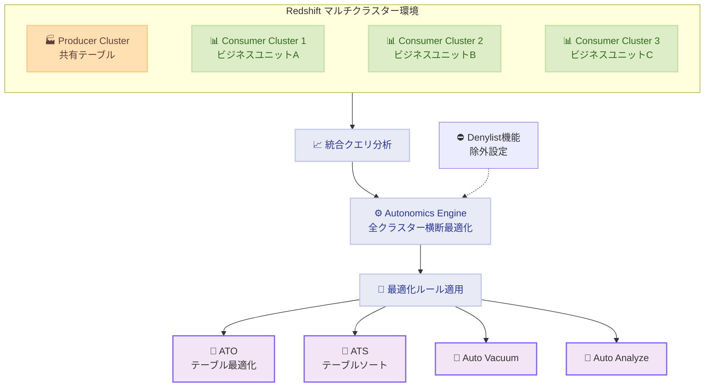

# Amazon Redshift - マルチクラスター環境での Autonomics サポート

**リリース日**: 2026年2月4日
**サービス**: Amazon Redshift
**機能**: Autonomics for Multi-Cluster Environments

## 概要

Amazon Redshift が複数クラスター環境での autonomics(自動最適化)機能のサポートを開始しました。これまで autonomics は個別クラスター内での最適化に限定されていましたが、今回のアップデートにより、複数のコンシューマークラスター全体のクエリパターンを考慮した最適化が可能になります。複数ビジネスユニットが共有データにアクセスする環境での手動チューニング負荷が大幅に軽減されます。

**アップデート前の課題**

- Autonomics の最適化対象が個別クラスター内に限定されていた
- 複数クラスター間でのテーブルレイアウト最適化を個別実施する必要があった
- 複数ビジネスユニットのクエリパターン全体を考慮した最適化ができなかった
- 大規模共有データ環境での手動チューニング工数が多大だった

**アップデート後の改善**

- 複数コンシューマークラスターのクエリパターン全体を統合的に分析し、全体最適化が可能に
- Automatic Table Optimization (ATO)、Automatic Table Sorting (ATS)、Auto Vacuum、Auto Analyze が全クラスター横断で動作
- Denylist 機能により、特定エンドポイント・AWS アカウントを最適化対象から除外可能
- 追加費用なしで利用可能

## アーキテクチャ図

複数のコンシューマークラスターのクエリパターンを統合分析し、全体最適化ルールを適用します。Denylist 機能により、クロスオーガニゼーション環境での最適化対象外設定も可能です。

## 主要機能

1. **統合クエリ分析**
   - 全コンシューマークラスターのクエリパターンを一元的に分析
   - 複数クラスター間の共通最適化パターンを自動検出

2. **Autonomics 機能の拡張**
   - **Automatic Table Optimization (ATO)**: テーブルレイアウトを全クラスター最適化
   - **Automatic Table Sorting (ATS)**: ソートキー自動最適化
   - **Auto Vacuum**: テーブル圧縮の自動実行
   - **Auto Analyze**: 統計情報の自動更新

3. **Denylist 機能**
   - 特定エンドポイント・AWS アカウントを最適化対象から除外可能
   - クロスオーガニゼーションデータ共有シーンで活用

## メリット

### ビジネス面

- **運用効率化**: 複数クラスター管理の手動チューニング工数削減
- **全体最適化**: ビジネスユニット横断で統合的なパフォーマンス改善
- **コスト削減**: 手動最適化の負荷軽減による運用コスト低減

### 技術面

- **パフォーマンス向上**: 全クラスター横断の最適化で、より効果的なチューニング
- **自動化**: 複雑なチューニング作業の自動化
- **柔軟な制御**: Denylist でカスタマイズ可能

## ユースケース

### ユースケース1: 共有データ分析環境

**シナリオ**: 複数部門が共有データウェアハウスを利用し、各部門独立のコンシューマークラスターでクエリを実行する場合

**効果**: Autonomics が全部門のクエリパターンを分析し、全体最適化。各部門の個別最適化より高い効果が期待でき、運用負荷が大幅削減

### ユースケース2: クロスオーガニゼーション環境

**シナリオ**: 複数の外部組織とデータ共有し、それぞれ独立クラスターを運用する場合

**効果**: Denylist 機能で、特定組織のクエリパターンが最適化判断に影響しないよう制御可能

### ユースケース3: 金融・大規模小売環境

**シナリオ**: リアルタイムレポート、在庫分析など多数の部門が同じデータセットにアクセスする環境

**効果**: 全部門のアクセスパターンを統合最適化することで、クエリレスポンス向上、インフラコスト低減

## 利用可能リージョン

Amazon Redshift をサポートする全ての AWS リージョンで利用可能です。追加費用はかかりません。

## 関連サービス・機能

- **Amazon Redshift Spectrum**: データレイク分析との連携
- **AWS Glue**: メタデータ管理
- **Amazon QuickSight**: ビジュアライゼーション

## 参考リンク

- [公式発表 (What's New)](https://aws.amazon.com/about-aws/whats-new/2026/02/amazon-redshift-autonomics-for-multi-cluster/)
- [Amazon Redshift Management Guide](https://docs.aws.amazon.com/redshift/latest/mgmt/welcome.html)

## まとめ

マルチクラスター環境での Autonomics サポートにより、複数部門が利用する共有データウェアハウスの運用が大幅に簡素化されます。複数クラスター横断の統合最適化で、パフォーマンス向上とオペレーション負荷削減を同時に実現できます。
