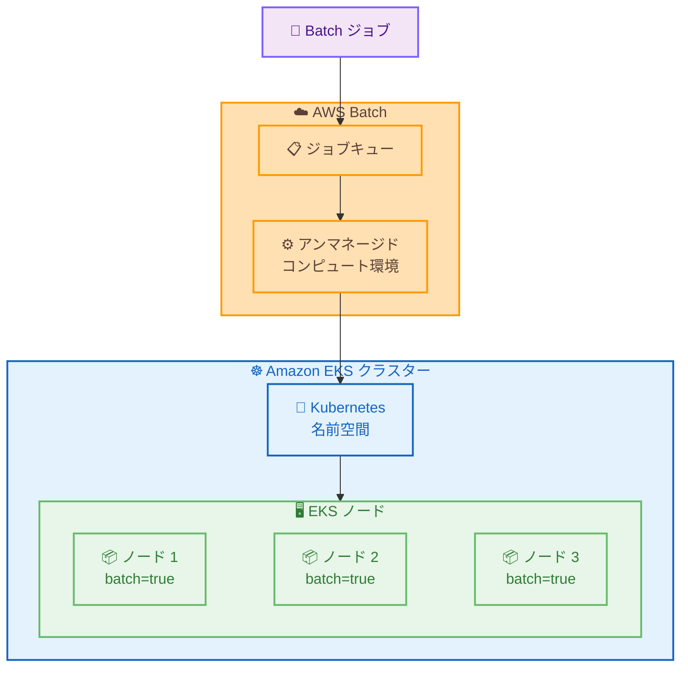

# AWS Batch - Amazon EKS でのアンマネージドコンピュート環境サポート

**リリース日**: 2026 年 2 月 4 日
**サービス**: AWS Batch
**機能**: Unmanaged Compute Environments for Amazon EKS

📊 [このアップデートのインフォグラフィックを見る](https://takech9203.github.io/aws-news-summary/20260204-aws-batch-on-eks-unmanaged-compute-environments.html)

## 概要

AWS Batch が Amazon EKS でのアンマネージドコンピュート環境をサポートするようになりました。この機能により、AWS Batch のジョブスケジューリング機能を活用しながら、セキュリティ、コンプライアンス、または運用上の要件に応じて Kubernetes インフラストラクチャを完全に制御できるようになります。

アンマネージド EKS コンピュート環境では、既存の EKS クラスターと Kubernetes 名前空間を指定し、kubectl ラベリングを使用して EKS ノードをコンピュート環境に関連付けます。これにより、ML モデルトレーニング、シミュレーション、分析などのバッチ処理ワークロードを効率的に実行できます。

**アップデート前の課題**

- AWS Batch on EKS ではマネージドコンピュート環境のみがサポートされていた
- 特定のセキュリティやコンプライアンス要件に対応するためのカスタマイズが制限されていた
- 既存の EKS クラスター設定を活用することが困難だった

**アップデート後の改善**

- 既存の EKS クラスターとノードを使用して AWS Batch ジョブを実行可能
- Kubernetes インフラストラクチャの完全な制御を維持
- セキュリティ、コンプライアンス、運用要件に対応したカスタム設定が可能

## アーキテクチャ図



AWS Batch のジョブキューからアンマネージドコンピュート環境を経由して、ラベル付けされた EKS ノードでジョブが実行されます。

## サービスアップデートの詳細

### 主要機能

1. **既存 EKS クラスターの活用**
   - CreateComputeEnvironment API または AWS Batch コンソールでアンマネージドコンピュート環境を作成
   - 既存の EKS クラスターと Kubernetes 名前空間を指定
   - kubectl ラベリングで EKS ノードをコンピュート環境に関連付け

2. **完全なインフラ制御**
   - ノードの設定、スケーリング、セキュリティポリシーを完全に制御
   - カスタム AMI、インスタンスタイプ、ノードグループ設定を使用可能
   - 既存の Kubernetes セキュリティコンテキストや Pod セキュリティポリシーを維持

3. **AWS Batch のジョブオーケストレーション**
   - ジョブキュー、ジョブ定義、依存関係管理などの AWS Batch 機能をフル活用
   - スケジューリング、リトライ、タイムアウトなどのジョブライフサイクル管理
   - CloudWatch との統合によるモニタリング

## 技術仕様

### マネージド vs アンマネージド比較

| 項目 | マネージド | アンマネージド |
|------|-----------|---------------|
| ノード管理 | AWS Batch が管理 | ユーザーが管理 |
| スケーリング | 自動 | ユーザーが設定 |
| カスタマイズ | 制限あり | 完全に可能 |
| セットアップ | シンプル | より詳細な設定が必要 |
| ユースケース | 一般的なバッチ処理 | 特殊な要件があるワークロード |

### 設定例

```bash
# アンマネージドコンピュート環境の作成
aws batch create-compute-environment \
    --compute-environment-name my-unmanaged-eks-ce \
    --type UNMANAGED \
    --eks-configuration '{
        "eksClusterArn": "arn:aws:eks:us-east-1:123456789012:cluster/my-cluster",
        "kubernetesNamespace": "batch-jobs"
    }'

# EKS ノードにラベルを付与
kubectl label nodes node-1 batch.amazonaws.com/compute-environment=my-unmanaged-eks-ce
kubectl label nodes node-2 batch.amazonaws.com/compute-environment=my-unmanaged-eks-ce
```

### ジョブ定義例

```json
{
  "jobDefinitionName": "my-eks-job",
  "type": "container",
  "eksProperties": {
    "podProperties": {
      "containers": [
        {
          "image": "my-ml-image:latest",
          "command": ["python", "train.py"],
          "resources": {
            "limits": {
              "cpu": "4",
              "memory": "8Gi",
              "nvidia.com/gpu": "1"
            }
          }
        }
      ]
    }
  }
}
```

## 設定方法

### 前提条件

1. Amazon EKS クラスター
2. AWS Batch サービスロール
3. kubectl アクセス

### 手順

#### ステップ 1: EKS クラスターの準備

```bash
# EKS クラスターが存在することを確認
aws eks describe-cluster --name my-cluster
```

既存の EKS クラスターを使用するか、新しいクラスターを作成します。

#### ステップ 2: アンマネージドコンピュート環境の作成

```bash
# コンピュート環境を作成
aws batch create-compute-environment \
    --compute-environment-name my-unmanaged-eks \
    --type UNMANAGED \
    --state ENABLED \
    --eks-configuration '{
        "eksClusterArn": "arn:aws:eks:us-east-1:123456789012:cluster/my-cluster",
        "kubernetesNamespace": "batch-namespace"
    }'
```

AWS Batch コンソールまたは API でアンマネージドコンピュート環境を作成します。

#### ステップ 3: ノードのラベリング

```bash
# バッチジョブを実行するノードにラベルを付与
kubectl label nodes my-node-1 batch.amazonaws.com/compute-environment=my-unmanaged-eks
kubectl label nodes my-node-2 batch.amazonaws.com/compute-environment=my-unmanaged-eks
```

kubectl を使用して、バッチジョブを実行する EKS ノードにラベルを付与します。

#### ステップ 4: ジョブキューの作成とジョブの実行

```bash
# ジョブキューを作成
aws batch create-job-queue \
    --job-queue-name my-eks-queue \
    --priority 1 \
    --compute-environment-order '[{"order":1,"computeEnvironment":"my-unmanaged-eks"}]'

# ジョブを送信
aws batch submit-job \
    --job-name my-ml-job \
    --job-queue my-eks-queue \
    --job-definition my-eks-job
```

ジョブキューを作成し、ジョブを送信します。

## メリット

### ビジネス面

- **柔軟性**: 既存の EKS インフラを活用し、投資を最大化
- **コンプライアンス対応**: 特定のセキュリティ要件やコンプライアンス要件に対応可能
- **コスト最適化**: 既存のノードを共有利用してコストを削減

### 技術面

- **完全な制御**: ノード設定、セキュリティ、ネットワークを完全に制御
- **AWS Batch の機能**: ジョブスケジューリング、依存関係管理、リトライなどをフル活用
- **既存ツールとの統合**: 既存の Kubernetes ツールやプロセスを継続使用

## デメリット・制約事項

### 制限事項

- ノードの管理とスケーリングはユーザーの責任
- マネージドコンピュート環境と比較してセットアップが複雑
- ノードのラベリングを適切に管理する必要がある

### 考慮すべき点

- ノードの可用性とキャパシティをモニタリング
- ラベルの一貫性を維持
- 適切なリソース制限を設定

## ユースケース

### ユースケース 1: ML モデルトレーニング

**シナリオ**: 特定のセキュリティ要件を持つ ML トレーニングジョブを既存の GPU ノードで実行したい

**実装例**:
```bash
# GPU ノードにラベルを付与
kubectl label nodes gpu-node-1 batch.amazonaws.com/compute-environment=ml-training-ce

# GPU を使用するジョブを送信
aws batch submit-job \
    --job-name ml-training \
    --job-queue ml-queue \
    --job-definition ml-training-job
```

**効果**: 既存の GPU インフラを活用しながら、AWS Batch のジョブ管理機能を利用

### ユースケース 2: 金融シミュレーション

**シナリオ**: コンプライアンス要件を満たすカスタム設定のノードで大規模シミュレーションを実行したい

**実装例**:
```bash
# コンプライアンス準拠のノードグループを使用
kubectl label nodes compliant-node-1 batch.amazonaws.com/compute-environment=simulation-ce
kubectl label nodes compliant-node-2 batch.amazonaws.com/compute-environment=simulation-ce
```

**効果**: セキュリティ要件を満たしながら、効率的なバッチ処理を実現

### ユースケース 3: 科学計算

**シナリオ**: 高性能コンピューティング (HPC) ワークロードを既存の EKS クラスターで実行したい

**実装例**:
```bash
# HPC 最適化ノードにラベルを付与
kubectl label nodes hpc-node batch.amazonaws.com/compute-environment=hpc-ce
```

**効果**: 専用の HPC ノードで科学計算ジョブを効率的に実行

## 料金

AWS Batch 自体に追加料金はありません。以下のリソースに対して標準料金が適用されます。

- Amazon EKS: クラスター時間に基づく料金
- EC2: ノードのインスタンス時間に基づく料金
- データ転送: リージョン間転送などの標準料金

## 利用可能リージョン

この機能は、AWS Batch が利用可能なすべての AWS リージョンで利用可能です。

## 関連サービス・機能

- **AWS Batch マネージドコンピュート環境**: 自動スケーリングが必要な場合
- **Amazon EKS**: Kubernetes クラスター管理
- **Amazon EC2 Auto Scaling**: ノードのスケーリング管理

## 参考リンク

- 📊 [インフォグラフィック](https://takech9203.github.io/aws-news-summary/20260204-aws-batch-on-eks-unmanaged-compute-environments.html)
- [公式発表 (What's New)](https://aws.amazon.com/about-aws/whats-new/2026/02/aws-batch-on-eks-unmanaged-compute-environments)
- [AWS Batch ユーザーガイド - アンマネージド EKS コンピュート環境](https://docs.aws.amazon.com/batch/latest/userguide/create-compute-environment-unmanaged-eks.html)

## まとめ

AWS Batch の EKS アンマネージドコンピュート環境サポートは、Kubernetes インフラの完全な制御を維持しながら AWS Batch のジョブオーケストレーション機能を活用したい組織にとって重要な機能です。特定のセキュリティ、コンプライアンス、または運用要件がある ML トレーニング、シミュレーション、科学計算などのワークロードで、この機能の活用を検討することを推奨します。
