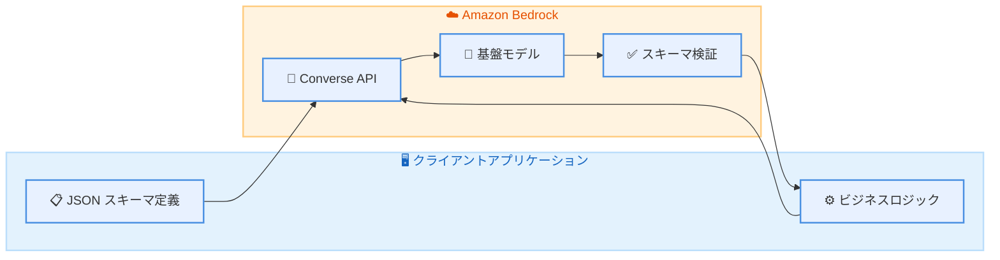

# Amazon Bedrock - Structured Outputs

**リリース日**: 2026 年 2 月 4 日
**サービス**: Amazon Bedrock
**機能**: Structured Outputs (構造化出力)

📊 [このアップデートのインフォグラフィックを見る](https://takech9203.github.io/aws-news-summary/20260204-structured-outputs-available-amazon-bedrock.html)

## 概要

Amazon Bedrock で Structured Outputs (構造化出力) 機能が一般提供 (GA) となりました。この機能により、基盤モデルからの応答が指定した JSON スキーマに準拠した一貫性のある機械可読形式で取得できるようになります。

従来はプロンプトで JSON 形式を要求し、アプリケーション側で追加の検証ロジックを実装する必要がありましたが、Structured Outputs を使用することで、期待するフォーマットを定義するだけで、それに準拠した応答を確実に受け取れます。

**アップデート前の課題**

- 基盤モデルからの応答形式が不安定で、JSON パースエラーが発生することがあった
- プロンプトで JSON 形式を要求しても、モデルが予期しない形式で応答することがあった
- アプリケーション側で複雑な検証ロジックとリトライ処理を実装する必要があった

**アップデート後の改善**

- JSON スキーマを指定することで、スキーマに準拠した応答を確実に取得可能
- ツール呼び出しの厳密な定義により、モデルの出力が仕様に一致することを保証
- カスタム検証ロジックの削減と、リトライによる運用オーバーヘッドの低減

## アーキテクチャ図



クライアントが JSON スキーマを指定して API を呼び出すと、Bedrock が基盤モデルの応答をスキーマに準拠させて返却します。

## サービスアップデートの詳細

### 主要機能

1. **JSON スキーマベースの構造化出力**
   - 応答形式を JSON スキーマで定義可能
   - 必須フィールド、データ型、列挙値などを指定
   - スキーマに準拠した応答を保証

2. **厳密なツール定義 (Strict Tool Definitions)**
   - ツール呼び出しの入出力形式を厳密に定義
   - モデルのツール呼び出しが仕様に確実に一致
   - 下流システムとの連携でのエラーを防止

3. **複数の API サポート**
   - Converse API
   - ConverseStream API
   - InvokeModel API
   - InvokeModelWithResponseStream API

## 技術仕様

### 対応モデル

| モデルカテゴリ | 対応モデル |
|---------------|-----------|
| Anthropic Claude | Claude 4.5 モデル |
| オープンウェイトモデル | [サポート対象モデル一覧](https://docs.aws.amazon.com/bedrock/latest/userguide/structured-output.html#structured-output-supported-models) を参照 |

### API 変更履歴

| 日付 | サービス | 変更内容 |
|------|----------|----------|
| 2026/02/04 | [Amazon Bedrock Runtime](https://awsapichanges.com/archive/changes/b02439-bedrock-runtime.html) | 3 updated methods - Converse/ConverseStream API に Structured Outputs サポートを追加 |

### JSON スキーマ定義例

```json
{
  "type": "object",
  "properties": {
    "sentiment": {
      "type": "string",
      "enum": ["positive", "negative", "neutral"]
    },
    "confidence": {
      "type": "number",
      "minimum": 0,
      "maximum": 1
    },
    "keywords": {
      "type": "array",
      "items": {
        "type": "string"
      }
    }
  },
  "required": ["sentiment", "confidence"]
}
```

## 設定方法

### 前提条件

1. Amazon Bedrock へのアクセス権限
2. 対応モデルへのアクセス許可
3. AWS SDK (boto3 など) の最新バージョン

### 手順

#### ステップ 1: Converse API でのスキーマ指定

```python
import boto3
import json

bedrock = boto3.client('bedrock-runtime')

# JSON スキーマを定義
response_schema = {
    "type": "object",
    "properties": {
        "summary": {"type": "string"},
        "topics": {"type": "array", "items": {"type": "string"}},
        "sentiment": {"type": "string", "enum": ["positive", "negative", "neutral"]}
    },
    "required": ["summary", "sentiment"]
}

response = bedrock.converse(
    modelId="anthropic.claude-v4-5-sonnet",
    messages=[
        {"role": "user", "content": [{"text": "以下の記事を分析してください: ..."}]}
    ],
    inferenceConfig={
        "structuredOutput": {
            "jsonSchema": response_schema
        }
    }
)
```

Converse API の `inferenceConfig` パラメータに `structuredOutput` を指定することで、応答が指定したスキーマに準拠します。

#### ステップ 2: 厳密なツール定義の使用

```python
tools = [
    {
        "toolSpec": {
            "name": "get_weather",
            "description": "指定した都市の天気を取得",
            "inputSchema": {
                "json": {
                    "type": "object",
                    "properties": {
                        "city": {"type": "string"},
                        "unit": {"type": "string", "enum": ["celsius", "fahrenheit"]}
                    },
                    "required": ["city"]
                }
            },
            "strict": True  # 厳密モードを有効化
        }
    }
]

response = bedrock.converse(
    modelId="anthropic.claude-v4-5-sonnet",
    messages=[...],
    toolConfig={"tools": tools}
)
```

`strict: True` を指定することで、モデルのツール呼び出しが定義したスキーマに厳密に従います。

## メリット

### ビジネス面

- **開発効率の向上**: カスタム検証ロジックの実装工数を削減
- **運用コストの削減**: パースエラーによるリトライ処理が減少し、API 呼び出しコストを最適化
- **信頼性の向上**: 下流システムとの連携でのエラーを防止し、サービス品質を向上

### 技術面

- **型安全性の確保**: JSON スキーマによる厳密な型チェック
- **エラーハンドリングの簡素化**: 予測可能な応答形式により、エラー処理が容易に
- **API 連携の強化**: ツール呼び出しの厳密な定義により、外部 API との連携が確実に

## デメリット・制約事項

### 制限事項

- 対応モデルが限定されている (Claude 4.5 および一部のオープンウェイトモデル)
- 複雑なスキーマでは応答生成に時間がかかる可能性がある
- ストリーミング応答では完全な JSON が返るまで解析できない

### 考慮すべき点

- スキーマの複雑さとモデルの応答品質のバランスを検討する必要がある
- 既存のアプリケーションでスキーマ定義の追加が必要

## ユースケース

### ユースケース 1: データ抽出パイプライン

**シナリオ**: 非構造化テキストから構造化データを抽出し、データベースに格納する

**実装例**:
```python
schema = {
    "type": "object",
    "properties": {
        "company_name": {"type": "string"},
        "revenue": {"type": "number"},
        "year": {"type": "integer"},
        "currency": {"type": "string", "enum": ["USD", "EUR", "JPY"]}
    },
    "required": ["company_name", "revenue", "year"]
}
```

**効果**: 抽出データの形式が保証され、データベースへの格納処理でのエラーを防止

### ユースケース 2: AI エージェントのツール呼び出し

**シナリオ**: AI エージェントが外部 API を呼び出す際の引数を正確に生成する

**実装例**:
```python
tools = [{
    "toolSpec": {
        "name": "create_ticket",
        "inputSchema": {
            "json": {
                "type": "object",
                "properties": {
                    "title": {"type": "string", "maxLength": 100},
                    "priority": {"type": "string", "enum": ["low", "medium", "high", "critical"]},
                    "assignee_id": {"type": "integer"}
                },
                "required": ["title", "priority"]
            }
        },
        "strict": True
    }
}]
```

**効果**: ツール呼び出しの引数が常に有効な形式となり、API エラーを防止

### ユースケース 3: コンテンツ分類システム

**シナリオ**: ユーザー生成コンテンツを複数のカテゴリに自動分類する

**実装例**:
```python
schema = {
    "type": "object",
    "properties": {
        "primary_category": {"type": "string", "enum": ["技術", "ビジネス", "エンタメ", "スポーツ"]},
        "secondary_categories": {"type": "array", "items": {"type": "string"}},
        "confidence_score": {"type": "number", "minimum": 0, "maximum": 1},
        "content_flags": {"type": "array", "items": {"type": "string", "enum": ["sensitive", "promotional", "mature"]}}
    },
    "required": ["primary_category", "confidence_score"]
}
```

**効果**: 分類結果が常に有効なカテゴリ値となり、後続の処理での例外処理が不要に

## 料金

Structured Outputs の使用に追加料金はかかりません。通常の Amazon Bedrock のモデル呼び出し料金が適用されます。

### 料金例

| モデル | 入力トークン | 出力トークン |
|--------|-------------|-------------|
| Claude 4.5 Sonnet | $0.003 / 1K トークン | $0.015 / 1K トークン |

※ 最新の料金は [Amazon Bedrock 料金ページ](https://aws.amazon.com/bedrock/pricing/) を参照してください。

## 利用可能リージョン

Amazon Bedrock がサポートされているすべての商用 AWS リージョンで利用可能です。

詳細は [AWS リージョン表](https://docs.aws.amazon.com/general/latest/gr/bedrock.html) を参照してください。

## 関連サービス・機能

- **Amazon Bedrock Agents**: AI エージェントでの厳密なツール定義との組み合わせ
- **Amazon Bedrock Knowledge Bases**: RAG パイプラインでの構造化出力の活用
- **AWS Lambda**: 構造化応答を処理するサーバーレス関数との連携

## 参考リンク

- 📊 [インフォグラフィック](https://takech9203.github.io/aws-news-summary/20260204-structured-outputs-available-amazon-bedrock.html)
- [公式発表 (What's New)](https://aws.amazon.com/about-aws/whats-new/2026/02/structured-outputs-available-amazon-bedrock/)
- [ドキュメント - Structured Outputs](https://docs.aws.amazon.com/bedrock/latest/userguide/structured-output.html)
- [サポート対象モデル一覧](https://docs.aws.amazon.com/bedrock/latest/userguide/structured-output.html#structured-output-supported-models)
- [料金ページ](https://aws.amazon.com/bedrock/pricing/)

## まとめ

Amazon Bedrock の Structured Outputs は、生成 AI アプリケーションの本番運用における信頼性を大幅に向上させる重要な機能です。JSON スキーマによる応答形式の保証により、開発者はデータ検証ロジックの実装負担を軽減し、よりビジネスロジックに集中できます。特に AI エージェントやデータ抽出パイプラインを構築している開発者は、ぜひこの機能の活用を検討してください。
