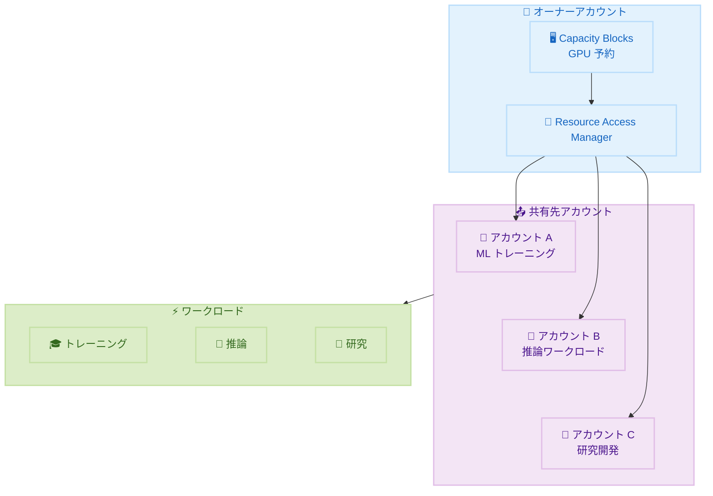

# Amazon EC2 Capacity Blocks for ML - クロスアカウント共有

**リリース日**: 2026 年 2 月 5 日
**サービス**: Amazon EC2
**機能**: Capacity Blocks for ML のクロスアカウント共有

📊 [このアップデートのインフォグラフィックを見る](https://takech9203.github.io/aws-news-summary/20260205-amazon-capacity-blocks-multiple-accounts.html)

## 概要

Amazon EC2 Capacity Blocks for ML のクロスアカウント共有機能が一般提供開始となりました。この機能により、AWS Resource Access Manager (RAM) を使用して、予約済み GPU キャパシティを複数の AWS アカウント間で共有できるようになりました。これにより、利用効率の最適化とコスト削減が可能になります。

組織は Capacity Blocks を購入し、複数のアカウントにプロビジョニングできるため、異なるワークロードが追加コストなしで予約済みキャパシティのプールにアクセスできます。この機能により、チーム間で ML インフラストラクチャ投資を調整し、予約済み GPU キャパシティを異なるワークロード間で継続的に使用できます。

**アップデート前の課題**

- Capacity Blocks は購入したアカウント内でのみ使用可能だった
- 複数チームで GPU リソースを共有するには手動調整が必要だった
- 予約キャパシティの利用率が最適化されていない場合があった

**アップデート後の改善**

- AWS RAM を使用して複数アカウント間で Capacity Blocks を共有可能
- 異なるワークロードが共有キャパシティプールにアクセス可能
- 追加コストなしでクロスアカウント共有を実現

## アーキテクチャ図



オーナーアカウントが Capacity Blocks を購入し、RAM を通じて複数のアカウントと共有します。

## サービスアップデートの詳細

### 主要機能

1. **クロスアカウント共有**
   - AWS Resource Access Manager を使用
   - 複数アカウントへの Capacity Blocks のプロビジョニング
   - 追加コストなし

2. **リソースの効率的利用**
   - 予約キャパシティのプール化
   - 異なるワークロード間での共有
   - 継続的な利用による無駄の削減

3. **組織レベルの管理**
   - 一元的なキャパシティ購入
   - チーム間でのリソース調整
   - ML インフラ投資の最適化

## 技術仕様

### サポートされるインスタンスタイプ

EC2 Capacity Blocks for ML がサポートするすべてのインスタンスタイプでクロスアカウント共有が利用可能です。

| インスタンスタイプ | GPU | 用途 |
|------------------|-----|------|
| p4d, p4de | A100 | 大規模トレーニング |
| p5 | H100 | 最高性能トレーニング |
| trn1, trn2 | Trainium | コスト効率の良いトレーニング |
| inf2 | Inferentia2 | 推論ワークロード |

### Resource Access Manager の設定

| 項目 | 説明 |
|------|------|
| リソースタイプ | ec2:CapacityReservation |
| 共有範囲 | 組織内またはアカウント指定 |
| 権限 | AWSRAMDefaultPermissionCapacityReservation |

## 設定方法

### 前提条件

1. EC2 Capacity Blocks for ML の予約
2. AWS RAM の有効化
3. 共有先アカウントの特定

### 手順

#### ステップ 1: Resource Share の作成

```bash
# AWS CLI で Resource Share を作成
aws ram create-resource-share \
    --name "ml-capacity-blocks-share" \
    --resource-arns "arn:aws:ec2:us-east-1:123456789012:capacity-reservation/cr-1234567890abcdef0" \
    --principals "arn:aws:organizations::123456789012:account/o-example/987654321098"
```

このコマンドで Capacity Blocks を含む Resource Share を作成し、対象アカウントと共有します。

#### ステップ 2: 共有先アカウントでの承諾

```bash
# 共有先アカウントで Resource Share を承諾
aws ram accept-resource-share-invitation \
    --resource-share-invitation-arn "arn:aws:ram:us-east-1:123456789012:resource-share-invitation/12345678-1234-1234-1234-123456789012"
```

共有先アカウントで Resource Share の招待を承諾します。

#### ステップ 3: 共有キャパシティの使用

```bash
# 共有先アカウントでインスタンスを起動
aws ec2 run-instances \
    --instance-type p5.48xlarge \
    --capacity-reservation-specification CapacityReservationTarget='{CapacityReservationId=cr-1234567890abcdef0}' \
    --image-id ami-12345678 \
    --count 1
```

共有された Capacity Blocks を指定してインスタンスを起動します。

## メリット

### ビジネス面

- **コスト最適化**: 予約キャパシティの利用率向上
- **投資の統合**: 組織全体での GPU リソース調達の一元化
- **柔軟な配分**: ワークロードの優先度に応じたリソース割り当て

### 技術面

- **シンプルな管理**: RAM を通じた標準的な共有メカニズム
- **追加コストなし**: 共有機能自体に追加料金なし
- **即座の利用**: 共有後すぐにキャパシティを使用可能

## デメリット・制約事項

### 制限事項

- EC2 Capacity Blocks for ML がサポートされるリージョンに限定
- Resource Access Manager の設定が必要

### 考慮すべき点

- 共有先アカウントでのキャパシティ使用量の監視が重要
- 複数アカウントでの同時使用時のリソース競合に注意

## ユースケース

### ユースケース 1: ML チーム間のリソース共有

**シナリオ**: 複数の ML チームが異なるアカウントで作業している組織

**実装**:
- 中央のプラットフォームチームが Capacity Blocks を購入
- 各 ML チームのアカウントに RAM で共有
- チームは必要に応じて共有キャパシティを使用

**効果**: GPU リソースの一元管理と効率的な利用

### ユースケース 2: 開発と本番環境の分離

**シナリオ**: 開発アカウントと本番アカウントで GPU リソースを共有

**効果**: 環境分離を維持しながら、予約キャパシティを効率的に活用

### ユースケース 3: 時間帯による利用最適化

**シナリオ**: 日中はトレーニングアカウント、夜間は推論アカウントでキャパシティを使用

**効果**: 24 時間でのキャパシティ利用率を最大化

## 料金

クロスアカウント共有機能自体に追加料金はありません。Capacity Blocks の標準料金が適用されます。

詳細は [EC2 Capacity Blocks 料金ページ](https://aws.amazon.com/ec2/pricing/) を参照してください。

## 利用可能リージョン

EC2 Capacity Blocks for ML が提供されているすべてのリージョンで利用可能です。

サポートリージョンの一覧は [Capacity Blocks サポートリージョン ドキュメント](https://docs.aws.amazon.com/AWSEC2/latest/UserGuide/ec2-capacity-blocks.html#capacity-blocks-prerequisites) を参照してください。

## 関連サービス・機能

- **AWS Resource Access Manager**: リソース共有の管理
- **EC2 Capacity Reservations**: オンデマンドキャパシティ予約
- **AWS Organizations**: マルチアカウント管理

## 参考リンク

- 📊 [インフォグラフィック](https://takech9203.github.io/aws-news-summary/20260205-amazon-capacity-blocks-multiple-accounts.html)
- [公式発表 (What's New)](https://aws.amazon.com/about-aws/whats-new/2026/02/amazon-capacity-blocks-multiple-accounts/)
- [Capacity Block ガイド](https://docs.aws.amazon.com/AWSEC2/latest/UserGuide/capacity-blocks-share.html)
- [Capacity Blocks サポートリージョン](https://docs.aws.amazon.com/AWSEC2/latest/UserGuide/ec2-capacity-blocks.html#capacity-blocks-prerequisites)

## まとめ

EC2 Capacity Blocks for ML のクロスアカウント共有機能により、組織は予約済み GPU キャパシティを複数のアカウントやチーム間で効率的に共有できるようになりました。ML ワークロードを複数のアカウントで運用している組織は、この機能を活用してリソース利用率の向上とコスト最適化を実現することを推奨します。
