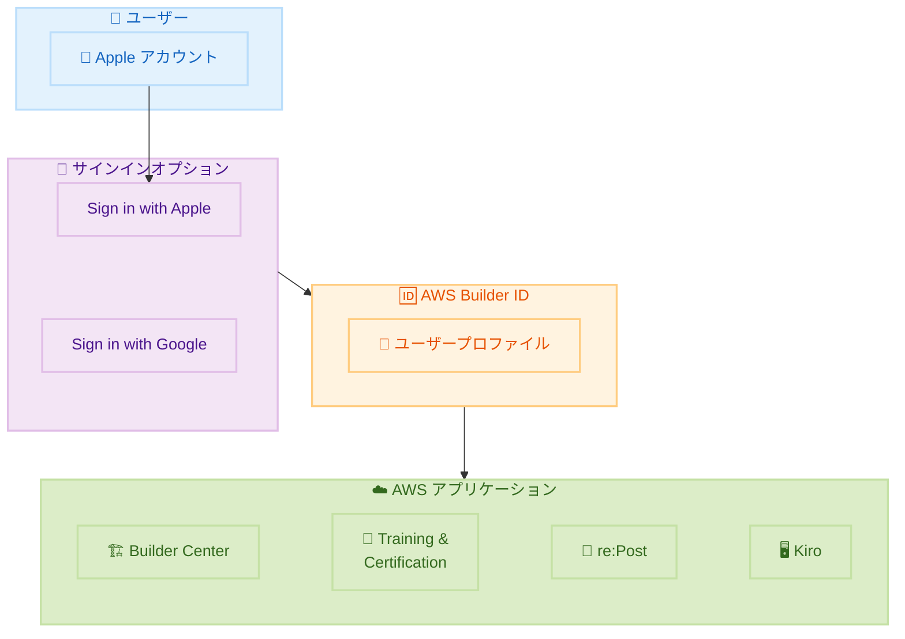

# AWS Builder ID - Sign in with Apple サポート

**リリース日**: 2026 年 2 月 5 日
**サービス**: AWS Builder ID
**機能**: Sign in with Apple

📊 [このアップデートのインフォグラフィックを見る](https://takech9203.github.io/awsnews-summary/20260205-aws-builder-id-sign-in-apple.html)

## 概要

AWS Builder ID が Sign in with Apple をソーシャルログインプロバイダーとしてサポートしました。これにより、既存の Sign in with Google に加えて、Apple ユーザーは Apple アカウントの認証情報を使用して AWS リソースにシームレスにアクセスできるようになりました。

AWS Builder ID は、AWS Builder Center、AWS Training and Certification、AWS re:Post、AWS Startups、Kiro などの AWS アプリケーションにアクセスするためのプロファイルです。Sign in with Apple の統合により、パスワード管理の複雑さが排除され、新規ユーザー登録と既存ユーザーのサインインがより簡単になります。

**アップデート前の課題**

- Apple ユーザーは AWS Builder ID 用に別の認証情報を管理する必要があった
- Google 以外のソーシャルログインオプションがなかった
- パスワード忘れや管理の煩雑さがユーザー体験を損なっていた

**アップデート後の改善**

- Apple アカウントで AWS Builder ID にサインイン可能
- パスワード管理が不要になり、ユーザー体験が向上
- Face ID や Touch ID を使用した安全で便利な認証が可能

## アーキテクチャ図

Apple アカウントを使用して AWS Builder ID にサインインし、各種 AWS アプリケーションにアクセスできます。

## サービスアップデートの詳細

### 主要機能

1. **Sign in with Apple 統合**
   - Apple アカウントでの認証
   - Face ID / Touch ID サポート
   - プライバシー保護されたメールオプション

2. **対応 AWS アプリケーション**
   - AWS Builder Center: 開発リソースへのアクセス
   - AWS Training and Certification: 認定プログラムへの登録
   - AWS re:Post: コミュニティディスカッションへの参加
   - AWS Startups: スタートアップリソースの探索
   - Kiro: AI 支援コーディング

3. **既存機能との共存**
   - Sign in with Google も引き続き利用可能
   - 従来のメール/パスワード認証も維持

## 技術仕様

### サポートされるサインイン方法

| 方法 | 説明 |
|------|------|
| Sign in with Apple | Apple アカウントでの OAuth 認証 |
| Sign in with Google | Google アカウントでの OAuth 認証 |
| メール/パスワード | 従来の認証方式 |

### Apple サインインの特徴

| 機能 | 説明 |
|------|------|
| Face ID / Touch ID | 生体認証でのサインイン |
| Hide My Email | プライバシー保護のためのメールリレー |
| 2 要素認証 | Apple アカウントの 2FA を活用 |

## 設定方法

### 前提条件

1. Apple アカウント
2. Sign in with Apple が有効な Apple デバイスまたはブラウザ

### 手順

#### ステップ 1: AWS Builder ID のサインインページにアクセス

1. AWS Builder ID を使用するアプリケーションにアクセス
2. サインインページで「Sign in with Apple」を選択

#### ステップ 2: Apple アカウントで認証

1. Apple ID とパスワードを入力、または Face ID / Touch ID で認証
2. プライバシーオプションを選択 (メールを共有または非公開)
3. AWS Builder ID プロファイルの作成/リンクを完了

#### ステップ 3: AWS アプリケーションへのアクセス

認証完了後、AWS Builder Center、Training and Certification などのアプリケーションに自動的にアクセスできます。

## メリット

### ビジネス面

- **ユーザー獲得の向上**: 登録の障壁を下げて新規ユーザーを獲得
- **ユーザー体験の向上**: パスワード管理の煩わしさを排除
- **セキュリティ強化**: Apple の強力な認証基盤を活用

### 技術面

- **OAuth 統合**: 標準的な認証プロトコルを使用
- **生体認証**: Face ID / Touch ID による便利な認証
- **プライバシー保護**: Hide My Email 機能でメールアドレスを保護

## デメリット・制約事項

### 制限事項

- Apple アカウントが必要
- Apple デバイスでない場合、ブラウザ経由での認証が必要

### 考慮すべき点

- 組織によっては特定のサインイン方法を推奨/制限している場合がある
- Apple アカウントのセキュリティ設定が AWS Builder ID のアクセスに影響

## ユースケース

### ユースケース 1: 開発者の迅速なオンボーディング

**シナリオ**: 新しい開発者が AWS の学習リソースに素早くアクセスしたい

**効果**: Apple アカウントで即座にサインインし、AWS Training and Certification にアクセス

### ユースケース 2: コミュニティ参加

**シナリオ**: AWS re:Post で技術的な質問をしたい

**効果**: パスワードを作成せずに Apple アカウントでサインインし、すぐに質問を投稿

### ユースケース 3: Kiro での開発

**シナリオ**: Kiro IDE を使用して AI 支援コーディングを開始したい

**効果**: Apple アカウントで簡単にサインインし、すぐに開発を開始

## 料金

AWS Builder ID および Sign in with Apple 機能は無料で利用できます。

## 利用可能リージョン

AWS Builder ID はグローバルサービスであり、すべてのリージョンで利用可能です。

## 関連サービス・機能

- **AWS Builder Center**: 開発者向けリソースハブ
- **AWS Training and Certification**: AWS 認定プログラム
- **AWS re:Post**: AWS コミュニティフォーラム
- **Kiro**: AI 支援統合開発環境

## 参考リンク

- 📊 [インフォグラフィック](https://takech9203.github.io/awsnews-summary/20260205-aws-builder-id-sign-in-apple.html)
- [公式発表 (What's New)](https://aws.amazon.com/about-aws/whats-new/2026/02/aws-builder-id-sign-in-apple/)
- [AWS Builder ID ドキュメント](https://docs.aws.amazon.com/signin/latest/userguide/sign-in-builder-id.html)

## まとめ

AWS Builder ID での Sign in with Apple サポートにより、Apple ユーザーは既存のアカウントを使用して AWS の開発者向けリソースに簡単にアクセスできるようになりました。パスワード管理の煩わしさがなくなり、Face ID や Touch ID を使用した安全で便利な認証が可能です。AWS の学習や開発を始めたい方は、この新しいサインインオプションをぜひ活用してください。
