# AWS Glue - ネイティブ REST API コネクタ

**リリース日**: 2026 年 2 月 5 日
**サービス**: AWS Glue
**機能**: ネイティブ REST API コネクタ

📊 [このアップデートのインフォグラフィックを見る](https://takech9203.github.io/aws-news-summary/20260205-aws-glue-rest-api-connector.html)

## 概要

AWS Glue がネイティブ REST API コネクタを提供開始しました。これにより、REST API を持つ任意のデータソースからデータを簡単に読み取れるようになりました。カスタムコネクタを作成して REST 対応のデータソースに接続し、AWS Glue ETL ジョブにシームレスに統合できます。

この機能は、60 以上のネイティブコネクタと AWS Marketplace の追加オプションを通じて 100 以上の非 AWS データソースへの接続をサポートする AWS Glue の既存の接続機能を拡張するものです。

**アップデート前の課題**

- 独自システムや新興プラットフォームへの接続には、専用 JAR ファイルを含むカスタムコネクタの構築が必要だった
- カスタムライブラリのインストール、更新、管理に運用オーバーヘッドが発生していた
- 新しいデータソースへの対応に時間とリソースがかかっていた

**アップデート後の改善**

- 任意の REST API 対応データソースに簡単に接続可能
- カスタムライブラリのインストール・管理が不要
- ビジネスニーズの変化に応じて新しいデータソースに迅速に対応可能

## アーキテクチャ図

```mermaid
flowchart LR
    subgraph DataSources["🌐 REST API データソース"]
        direction TB
        SaaS["☁️ SaaS アプリ"]
        Internal["🏢 社内システム"]
        ThirdParty["🔗 サードパーティ API"]
    end

    subgraph Glue["☁️ AWS Glue"]
        direction TB
        RESTConnector["🔌 REST API コネクタ"]
        ETL["⚙️ ETL ジョブ"]
        Transform["🔄 変換処理"]
    end

    subgraph Destinations["📦 出力先"]
        direction TB
        S3["🪣 Amazon S3"]
        Redshift["📊 Redshift"]
        DataCatalog["📚 Data Catalog"]
    end

    DataSources --> RESTConnector
    RESTConnector --> ETL
    ETL --> Transform
    Transform --> Destinations

    classDef sources fill:#E3F2FD,stroke:#BBDEFB,stroke-width:2px,color:#1565C0
    classDef glue fill:#F3E5F5,stroke:#E1BEE7,stroke-width:2px,color:#4A148C
    classDef dest fill:#DCEDC8,stroke:#C5E1A5,stroke-width:2px,color:#33691E

    class DataSources,SaaS,Internal,ThirdParty sources
    class Glue,RESTConnector,ETL,Transform glue
    class Destinations,S3,Redshift,DataCatalog dest
```



REST API コネクタを使用して任意の REST API からデータを取得し、Glue ETL ジョブで処理して各種出力先に保存できます。

## サービスアップデートの詳細

### 主要機能

1. **ユニバーサル接続**
   - 任意の REST API 対応データソースに接続
   - カスタム認証のサポート
   - ページネーション処理の組み込み

2. **運用簡素化**
   - カスタム JAR ファイル不要
   - ライブラリ管理のオーバーヘッド排除
   - AWS Glue の標準機能として提供

3. **柔軟性**
   - 新しいデータソースへの迅速な対応
   - ビジネスロジックへの集中
   - データ変換とビジネスロジックに注力可能

### API 変更履歴

| 日付 | サービス | 変更内容 |
|------|----------|----------|
| 2026/02/05 | [AWS Glue](https://awsapichanges.com/archive/changes/7c51a6-glue.html) | 2 new 2 updated api methods - REST API 接続機能 |

## 技術仕様

### サポートされる認証方式

| 認証方式 | 説明 |
|----------|------|
| API Key | ヘッダーまたはクエリパラメータでの API キー |
| Basic Auth | ユーザー名とパスワード |
| OAuth 2.0 | トークンベースの認証 |
| Custom | カスタム認証ヘッダー |

### 接続パラメータ

| パラメータ | 説明 |
|------------|------|
| Base URL | REST API のベース URL |
| Authentication | 認証設定 |
| Headers | カスタム HTTP ヘッダー |
| Pagination | ページネーション設定 |

## 設定方法

### 前提条件

1. AWS Glue へのアクセス権限
2. 接続先 REST API の認証情報
3. API のエンドポイントとスキーマ情報

### 手順

#### ステップ 1: REST API 接続の作成

```python
import boto3

glue = boto3.client('glue')

# REST API 接続を作成
response = glue.create_connection(
    ConnectionInput={
        'Name': 'my-rest-api-connection',
        'ConnectionType': 'REST',
        'ConnectionProperties': {
            'BASE_URL': 'https://api.example.com',
            'AUTHENTICATION_TYPE': 'OAUTH2',
            'CLIENT_ID': 'your-client-id',
            'CLIENT_SECRET': 'your-client-secret'
        }
    }
)
```

AWS Glue API を使用して REST API 接続を作成します。

#### ステップ 2: ETL ジョブでの使用

```python
from awsglue.context import GlueContext
from pyspark.context import SparkContext

sc = SparkContext()
glueContext = GlueContext(sc)

# REST API からデータを読み取り
datasource = glueContext.create_dynamic_frame.from_options(
    connection_type="rest",
    connection_options={
        "connectionName": "my-rest-api-connection",
        "path": "/api/v1/data",
        "pagination.type": "offset",
        "pagination.pageSize": 100
    }
)

# データ変換と出力
# ...
```

Glue ETL ジョブで REST API コネクタを使用してデータを読み取ります。

#### ステップ 3: AWS CLI での設定

```bash
# AWS CLI で接続を作成
aws glue create-connection \
    --connection-input '{
        "Name": "my-rest-api-connection",
        "ConnectionType": "REST",
        "ConnectionProperties": {
            "BASE_URL": "https://api.example.com",
            "AUTHENTICATION_TYPE": "API_KEY",
            "API_KEY_HEADER": "X-API-Key",
            "API_KEY": "your-api-key"
        }
    }'
```

AWS CLI を使用して REST API 接続を作成することもできます。

## メリット

### ビジネス面

- **迅速な統合**: 新しいデータソースへの接続時間を大幅短縮
- **コスト削減**: カスタム開発とメンテナンスコストの削減
- **俊敏性**: ビジネス要件の変化に迅速に対応

### 技術面

- **シンプルな実装**: 標準的な設定でカスタムコードなしに接続
- **保守性向上**: AWS マネージドサービスとして更新を自動化
- **拡張性**: 既存の Glue 機能とシームレスに統合

## デメリット・制約事項

### 制限事項

- REST API のレスポンス形式に依存
- 非常に複雑な認証フローには対応が困難な場合あり

### 考慮すべき点

- API レート制限への対応が必要
- 大量データの取得にはページネーション設定が重要

## ユースケース

### ユースケース 1: SaaS データの統合

**シナリオ**: CRM システムの顧客データを分析基盤に統合

**実装例**:
```python
# Salesforce REST API からデータを取得
datasource = glueContext.create_dynamic_frame.from_options(
    connection_type="rest",
    connection_options={
        "connectionName": "salesforce-connection",
        "path": "/services/data/v55.0/query",
        "query.q": "SELECT Id, Name, Industry FROM Account"
    }
)
```

**効果**: カスタムコネクタなしで CRM データを ETL パイプラインに統合

### ユースケース 2: 社内システムとの連携

**シナリオ**: 独自の社内システムから日次データを抽出

**効果**: JAR ファイルの管理なしで社内 API からデータを取得

### ユースケース 3: サードパーティデータの取得

**シナリオ**: 外部データプロバイダーから市場データを取得

**効果**: 標準的な REST API 接続で外部データを ETL フローに組み込み

## 料金

AWS Glue の標準料金が適用されます。REST API コネクタ自体の追加料金はありません。

詳細は [AWS Glue 料金ページ](https://aws.amazon.com/glue/pricing/) を参照してください。

## 利用可能リージョン

AWS Glue が利用可能なすべての AWS 商用リージョンで利用可能です。

## 関連サービス・機能

- **AWS Glue Data Catalog**: メタデータ管理
- **AWS Glue Studio**: ビジュアル ETL 開発
- **AWS Secrets Manager**: 認証情報の安全な管理

## 参考リンク

- 📊 [インフォグラフィック](https://takech9203.github.io/aws-news-summary/20260205-aws-glue-rest-api-connector.html)
- [公式発表 (What's New)](https://aws.amazon.com/about-aws/whats-new/2026/02/aws-glue-rest-api-connector/)
- [AWS Glue REST API 接続ドキュメント](https://docs.aws.amazon.com/glue/latest/dg/rest-api-connections.html)
- [AWS Glue 料金](https://aws.amazon.com/glue/pricing/)

## まとめ

AWS Glue のネイティブ REST API コネクタにより、任意の REST API からのデータ統合が大幅に簡素化されました。カスタムコネクタの開発とメンテナンスが不要になり、データエンジニアはデータ変換とビジネスロジックに集中できます。REST API を持つデータソースとの統合を検討している組織は、この新機能の活用を推奨します。
