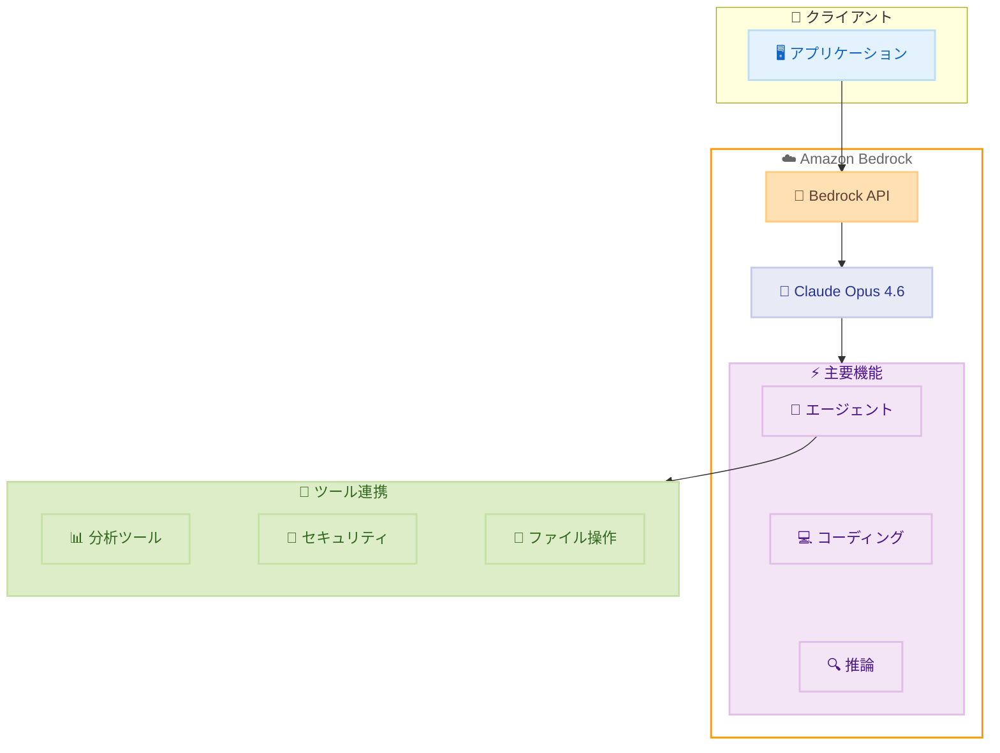

# Amazon Bedrock - Claude Opus 4.6 提供開始

**リリース日**: 2026 年 2 月 5 日
**サービス**: Amazon Bedrock
**機能**: Claude Opus 4.6 モデル

📊 [このアップデートのインフォグラフィックを見る](https://takech9203.github.io/awsnews-summary/20260205-claude-opus-4-6-available-amazon-bedrock.html)

## 概要

Amazon Bedrock で Anthropic の最新フラッグシップモデル「Claude Opus 4.6」が利用可能になりました。Anthropic によると、Opus 4.6 は同社史上最も高性能なモデルであり、コーディング、エンタープライズエージェント、プロフェッショナルワークにおいて世界最高水準の性能を誇ります。

Claude Opus 4.6 は、高度な推論能力とマルチステップオーケストレーションを必要とするユースケースで特に優れた性能を発揮します。エージェンティックワークフロー、複雑なコーディングプロジェクト、エンタープライズグレードのワークフローなど、深い推論と信頼性が求められるタスクに最適です。

**アップデート前の課題**

- エージェンティックタスクで複数のツールを使用する際の信頼性に限界があった
- 大規模コードベースの全ライフサイクル管理には人間の介入が多く必要だった
- 長時間のコンテキストを必要とするドキュメント処理に制約があった

**アップデート後の改善**

- 数十のツールを使用した複雑なタスクを業界最高の信頼性で管理可能
- 要件定義から実装、メンテナンスまでコーディングの全ライフサイクルを処理
- 200K および 1M コンテキストトークン (プレビュー) をサポートし、大規模なドキュメントやコードベースの処理が可能

## アーキテクチャ図



Claude Opus 4.6 は Amazon Bedrock API を通じて利用可能で、エージェント機能、コーディング支援、高度な推論を統合的に提供します。

## サービスアップデートの詳細

### 主要機能

1. **エージェンティックワークフロー**
   - 数十のツールを使用した複雑なタスクを業界最高の信頼性で管理
   - サブエージェントを自律的に起動し、少ない監視で作業を遂行
   - マルチステップオーケストレーションに最適化

2. **高度なコーディング能力**
   - 長期プロジェクトや複雑な実装に対応
   - 大規模コードベースの全ライフサイクル管理
   - 要件定義から実装、メンテナンスまで一貫してサポート

3. **エンタープライズワークフロー**
   - 金融分析: 手動では数日かかるインサイトの抽出
   - サイバーセキュリティ: 微妙な攻撃パターンの検出
   - コンピュータ操作: アプリケーション間のデータ移動

4. **拡張コンテキストウィンドウ**
   - 200K コンテキストトークンを標準サポート
   - 1M コンテキストトークン (プレビュー) で大規模ドキュメント処理が可能

## 技術仕様

### モデル仕様

| 項目 | 詳細 |
|------|------|
| モデル名 | Claude Opus 4.6 |
| プロバイダー | Anthropic |
| コンテキストウィンドウ | 200K トークン (標準)、1M トークン (プレビュー) |
| 主要用途 | エージェンティックタスク、コーディング、エンタープライズワークフロー |

### 性能特性

| 特性 | 説明 |
|------|------|
| 推論能力 | 業界最高水準の深い推論 |
| ツール使用 | 数十のツールを同時に管理可能 |
| 信頼性 | エージェンティックタスクで業界最高 |
| 自律性 | サブエージェントの自動起動 |

## 設定方法

### 前提条件

1. AWS アカウントと Amazon Bedrock へのアクセス権限
2. Claude Opus 4.6 モデルへのアクセス申請と承認
3. 適切な IAM ロールとポリシーの設定

### 手順

#### ステップ 1: モデルアクセスの有効化

AWS Management Console にログインし、Amazon Bedrock コンソールに移動します。

1. 左側メニューから「Model access」を選択
2. 「Manage model access」をクリック
3. Anthropic の Claude Opus 4.6 を選択
4. アクセスをリクエストし、承認を待つ

#### ステップ 2: API 呼び出しの実行

```python
import boto3
import json

client = boto3.client('bedrock-runtime')

response = client.invoke_model(
    modelId='anthropic.claude-opus-4-6',
    body=json.dumps({
        "anthropic_version": "bedrock-2023-05-31",
        "max_tokens": 4096,
        "messages": [
            {
                "role": "user",
                "content": "複雑なコーディングタスクを支援してください"
            }
        ]
    })
)

result = json.loads(response['body'].read())
print(result['content'][0]['text'])
```

Bedrock Runtime クライアントを使用して Claude Opus 4.6 を呼び出す基本的な Python コード例です。

## メリット

### ビジネス面

- **生産性向上**: 複雑なタスクの自動化により、手動作業を大幅に削減
- **迅速なインサイト**: 金融分析など、従来数日かかる作業を短時間で完了
- **コスト効率**: 高度な AI 能力をオンデマンドで利用可能

### 技術面

- **信頼性**: エージェンティックタスクで業界最高の信頼性を提供
- **スケーラビリティ**: 200K〜1M のコンテキストウィンドウで大規模処理に対応
- **統合性**: Amazon Bedrock のエコシステムとシームレスに連携

## デメリット・制約事項

### 制限事項

- 1M コンテキストトークンはプレビュー段階
- モデルアクセスには事前申請と承認が必要
- 利用可能なリージョンに制限あり

### 考慮すべき点

- 高性能モデルのため、利用コストが他のモデルより高い可能性
- 複雑なタスクの場合、レスポンス時間が長くなる可能性

## ユースケース

### ユースケース 1: 自律型コーディングエージェント

**シナリオ**: 大規模なリファクタリングプロジェクトで、コードベース全体の分析と改善を自動化

**実装例**:
```python
# エージェントが複数のツールを使用してコードベースを分析
messages = [
    {
        "role": "user",
        "content": "このリポジトリ全体を分析し、パフォーマンス改善点を特定してリファクタリングを実行してください"
    }
]
```

**効果**: 開発者の介入を最小限に抑えながら、包括的なコード改善を実現

### ユースケース 2: 金融分析ワークフロー

**シナリオ**: 四半期決算レポートの分析と投資判断に必要なインサイトの自動抽出

**実装例**:
```python
# 大量の財務ドキュメントを処理
messages = [
    {
        "role": "user",
        "content": "添付の決算報告書 50 件を分析し、主要な財務指標のトレンドと異常値を特定してください"
    }
]
```

**効果**: 手動では数日かかる分析を数時間で完了

### ユースケース 3: セキュリティ監視エージェント

**シナリオ**: ログ分析とセキュリティイベントの自動検出・対応

**実装例**:
```python
# セキュリティログの継続的な監視と分析
messages = [
    {
        "role": "user",
        "content": "CloudTrail ログを分析し、異常なアクセスパターンや潜在的な脅威を特定してください"
    }
]
```

**効果**: 微妙な攻撃パターンの早期検出と迅速な対応

## 料金

料金は Amazon Bedrock の標準料金体系に従います。詳細は [Amazon Bedrock 料金ページ](https://aws.amazon.com/bedrock/pricing/) を参照してください。

### 料金要素

| 要素 | 説明 |
|------|------|
| 入力トークン | プロンプトに含まれるトークン数に基づく課金 |
| 出力トークン | 生成されたレスポンスのトークン数に基づく課金 |

## 利用可能リージョン

Claude Opus 4.6 は Amazon Bedrock がサポートするリージョンで利用可能です。利用可能なリージョンの完全なリストは [Amazon Bedrock のドキュメント](https://docs.aws.amazon.com/bedrock/latest/userguide/models-supported.html) を参照してください。

## 関連サービス・機能

- **Amazon Bedrock Agents**: Opus 4.6 の高度なエージェント機能を活用したワークフロー構築
- **Amazon Bedrock Knowledge Bases**: 大規模なドキュメントコーパスとの連携
- **Amazon Bedrock Guardrails**: 安全で責任ある AI 利用のための制御機能

## 参考リンク

- 📊 [インフォグラフィック](https://takech9203.github.io/awsnews-summary/20260205-claude-opus-4-6-available-amazon-bedrock.html)
- [公式発表 (What's New)](https://aws.amazon.com/about-aws/whats-new/2026/2/claude-opus-4.6-available-amazon-bedrock/)
- [About Amazon Blog](https://www.aboutamazon.com/news/aws/anthropic-claude-4-opus-sonnet-amazon-bedrock)
- [Amazon Bedrock ドキュメント](https://docs.aws.amazon.com/bedrock/latest/userguide/models-supported.html)
- [Amazon Bedrock 料金](https://aws.amazon.com/bedrock/pricing/)

## まとめ

Claude Opus 4.6 の Amazon Bedrock での提供開始により、企業は最先端の AI 能力をクラウドネイティブな環境で利用できるようになりました。特にエージェンティックワークフロー、複雑なコーディングタスク、エンタープライズ分析において、従来のモデルを大幅に上回る性能を発揮します。AI を活用したワークフロー自動化や高度な分析を検討している組織にとって、早期の評価と導入検討を推奨します。
