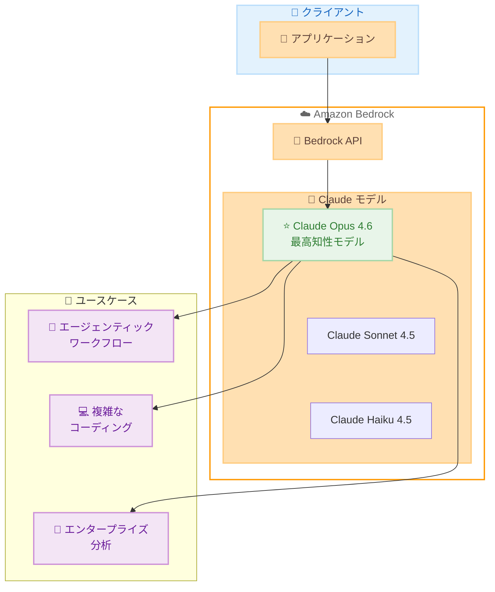

# Amazon Bedrock - Claude Opus 4.6 が利用可能に

**リリース日**: 2026 年 2 月 5 日
**サービス**: Amazon Bedrock
**機能**: Claude Opus 4.6 モデルサポート

📊 [このアップデートのインフォグラフィックを見る](https://takech9203.github.io/aws-news-summary/20260205-claude-opus-4.6-available-amazon-bedrock.html)

## 概要

Amazon Bedrock で Anthropic の最新モデル **Claude Opus 4.6** が利用可能になりました。Anthropic によると、Opus 4.6 は同社で最も知的なモデルであり、コーディング、エンタープライズエージェント、プロフェッショナルワークにおいて世界最高のモデルとされています。

Claude Opus 4.6 は、エージェンティックタスク、複雑なコーディングプロジェクト、深い推論と信頼性を必要とするエンタープライズグレードのワークフローにおいて、業界をリードするパフォーマンスを提供します。200K および 1M (プレビュー) のコンテキストトークンをサポートし、大規模なドキュメントやコードベースの処理が可能です。

**アップデート前の課題**

- Claude Opus 4.5 では複雑なエージェンティックタスクの信頼性に限界があった
- 長期間にわたるコーディングプロジェクトでの一貫性維持が困難だった
- 大規模コードベースのフルライフサイクル管理には追加のオーケストレーションが必要だった

**アップデート後の改善**

- 数十のツールを使用した複雑なタスクを業界トップの信頼性で管理可能に
- サブエージェントを自律的に起動し、より少ない監視で作業可能に
- 要件収集から実装・メンテナンスまでのフルライフサイクルを単一モデルで処理可能に

## アーキテクチャ図



Claude Opus 4.6 は Amazon Bedrock を通じてアクセスし、エージェンティックワークフロー、複雑なコーディング、エンタープライズ分析など多様なユースケースに対応します。

## サービスアップデートの詳細

### 主要機能

1. **エージェンティックワークフローの卓越性**
   - 数十のツールを使用した複雑なタスクを業界トップの信頼性で管理
   - サブエージェントを自律的に起動し、より少ない監視で作業可能
   - マルチステップのオーケストレーションにおける高度な推論能力

2. **コーディング能力の強化**
   - 長期的なプロジェクトや複雑な実装に対応
   - 大規模コードベースのフルライフサイクル管理
   - 要件収集から実装・メンテナンスまで一貫して処理

3. **エンタープライズワークフロー対応**
   - 手作業で数日かかる洞察を導き出す財務分析
   - 微妙な攻撃パターンを検出するサイバーセキュリティ応用
   - アプリケーション間でデータを移動するコンピュータ使用ワークフロー

4. **拡張コンテキストウィンドウ**
   - 200K コンテキストトークン (標準)
   - 1M コンテキストトークン (プレビュー)
   - 大規模なドキュメントやコードベースの処理が可能

## 技術仕様

### モデル仕様

| 項目 | 詳細 |
|------|------|
| モデル ID | `anthropic.claude-opus-4-6-v1` |
| 入力モダリティ | テキスト、画像 |
| 出力モダリティ | テキスト |
| ストリーミング | サポート |
| コンテキストウィンドウ | 200K トークン (1M プレビュー) |
| 推論プロファイル | クロスリージョン推論対応 |

### 利用方法

```python
import boto3
import json

# Bedrock Runtime クライアントの作成
bedrock_runtime = boto3.client(
    service_name='bedrock-runtime',
    region_name='us-east-1'
)

# Claude Opus 4.6 を使用した推論リクエスト
response = bedrock_runtime.invoke_model(
    modelId='anthropic.claude-opus-4-6-v1',
    body=json.dumps({
        "anthropic_version": "bedrock-2023-05-31",
        "max_tokens": 4096,
        "messages": [
            {
                "role": "user",
                "content": "複雑なコードベースの分析を行ってください。"
            }
        ]
    })
)

result = json.loads(response['body'].read())
print(result['content'][0]['text'])
```

## 設定方法

### 前提条件

1. AWS アカウントが有効であること
2. Amazon Bedrock へのアクセス権限が設定されていること
3. Claude Opus 4.6 モデルへのアクセスがリクエスト済みであること

### 手順

#### ステップ 1: モデルアクセスのリクエスト

Amazon Bedrock コンソールで Claude Opus 4.6 へのアクセスをリクエストします。

1. [Amazon Bedrock コンソール](https://console.aws.amazon.com/bedrock/) にアクセス
2. 「Model access」を選択
3. Anthropic の「Claude Opus 4.6」を選択してアクセスをリクエスト

#### ステップ 2: IAM ポリシーの設定

```json
{
    "Version": "2012-10-17",
    "Statement": [
        {
            "Effect": "Allow",
            "Action": [
                "bedrock:InvokeModel",
                "bedrock:InvokeModelWithResponseStream"
            ],
            "Resource": "arn:aws:bedrock:*::foundation-model/anthropic.claude-opus-4-6-v1"
        }
    ]
}
```

この IAM ポリシーにより、Claude Opus 4.6 モデルの推論 API を呼び出す権限が付与されます。

#### ステップ 3: Converse API を使用した推論

```python
import boto3

client = boto3.client('bedrock-runtime', region_name='us-east-1')

response = client.converse(
    modelId='anthropic.claude-opus-4-6-v1',
    messages=[
        {
            "role": "user",
            "content": [{"text": "エンタープライズアプリケーションの設計を支援してください。"}]
        }
    ],
    inferenceConfig={
        "maxTokens": 4096,
        "temperature": 0.7
    }
)

print(response['output']['message']['content'][0]['text'])
```

Converse API は統一されたインターフェースを提供し、異なるモデル間での切り替えを容易にします。

## メリット

### ビジネス面

- **生産性向上**: 複雑なタスクを自律的に処理し、人間の監視負担を軽減
- **品質向上**: 業界トップの信頼性により、エラーや手戻りを最小化
- **コスト効率**: 複数ツールを使用した複雑なワークフローを単一モデルで処理

### 技術面

- **拡張コンテキスト**: 1M トークンのプレビューサポートにより、大規模なドキュメント処理が可能
- **マルチモーダル**: テキストと画像の両方を入力として処理可能
- **クロスリージョン推論**: 複数リージョンでの可用性と負荷分散をサポート

## デメリット・制約事項

### 制限事項

- 1M コンテキストトークンは現在プレビュー段階
- 高度な機能を使用する場合、コストが他のモデルより高くなる可能性
- 一部のリージョンでは利用できない場合がある

### 考慮すべき点

- エージェンティックワークフローでは適切なツール設計が必要
- 大規模コンテキストを使用する場合はレイテンシが増加する可能性
- Reserved Tier を活用することでコスト最適化が可能

## ユースケース

### ユースケース 1: 自律的コードレビューエージェント

**シナリオ**: 大規模なプルリクエストを自動的にレビューし、セキュリティ問題、パフォーマンス改善、コーディング規約違反を検出

**実装例**:
```python
review_prompt = """
以下のコード変更をレビューしてください:
1. セキュリティの脆弱性
2. パフォーマンスの問題
3. コーディング規約違反
4. 改善提案

{code_diff}
"""
```

**効果**: 手動レビュー時間を 60-70% 削減し、見落としを最小化

### ユースケース 2: 財務分析ワークフロー

**シナリオ**: 複数の財務レポートを分析し、トレンド、異常、投資機会を自動的に特定

**実装例**:
```python
analysis_prompt = """
添付の財務レポートを分析し、以下を提供してください:
1. 主要な財務指標のトレンド分析
2. 競合他社との比較
3. リスク要因の特定
4. 投資推奨事項
"""
```

**効果**: 数日かかる分析を数時間に短縮し、より深い洞察を提供

### ユースケース 3: マルチエージェントオーケストレーション

**シナリオ**: 複数の専門エージェントを調整し、複雑なビジネスプロセスを自動化

**実装例**:
```python
orchestration_config = {
    "main_agent": "claude-opus-4-6",
    "sub_agents": [
        {"role": "researcher", "model": "claude-sonnet-4-5"},
        {"role": "analyst", "model": "claude-sonnet-4-5"},
        {"role": "writer", "model": "claude-haiku-4-5"}
    ],
    "workflow": "research -> analyze -> summarize -> report"
}
```

**効果**: 複雑なワークフローを自律的に管理し、人間の介入を最小化

## 料金

Amazon Bedrock での Claude モデルの料金は、入力トークンと出力トークンに基づいて計算されます。

### 料金体系

| ティア | 説明 |
|--------|------|
| Standard | 標準的なオンデマンド料金 |
| Flex | 50% 割引、混雑時の優先度が低い |
| Priority | 75% 割増、高優先度アクセス |
| Reserved | コミットメントに基づく割引料金 |

詳細な料金については [Amazon Bedrock 料金ページ](https://aws.amazon.com/bedrock/pricing/) を参照してください。

## 利用可能リージョン

Claude Opus 4.6 はクロスリージョン推論をサポートし、以下のリージョンで利用可能です:

- **北米**: us-east-1, us-east-2, us-west-1, us-west-2, ca-central-1, ca-west-1, mx-central-1
- **ヨーロッパ**: eu-central-1, eu-central-2, eu-north-1, eu-south-1, eu-south-2, eu-west-1, eu-west-2, eu-west-3
- **アジアパシフィック**: ap-northeast-1 (東京), ap-northeast-2, ap-northeast-3, ap-south-1, ap-south-2, ap-southeast-1, ap-southeast-2, ap-southeast-3, ap-southeast-4, ap-southeast-5, ap-southeast-7, ap-east-2
- **中東・アフリカ**: me-central-1, me-south-1, af-south-1, il-central-1
- **南米**: sa-east-1

## 関連サービス・機能

- **Amazon Bedrock Agents**: Claude Opus 4.6 を使用したエージェンティックワークフローの構築
- **Amazon Bedrock AgentCore**: ブラウザ操作やツール実行を含む高度なエージェント機能
- **Amazon Bedrock Knowledge Bases**: RAG (Retrieval-Augmented Generation) による知識拡張
- **Amazon Bedrock Guardrails**: 安全で責任ある AI の使用を確保

## 参考リンク

- 📊 [インフォグラフィック](https://takech9203.github.io/aws-news-summary/20260205-claude-opus-4.6-available-amazon-bedrock.html)
- [公式発表 (What's New)](https://aws.amazon.com/about-aws/whats-new/2026/2/claude-opus-4.6-available-amazon-bedrock/)
- [サポートされるモデル一覧](https://docs.aws.amazon.com/bedrock/latest/userguide/models-supported.html)
- [Claude モデルパラメータ](https://docs.aws.amazon.com/bedrock/latest/userguide/model-parameters-claude.html)
- [Amazon Bedrock 料金](https://aws.amazon.com/bedrock/pricing/)
- [Amazon Bedrock コンソール](https://console.aws.amazon.com/bedrock/)

## まとめ

Claude Opus 4.6 の Amazon Bedrock での提供開始は、エンタープライズ AI アプリケーション開発者にとって重要なマイルストーンです。業界トップのエージェンティック性能、拡張されたコンテキストウィンドウ、そして複雑なワークフローを自律的に管理する能力により、AI を活用したビジネスプロセスの自動化が大きく前進します。特にコーディング支援、財務分析、マルチエージェントオーケストレーションなどのユースケースで、その真価を発揮するでしょう。
